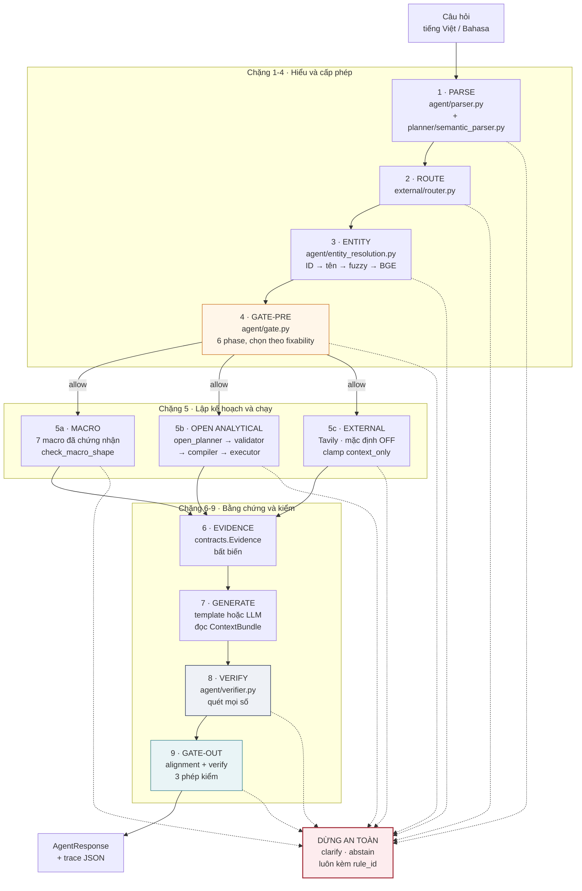
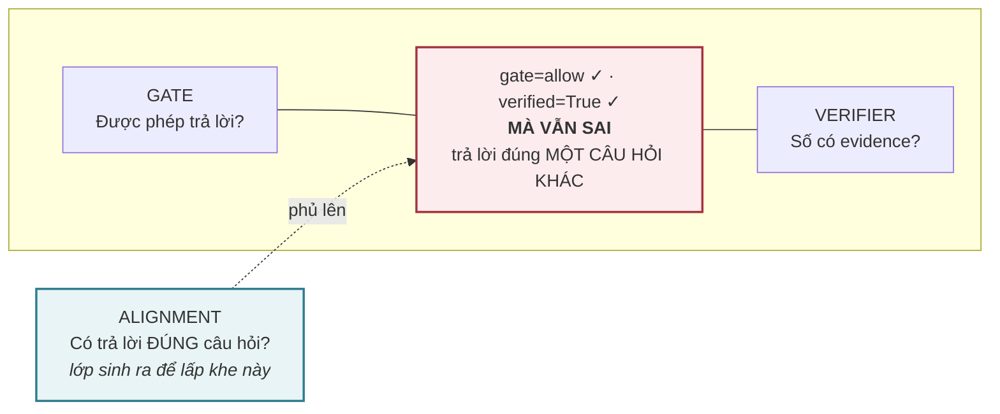
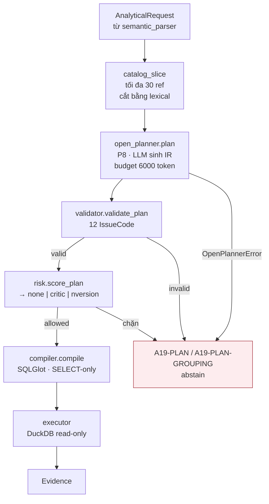
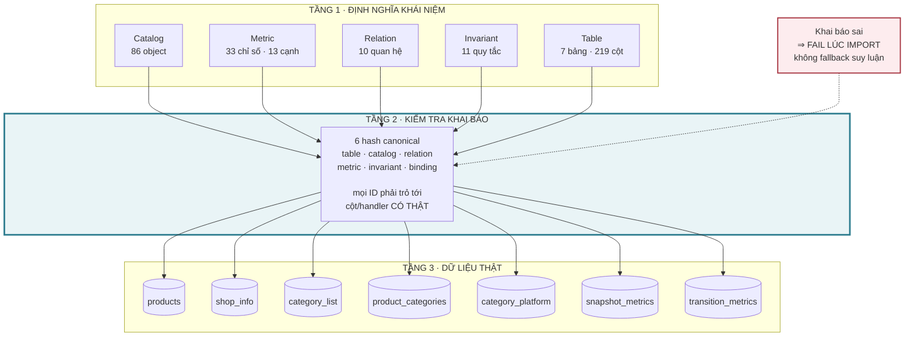

# Archibefore2208 — Đặc tả kiến trúc hiện tại

> **Chốt tại:** commit `e5347df`, nhánh `MVP_Dai_V2`, ngày 22/08/2026.
>
> **Nguồn sự thật:** file này được dựng bằng cách **đọc source code đang chạy**,
> rồi mới đối chiếu ngược với tài liệu trong `docs/`. Chỗ nào tài liệu mâu thuẫn
> với code, code thắng và mâu thuẫn được ghi lại ở §12 thay vì bị giấu.
>
> **Cách đọc:** §1 là tóm tắt đủ để nắm hệ thống trong 5 phút. §2–§10 là chi tiết
> từng tầng. §11 là bảng tra cứu mã lỗi. §12 là danh sách tài liệu đã lỗi thời.
> §13 là kết quả chạy thử một testcase đối chiếu với chính đặc tả này.

---

## 1. Tóm tắt kiến trúc

### 1.1. Hệ thống này giải bài toán gì

Trả lời câu hỏi phân tích thương mại điện tử (Việt Nam + Indonesia) bằng ngôn
ngữ tự nhiên, trên một dataset **đã đóng băng** (3 snapshot 01–03/07/2026), với
ràng buộc chi phối toàn bộ thiết kế:

> Mọi con số hiển thị phải truy vết được về evidence, và **không bao giờ được đoán**.

Hệ quả kiến trúc: `clarify`/`abstain` là **hành vi đúng**, không phải lỗi. Một
câu trả lời trôi chảy mà sai nguy hiểm hơn một câu từ chối, vì không ai kiểm lại nó.

### 1.2. Ba ý tưởng nền

| # | Ý tưởng | Hệ quả cụ thể |
| --- | --- | --- |
| 1 | **Đóng kín từ vựng** | 86 semantic object trong `domain/catalog.py`. Câu hỏi không rơi vào tập này thì bị từ chối, không "hiểu đại khái rồi thử" |
| 2 | **LLM đề xuất, máy quyết định** | LLM không tính số, không quyết gate, không viết SQL. Mọi output LLM đi qua validator deterministic |
| 3 | **Ba lớp kiểm hỏi ba câu khác nhau** | Gate hỏi *được phép không*; Alignment hỏi *có đúng câu hỏi không*; Verifier hỏi *số có evidence không* |

### 1.3. Luồng chín chặng

```
                    câu hỏi người dùng
                            │
   ┌────────────────────────▼─────────────────────────┐
   │  1  PARSE          agent/parser.py               │  → StructuredRequest
   │  2  ROUTE          external/router.py            │  → route_mode
   │  3  ENTITY         agent/entity_resolution.py    │  → ResolutionResult
   │  4  GATE-PRE       agent/gate.py                 │  → GateDecision
   ├──────────────────────────────────────────────────┤
   │  5  PLAN & EXECUTE                               │
   │     5a  macro đã chứng nhận  planner/macros.py   │
   │     5b  open analytical      planner/open_planner│
   │             → validator → compiler → executor    │
   │     5c  external context     external/pipeline   │  (mặc định OFF)
   ├──────────────────────────────────────────────────┤
   │  6  EVIDENCE       contracts.Evidence            │
   │  7  GENERATE       workflow._generate            │
   │  8  VERIFY         agent/verifier.py             │
   │  9  GATE-OUT       agent/alignment.py + verifier │
   └────────────────────────┬─────────────────────────┘
                            ▼
                      AgentResponse
```

**Điểm cốt lõi:** mọi chặng đều có quyền dừng cả quy trình. Không chặng nào bắt
buộc phải trả lời. Mọi lối dừng đều kèm `rule_id` tra cứu được (§11).

### 1.4. Bản đồ package

| Package | LOC | Trách nhiệm |
| --- | ---: | --- |
| `agent/` | 4.775 | Orchestrator + 3 lớp kiểm + parse/entity/generate |
| `planner/` | 6.071 | IR, validator, compiler, executor, macro, decomposer, topic router |
| `domain/` | 3.396 | Catalog 86 ref, alias index, invariant, table/relation/metric registry |
| `insights/` | 1.895 | Insight mart, miner, PAM, dashboard |
| `external/` | 1.732 | Live search: router, planner, extractor, admission (OFF) |
| `analytics/` | 660 | Tính toán deterministic, sinh `Evidence` |
| `data/` | 223 | `ArtifactRepository`, data contract, coverage |

---

## 2. Sơ đồ kiến trúc tổng thể



---

## 3. Ba lớp kiểm — và khe hở giữa chúng

Đây là phần dễ hiểu nhầm nhất của hệ thống. Ba lớp **hỏi ba câu khác nhau**.

| Lớp | Câu hỏi nó đặt ra | File | Chạy ở chặng |
| --- | --- | --- | --- |
| **Gate** | Được phép trả lời không? | `agent/gate.py` | 4 (và cập nhật ở 5, 9) |
| **Alignment** | Có đang trả lời **đúng câu hỏi** không? | `agent/alignment.py` | 5 và 9 |
| **Verifier** | Số hiển thị có evidence không? | `agent/verifier.py` | 8 |

### 3.1. Vì sao cần lớp thứ ba

Đã có lỗi thật lọt qua **cả hai** lớp còn lại:

```
Hỏi        : "có bao nhiêu listing giảm giá trên 50%?"
Trả lời    : 474
Sự thật    : 474 là TỔNG SỐ listing, không phải số listing đang giảm giá

gate   = allow  ✓      (câu hỏi hợp lệ, đủ slot)
verify = passed ✓      (474 CÓ evidence thật)
```

Cả hai lớp đều làm đúng việc của mình. Không lớp nào được giao việc hỏi *"con số
này có trả lời đúng câu được hỏi không?"*. Lớp Alignment sinh ra để lấp đúng khe đó.



### 3.2. Alignment chạy ở bốn điểm khác nhau

Đọc từ `workflow.py::run()`:

| Hàm | Gọi ở dòng | Kiểm gì |
| --- | ---: | --- |
| `check_macro_shape` | 1108 | Macro có nhận đúng hình dạng request không |
| `check_plan_alignment` | 1145 | Plan có giữ measure/scope/shape mà câu hỏi yêu cầu không |
| `check_evidence_alignment` | 1210 | Evidence sinh ra có khớp request không (bản đầy đủ, cho plan) |
| `check_evidence_scope_alignment` | 1212 | Bản rút gọn cho macro — chỉ kiểm scope/ngày, **không** kiểm ref-level measure, vì macro được phép trả `derived.monthly_sold_delta` cho câu hỏi về `measure.monthly_sold` |
| `check_answer_alignment` | 1266 | Câu chữ cuối có khớp evidence không |
| `check_question_alignment` | 1279 | **Ràng buộc do chính câu hỏi mang theo** — câu nhân quả và tiền đề chiều biến động |

### 3.3. 13 mã lỗi alignment

`IssueCode` (alignment.py:15-34) → `rule_id` (alignment.py:54-68):

| IssueCode | rule_id |
| --- | --- |
| `measure_dropped`, `measure_substituted` | `A22-ALIGN-MEASURE` |
| `shape_mismatch`, `causal_question_unanswered` | `A22-ALIGN-SHAPE` |
| `qualifier_ignored` | `A22-ALIGN-QUALIFIER` |
| `entity_unbound` | `A22-ALIGN-ENTITY` |
| `subrequest_dropped` | `A22-ALIGN-SUBREQUEST` |
| `country_dropped` | `A22-ALIGN-COUNTRY` |
| `date_range_narrowed` | `A22-ALIGN-DATE` |
| `aggregation_mismatch` | `A22-ALIGN-AGGREGATION` |
| `grouping_dropped` | `A22-ALIGN-GROUPING` |
| `filter_dropped` | `A22-ALIGN-FILTER` |
| `premise_contradicted` | `A22-ALIGN-PREMISE` |

**Lưu ý:** `causal_question_unanswered` cố ý **dùng lại** `A22-ALIGN-SHAPE` thay
vì tạo mã mới — nó là một biến thể của "trả sai hình dạng kết quả", không phải
một loại lỗi thứ hai.

---

## 4. Chặng 1–4 · Hiểu câu hỏi và cấp phép

### 4.1. Chặng 1 · PARSE

Hai bộ parse chạy song song, kết quả **merge theo luật precedence**:

```
                    câu hỏi
                       │
        ┌──────────────┴──────────────┐
        ▼                             ▼
MultilingualIntentParser        LLM parse_intent
  (agent/parser.py)             (agent/llm.py)
  deterministic                 MẶC ĐỊNH TẮT
        │                             │
        └──────────────┬──────────────┘
                       ▼
            AgentRuntime._parse()
            5 nhánh precedence
                       ▼
              StructuredRequest
```

**Trạng thái LLM parse: TẮT mặc định** (`runtime_factory.py`). Bật bằng
`GLADIATORS_ENABLE_LLM_PARSER=1`. Lý do đo được:

| | offline | deepseek |
| --- | ---: | ---: |
| `end_to_end_accuracy` (60 câu × 3) | 1.0 | 0.622 |
| Thời gian 20 câu | 0,9s | 394,1s (438×) |

Năm nhánh precedence trong `_parse()` (workflow.py:267-435), theo thứ tự kiểm,
nhánh đầu khớp thì thắng:

| # | Tên nhánh | Điều kiện | Kết quả |
| ---: | --- | --- | --- |
| 1 | `deterministic_route_safety_precedence` | deterministic ra `external_only`/`hybrid` và LLM bất đồng | deterministic thắng **toàn bộ field** |
| 2 | `unsupported_safety_precedence` | deterministic gắn `unsupported:*`, LLM thì không | deterministic thắng intent |
| 3 | `unsupported_taxonomy_normalized` | LLM gắn `unsupported:*` sai taxonomy | deterministic thắng intent |
| 4 | `capability_contract_precedence` | intent LLM trỏ macro mà request không thoả contract | deterministic thắng intent |
| 5 | `open_analytical_precedence` | deterministic ra `open_analytical`, LLM đòi template mà thiếu `analytical_kind` | deterministic thắng intent |

Không nhánh nào khớp thì **giữ intent của LLM**. Ngoài ra có một lượt backfill
riêng: `entity_text`, `country`, `entities`, `analytical` được điền từ
deterministic **chỉ khi** phía LLM để trống; `slots` merge khi hai bên cùng intent.

**Cạm bẫy đã đo được:** precedence chỉ backfill khi LLM để **trống**. LLM trả
`country` **sai** thì giá trị sai được giữ nguyên.

`StructuredRequest` (contracts.py:10-43):

```python
intent: str                  # phải nằm trong IntentRegistry hoặc "unsupported:*"
entity_text: str | None
country: str | None          # tự chuẩn hoá vietnam→vn, indonesia→id
countries: tuple[str, ...]
entities: tuple[dict, ...]
date_range: list[str]
slots: dict[str, Any]
analytical: dict | None      # AnalyticalRequest đã serialize
language: "vi" | "id" | "unknown"
route_mode: "internal_only" | "external_only" | "hybrid" | "clarify" | "abstain"
external_purpose: "campaign_context" | "market_event" | "product_external_info" | None
requested_variables: tuple[str, ...]
```

**13 nhóm năng lực không hỗ trợ** (`parser.py::UNSUPPORTED`): `profit`,
`forecast`, `sku`, `ads`, `inventory`, `conversion`, `image_similarity`,
`reference`, `external`, `orders`, `category_type`, `price_reconstruction`.

### 4.2. Chặng 2 · ROUTE

`external/router.py` quyết `route_mode`. Bốn giá trị đi tiếp được:
`internal_only` (mặc định), `external_only`, `hybrid`, và hai giá trị dừng:
`clarify`, `abstain`.

### 4.3. Chặng 3 · ENTITY

`agent/entity_resolution.py` — thang bốn bậc: **ID chính xác → tên chính xác →
fuzzy (rapidfuzz) → BGE-M3 embedding**. Margin thấp giữa hai ứng viên đầu ⇒
`CLARIFY` chứ không chọn bừa.

Bốn trạng thái (`ResolutionState`, entity_resolution.py:13):
`resolved` · `not_found` · `invalid_extraction` · `ambiguous_broad`.

**Đặc điểm quan trọng:** với entity **dạng mã** (`listing_key`, `item_id`),
resolution chạy **trước gate** (workflow.py:861-868) để "mã này có tồn tại
không" được cạnh tranh bình đẳng với "bạn muốn thị trường nào". Cố ý **chỉ** áp
cho mã, không áp cho mô tả tự do — một cái tên không khớp thường là `clarify`,
không phải khẳng định sản phẩm không tồn tại.

### 4.4. Chặng 4 · GATE

`ContractDrivenGate.decide()` — **thu thập mọi issue rồi mới chọn**, không
return sớm ở rule đầu tiên. Sáu phase, chạy **có điều kiện** chứ không phải luôn
đủ sáu: phase nào thật sự được đánh giá thì ghi vào `GateDecision.evaluated_phases`
(vd. một câu không có ràng buộc grain sẽ cho `(1, 2, 4, 6)` — phase 3 không chạy).

| Phase | Kiểm gì | Ví dụ rule |
| ---: | --- | --- |
| 1 | Capability / out-of-scope / route / entity tồn tại | `A-ENTITY-NOT-FOUND`, `A-MISSING-PROFIT`, `A14-ROUTE-MISMATCH` |
| 2 | Intent đã đăng ký / live search | `A-UNKNOWN-INTENT`, `A14-LIVE`, `A19-PLAN` |
| 3 | Admission theo grain | `a19_admission` |
| 4 | Tiền tệ chéo thị trường | `A-CROSS-CURRENCY-SCOPE`, `A16-CROSS-CURRENCY` |
| 6 | Slot / quốc gia / voucher | `A-MISSING-SLOT`, `A-COUNTRY`, `A-VOUCHER-ID` |

**Luật chọn issue** (`select_issue`, gate.py:102-112) — đây là điểm thiết kế quan trọng:

```python
return min(issues, key=lambda item: (item.fixable, item.priority))
```

`fixable=False` nghĩa là **không thông tin nào người dùng cung cấp được sẽ gỡ
được rào cản**. Issue không khắc phục được **thắng** issue khắc phục được, bất
kể thứ tự code chạy.

Vì sao cần: trước đó gate chọn rule bắn sớm nhất theo thứ tự code. Hỏi về mã sản
phẩm không tồn tại **và** thiếu country → hệ báo "hãy nêu rõ thị trường", một
hành động không thể giúp gì. Thêm thị trường không làm mã sản phẩm tồn tại.

`fixable=False` hiện áp cho: `A-ENTITY-NOT-FOUND`, `A-MISSING-{capability}`
(trừ `external`/`reference` vẫn `fixable=True`).

---

## 5. Chặng 5 · Lập kế hoạch và thực thi

Ba nhánh loại trừ nhau, chọn theo `request.intent`.

### 5.1. Bản đồ intent → nhánh

10 intent trong `IntentRegistry` (`domain/intent_registry.py`):

| Intent | Nhánh | Slot bắt buộc | Tool |
| --- | --- | --- | --- |
| `sales_decline` | 5a macro | `entity_text` | `resolve_entity`, `get_sales_transitions` |
| `similar_product` | 5a macro | `entity_text` | `resolve_entity`, `find_similar` |
| `promotion_effectiveness` | 5a macro | `country` | `compare_voucher_groups` |
| `voucher_coverage` | 5a macro | — | `compare_voucher_coverage` |
| `voucher_profile_rank` | 5a macro | `country` | `rank_voucher_profiles` |
| `discount_bucket_observation` | 5a macro | — | `observe_discount_bucket` |
| `dataset_coverage` | 5a macro | — | `describe_dataset_coverage` |
| `analytical_query` | 5b template | — | `execute_analytical_plan` |
| `open_analytical` | 5b tự lập plan | — | `execute_analytical_plan` |
| `external_context` | 5c external | `external_purpose` | `live_search_context` |

**Ghi chú `voucher_profile_rank`:** intent này bị chặn cứng ở workflow.py:870-885
thành `A19-METRIC` khi `enable_voucher_profile=False` (mặc định), vì trọng số
metric chưa được duyệt. Macro tồn tại nhưng không phục vụ.

### 5.2. Nhánh 5a · Macro đã chứng nhận

7 macro, mỗi macro mang `certified_shape` + `plan_template` + `plan_hash` +
`evidence contract`. Trước khi chạy, `check_macro_shape(digest, certified_shape)`
xác nhận request đúng hình dạng macro nhận. Không khớp ⇒ `clarify` với
`A22-ALIGN-*`.

Sau khi chạy, `macro.accepts_evidence(...)` xác nhận evidence sinh ra khớp
certified contract; không khớp ⇒ `A-MACRO-EVIDENCE-CONTRACT`.

Ràng buộc thêm: `sales_decline` và `similar_product` chỉ bind **một** entity;
câu hỏi nêu nhiều entity ⇒ `entity_unbound` (workflow.py:1109-1119).

### 5.3. Nhánh 5b · Open analytical



**LLM chỉ thấy một lát catalog ≤30 ref đã được cắt sẵn bằng lexical**, và chỉ
được sinh IR có kiểu — không sinh SQL, không sinh tên cột, không sinh join key.

**12 operator IR** (`query_ir.py::Op`): `Scan`, `ResolveValue`, `Filter`, `Join`,
`Dedupe`, `Aggregate`, `DeriveMetric`, `TemporalCompare`, `Rank`, `Similarity`,
`Project`, `Union`.

`ResolveValue` và `Similarity` **không compile thành SQL** — chúng được delegate
sang module riêng; compiler raise `CompilationError` nếu gặp (compiler.py:165).

**12 IssueCode của validator** (`validator.py:20-24`): `missing_semantic_object`,
`wrong_filter`, `wrong_join_path`, `grain_mismatch`, `fanout_risk`,
`unit_mismatch`, `temporal_mismatch`, `unsupported_claim`, `budget_exceeded`,
`schema_invalid`, `tier_violation`, `non_physical_grouping`.

Ba tầng escalation theo risk (`planner/risk.py`), cả hai tầng trên **mặc định tắt**:

| Mode | Bật bằng | Hành vi |
| --- | --- | --- |
| `none` | mặc định | chạy thẳng |
| `critic` | `GLADIATORS_ENABLE_CRITIC=1` | P9 review plan; có issue ⇒ `A19-PLAN` |
| `nversion` | `GLADIATORS_ENABLE_NVERSION=1` | P10 alternate planner bị blind + P11 adjudicator; không phân định được ⇒ `A19-PLAN`, **không chọn ngẫu nhiên** |

**Bảo đảm an toàn của executor** (executor.py:67-77) — đọc thẳng từ code:

```python
duckdb.connect(database=":memory:")
SET enable_external_access = false
SET autoload_known_extensions = false
SET allow_community_extensions = false
... register view ...
SET lock_configuration = true      # khoá lại sau khi đăng ký view
```

Cộng với `assert_read_only_sql` và AST root bắt buộc là `SELECT` hoặc `UNION`
(compiler.py:280).

### 5.4. Nhánh 5c · External context

Mặc định **OFF**. Khi bật: `search_planner` (P5) → Tavily → `relevance` →
`web_extract` (P6) → `admission`.

Bất biến: external evidence **luôn** `source_tier="external"`,
`mapping_status="needs_review"`, `admission="context_only"`. Cấm tính toán hoặc
suy nhân quả xuyên tier (`A20-TIER`).

`hybrid` giữ nguyên phần internal đã hoàn tất; external hỏng thì hạ thành
limitation (`A15-INTERNAL-PARTIAL`), không abstain toàn bộ.

---

## 6. Tầng nối metadata với vật lý

Đây là tầng mới nhất và là phần **chưa từng được ghi đầy đủ** trong tài liệu cũ.

### 6.1. Vấn đề nó giải

Semantic layer đã có đủ catalog/metric/relation/invariant. Nhưng phần **nối**
chúng với dữ liệu vật lý thì không ai kiểm. Registry không được kiểm là registry
trang trí: nó *trông như* đang bảo vệ điều gì đó.

Đối chiếu lần đầu tìm ra **4 sai lệch có thật**:

```
in_platform_category  left products_clean.csv.category_id KHÔNG TỒN TẠI
has_brand             right key 'raw_brand' không tồn tại ở BẤT KỲ bảng nào
in_platform_category  relations và compiler khai HAI bộ join key khác nhau
in_shop_category      cùng dạng lệch, biến thể cột _num
```

Hai cái sau chưa gây sai số **chỉ vì** compiler đang bỏ qua toàn bộ inline join —
tức là đúng vì một lý do không liên quan.

### 6.2. Kiến trúc ba tầng



**Không đường nào nối thẳng tầng 1 xuống tầng 3.** Mọi thứ phải đi qua tầng giữa.

Kiểm bằng:

```bash
PYTHONPATH=src .venv/Scripts/python.exe scripts/verify_metadata_bindings.py
```

Kết quả tại `e5347df`:

```
tables:     tables=7 columns=219 duplicate_views=0 unresolved_quality_handlers=0
catalog:    catalog_objects=86 catalog_bindings=82 errors=0
relations:  relations=10 join=4 inline=6 invalid_columns=0 legacy_maps_match=4
metrics:    metrics=33 metric_edges=13 cycles=0 unresolved_constraints=0
invariants: specs=11 handlers=11 unresolved=0 uncovered_stages=0 hard=10 warning=1
hashes:     table=a3f67e54a1f181c4  catalog=1c67bb5652e4cc74  relation=560fa1732c19e92d
            metric=b906688ffa6ecb55 invariant=5281c579b00dcca9 binding=985b40a09229803a
```

### 6.3. 11 invariant và handler

| Invariant | Sev | Handler | Stage |
| --- | --- | --- | --- |
| `INV-PRICE-SENTINEL-EXCLUDED` v1.1 | hard | `sentinel.price_excluded_before_rank` | plan, execution |
| `INV-DEDUPE-BEFORE-AGGREGATE` | hard | `grain.dedupe_before_aggregate` | plan, execution |
| `INV-SHELF-NOT-PLATFORM-CATEGORY` | hard | `relation.no_shelf_to_platform_edge` | plan |
| `INV-CURRENCY-NO-MIX` | hard | `currency.no_cross_market_arithmetic` | request, plan, evidence |
| `INV-SNAPSHOT-SCOPE` | hard | `temporal.scope_within_governed_snapshots` | request, plan, evidence |
| `INV-DATE-RANGE-HONOURED` | hard | `temporal.evidence_matches_requested_range` | evidence |
| `INV-COUNTRY-COVERAGE` | hard | `scope.evidence_covers_requested_countries` | evidence |
| `INV-EMPTY-RESULT-IS-VALID` | hard | `execution.zero_row_is_a_result` | execution, evidence |
| `INV-NO-CAUSAL-CLAIM` | hard | `wording.no_causal_claim` | answer |
| `INV-NO-INTERNAL-VOCABULARY` | hard | `wording.no_internal_jargon` | answer |
| `INV-PROXY-NOT-VERIFIED-SALES` | warning | `wording.proxy_labelled_as_estimate` | answer |

11/11 resolve tới handler thật; `_check_dispatch` làm **fail ở import** nếu một
ID không resolve được.

**Trạng thái migration — nói thẳng:** stage `plan` đã chuyển hoàn toàn sang
dispatcher (`validator.py:241-243`, nhánh hard-code cũ đã xoá). Năm stage còn
lại (`request`, `composition`, `execution`, `evidence`, `answer`) **có handler
chạy được + có test, nhưng call site vẫn gọi enforcement cũ trực tiếp**.
Enforcement không yếu đi, nhưng chưa phải một nguồn duy nhất.

### 6.4. Catalog — hai trục trực giao

`CatalogObject` (catalog.py:39-61) có **hai trục phân loại độc lập**:

| Trục | Giá trị | Trả lời câu hỏi |
| --- | --- | --- |
| `answerability` | `exposed_as_dimension`, `exposed_as_measure`, `proxy_only`, `raw_but_unsafe`, `absent`, `context_only` | Ref này có được phép phục vụ không? |
| `analysis_role` | `physical_dimension`, `analysis_unit`, `computed_value` | Ref này đóng vai gì trong câu hỏi? |

Vì sao cần trục thứ hai: `entity.product_listing` khai `exposed_as_dimension`
nhưng `physical=()`. Validator tin lời khai, compiler thi hành thực tế → crash
`CompilationError` không bắt được.

Chẩn đoán: hệ lẫn giữa *thứ được đo/đếm* và *chiều để gom nhóm*.
`entity.product_listing` trả lời "đơn vị của phép đo này là gì" — nó là
`analysis_unit`. `dim.shop_name` trả lời "chia kết quả theo cột nào" — nó là
`physical_dimension`. **Chỉ cái thứ hai mới cần cột vật lý.**

`counting_key` là cột dùng cho `COUNT(DISTINCT ...)` khi ref là `analysis_unit`.

Kiểm lúc build: ref khai `exposed_as_dimension` mà `analysis_role !=
"analysis_unit"` thì **bắt buộc** có `physical` khác rỗng.

Phân bổ 86 object:

| kind | Số lượng |
| --- | ---: |
| `derived_metric` | 33 |
| `measure` | 25 |
| `dimension` | 14 |
| `entity` | 11 |
| `context` | 3 |

---

## 7. Chặng 6 · Evidence

`Evidence` (contracts.py:98-131) là **bất biến**. Sửa evidence gốc ⇒ số hiển thị
và evidence lệch nhau ⇒ toàn bộ câu trả lời chuyển `A-VERIFICATION-FINAL`.

```python
evidence_id: str                    # "ev:{trace_id}:{seq:04d}"
source_tier: "btc_dataset" | "reference" | "external"
metric: str
value: int | float | str | bool | None
unit: str | None
source_locator: SourceLocator       # artifact + row key
source_path: str | None
dataset_version: str
attrs: dict[str, Any]               # scope, ngày, nhóm, exclusion count
provenance: ExternalProvenance | None
parent_evidence_ids: tuple[str, ...]
claimable_paths: tuple[str, ...]    # mặc định ("value",)
```

Hai validator cứng ngay trên model:

1. `claimable_paths` chỉ nhận dot-path định danh, không rỗng, không trùng.
2. `provenance_matches_tier`: `btc_dataset` **cấm** mang provenance ngoài;
   `reference`/`external` **bắt buộc** có provenance (`A21-PROV`).

### 7.1. Chuỗi truy vết

```
Con số trong câu trả lời
   ↓  ResponseClaim
evidence_id
   ↓  Evidence (bất biến)
metric · value · unit · source_path
   ↓  SourceLocator
artifact + row key
   ↓
dataset_version (khoá cố định cho cả request)
```

### 7.2. Luật đếm ≠ đo

Bất kỳ macro nào tính đồng thời một **count** và một **aggregate** phải tách tập
dữ liệu: **count trên toàn phạm vi**, aggregate trên tập con đo được, và số dòng
bị loại phải xuất hiện trong `Evidence.attrs` lẫn trong câu trả lời.

Vì sao: macro tính trung vị lượt bán loại listing không đo được sold — đúng cho
trung vị. Nhưng phép **đếm** trong cùng khối thừa hưởng bộ lọc đó, nên câu trả
lời cho *"bao nhiêu listing có voucher"* thực chất là *"bao nhiêu listing có
voucher **và đo được lượt bán**"*, lệch 40 dòng, và không dòng nào nói ra.

---

## 8. Chặng 7 · Sinh câu trả lời

Hai đường:

| Đường | Khi nào | Đặc điểm |
| --- | --- | --- |
| Template deterministic | mặc định | `_deterministic_answer()`, workflow.py:435-730 |
| LLM đọc `ContextBundle` | khi `use_llm_generation=True` | budget 4000 token, guard hits ghi vào trace |

`ContextBundle` (context.py:48-61) là thứ **duy nhất** LLM được nhìn thấy ở khâu
sinh — nó chứa **bản copy đã guard** của evidence, không phải object gốc.

Budget theo stage (`agent/context.py:21-28`):

| Stage | Purpose | Token |
| --- | --- | ---: |
| plan | P8 | 6000 |
| alternate | P10 | 6000 |
| critic | P9 | 4000 |
| generate | P2 | 4000 |
| adjudicate | P11 | 3000 |
| extract | P6 | 2000 |

**Cạm bẫy đã cắn người thật:** không viết chữ số vào message abstain. Câu abstain
không mang evidence, nên `"1.157 listing"` trong message bị `scan_numbers` chấm
là số bịa — đã làm eval rơi 1.0 → 0.77. **Mô tả phạm vi bằng lời.**

---

## 9. Chặng 8–9 · Verify và gate cuối

### 9.1. Verifier

`verify_numeric_claims` (verifier.py:233) quét **mọi** số trong câu trả lời và
đòi mỗi số khớp một evidence. Các phép kiểm phụ:

| Hàm | Kiểm gì |
| --- | --- |
| `scan_numbers` / `scan_number_tokens` | Trích mọi số, có chuẩn hoá dấu phân cách nghìn và dấu câu Unicode |
| `_claim_value_matches` | So khớp giá trị claim với evidence |
| `_claim_binding_gaps` | Claim có trỏ đúng `claimable_paths` không |
| `_tier_mixing` | Có trộn tier trong cùng một câu không |
| `_provenance_gaps` | Evidence ngoài có đủ provenance không |
| `_source_label_gaps` | Nhãn nguồn có khớp không |

`decision.quoted_texts` là lối thoát có kiểm soát: tên listing echo lại từ dataset
(vd. `"... Cleanser 100ml"`) được miễn quét số, vì đó là **dữ liệu được trích
dẫn**, không phải claim.

### 9.2. Gate cuối

```python
final_verification_failed = (
    enable_verifier and decision.action == "allow"
    and (not verification["passed"]
         or not answer_alignment.aligned
         or not question_alignment.aligned)
)
```

Hai nhánh xử lý khác nhau, và sự khác nhau này có chủ đích:

- **`question_alignment` hỏng** ⇒ `clarify` với `A22-ALIGN-PREMISE` (hoặc mã của
  issue đầu). Nêu đúng vấn đề thật, vì nếu chỉ báo "verification failed" thì
  người dùng sẽ diễn đạt lại và nhận đúng lời từ chối đó — rào cản nằm ở **tiền
  đề của câu hỏi**.
- **Còn lại** ⇒ `abstain` với `A-VERIFICATION-FINAL`.

Cả hai nhánh đều **xoá sạch evidence và claim**, sinh lại answer bằng template
deterministic, rồi verify lại — để chính câu từ chối cũng không mang số bịa.

### 9.3. Hai phép kiểm sinh từ lỗi thật

**Coverage ≠ containment.** Điều kiện cũ hỏi *"evidence có NẰM TRONG cửa sổ
không"*; câu hỏi đòi *"evidence có PHỦ cửa sổ không"*. Một snapshot cuối kỳ
**luôn** nằm trong cửa sổ chứa nó, nên `'2026-07-01' <= '2026-07-03' <=
'2026-07-03'` là `True` và không có issue nào bắn.

**Tiền đề phải được kiểm trước khi giải thích.** `_premise_direction` (:388) đọc
chiều biến động mà câu hỏi khẳng định ("giảm mạnh", "tăng vọt");
`_observed_direction` (:397) tính chiều thật từ evidence. Ngược chiều ⇒
`premise_contradicted`.

---

## 10. Cấu hình và trạng thái mặc định

| Cờ | Mặc định | Bật bằng |
| --- | --- | --- |
| LLM parse intent | **OFF** | `GLADIATORS_ENABLE_LLM_PARSER=1` |
| LLM generation | theo provider | `create_runtime("<provider>")` |
| Live search (Tavily) | **OFF** | `GLADIATORS_ENABLE_LIVE_SEARCH=1` |
| Plan critic | **OFF** | `GLADIATORS_ENABLE_CRITIC=1` |
| N-version | **OFF** | `GLADIATORS_ENABLE_NVERSION=1` |
| BGE embedding | **OFF** | `GLADIATORS_ENABLE_BGE=1` |
| voucher_profile_rank | **OFF** | `enable_voucher_profile=True` |
| Topic gate | **đóng** (`gate_open=false`) | chờ reviewer |

**Topic routing / decomposer chạy shadow** (`planner/shadow.py::observe`): ghi
verdict vào `planning_meta["shadow"]`, **không đổi** plan, không đổi gate, không
đổi câu trả lời. Verdict luôn có `shadow_enabled`; `mode` là `None` khi không
topic nào khớp, và `observe` trả về bản ghi lỗi chứ **không raise** — một
component shadow làm hỏng request thật thì nó không còn là shadow. Chạy trên traffic thật là chủ đích: một component không ai gọi
là một component không ai đo.

`create_runtime("offline")` ⇒ `llm=None`, `use_llm_parser=False`,
`use_llm_generation=False`. Nghĩa là điểm 1.0 của 7 bộ eval đạt được với **0 lần
gọi LLM**.

---

## 11. Bảng tra cứu mã lỗi

| rule_id | Nghĩa |
| --- | --- |
| `A-ALLOW` | Cho phép |
| `A-ENTITY-NOT-FOUND` | Định danh không có trong dữ liệu (không khắc phục được) |
| `A-MISSING-{CAP}` | Dataset không có năng lực đó, vd `A-MISSING-PROFIT` |
| `A-MISSING-SLOT` | Thiếu thông tin bắt buộc |
| `A-COUNTRY` | Không có dữ liệu cho quốc gia đó |
| `A-VOUCHER-ID` | Indonesia không có voucher structured |
| `A-UNKNOWN-INTENT` | Intent chưa đăng ký |
| `A-CROSS-CURRENCY-SCOPE` | Cần chọn một thị trường |
| `A16-CROSS-CURRENCY` | Phép tính trộn VND với IDR |
| `A14-LIVE` | Live search đang tắt |
| `A14-HYBRID` / `A14-HYBRID-PARTIAL` | Nhánh hybrid |
| `A14-ROUTE-MISMATCH` | Route không khớp |
| `A15-EXTERNAL-UNUSABLE` | Không có external evidence qua admission |
| `A15-INTERNAL-PARTIAL` | Internal xong, external hạ thành limitation |
| `A19-PLAN` | Plan không hợp lệ hoặc bị chặn |
| `A19-PLAN-GROUPING` | Gom nhóm theo ref không phải chiều vật lý |
| `A19-METRIC` | Metric chưa được duyệt định nghĩa |
| `A19-CAT` / `A19-OP` | Không bind được catalog / operator |
| `A-REFS-DISCONNECTED` | Các ref được hỏi không nối được bằng quan hệ nào đã chứng nhận (WP-A2, mặc định shadow) |
| `A26-CONSISTENCY` | Các con số trong cùng câu trả lời không nhất quán với nhau (WP-B6) |
| `A20-TIER` | Tính toán xuyên tier |
| `A21-PROV` | Thiếu provenance |
| `A22-ALIGN-*` | 11 mã, xem §3.3 |
| `A-MACRO-EVIDENCE-CONTRACT` | Evidence không khớp certified contract |
| `A-NO-EVIDENCE` | Không đủ dữ liệu |
| `A-VERIFICATION-FINAL` | Không qua verify cuối, fail-closed |
| `A-ANALYTICAL-AMBIGUITY` | Câu analytical mơ hồ |
| `A-VALUE-NOT-FOUND` | Câu nêu một **giá trị chiều** không có trong dữ liệu của thị trường đó — bản song sinh của `A-ENTITY-NOT-FOUND` cho brand/danh mục/shop (WP-A5.1, không khắc phục được) |
| `A-EMPTY-RESULT-RELAXED` | Kết quả rỗng chỉ đạt được sau khi **nới điều kiện lọc**, nên nó không trả lời câu đã hỏi (WP-A5.1) |
| `A23-PARTIAL` | Câu nhiều mệnh đề: đã trả phần trả lời được, phần còn lại nêu riêng kèm lý do (WP-A13). **Khác `A22-ALIGN-SUBREQUEST`**, vốn dành riêng cho phần vượt năng lực dataset và bị khoá bởi `p0_probes`/`dr2607` |
| `ABLATION-NO-GATE` | Gate bị tắt để ablation (chỉ dùng khi đo) |

**Kết quả rỗng KHÔNG có mã lỗi.** `result_count = 0` đi ra bằng `A-ALLOW`: không
dòng nào thoả điều kiện là một **kết quả**, không phải một lỗi. Đây cũng là call
site duy nhất của stage `execution` trong bộ invariant.

---

## 12. Tài liệu đã lỗi thời — đối chiếu với code

Phần này liệt kê mọi chỗ tài liệu trong `docs/` (và `CLAUDE.md`) **mâu thuẫn với
code đang chạy**. Đây là lý do file này tồn tại.

| Tài liệu | Nói gì | Thực tế tại `e5347df` |
| --- | --- | --- |
| `CLAUDE.md` §1 | Graph "3601 node, 7880 edge" | **3.972 node, 8.272 edge** |
| `CLAUDE.md` §4 | "Catalog: **83** semantic object" | **86 object** |
| `CLAUDE.md` §5 | `pytest` = "804 passed, 1 skipped" | **933 passed, 1 skipped** |
| `CLAUDE.md` §5 | legacy 60×3 = **0.65**, V2 = 0.879, A19 = 0.833 | **cả ba = 1.0**; regression không tái lập kể cả ở commit trước vòng sửa |
| `CLAUDE.md` §5 | "21 case fail do verifier false positive" | Không còn tái lập |
| `CLAUDE.md` §6 | Không nhắc trạng thái LLM parser | LLM parser **đã tắt mặc định** |
| `domain/alias_index.py` docstring dòng 3-7 | "`CatalogObject.aliases` là single source; parser deterministic **từng** mang MEASURES/DIMENSIONS riêng" | `DeterministicSemanticParser.MEASURES`/`DIMENSIONS` **vẫn còn**, semantic_parser.py:149,157 — docstring khẳng định sai |
| `docs/design/ultimate solution.md` §3.2 | Kế hoạch "Xoá `DeterministicSemanticParser.MEASURES/DIMENSIONS`" | **Chưa làm** |
| `docs/design/Metadata_Model_And_Binding_Layer.md` §E4.5 | `metric_edges=11` | **13**; và §E4.3 tự mâu thuẫn — sáu dòng bảng cộng lại là 12 |
| `docs/design/ultimate solution.md` §0 (trước 22/08) | Theme D/E/F "spec, chưa hiện thực" | Đã hiện thực; F chỉ ở phạm vi trace |

### 12.1. Nợ kiến trúc còn tồn tại

1. **Hai bộ máy khớp alias song song.** `AliasIndex.find_in` (shadow, nuôi topic
   router) và `DeterministicSemanticParser._link` (production, nuôi câu trả lời
   thật). Một bản vá ở bộ này **không** áp cho bộ kia — bug `"giá trị"` →
   `measure.price` từng được vá ad-hoc chỉ trong `_link`.
2. **Dispatch invariant mới chuyển 1/6 stage** (§6.3).
3. **`streamlit` chưa khai trong requirements** nên `insights/dashboard.py` không
   chạy sau khi cài theo README. Trạng thái có chủ đích, ghi ở `CLAUDE.md` §10.

---

## 13. Chạy thử đối chiếu spec

Phần này được điền **sau khi** viết xong §1–§12, bằng cách chạy thật testcase và
so từng bước với đặc tả ở trên. Mục đích không phải chứng minh hệ chạy đúng, mà
chứng minh **đặc tả này mô tả đúng thứ đang chạy**.

### 13.1. Testcase chính

```
Câu hỏi: "Có bao nhiêu shop ở Việt Nam?"
```

Chọn câu này vì nó đi qua **nhiều tầng nhất**: parse → digest → gate →
synthesizer → validator → compiler → executor → evidence → generate → verify →
2 lớp alignment cuối. Ba câu ứng viên khác đều dừng sớm hơn:

| Câu hỏi | Đường đi | Dừng ở đâu |
| --- | --- | --- |
| "Giá trung vị của listing tại VN ngày 03/07" | `analytical_query` | `clarify / A22-ALIGN-MEASURE` |
| "Shop nào có nhiều listing nhất tại ID" | `analytical_query` | `abstain / A19-PLAN` |
| "So sánh nhóm có voucher và không voucher tại VN" | macro | `allow`, 6 evidence |
| **"Có bao nhiêu shop ở Việt Nam?"** | **`open_analytical`** | **`allow`, chạy hết 9 chặng** |

### 13.2. Đối chiếu từng chặng

| Chặng | Spec nói gì | Trace thật | Khớp |
| --- | --- | --- | :---: |
| **1 · PARSE** | ra `StructuredRequest`, chuẩn hoá `vietnam→vn` | `intent=open_analytical`, `country=vn`, `countries=('vn',)`, `language=vi`, `route_mode=internal_only` | ✅ |
| 1 · LLM | tắt mặc định | `provider=deterministic`, `parse_fallback=False` | ✅ |
| 1 · Digest | `RequestDigest` mang measure/dimension/shape | `requested_measures=('derived.shop_count',)`, `output_shape=scalar` | ✅ |
| **4 · GATE** | thu thập issue rồi mới chọn; ghi `evaluated_phases` | `evaluated_phases=(1,2,4,6)`, 0 issue → `allow / A-ALLOW` | ✅ |
| **5b · PLAN** | synthesizer → validator → compiler | `mode=deterministic_synthesis`, `plan_id=synth:derived.shop_count:count:nogroup:none:vn:2026-07-03:1.0` | ✅ |
| 5b · IR | 12 operator, `ir_version` 1.0 | `Scan → Filter → Aggregate`, depth 3, `ir_version=1.0` | ✅ |
| 5b · Validator | 12 IssueCode, chặn plan sai | `valid=True, issues=0` | ✅ |
| 5b · Risk | 3 mode, hai mode trên tắt mặc định | `risk_score=0`, `escalation=single` | ✅ |
| 5b · Compiler | SELECT-only, không nội suy chuỗi | `SELECT COUNT(DISTINCT shop_id) … WHERE country_code = ? AND date = ?` | ✅ |
| **§6.4 counting_key** | `analysis_unit` đếm bằng `COUNT(DISTINCT counting_key)` | SQL dùng đúng `COUNT(DISTINCT shop_id)` | ✅ |
| §10 · Shadow | ghi verdict, **không đổi** kết quả | `shadow_enabled=True`, plan/gate/answer không đổi | ✅ |
| **§3.2 · Alignment** | `check_plan_alignment` + `check_evidence_alignment` | `alignment.aligned=True`, `evidence_alignment.aligned=True` | ✅ |
| **6 · EVIDENCE** | bất biến, mang tier + dataset_version + attrs | `ev:…:0001 tier=btc_dataset shop_count=10 shops`, `dataset_version=27de9bff184f4f89`, attrs có `country`/`observed_date`/`plan_hash`/`row_index` | ✅ |
| **8 · VERIFY** | quét mọi số, đòi khớp evidence | `passed=True`, `coverage=1.0`, claim `10 → ev:…:0001` | ✅ |
| **9 · GATE-OUT** | 2 phép kiểm cuối | `answer_alignment=True`, `question_alignment=True`, `degraded=False` | ✅ |
| §5.1 · Dispatch | tool theo `tool_plan` của registry | `tool_calls=['execute_analytical_plan']` | ✅ |
| §1 · Trace | ghi ra JSON | `artifacts/traces/86c60a855106.json` | ✅ |

**Plan IR thật sinh ra:**

```
n1  Scan       refs=('entity.shop',)
n2  Filter     pred: dim.country eq vn
               pred: dim.date    eq 2026-07-03
n4  Aggregate  refs=('derived.shop_count',)  agg=count
output_node=n4   time_scope=('2026-07-03',)
semantic_refs = derived.shop_count · dim.country · dim.date · entity.shop
```

**Câu trả lời thật:**

```
Kết quả
- shop_count=10 shops [ev:86c60a855106:0001]

Phạm vi
Thị trường VN, snapshot 2026-07-03. Hiển thị 1/1 dòng [ev:86c60a855106:0001].
```

### 13.3. Kiểm riêng luật fixability (§4.4)

Chạy hai câu có **nhiều issue cùng bắn**:

```
"Doanh số của sản phẩm mã 99999999999 là bao nhiêu?"
  → abstain / A-ENTITY-NOT-FOUND
    fixable=False  phase1 prio1   A-ENTITY-NOT-FOUND      ← thắng
    fixable=True   phase4 prio2   A-CROSS-CURRENCY-SCOPE
```

Case này **chưa chứng minh được cơ chế**: issue thắng cũng đang có `priority`
nhỏ nhất, nên luật cũ (chọn theo priority) sẽ ra cùng kết quả. Phải test trực
tiếp `select_issue` với thứ tự **ngược lại**:

```
pool (theo đúng thứ tự code chạy):
   phase1 prio1   fixable=True   A-CROSS-CURRENCY-SCOPE
   phase6 prio2   fixable=True   A-MISSING-SLOT
   phase9 prio99  fixable=False  A-ENTITY-NOT-FOUND

select_issue chọn        : A-ENTITY-NOT-FOUND
nếu chỉ theo priority thì: A-CROSS-CURRENCY-SCOPE
⇒ cơ chế fixability CÓ lật được kết quả
```

Đúng như §4.4 mô tả: issue không khắc phục được thắng **bất kể** thứ tự code chạy.

### 13.4. Kết luận đối chiếu

**19/19 điểm đối chiếu khớp.** Không tìm thấy chỗ nào luồng thật khác đặc tả.

Hai điều chỉnh nhỏ đã áp vào §1–§12 nhờ lần chạy này:

1. `shadow` trả `mode=None` khi không có topic nào khớp — trước đó §10 ngụ ý nó
   luôn ghi một `mode`. Đã sửa cách diễn đạt thành "ghi verdict".
2. `evaluated_phases` của case này là `(1,2,4,6)` — phase 3 (admission theo
   grain) **không chạy** cho câu không có ràng buộc grain. §4.4 giờ ghi rõ phase
   là *có điều kiện*, không phải luôn chạy đủ 6.

### 13.5. Lệnh tái lập phần này

```bash
# testcase chính, dump trace theo từng chặng
PYTHONIOENCODING=utf-8 PYTHONPATH=src .venv/Scripts/python.exe -c "
from gladiators.runtime_factory import create_runtime
r = create_runtime('offline').run('Có bao nhiêu shop ở Việt Nam?')
print(r.request.intent, r.gate.action, r.gate.rule_id)
print(r.planning['mode'], r.planning['plan_id'])
print([(e.metric, e.value) for e in r.evidence])
print(r.verification['passed'], r.verification['alignment']['aligned'])"

# IR + SQL thật
PYTHONIOENCODING=utf-8 PYTHONPATH=src .venv/Scripts/python.exe -c "
from gladiators.planner.semantic_parser import DeterministicSemanticParser
from gladiators.planner.synthesizer import synthesize
from gladiators.planner.compiler import compile_plan
p = synthesize(DeterministicSemanticParser().parse('Có bao nhiêu shop ở Việt Nam?','vi','vn'),'vn').plan
print(compile_plan(p).sql)"
```

---

## 14. Mô hình dữ liệu chi tiết

Phần này gộp từ `docs/reference/Data_Context_and_Analysis_Notes.md` — kiến thức
nghiệp vụ về cột, khoá và quan hệ, **không** trùng với `business-dictionary.md`
(file kia định nghĩa 12 công thức metric; phần này định nghĩa cấu trúc dữ liệu).

### 14.1. Grain và khoá logic từng bảng

| Bảng | Khoá logic |
| --- | --- |
| `products_clean` | `country_code + shop_id + item_id + date` |
| `shop_info_clean` | `country_code + shop_id` — **chỉ một ngày 03/07** |
| `category_list_clean` | `country_code + shop_id + shop_category_id + date` |
| `product_categories_clean` | `country_code + shop_id + item_id + category_id + date` |
| `category_platform_clean` | `path_country_code + category_id` |

Mỗi khoá trên có **0 duplicate-key group** trong bảng tương ứng.

### 14.2. Join được phép — không được rút gọn

```text
products → shop_info          country_code, shop_id
products → product_categories country_code, shop_id, item_id, date
product_categories → category_list
                              country_code, shop_id, category_id=shop_category_id, date
products → category_platform  country_code=path_country_code, catid=category_id
```

> Join `products → shop_info` hiện chỉ là **enrichment latest/static** vì
> `shop_info` chỉ có một ngày. Nếu sau này có nhiều snapshot, **bắt buộc** đổi
> sang join theo ngày hoặc as-of join.

### 14.3. Hai hệ category khác nhau — cạm bẫy đặt tên

| Hệ | Field | Ý nghĩa |
| --- | --- | --- |
| Shopee platform | `category_platform.category_id`, `products.catid`/`global_catids` | Taxonomy dùng chung trong một thị trường |
| Shop nội bộ | `category_list.shop_category_id`, `product_categories.category_id` | Kệ do từng shop tự tổ chức |

> **Cấm** join `product_categories.category_id` hoặc
> `category_list.shop_category_id` với `category_platform.category_id` chỉ vì
> chúng cùng tên `category_id`. Đây chính là thứ invariant
> `INV-SHELF-NOT-PLATFORM-CATEGORY` thi hành (§6.3).

### 14.4. Vai trò thật của `catid` và `global_catids`

Kiểm trực tiếp trên 3.341 snapshot:

- `global_catids` không rỗng và parse được ở **3.341/3.341** dòng
- `catid` bằng **phần tử đầu** của `global_catids` ở 3.341/3.341 dòng
- Category ứng với `catid` có `parent_category_id = 0` ở 3.341/3.341 dòng
  ⇒ **`catid` là top-level category, KHÔNG phải category cụ thể nhất**
- Phần tử **cuối** của `global_catids` có `has_children = False` ở 3.341/3.341
  ⇒ dùng phần tử cuối khi cần leaf category
- Độ dài path: 395 snapshot 2 cấp · 2.623 snapshot 3 cấp · 323 snapshot 4 cấp

### 14.5. Referential coverage đã kiểm

| Quan hệ | Kết quả | Hệ quả |
| --- | ---: | --- |
| `products.catid` → platform category (có country) | 0 orphan / 3.341 | Coverage đầy đủ |
| Mọi ID trong `global_catids` → platform category | 0 orphan / 9.951 ref | Path map được đầy đủ |
| `products` → `shop_info` | 0 orphan / 3.341 | Đầy đủ, nhưng là enrichment static |
| `product_categories` → `category_list` | 0 orphan / 4.054 | Đầy đủ |
| `product_categories` → `products` | **5 orphan / 4.054** | **Không được tuyên bố referential integrity tuyệt đối** |
| Snapshot **không có** dòng `product_categories` | **1.132 / 3.341** | Phải dùng LEFT JOIN nếu cần giữ toàn bộ population |

Năm mapping orphan đều ở VN, shop `289646907`, ngày `2026-07-01`, thuộc ba
`item_id` khác nhau. **Không tự đoán nguyên nhân** — giữ chúng như data-quality
exception.

### 14.6. Luật fanout của kệ shop

Một listing có thể thuộc **nhiều** shop category. Phân tích theo từng kệ có thể
cố ý ghi nhận listing ở nhiều kệ, nhưng **không được cộng các kệ** để suy ra tổng
shop hay tổng thị trường. Tổng hợp toàn cục phải trở về grain
`country_code + shop_id + item_id + date`.

Đây là lý do `INV-DEDUPE-BEFORE-AGGREGATE` tồn tại (§6.3): aggregate sau một join
gây fanout mà không qua `Dedupe` là đếm trùng.
