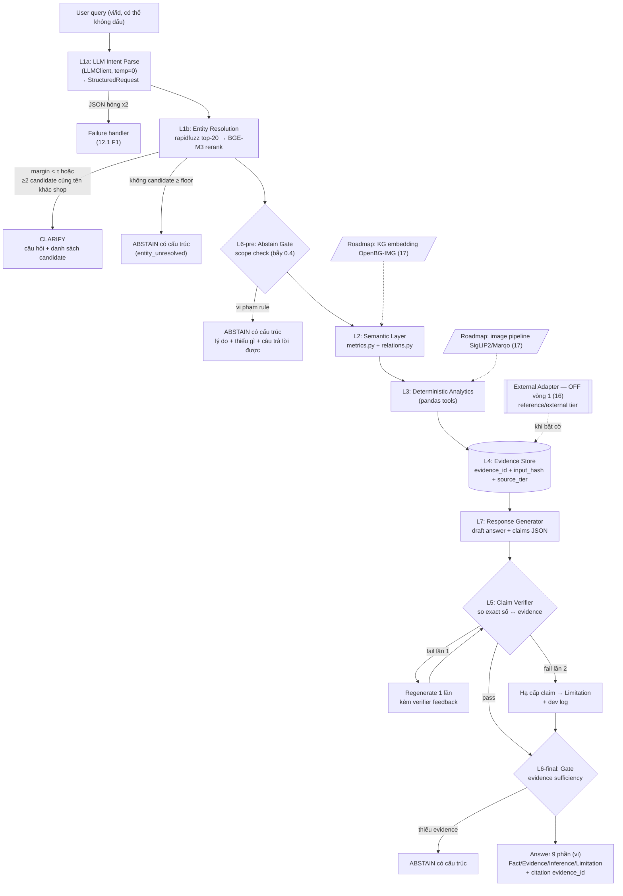
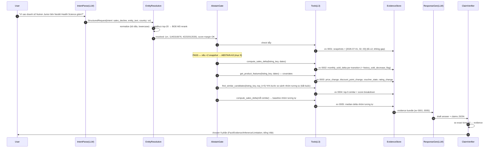
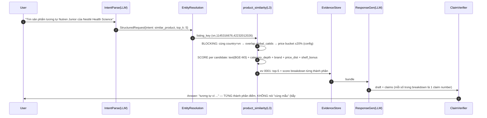
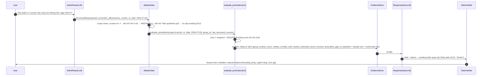

# ARCHITECTURE DESIGN DOC — Verifiable Product Intelligence Agent

**Gladiators · Track 01 · v1.0 — 15/7/2026**

**Hai bảo đảm cốt lõi của hệ thống:**

- (a) **Mọi con số** trong câu trả lời truy vết được về một `evidence_id` trong evidence store, được verify bằng so sánh exact tại runtime **trước khi** trả lời.
- (b) Hệ thống **abstain có cấu trúc** (hoặc clarify — hỏi lại) khi dữ liệu không đủ, theo rule suy từ data contract, không dựa vào "sự tự giác" của LLM.

Hệ thống phải **sẵn chỗ cắm** cho dữ liệu bổ sung bên ngoài (mục 16) và các nâng cấp roadmap — image pipeline, multimodal similarity, KG embedding, nâng cấp embedding (mục 17) — mà không phải sửa core.

---

## Mục lục

0. Bối cảnh cố định: dataset, intent, bẫy dữ liệu, quyết định kiến trúc
1. System Overview & kiến trúc tầng
2. Data Flow chi tiết theo intent (3 walkthrough chính + 3 walkthrough đặc biệt)
3. Data Layer (Pandera contract, ingest, data_quality_report)
4. Semantic Layer (`domain/metrics.py`, `domain/relations.py`, traceability 20 bẫy)
5. Evidence Store
6. Agent Orchestration & Tool Registry
7. Product Similarity
8. Claim Verifier
9. Answer/Abstain Gate
10. Response Generator
11. Eval Harness
12. Non-functional (failure modes, logging, latency, config)
13. Repo Structure & Build Order
14. Risks
15. TODO còn mở (owner + hạn)
16. External Data Augmentation (thiết kế trước — mặc định OFF)
17. Roadmap ngoài vòng 1

- Phụ lục A — Reading List (A1–A9)
- Phụ lục B — Prompt texts (P1–P4)
- Phụ lục C — Ánh xạ nghiên cứu → quyết định kiến trúc

---

## 0. Bối cảnh cố định

### 0.1. Ba intent của agent

1. **`sales_decline`** — "Vì sao doanh số listing A giảm?": resolve listing → check ≥2 snapshot hợp lệ của cùng listing (bẫy #15/#20) → so sánh snapshot → so sánh nhóm listing tương tự → soi price/discount/voucher/trust/content → xếp hạng tín hiệu khả dĩ → **báo cáo tương quan, không nhân quả**.
2. **`similar_product`** — "Listing nào tương tự với listing này?": đơn vị là **product listing** (`country_code + shop_id + item_id`), **KHÔNG phải SKU** — dataset không có `sku_id`/`model_id`, và `tier_variation_name/options` chỉ mô tả lựa chọn hiển thị cấp listing nên **cấm ghép thành SKU proxy** (bẫy #13). Resolve listing → lọc candidate (blocking) → chấm điểm đa thành phần → top-k kèm giải thích từng thành phần điểm.
3. **`promotion_effectiveness`** (giữ tên intent theo đề bài; nội dung là **so sánh MÔ TẢ**, không đo hiệu quả nhân quả) — validate scope → tại **một snapshot đã chọn**, trong **cùng một thị trường**, so nhóm **có structured voucher** (`voucher_discount_num > 0`) với nhóm **không** → tính `median_monthly_sold`, `median estimated_recent_revenue`, `product_count` + chênh lệch mô tả so nhóm nền → **báo cáo sample size + confounders, wording thuần quan sát**. Ràng buộc (bẫy #19): **cấm dựng nhóm promotion/voucher 4 chiều**; structured voucher gần như **chỉ tồn tại ở VN** (1.580/1.580 snapshot thuộc VN) nên so sánh gần như chỉ khả dụng trong VN; `vouchers_count > 0` (label UI) **khác** structured voucher; `promotion_id != 0` **không** chứng minh có promotion tạo discount; cấm chữ "hiệu quả/gây ra/tác động".

Ba intent là entry trong `INTENT_REGISTRY` (6.4): thêm intent mới = 1 spec + tái dùng tool + 12 câu eval, **không sửa core**. Ứng viên #4: `category_insight`.

### 0.2. Dataset — 5 bảng, khóa logic, quan hệ join

Shopee, 2 thị trường `vn` và `id`, 20 shop (10/quốc gia). Snapshot theo ngày `2026-07-01` → `2026-07-03` (3 ngày); riêng `shop_info` chỉ có snapshot `2026-07-03`.

| Bảng                                             | Dòng (processed) | Khóa logic                                               | Join chính                                                                                                                                                                        |
| ------------------------------------------------- | ----------------: | --------------------------------------------------------- | ---------------------------------------------------------------------------------------------------------------------------------------------------------------------------------- |
| `products` (trung tâm)                         |             3.341 | `country_code + shop_id + item_id + date`               | →`shop_info` qua `country_code + shop_id`; → `category_platform` qua `country_code = path_country_code` và `catid`/từng ID trong `global_catids` = `category_id` |
| `shop_info`                                     |                20 | `country_code + shop_id`                                |                                                                                                                                                                                    |
| `category_list` (kệ nội bộ shop)             |               491 | `country_code + shop_id + shop_category_id + date`      | ←`product_categories.category_id = shop_category_id` (kèm country, shop, date)                                                                                                 |
| `product_categories` (SP↔kệ)                  |             4.054 | `country_code + shop_id + item_id + category_id + date` | →`products` qua `country_code + shop_id + item_id + date`                                                                                                                     |
| `category_platform` (taxonomy Shopee/quốc gia) |             4.482 | `path_country_code + category_id`                       |                                                                                                                                                                                    |

**Bảng phân tích chính:** `Dataset/DataProcessed/product_dataset_ready.csv` (products + shop_info + kệ nội bộ gộp vào `shop_category_ids/names/count`). Suffix chuẩn hóa `_num`, `_bool`, `_count`; có `product_name_clean`, `discount_amount_num`.

**Doanh thu:** không có doanh thu trực tiếp; chỉ dùng `estimated_recent_revenue = price_num * monthly_sold_value_num`, luôn label "ước tính".

**Listing duy nhất:** 1.157 (`country_code + shop_id + item_id`) = 682 VN + 475 ID. 3.341 là **product-listing snapshot**, KHÔNG phải 1.157 product và KHÔNG phải SKU.

### 0.3. Môi trường

- **Runtime:** laptop cá nhân, **không GPU**, không managed services trả phí.
- **Ngôn ngữ:** query đầu vào tiếng Việt + Bahasa Indonesia, có thể gõ không dấu; câu trả lời tiếng Việt.
- **Stack chuẩn:** pandas, numpy, pydantic, pandera, rapidfuzz, BGE-M3, pytest. Thêm thư viện ngoài danh sách này chỉ khi blocking, phải ghi vào mục 15.
- **Team & ownership:** DS1 = Data & Semantic Layer · DS2 = Agent & Retrieval · DR1 = Business Logic & Metrics · DR2 = Evaluation · Lead = gác cổng kiến trúc + deck.
- **Timeline:** 15–18/7 core build → **19–22/7 reliability + eval harness chạy được** → 23–25/7 polish/measure → 26–27/7 deck → 28/7 nộp.

### 0.4. Hai mươi bẫy dữ liệu & ranh giới claim — bắt buộc xử lý trong thiết kế

Mỗi bẫy có một nơi xử lý cụ thể trong code; bảng traceability đầy đủ ở 4.4. Bẫy nào không map được coi như thiết kế chưa xong.

1. **`price` là giá cuối hiển thị đã phản ánh voucher/promo.** Chỉ 641/1.016 dòng khớp `price = price_before_promo - voucher_discount`. → Cấm metric tự tái tạo giá cuối; `discount_percent`, `voucher_discount`, `price_before_promo` chỉ để *giải thích* thành phần giảm giá; cấm trừ voucher lần hai.
2. **Hai hệ category ID.** `category_platform.category_id` (↔ `products.catid`/`global_catids`) vs hệ nội bộ shop (`category_list.shop_category_id` ↔ `product_categories.category_id`). **Cấm join chéo.** Join kệ nội bộ luôn kèm `country_code + shop_id (+ date)`.
3. **Double count theo kệ nội bộ:** một sản phẩm nằm nhiều kệ. Group theo kệ được phép double count (đo trưng bày); tổng shop/thị trường phải dedupe theo khóa `products`. Mỗi metric khai báo cờ dedupe.
4. **`monthly_sold_value` không rõ cửa sổ thời gian.** → Caveat trong định nghĩa metric; wording "lượt bán gần đây theo Shopee hiển thị".
5. **3 dòng `price = 999999999`** — sentinel. → Contract có policy flag/loại; metric giá nêu cách xử lý.
6. **`is_ad` và `is_sold_out` toàn `False`** (3.341/3.341 snapshot). → Câu hỏi hiệu quả quảng cáo/sold-out → abstain "toàn bộ = False, không có phương sai để phân tích".
7. **`shop_info` chỉ 1 snapshot (07-03).** → Delta shop-level theo thời gian → abstain.
8. **Chỉ 3 snapshot ngày.** Delta 2 mốc OK; trend dài hạn/seasonality/forecast → abstain có cấu trúc.
9. **Observational data.** → Wording tương quan ("có liên quan tới"), cấm nhân quả ("làm tăng", "gây ra"); promotion chỉ là "observed association / descriptive comparison"; đưa vào rubric judge.
10. **Không có cost/margin/phí sàn.** → Câu hỏi profit → abstain, gợi ý câu trả lời được.
11. **`category_type` không có bảng giải mã** → không diễn giải.
12. **Số listing duy nhất: 1.157** (`country_code + shop_id + item_id`) = 682 VN + 475 ID. 3.341 là **product-listing snapshot**, KHÔNG phải 1.157 product và KHÔNG phải SKU.
13. **Không có SKU/variation-level data.** `item_id` là **listing ID**, KHÔNG phải SKU; dataset không có `sku_id`/`model_id`/giá/tồn kho/sales theo variation. `tier_variation_name/options` chỉ là text mô tả lựa chọn hiển thị — **cấm ghép thành SKU proxy để định danh hay theo dõi**; câu hỏi hiệu năng cấp SKU/variation → abstain.
14. **Không có order-level data** → không có conversion rate, AOV, basket size → câu hỏi các chỉ số này → abstain.
15. **"Doanh số giảm" chỉ hợp lệ khi có ≥2 snapshot của cùng sản phẩm** (`country_code + shop_id + item_id`). Thiếu → abstain/clarify, không tự chọn dòng gần đúng.
16. **Similarity ≠ same-product.** Không có nhãn same-product → chỉ nói "tương tự" kèm các thành phần điểm; cấm khẳng định "cùng mẫu/cùng loại chính xác".
17. **Confidence = mức đầy đủ/nhất quán của evidence, KHÔNG phải xác suất calibrated.** Output contract và judge rubric phải nói đúng ngữ nghĩa này.
18. **Vòng 1 không có image features ngoài `images_count`** (manifest ghi 454 record `downloaded` nhưng checkout không có image binary; chỉ `manifest.csv` được version-control). → Chỉ dùng `images_count` như feature đếm; cấm suy diễn "ảnh thiếu/ít = content kém"; phân tích chất lượng ảnh là roadmap (17).
19. **Structured voucher gần như chỉ ở VN & CẤM nhóm promotion 4 chiều.** Ba population tách bạch: raw có voucher 1.610 → processed structured voucher (`voucher_discount_num > 0`) **1.580 (toàn bộ VN)** → subgroup `promotion_id != 0` là 1.016; công thức `price_before_promo − voucher_discount = price` khớp 1.011/1.580 (641/1.016 ở subgroup). → intent `promotion_effectiveness` chỉ **so mô tả có/không structured voucher trong cùng thị trường**; `vouchers_count > 0` (label UI hỗn hợp như *Pilih Lokal*, *Add-on Deal*) **≠** structured voucher; `promotion_id != 0` không chứng minh có promotion tạo discount (874/3.341 có `promotion_id = 0` sentinel); **cấm dựng 4 nhóm**, cấm suy hiệu quả từ `promotion_id`/`discount_percent`.
20. **Panel 3 ngày KHÔNG balanced.** Kỳ vọng `1.157 × 3 = 3.471` ô, thực có 3.341 (thiếu 130 snapshot): 1.039 listing đủ 3 ngày, 106 có 2 ngày, 12 có 1 ngày; 5 listing VN thiếu ngày giữa (01/07 và 03/07 nhưng không 02/07). → gắn `snapshot_gap_flag`; `sales_decline` cần ≥2 snapshot hợp lệ của cùng listing (bẫy #15), cấm ngầm coi là balanced panel.

### 0.5. Guardrail dữ liệu được viện dẫn xuyên suốt

| ID            | Nội dung                                                                                                                                                                                                               |
| ------------- | ----------------------------------------------------------------------------------------------------------------------------------------------------------------------------------------------------------------------- |
| **G6**  | Mọi aggregate cross-sectional phải**chọn 1 snapshot + dedupe về listing** trước khi tính (không cộng proxy qua 3 ngày).                                                                                 |
| **G9**  | Mọi dòng có structured voucher đều tự động`has_promo = True` (khớp toán học 1.580/1.580) ⇒ chỉ 3 nhóm tồn tại trong thực tế: none 307 / promo-only 1.454 / voucher+promo 1.580. Cấm dựng 4 nhóm. |
| **G12** | Metric tiền tệ gắn`unit` theo `country_code` (VND\|IDR); **cấm so/cộng chéo VN–ID khi chưa có FX evidence**.                                                                                         |

### 0.6. Quyết định kiến trúc đã khóa — không thiết kế lại

Căn cứ nghiên cứu cho từng quyết định: Phụ lục C. Nhiệm vụ của doc này là **chi tiết hóa**, không tranh luận lại.

1. **Single-agent, pipeline tuyến tính.** Claim Verifier và Abstain Gate là code module trong một luồng, KHÔNG phải agent riêng. Không multi-agent.
2. **LLM không bao giờ tự tính số** (PAL/TAG — A1): LLM chỉ parse intent + sinh structured request + sinh văn bản kết luận; mọi phép tính do deterministic tools (pandas/Python).
3. **Semantic layer mini:** mọi metric/định nghĩa nghiệp vụ sống ở MỘT nơi (`domain/metrics.py`); nơi khác import, không định nghĩa lại.
4. **Data contract bằng Pandera** (`coerce=True`, `strict=True`, lazy validation) tại ingest.
5. **Evidence ledger:** mọi kết quả tính toán ghi vào evidence store với `evidence_id`, input hash, `source_tier` ∈ {`btc_dataset`, `reference`, `external`}.
6. **Claim Verifier tại runtime:** response xuất claims JSON `{claim, evidence_id}`; verifier so exact từng con số; fail → chặn. (Bản deterministic hóa của ALCE Citation Recall — A2 — enforce trước khi trả lời thay vì đo post-hoc.)
7. **Abstain Gate rule-based** suy từ data contract + danh sách 0.4; có nhánh **clarify** khi entity resolution ambiguous (margin top-1/top-2 dưới ngưỡng, hoặc ≥2 candidate khác shop cùng tên). (Căn cứ AbstentionBench — A3.)
8. **Entity resolution:** rapidfuzz (chuẩn hóa diacritics) lọc top-20 → BGE-M3 dense+sparse rerank, encode offline, cosine in-memory numpy. KHÔNG vector DB.
9. **KHÔNG GraphRAG / graph DB.** Dữ liệu đã là bảng quan hệ có schema (A7).
10. **Eval 3 tầng** (tool correctness kiểu TRAJECT-Bench → số liệu/citation kiểu ALCE deterministic → chất lượng kết luận LLM-as-judge có rubric + human spot-check). Bộ 60 câu, mỗi câu chạy 3 lần, report **pass^3** (τ-bench); 12 câu abstain theo taxonomy AbstentionBench; report **Abstention Recall/Precision/F1**, **Citation Recall/Precision**.
11. **External data:** vòng 1 chạy 100% trên dataset BTC (`sources.reference.enabled = false`, `sources.external.enabled = false`); kiến trúc có chỗ cắm theo mục 16.
12. **"Skill" = code module/tool trong single agent** (`sales_decline`, `similar_product`, `promotion_effectiveness`, `category_insight`...), KHÔNG phải agent riêng.
13. **Knowledge Graph = relation registry as code, không phải graph DB.** Entity/relation catalog (node, edge, source join, scope, quy tắc diễn giải) trong `domain/relations.py`, **thực thi bằng pandas join**. KG embedding / link prediction và multimodal matching là **roadmap 17**.
14. **Similarity theo mô hình select-from-candidates, deterministic ở hot path.** Filter candidate → chấm điểm đa thành phần → top-k (khớp kết luận ComEM — A5). LLM-as-matcher cho cặp mơ hồ chỉ là **tùy chọn ngoài hot path** (auto-label khi build eval set, hoặc roadmap) — không đứng giữa user và câu trả lời.

### 0.7. Nguyên tắc áp toàn hệ thống

- **Typed everywhere:** mọi interface giữa module là signature/schema có kiểu.
- **Deterministic-first:** chỗ nào để LLM làm việc code làm được, phải giải thích trong doc.
- **Thiết kế cho quy mô thật:** ~3,3k dòng, 20 shop, 3 snapshot, chạy local. Không queue, không cache layer phức tạp, không microservices, không vector DB, không graph DB.
- **Không lấp chỗ thiếu bằng giá trị "hợp lý":** thiếu thông tin → `TODO(owner): <cần gì>` tại chỗ + ghi vào mục 15.

### 0.8. Nguồn dữ liệu 3 tier, 2 cờ config

```yaml
sources:
  btc_dataset: { enabled: true }        # bất biến — Fact tier duy nhất
  reference:   { enabled: false }       # Tier A (FX, lịch 7.7) — bật khi DS1 commit data/reference/ + DR1 review
  external:    { enabled: false }       # Tier B — bật theo trigger 16.g, sớm nhất 23–25/7
```

Bất biến: **Fact chỉ đến từ `btc_dataset`**; reference/external chỉ xuất hiện ở tầng Evidence/Context có label nguồn + thời điểm.

### 0.9. Sản phẩm ví dụ xuyên suốt doc

Listing thật `vn:1145316676:42232012026` (shop **Nestlé Health Science**, `shop_id=1145316676`). Hai con số thật: `voucher_discount = 665.820 VND`, `voucher_min_spend = 3.000.000 VND` (snapshot mới nhất). **Mọi giá trị khác trong payload ví dụ được đánh dấu `# minh họa`** — không phải trích xuất từ dataset, không được dùng làm ground truth.

---

## 1. System Overview & kiến trúc tầng

### 1.1. Bảng tầng — trách nhiệm & **negative responsibility**

| #  | Tầng                                     | Trách nhiệm                                                                                                            | Input → Output                                                 | **KHÔNG được làm**                                                                                   |
| -- | ----------------------------------------- | ------------------------------------------------------------------------------------------------------------------------ | --------------------------------------------------------------- | --------------------------------------------------------------------------------------------------------------- |
| L1 | **Intent + Entity Resolution**      | Parse intent (LLM) →`StructuredRequest`; resolve entity (rapidfuzz → BGE-M3) → `ResolvedEntity`/`ClarifyNeeded` | user text → StructuredRequest + candidates                     | Không tính metric; không đoán khi ambiguous (margin < τ → clarify); không tự chọn "dòng gần đúng" |
| L2 | **Semantic Layer**                  | Cung cấp định nghĩa metric, relation registry, grain, khóa, promotion taxonomy                                      | request → metric/relation specs                                | Không đọc CSV trực tiếp; không chứa business logic ad-hoc ngoài registry                                |
| L3 | **Deterministic Analytics (tools)** | Thực thi phép tính pandas theo metric spec; mỗi kết quả → evidence record                                         | typed args → typed result + evidence_id                        | Không gọi LLM; không format văn bản trả lời; không định nghĩa lại metric                            |
| L4 | **Evidence Store**                  | Ghi/tra`evidence_id`, input hash, `source_tier`, payload chuẩn                                                      | tool result → EvidenceRecord                                   | Không biến đổi giá trị; không nhận record thiếu source_tier                                            |
| L5 | **Claim Verifier**                  | So exact từng con số trong claims JSON với evidence; chặn số không nguồn                                          | draft claims → verified/blocked                                | Không "sửa hộ" con số; không bỏ qua claim thiếu evidence_id                                              |
| L6 | **Answer/Abstain Gate**             | Rule-based abstain/clarify suy từ contract + bẫy 0.4; kiểm evidence sufficiency                                       | request/evidence bundle → pass / abstain(structured) / clarify | Không dựa vào "sự tự giác" của LLM (A3); không abstain suông thiếu cấu trúc 3 phần                 |
| L7 | **Response Generator**              | LLM diễn giải theo answer contract 9 phần + claims JSON                                                               | evidence bundle → answer(vi) + claims                          | **Không tự tính số**; không dùng từ nhân quả cho quan sát; không thêm số ngoài evidence     |
| — | **External Adapter (OFF vòng 1)**  | Chỗ cắm mục 16; fetch/map/cache external                                                                              | ExternalQuery → ExternalRecord                                 | Không được là nguồn của Fact; không vào answer khi`unmapped`                                         |

### 1.2. Pipeline flowchart



### 1.3. Rationale kiến trúc

Kiến trúc này là bản thu nhỏ của pattern *semantic layer + deterministic engine*: LLM chỉ chọn metric đã định nghĩa, không tự viết logic. Benchmark dbt Labs 2026 (A1) báo cáo accuracy Text-to-SQL trên raw schema 32,7% → 64,5% khi thêm modeling → ~100% khi query đi qua semantic layer đã model đủ. Cùng hướng: PAL (A1) tách reasoning khỏi computation để loại lỗi số học ngay cả khi reasoning đúng; TAG (A1) chuẩn hóa quy trình query synthesis → execution → answer generation.

Quyết định **không** dùng GraphRAG có verdict định lượng: GraphRAG chỉ vượt dense retrieval **+27,23 điểm ở multi-hop QA** trên corpus phi cấu trúc, nhưng chỉ **+0,47 ở general QA** (A7) — dữ liệu của mình đã là bảng quan hệ có khóa cứng, 3 intent là join + group-by + delta 1-hop. Chi tiết verdict hai chiều cho graph DB / vector DB / multi-agent: Phụ lục C.

---

## 2. Data Flow chi tiết theo intent

Sản phẩm ví dụ xuyên suốt (0.9): `vn:1145316676:42232012026` — Nestlé Health Science. Trace id ví dụ: `t_a1b2c3d4e5f6`.

### 2.1. Walkthrough `sales_decline` — "Vì sao doanh số Nutren Junior giảm?" *(tên sản phẩm trong câu hỏi là minh họa)*



**Bảng I/O từng bước (payload ví dụ):**

| Bước | Tool/Module                     | Input (rút gọn)     | Output → evidence                                                                                                                                                                                                                                                                                                        |
| ------ | ------------------------------- | --------------------- | ------------------------------------------------------------------------------------------------------------------------------------------------------------------------------------------------------------------------------------------------------------------------------------------------------------------------- |
| 1      | `IntentParse`                 | text câu hỏi        | `{"intent":"sales_decline","entity_text":"Nutren Junior","shop_hint":"Nestlé Health Science","country":"vn","date_range":["2026-07-01","2026-07-03"]}`                                                                                                                                                                 |
| 2      | `resolve_entity`              | entity_text, country  | `{"listing_key":["vn","1145316676","42232012026"],"top1_score":0.91,"margin":0.23}` *# điểm minh họa*                                                                                                                                                                                                              |
| 3      | `get_product_snapshots`       | listing_key           | `ev:t_a1b2c3d4e5f6:0001` payload: `{"metric":"snapshot_dates","value":["2026-07-01","2026-07-02","2026-07-03"],"snapshot_gap_flag":false}`                                                                                                                                                                            |
| 4      | `compute_sales_delta`         | listing_key, dates    | `ev:0002`: `{"metric":"monthly_sold_delta","value":[{"from":"2026-07-01","to":"2026-07-02","delta":-38},{"from":"2026-07-02","to":"2026-07-03","delta":-12}],"unit":"units_per_recent_window","caveat":"monthly_sold là lượt bán gần đây Shopee hiển thị, cửa sổ chưa xác nhận"}` *# delta minh họa* |
| 5      | `get_product_features`        | listing_key, dates    | `ev:0003`: `{"price_change_pct":-3.1,"discount_point_change":-4.0,"voucher_state":{"2026-07-02":"có","2026-07-03":"có","voucher_discount_latest":665820,"voucher_min_spend_latest":3000000},"unit_money":"VND"}` *# price/discount minh họa; 2 số voucher là số thật*                                        |
| 6      | `find_similar_candidates`     | listing_key, top_k=5  | `ev:0004`: top-5 + score breakdown (xem 7.5)                                                                                                                                                                                                                                                                            |
| 7      | `compute_sales_delta` (batch) | 5 listing tương tự | `ev:0005`: `{"metric":"similar_group_median_delta","value":-9,"n":5}` *# minh họa*                                                                                                                                                                                                                                 |
| 8      | `ResponseGen`                 | bundle                | draft +`claims: [{"text":"monthly_sold giảm 38 giữa 01→02/07","numbers":[{"value":-38,"evidence_id":"...:0002","path":"value[0].delta"}],"level":"fact"}, ...]`                                                                                                                                                      |

### 2.2. Walkthrough `similar_product` — "Listing nào tương tự sản phẩm này?"

Đơn vị là **product listing** (`country_code+shop_id+item_id`), **không phải SKU** (bẫy #13 — dataset không có `sku_id`/`model_id`; `tier_variation_*` chỉ là text hiển thị, cấm ghép thành SKU proxy).



Payload evidence đầy đủ: 7.5.

### 2.3. Walkthrough `promotion_effectiveness` — so sánh **MÔ TẢ**, không đo hiệu quả nhân quả

Ràng buộc cứng từ bẫy #19: chỉ so nhóm `has_structured_voucher` (voucher_discount_num > 0) vs nhóm không, **tại một snapshot đã chọn, trong cùng một thị trường**; structured voucher = 1.580/1.580 snapshot đều thuộc VN → so sánh thực tế chỉ khả dụng trong VN; **cấm 4 nhóm**, cấm chữ "hiệu quả/gây ra/tác động".



Số tham chiếu thật để viết Limitation mẫu (snapshot mới nhất, chỉ VN): nhóm không voucher **94 listing / 6 shop / median monthly sold 284,5 / median price 38.700 VND / median revenue proxy 10.873.500 VND**; nhóm có voucher **588 / 9 / 205,0 / 143.237,5 / 38.776.320** — hai nhóm khác mạnh về shop/ngành/mức giá ⇒ mọi chênh lệch chỉ là mô tả, không phải effect.

### 2.4. Ba walkthrough đặc biệt — đi hết đường tới response cuối

**(a) ABSTAIN — "Xu hướng bán hàng của shop này theo mùa thế nào?"**

1. IntentParse → intent ngoài registry / yêu cầu seasonality. 2. Gate rule **A4** khớp (chỉ 3 snapshot — bẫy #8). 3. Response cuối (mẫu, tiếng Việt):

> **Không đủ dữ liệu để trả lời.** *Lý do:* dataset chỉ có 3 snapshot ngày 01–03/07/2026, không đủ cho seasonality/trend dài hạn. *Dữ liệu hiện có trả lời được:* thay đổi giữa tối đa 2 cặp snapshot trong 3 ngày này (delta giá, sold proxy, voucher). *Cần thêm gì:* chuỗi snapshot ≥ vài tuần/tháng. *Bạn có thể hỏi:* "Sold proxy của shop X thay đổi thế nào giữa 01/07 và 03/07?"

**(b) CLARIFY — hai candidate cùng tên khác shop.** (Dữ liệu xác nhận: 5 nhóm listing trùng tên trong cùng shop ở snapshot mới nhất; trùng tên khác shop hoàn toàn khả dĩ → không đoán.)

1. resolve_entity trả 2 candidate, margin < τ. 2. Nhánh clarify (không phải refuse):

> Mình tìm thấy **2 listing** khớp tên bạn hỏi. Bạn muốn nói tới listing nào?
> ① `[tên]` — shop **Richy - Chi Nhánh Miền Bắc** (vn, shop 173513432) · ② `[tên]` — shop **Richy - Chi nhánh Miền Nam** (vn, shop 438905996) *(cặp shop minh họa lấy từ danh sách shop thật)*

3. User chọn → pipeline tiếp tục với listing_key đã chốt.

**(c) CẦN EXTERNAL KHI OFF — "Tổng revenue proxy VN so với Indonesia bên nào cao hơn (quy ra USD)?"**

1. Gate rule **A16** khớp: so sánh monetary VN–ID cần FX (G12), `sources.reference.enabled=false`. 2. Response cuối:

> **Chưa thể so sánh trực tiếp.** *Lý do:* dataset không có trường currency/FX; VND và IDR chỉ suy từ `country_code`, so tuyệt đối khi chưa quy đổi là sai lệch. Nguồn tỷ giá (reference tier) hiện **đang tắt** trong cấu hình vòng 1. *Trả lời được ngay:* so sánh theo tỷ lệ/median trong từng thị trường riêng. *Cần thêm gì:* bật reference tier với file tỷ giá 01–03/07/2026 có nguồn (thiết kế sẵn ở mục 16). *Bạn có thể hỏi:* "Median revenue proxy theo shop trong VN ngày 03/07?"

---

## 3. Data Layer

### 3.1. Nguồn đọc: `DataProcessed`

Ingest đọc từ `Dataset/DataProcessed/` (các bảng `*_clean.csv` + `product_dataset_ready.csv`), **không** đọc lại DataRaw ở vòng 1. Lý do: (i) processed đã dedupe 30 dòng trùng exact (3.371 → 3.341, toàn bộ 30 dòng loại là structured-voucher rows); (ii) đã có suffix chuẩn hóa `_num/_bool/_count` và `product_name_clean`, `discount_amount_num`; (iii) DataRaw 82 CSV chỉ cần khi rebuild pipeline — thuộc phạm vi `Preprocessing/`, ngoài critical path.

### 3.2. Data contract — Pandera, chiến lược **contract projection** để giữ `strict=True`

`product_dataset_ready` có 94 cột. Giải pháp giữ đúng quyết định khóa #4 (`coerce=True, strict=True`, lazy): **ingest chỉ xuất ra projection gồm các cột trong contract**; mọi module downstream chỉ được đọc projection này. Cột mới muốn dùng → thêm vào contract qua PR (DS1 + DR1 approve) → chính là cơ chế enforce "một định nghĩa một nơi" ở tầng dữ liệu.

Đây cũng là chốt chặn diệt lớp bug `has_promo` của MVP cũ: `promotion_id` đọc thành chuỗi, `"0"` bool ra `True` → 305 dòng phân loại sai. Với contract dưới đây, `promotion_id_num` bị **ép kiểu Int64 ngay tại ingest**, sentinel `0` xử lý tường minh.

```python
# src/gladiators/data/contracts.py            owner: DS1 (review: DR1)
import pandera as pa
from pandera import Column, Check

DATES = ["2026-07-01", "2026-07-02", "2026-07-03"]
PRICE_SENTINEL = 999_999_999  # 3 dòng — bẫy #5

# ---------- products (projection từ product_dataset_ready.csv) ----------
products_schema = pa.DataFrameSchema(
    {
        # khóa grain: country_code + shop_id + item_id + date
        "country_code": Column(str, Check.isin(["vn", "id"])),
        "shop_id":      Column(str, coerce=True),   # đọc string để không mất leading digits
        "item_id":      Column(str, coerce=True),
        "date":         Column(str, Check.isin(DATES)),
        # tên & content
        "product_name":       Column(str, nullable=True),
        "product_name_clean": Column(str, nullable=True),
        "images_count":       Column("Int64", nullable=True, coerce=True),   # bẫy #18: chỉ là feature đếm
        "tier_variation_name":    Column(str, nullable=True),                # bẫy #13: display text, KHÔNG phải SKU
        "tier_variation_options": Column(str, nullable=True),                # JSON string; parse ở feature layer
        # giá & giảm giá (bẫy #1: price là giá cuối hiển thị, đã phản ánh voucher/promo)
        "price_num":           Column(float, nullable=True, coerce=True),
        "price_original_num":  Column(float, nullable=True, coerce=True),
        "discount_percent_num": Column(float, nullable=True, coerce=True),   # 307 dòng trống, tất cả price==price_original → fill 0 CHỈ trong case này
        "discount_amount_num": Column(float, nullable=True, coerce=True),    # đã verify = price_original_num - price_num (0 mismatch/3.341)
        # sales proxy (bẫy #4)
        "monthly_sold_value_num": Column(float, nullable=True, coerce=True),
        "history_sold_value_num": Column(float, nullable=True, coerce=True),
        # promotion & voucher (bẫy #19)
        "promotion_id_num":       Column("Int64", nullable=True, coerce=True),  # 0 = sentinel "không/không xác định" (874/3.341)
        "voucher_discount_num":   Column(float, nullable=True, coerce=True),    # NaN = không có structured voucher (KHÔNG phải 0)
        "voucher_min_spend_num":  Column(float, nullable=True, coerce=True),
        "voucher_code":           Column(str, nullable=True),
        "vouchers_count":         Column("Int64", nullable=True, coerce=True),  # label UI hỗn hợp ≠ structured voucher
        # engagement & flags
        "rating_num":        Column(float, nullable=True, coerce=True),
        "rating_count_num":  Column(float, nullable=True, coerce=True),
        "liked_count_num":   Column(float, nullable=True, coerce=True),
        "is_ad_bool":        Column(bool, coerce=True),   # toàn False 3.341/3.341 — bẫy #6
        "is_sold_out_bool":  Column(bool, coerce=True),   # toàn False 3.341/3.341 — bẫy #6
        # category (hệ platform — bẫy #2)
        "catid":         Column(str, coerce=True),        # = phần tử đầu global_catids, top-level
        "global_catids": Column(str),                     # JSON string; phần tử cuối = leaf (has_children=False 3.341/3.341)
        # shelf nội bộ đã enrich sẵn trong product_dataset_ready
        "shop_category_ids":   Column(str, nullable=True),
        "shop_category_names": Column(str, nullable=True),
        "shop_category_count": Column("Int64", nullable=True, coerce=True),
    },
    strict=True,      # projection: cột ngoài contract bị loại TRƯỚC khi validate
    coerce=True,
    unique=["country_code", "shop_id", "item_id", "date"],   # đã kiểm: 0 duplicate-key group
)
# TODO(DS1, trước 16/7): xác nhận trong preprocessing.md tên cột chính xác cho:
#   brand, price_before_promo(_num?), voucher_start_time/voucher_end_time(_num?),
#   shopee_verified(_bool?), tier_variation_options_count — rồi bổ sung vào contract qua PR.

# ---------- shop_info ----------
shop_info_schema = pa.DataFrameSchema(
    {
        "country_code": Column(str, Check.isin(["vn", "id"])),
        "shop_id":      Column(str, coerce=True),
        # snapshot duy nhất 2026-07-03 — bẫy #7: enrichment là static/latest
        # TODO(DS1): điền tên cột _num/_bool thật (follower, rating, response, is_official_shop, vacation)
    },
    strict=False,  # tạm — nâng lên strict=True ngay khi TODO trên đóng (PR riêng)
    coerce=True,
    unique=["country_code", "shop_id"],
)

# ---------- category_list (kệ nội bộ shop) ----------
category_list_schema = pa.DataFrameSchema(
    {
        "country_code":     Column(str, Check.isin(["vn", "id"])),
        "shop_id":          Column(str, coerce=True),
        "shop_category_id": Column(str, coerce=True),
        "date":             Column(str, Check.isin(DATES)),
    },
    strict=False,  # TODO(DS1): thêm is_parent_category/is_sub_category/total với tên hậu tố chính xác → strict=True
    coerce=True,
    unique=["country_code", "shop_id", "shop_category_id", "date"],
)

# ---------- product_categories (SP ↔ kệ) ----------
product_categories_schema = pa.DataFrameSchema(
    {
        "country_code": Column(str, Check.isin(["vn", "id"])),
        "shop_id":      Column(str, coerce=True),
        "item_id":      Column(str, coerce=True),
        "category_id":  Column(str, coerce=True),   # = shop_category_id, KHÔNG join với category_platform.category_id (bẫy #2)
        "date":         Column(str, Check.isin(DATES)),
    },
    strict=True, coerce=True,
    unique=["country_code", "shop_id", "item_id", "category_id", "date"],
)

# ---------- category_platform (taxonomy Shopee theo quốc gia) ----------
category_platform_schema = pa.DataFrameSchema(
    {
        "path_country_code":  Column(str, Check.isin(["vn", "id"])),
        "category_id":        Column(str, coerce=True),
        "parent_category_id": Column(str, nullable=True, coerce=True),
        "has_children_bool":  Column(bool, coerce=True),
        # TODO(DS1): tên cột display-name của category → thêm khi xác nhận
    },
    strict=False, coerce=True,
    unique=["path_country_code", "category_id"],
)
```

### 3.3. Pipeline ingest & hành vi khi validation fail

```python
# src/gladiators/data/ingest.py               owner: DS1
def load_products() -> tuple[pd.DataFrame, IngestReport]:
    raw = pd.read_csv(READY_CSV, dtype=str)              # 1) đọc all-string: không để pandas đoán kiểu
    proj = raw[list(products_schema.columns)]            # 2) contract projection (KeyError = cột contract biến mất → FAIL toàn bộ)
    try:
        df = products_schema.validate(proj, lazy=True)   # 3) coerce + gom toàn bộ lỗi
        bad = df.iloc[0:0]
    except pa.errors.SchemaErrors as e:                  # 4) QUARANTINE dòng lỗi, không fail cả pipeline,
        bad_idx = e.failure_cases["index"].dropna().unique()   #    không âm thầm drop: mọi dòng quarantine vào report
        df, bad = _split(proj, bad_idx)
        df = products_schema.validate(df, lazy=True)
    df["price_sentinel_flag"] = df["price_num"] == PRICE_SENTINEL   # 5) sentinel: FLAG, không drop (bẫy #5)
    df["snapshot_gap_flag"] = _internal_gap(df)          # 6) 5 listing VN có 01/07 & 03/07 nhưng thiếu 02/07 (bẫy #20)
    df["dataset_version"] = _sha256_file(READY_CSV)[:12] # 7) gắn version cho evidence reproducibility
    return df, IngestReport(quarantined=bad, ...)        # 8) sinh data_quality_report.json (3.4)
```

Chính sách: **fail toàn bộ** chỉ khi (a) cột contract biến mất, (b) khóa grain duplicate, (c) >1% dòng quarantine (ngưỡng config). Còn lại: quarantine + báo cáo — không âm thầm bỏ dữ liệu lỗi.

### 3.4. `data_quality_report.json` — format

Report được **Abstain Gate đọc bằng máy** để suy rule: một contract → validate ingest + sinh abstain rules + sinh testcase ("one definition, three enforcement points").

```json
{
  "dataset_version": "sha256:ab12cd34ef56",
  "generated_at": "2026-07-15T21:00:00+07:00",
  "row_counts": {"products": 3341, "shop_info": 20, "category_list": 491,
                  "product_categories": 4054, "category_platform": 4482},
  "listings": {"total": 1157, "vn": 682, "id": 475},
  "snapshots_per_date": {"2026-07-01": 1055, "2026-07-02": 1144, "2026-07-03": 1142},
  "panel_coverage": {"days3": 1039, "days2": 106, "days1": 12, "missing_cells": 130,
                      "internal_gap_listings_vn": 5},
  "zero_variance_flags": {"is_ad_bool": true, "is_sold_out_bool": true},
  "price_sentinel": {"value": 999999999, "rows": 3},
  "duplicates_removed_raw": 30,
  "discount_percent_missing": {"rows": 307, "all_price_eq_original": true},
  "voucher_coverage": {"structured_rows": {"vn": 1580, "id": 0},
                        "promotion_id_zero_rows": 874,
                        "price_formula_match": {"structured": "1011/1580", "with_promoid": "641/1016"}},
  "sales_anomalies": {"history_sold_decrease": {"count": 88, "of_transitions": 2136, "country": "vn"}},
  "referential": {"product_categories_orphans_to_products": 5,
                   "snapshots_without_shelf_mapping": 1132},
  "shop_info_dates": ["2026-07-03"]
}
```

---

## 4. Semantic Layer — `domain/metrics.py` + `domain/relations.py`

### 4.1. Metric table (toàn bộ metric cho 3 intent)

Owner định nghĩa lời: DR1; code: DS1; review chéo bắt buộc.

Quy ước chung: mọi aggregate cross-sectional **chọn 1 snapshot + dedupe về listing** trước khi tính (G6); mọi metric tiền tệ gắn `unit` theo `country_code` (VND|IDR) và **không so/cộng chéo VN–ID khi chưa có FX** (G12); metric phụ thuộc giá loại/flag 3 dòng sentinel trước (bẫy #5).

| Metric                                                                                                                | Công thức                                                                                                               | Grain                                         | Đơn vị                                 | Cột phụ thuộc                                                                                                | Edge cases                                                                                                                                                                                              | Dedupe                                                                           |
| --------------------------------------------------------------------------------------------------------------------- | ------------------------------------------------------------------------------------------------------------------------- | --------------------------------------------- | ----------------------------------------- | --------------------------------------------------------------------------------------------------------------- | ------------------------------------------------------------------------------------------------------------------------------------------------------------------------------------------------------- | -------------------------------------------------------------------------------- |
| `monthly_sold_delta` — **trigger chính sales_decline**                                                      | `msv(T) − msv(T−1)`                                                                                                   | transition (listing, cặp snapshot liền kề) | lượt bán/cửa sổ gần đây (proxy)   | `monthly_sold_value_num`                                                                                      | <2 snapshot hợp lệ → abstain A3; NaN một đầu → loại transition + ghi coverage; giảm là phổ biến (413/2.043) —**không tự động là lỗi**                                          | n/a (per listing)                                                                |
| `history_sold_delta_raw` + `history_sold_decrease_flag` + `history_sold_delta_clean` — **kênh anomaly** | `hsv(T) − hsv(T−1)`; flag khi < 0; clean = raw nếu ≥0, ngược lại null                                            | transition                                    | lượt bán lũy kế (proxy)              | `history_sold_value_num`                                                                                      | 88/2.136 transition giảm, toàn VN →**báo cáo là data-quality anomaly**, cấm diễn giải "lượng bán mới phát sinh" khi flag=True; loại khỏi mọi phép cộng incremental             | n/a                                                                              |
| `price_change`, `price_change_pct`                                                                                | `p(T)−p(T−1)`; `%=100·Δ/p(T−1)`                                                                                  | transition                                    | tiền local / %                           | `price_num`                                                                                                   | loại sentinel trước;`p(T−1)∈{0,NaN}` → null + flag chia-0                                                                                                                                       | n/a                                                                              |
| `discount_point_change`                                                                                             | `dp(T) − dp(T−1)`                                                                                                     | transition                                    | điểm %                                  | `discount_percent_num`                                                                                        | missing chỉ fill 0 khi`price==price_original` (307 dòng đúng pattern này); ngược lại giữ null + flag                                                                                         | n/a                                                                              |
| `voucher_state_transition`                                                                                          | so trạng thái structured voucher (none↔có, đổi code/discount/min_spend) giữa 2 snapshot                            | transition                                    | trạng thái                              | `voucher_discount_num`, `voucher_min_spend_num`, `voucher_code`                                           | **NaN-vs-NaN phải loại trước khi đếm "đổi"** — nếu không sẽ đếm nhầm 1.125 transition không-voucher-cả-hai-lần thành "đổi"                                                   | n/a                                                                              |
| `rating_change`, `rating_count_delta`, `liked_delta`                                                            | delta 2 snapshot                                                                                                          | transition                                    | điểm / lượt                           | `rating_num`, `rating_count_num`, `liked_count_num`                                                       | NaN → loại transition                                                                                                                                                                                 | n/a                                                                              |
| `estimated_recent_revenue`                                                                                          | `price_num × monthly_sold_value_num`                                                                                   | **snapshot** (1 listing, 1 ngày)       | tiền local, label**"ước tính"** | `price_num`, `monthly_sold_value_num`                                                                       | sentinel loại; caveat bắt buộc: msv là "lượt bán gần đây Shopee hiển thị, cửa sổ chưa xác nhận" (bẫy#4); **cấm cộng qua 3 snapshot**                                          | khi aggregate: chọn 1 snapshot (mặc định latest/listing) rồi dedupe listing |
| `has_structured_voucher` — nhị phân, nhóm chính của intent 3                                                  | `voucher_discount_num > 0` (NaN ⇒ False, kèm ghi coverage)                                                            | snapshot                                      | bool                                      | `voucher_discount_num`                                                                                        | 1.580/1.580 dòng True đều thuộc VN; ID = 0 dòng → so VN–ID nhóm voucher = abstain A11                                                                                                           | dedupe listing khi lập nhóm                                                    |
| `has_voucher_label` — chỉ để phân biệt, KHÔNG dùng lập nhóm chính                                        | `vouchers_count > 0`                                                                                                    | snapshot                                      | bool                                      | `vouchers_count`                                                                                              | label UI hỗn hợp (*Pilih Lokal*, *Add-on Deal*…) ≠ structured voucher (bẫy #19)                                                                                                                | —                                                                               |
| `has_promo` — **derived flag, cấm dùng làm cờ promotion độc lập**                                     | `discount_percent_num > 0`                                                                                              | snapshot                                      | bool                                      | `discount_percent_num`                                                                                        | G9: mọi dòng có voucher đều tự động`has_promo=True` (khớp toán học 1.580/1.580) ⇒ chỉ 3 nhóm tồn tại: none 307 / promo-only 1.454 / voucher+promo 1.580; **cấm dựng 4 nhóm** | —                                                                               |
| `discount_bucket` — mức giảm giá **hiển thị** (không gọi là "promotion")                             | bins trên`discount_percent_num`; đề xuất `{0} · (0,10] · (10,20] · (20,40] · (40,100]`                        | snapshot                                      | bucket                                    | `discount_percent_num`                                                                                        | `TODO(DR1, 16/7): chốt bins sau EDA phân phối`                                                                                                                                                     | dedupe listing khi đếm                                                         |
| `product_count`, `median_monthly_sold`, `median_estimated_recent_revenue` (theo nhóm)                          | count / median trong nhóm,**tại 1 snapshot đã chọn, cùng country**                                            | nhóm listing                                 | — / lượt / tiền local                 | như trên                                                                                                      | median (không mean) để chống outlier; luôn báo sample size                                                                                                                                        | **bắt buộc**: 1 snapshot + dedupe listing                                |
| `descriptive_gap_vs_baseline`                                                                                       | `median(nhóm) − median(baseline)`; baseline = nhóm không voucher cùng scope                                        | nhóm                                         | như metric gốc                          | như trên                                                                                                      | wording thuần quan sát: "khác biệt mô tả", cấm "hiệu quả/gây ra/tác động" (bẫy#9/#19)                                                                                                     | như trên                                                                       |
| Similarity score components (chi tiết 7.3)                                                                           | `text_sim`, `category_overlap_depth`, `brand_match`, `price_distance`, `same_shelf_bonus`, `similarity_score` | cặp listing @ 1 snapshot                     | [0,1]                                     | `product_name_clean`, `global_catids`, `price_num`, `shop_category_ids`, brand `TODO(DS1: tên cột)` | xem 7.3                                                                                                                                                                                                 | latest snapshot/listing                                                          |

```python
# src/gladiators/domain/metrics.py            owner: DS1 · định nghĩa lời: DR1 · review chéo: bắt buộc
from dataclasses import dataclass
from typing import Callable, Literal
import pandas as pd

@dataclass(frozen=True)
class MetricSpec:
    name: str
    fn: Callable[..., pd.DataFrame]
    grain: Literal["snapshot", "transition", "group", "pair"]
    unit: str                       # "VND|IDR by country" / "percent_point" / "count" / "bool"
    dedupe: Literal["none", "one_snapshot_per_listing"]
    caveats: tuple[str, ...]        # chèn bắt buộc vào evidence payload
    traps: tuple[int, ...]          # bẫy 0.4 mà metric này xử lý

REGISTRY: dict[str, MetricSpec] = {}
def metric(**kw):
    def deco(fn):
        REGISTRY[kw["name"]] = MetricSpec(fn=fn, **kw); return fn
    return deco

@metric(name="monthly_sold_delta", grain="transition", unit="units_recent_window",
        dedupe="none", caveats=("monthly_sold là proxy hiển thị, cửa sổ chưa xác nhận",), traps=(4, 15, 20))
def monthly_sold_delta(df: pd.DataFrame, listing_key: tuple[str, str, str]) -> pd.DataFrame:
    s = (df.pipe(_one_listing, listing_key).sort_values("date"))
    if s["date"].nunique() < 2:
        raise InsufficientSnapshots(listing_key)          # → Gate A3, không tự chọn dòng gần đúng
    out = s[["date", "monthly_sold_value_num"]].copy()
    out["delta"] = out["monthly_sold_value_num"].diff()
    return out.dropna(subset=["delta"])

@metric(name="estimated_recent_revenue", grain="snapshot", unit="VND|IDR by country",
        dedupe="one_snapshot_per_listing", caveats=("proxy 'ước tính', không phải GMV/doanh thu kế toán",
        "không cộng qua 3 snapshot"), traps=(4, 5))
def estimated_recent_revenue(df: pd.DataFrame) -> pd.Series:
    ok = df.loc[~df["price_sentinel_flag"]]
    return ok["price_num"] * ok["monthly_sold_value_num"]
```

### 4.2. Relation registry — Knowledge Graph = **relation registry as code**, thực thi bằng pandas join (khóa #13)

Entity catalog (11 entity — **KHÔNG có SKU entity**, bẫy #13): `Country, Shop, Brand, ProductListing, PlatformCategory, ShopCategory, Promotion, Voucher, Content, SalesMetric, DateSnapshot`.

| Relation                                | Source (bảng + join key)                                                                                                                            | Scope bắt buộc                           | Quy tắc diễn giải                                                                                                                                                                                                          | Bẫy     |
| --------------------------------------- | ---------------------------------------------------------------------------------------------------------------------------------------------------- | ------------------------------------------ | ----------------------------------------------------------------------------------------------------------------------------------------------------------------------------------------------------------------------------- | -------- |
| `belongs_to` (Listing→Shop)          | products ⨝ shop_info trên`country_code + shop_id`                                                                                                | country+shop                               | shop_info chỉ có 03/07 → gọi là**latest/static enrichment**, không phải thuộc tính đồng thời từng ngày                                                                                                    | #7       |
| `observed_at` (Listing→DateSnapshot) | grain products                                                                                                                                       | full key                                   | 1 dòng = 1 listing-snapshot; 3.341 ≠ 1.157                                                                                                                                                                                  | #12, #20 |
| `in_platform_category`                | products.catid / từng ID trong`global_catids` ⨝ category_platform trên `path_country_code + category_id`                                      | **country bắt buộc**               | `catid` = top-level (parent=0, 3.341/3.341); leaf = phần tử cuối `global_catids` (has_children=False 3.341/3.341); referential 0 orphan                                                                                | #2       |
| `in_shop_category`                    | product_categories ⨝ category_list trên`country + shop + category_id=shop_category_id + date`; nối về products trên full listing-snapshot key | country+shop+date                          | multi-membership hợp lệ**chỉ ở cấp kệ**; tổng shop/thị trường phải dedupe về grain products; 5 orphan (VN, shop 289646907, 01/07) giữ như exception; 1.132 snapshot không có mapping → dùng left join | #2, #3   |
| `has_brand`                           | products (cột brand —`TODO(DS1): tên cột`)                                                                                                     | country                                    | match brand chỉ bằng field,**cấm suy từ tên sản phẩm**                                                                                                                                                           | —       |
| `has_promotion`                       | products.`promotion_id_num` tại snapshot                                                                                                          | snapshot                                   | `0` = sentinel (874 dòng); nhiều-nhiều theo thời gian (1 ID áp cho nhiều listing: vd 155 item_id/300 snapshot); `≠0` **không** chứng minh có promotion tạo discount; cấm suy effectiveness              | #19      |
| `has_voucher`                         | các cột`voucher_*` tại snapshot                                                                                                                 | snapshot,**VN-only trên thực tế** | thuộc tính theo snapshot, không cố định theo item (code đổi 798/933 transition có voucher 2 đầu); khóa record:`voucher_snapshot_key = country:shop:item:date:voucher_code`                                      | #19      |
| `has_content`                         | `product_name_clean`, `images_count`, `tier_variation_*`                                                                                       | snapshot                                   | `images_count` chỉ là feature đếm; **cấm suy "ảnh ít = content kém"**                                                                                                                                         | #18      |
| `has_display_variation`               | `tier_variation_name/options`                                                                                                                      | snapshot                                   | chỉ mô tả lựa chọn hiển thị cấp listing;**KHÔNG định danh/theo dõi SKU** (727/1.157 có tên variation, 582 có ≥2 option, max 38 — nhưng không có sku_id/giá/tồn kho theo option)                   | #13      |
| `has_sales_metric`                    | `monthly_sold_value_num`, `history_sold_value_num`, revenue proxy                                                                                | snapshot/transition                        | semantics theo 4.1; wording "proxy" bắt buộc                                                                                                                                                                                | #4       |

```python
# src/gladiators/domain/relations.py           owner: DS1 (đồng review: DS2)
from dataclasses import dataclass

@dataclass(frozen=True)
class Relation:
    name: str
    left: str; right: str                 # entity names
    source: str                           # bảng nguồn
    join_keys: tuple[tuple[str, str], ...]  # (left_col, right_col)
    scope: tuple[str, ...]                # cột bắt buộc có mặt trong mọi join/filter
    interpretation: str                   # chèn vào evidence caveat khi relation được dùng
    traps: tuple[int, ...]

REL: dict[str, Relation] = {r.name: r for r in [
    Relation("belongs_to", "ProductListing", "Shop", "shop_info",
             (("country_code","country_code"), ("shop_id","shop_id")),
             ("country_code","shop_id"),
             "static/latest enrichment (shop_info chỉ có 2026-07-03)", (7,)),
    Relation("in_platform_category", "ProductListing", "PlatformCategory", "category_platform",
             (("country_code","path_country_code"), ("catid","category_id")),
             ("country_code",),
             "catid=top-level; leaf=phần tử cuối global_catids", (2,)),
    Relation("in_shop_category", "ProductListing", "ShopCategory", "product_categories+category_list",
             (("country_code","country_code"), ("shop_id","shop_id"),
              ("item_id","item_id"), ("date","date")),
             ("country_code","shop_id","date"),
             "multi-membership chỉ ở cấp kệ; tổng phải dedupe về grain products; left join (1.132 snapshot không mapping)", (2,3)),
    # ... các relation còn lại theo bảng trên
]}

def join(rel_name: str, left_df, right_df):
    r = REL[rel_name]
    assert all(s in [k for k,_ in r.join_keys] for s in r.scope), "scope thiếu trong join key"
    out = left_df.merge(right_df, how="left",
                        left_on=[k for k,_ in r.join_keys], right_on=[v for _,v in r.join_keys])
    out.attrs["relation_used"] = r.name          # eval tầng 1 đọc để chấm relation correctness
    return out
# KHÔNG tồn tại relation nào nối shop_category ↔ platform_category ⇒ join chéo hai hệ là
# structurally impossible qua registry; join tay ngoài registry bị chặn bởi CI rule 4.3.
```

### 4.3. Naming & enforce "một định nghĩa một nơi"

- Naming: `snake_case`; cột chuẩn hóa giữ hậu tố preprocessing `_num/_bool/_count`; flag phái sinh `*_flag`; proxy `*_proxy`/`*_derived` (vd `promo_percent_derived`, `pre_final_reduction_proxy`); metric đăng ký qua decorator `@metric`.
- Enforce 4 lớp: (1) contract projection 3.2 — cột chưa vào contract thì code không thấy; (2) **CI grep rule**: pattern công thức (`monthly_sold_value_num *`, `voucher_discount_num >`, `price_num *`, `.diff()` trên cột sales) bị cấm ngoài `src/gladiators/domain/` — vi phạm fail CI; (3) tools L3 chỉ được import `domain.metrics`/`domain.relations`; (4) PR template = checklist chống lỗi âm thầm, mọi thay đổi metric cần DS1 + DR1 approve.

### 4.4. Bảng traceability — 20 bẫy 0.4 → nơi xử lý

| # Bẫy                                                   | Nơi xử lý                   | Cơ chế                                                                                                                                   |
| -------------------------------------------------------- | ------------------------------ | ------------------------------------------------------------------------------------------------------------------------------------------ |
| 1 · price là giá cuối, không tái tạo được      | Metric def + wording           | 4.1: cấm metric tái tạo giá cuối; decomposition chỉ qua`*_proxy`; verifier chặn phép trừ voucher lần 2 vì không có evidence |
| 2 · hai hệ category                                    | Relation registry              | 4.2: không tồn tại relation chéo; scope country/shop/date bắt buộc; eval tầng 1 chấm relation correctness                          |
| 3 · double count theo kệ                               | Metric dedupe flag             | 4.1: mọi metric có cờ`dedupe`; group theo kệ được phép, tổng phải về grain products                                           |
| 4 · monthly_sold không rõ cửa sổ                    | Caveat metric                  | 4.1: caveat bắt buộc trong MetricSpec → tự chèn vào evidence + answer                                                                |
| 5 · 3 dòng price sentinel                              | Validation rule                | 3.3:`price_sentinel_flag`, loại khỏi metric giá, log không drop                                                                      |
| 6 · is_ad/is_sold_out toàn False                       | Abstain condition              | 9: A6/A7 — "toàn bộ = False, không có phương sai để phân tích"                                                                  |
| 7 · shop_info 1 snapshot                                | Relation + abstain             | 4.2`belongs_to` static/latest; 9: A9 chặn delta shop theo ngày                                                                         |
| 8 · chỉ 3 snapshot                                     | Abstain condition              | 9: A4 — trend/seasonality/forecast                                                                                                        |
| 9 · observational                                       | Wording rule + judge           | 10.3 + 11 tầng 3: cấm từ nhân quả, regex + judge rubric                                                                               |
| 10 · không cost/margin                                 | Abstain condition              | 9: A5                                                                                                                                      |
| 11 · category_type không giải mã                     | Abstain condition              | 9: A13 (không diễn giải cột không có bảng giải mã)                                                                                |
| 12 · 1.157 listing ≠ 3.341 dòng                       | Contract + wording             | 3.2 unique key; 10.3: cấm gọi 3.341 dòng là sản phẩm                                                                                 |
| 13 · không SKU                                         | Registry + abstain + wording   | 4.2 không có SKU entity,`has_display_variation` chỉ display; 9: A10; 10.3 wording                                                     |
| 14 · không order-level                                 | Abstain condition              | 9: A8 (conversion/AOV/basket)                                                                                                              |
| 15 · sales_decline cần ≥2 snapshot                    | Validation + abstain           | 4.1`InsufficientSnapshots` → 9: A3; không tự chọn dòng gần đúng                                                                  |
| 16 · similarity ≠ same-product                         | Wording + output contract      | 7.4/10.3: "tương tự" + score breakdown, cấm "cùng mẫu"                                                                               |
| 17 · confidence = completeness                          | Answer contract + judge        | 10.2 định nghĩa thang; 11 tầng 3 rubric nói đúng ngữ nghĩa                                                                        |
| 18 · không image features ngoài images_count          | Metric + wording + roadmap     | 4.1/4.2 chỉ đếm; cấm suy diễn; 17: image pipeline                                                                                     |
| 19 · structured voucher gần như chỉ VN, cấm 4 nhóm | Metric def + abstain + wording | 4.1 (`has_structured_voucher` + 3-nhóm thực tế + cấm 4 chiều); 9: A11/A12; 10.3                                                     |
| 20 · panel không balanced                              | Validation + abstain           | 3.3`snapshot_gap_flag`; 4.1 kiểm ≥2 snapshot hợp lệ; caveat khi gap                                                                  |

---

## 5. Evidence Store

### 5.1. Schema record & cách sinh ID

```python
# src/gladiators/agent/evidence.py            owner: DS2
from pydantic import BaseModel
from typing import Literal, Any
import hashlib, json, time

SourceTier = Literal["btc_dataset", "reference", "external"]

class EvidenceRecord(BaseModel):
    evidence_id: str          # f"ev:{trace_id}:{seq:04d}" — trace_id = uuid4().hex[:12], seq tăng dần trong request
    input_hash: str           # sha256(canonical_json({"tool": name, "args": args_normalized,
                              #                        "dataset_version": DATASET_VERSION}))[:16]
                              # → cùng tool + cùng args + cùng data ⇒ cùng hash ⇒ tái tạo được
    source_tier: SourceTier
    tool: str
    payload: dict[str, Any]   # pattern bắt buộc: metric, value, unit, source, observed_at, caveat
    created_at: float

def canonical_json(x) -> bytes:
    return json.dumps(x, sort_keys=True, ensure_ascii=False, default=str).encode()
```

### 5.2. Hai ví dụ JSON

**(1) Nội bộ — `monthly_sold_delta` cho listing ví dụ** *(delta minh họa; khóa/ngày thật)*:

```json
{
  "evidence_id": "ev:t_a1b2c3d4e5f6:0002",
  "input_hash": "9f3a1c77d02b44aa",
  "source_tier": "btc_dataset",
  "tool": "compute_sales_delta",
  "payload": {
    "metric": "monthly_sold_delta",
    "value": [{"from": "2026-07-01", "to": "2026-07-02", "delta": -38},
               {"from": "2026-07-02", "to": "2026-07-03", "delta": -12}],
    "unit": "units_recent_window",
    "source": {"table": "product_dataset_ready", "filter": {"country_code": "vn",
               "shop_id": "1145316676", "item_id": "42232012026"},
               "dataset_version": "sha256:ab12cd34ef56"},
    "observed_at": ["2026-07-01", "2026-07-03"],
    "caveat": ["monthly_sold là proxy hiển thị, cửa sổ chưa xác nhận",
                "history_sold_decrease_flag=false trên cả 2 transition"]
  },
  "created_at": 1752480000.0
}
```

**(2) External — bản ghi tỷ giá (reference tier, dùng khi mục 16 bật)**:

```json
{
  "evidence_id": "ev:t_a1b2c3d4e5f6:0009",
  "input_hash": "5be0d1f2a9c37e11",
  "source_tier": "reference",
  "tool": "external.fx_rates",
  "payload": {
    "metric": "fx_rate_vnd_per_usd",
    "value": 25400.0,
    "unit": "VND/USD",
    "source": {"source_id": "fx_public_api", "url": "https://<nguồn tỷ giá công khai>",
               "retrieved_at": "2026-07-15T09:00:00+07:00",
               "content_hash": "sha256:77aa88bb...", "cache_path": "data/external_cache/fx_20260701_0703.json"},
    "observed_at": "2026-07-02",
    "caveat": ["reference data — không phải Fact tier; label nguồn + thời điểm bắt buộc trong answer"]
  },
  "created_at": 1752480001.0
}
```

*(giá trị 25400.0 và URL là minh họa cấu trúc — file thật do DS1 commit vào `data/reference/` kèm nguồn.)*

### 5.3. Lifecycle & lưu trữ

- **In-memory `dict[str, EvidenceRecord]` per request** — 3,3k dòng dữ liệu, vài chục evidence/câu ⇒ không cần DB.
- Kết thúc request: serialize toàn bộ bundle + StructuredRequest + claims + verifier verdicts vào `artifacts/traces/{trace_id}.json` (append-only). Lý do: (i) debug 1 câu sai <5 phút (12.2); (ii) eval tầng 2 đối chiếu số độc lập; (iii) reproducibility qua `input_hash + dataset_version` mà không cần persist store phức tạp. Không dùng sqlite/queue.

---

## 6. Agent Orchestration & Tool Registry

### 6.1. `StructuredRequest` — Pydantic

```python
# src/gladiators/agent/contracts.py            owner: DS2 (review: Lead)
from pydantic import BaseModel, field_validator, model_validator
from typing import Literal, Optional

VALID_DATES = {"2026-07-01", "2026-07-02", "2026-07-03"}

class StructuredRequest(BaseModel):
    intent: Literal["sales_decline", "similar_product", "promotion_effectiveness",
                    "out_of_scope"]          # out_of_scope → Gate xử lý, không đoán
    entity_text: Optional[str] = None        # tên/ID sản phẩm user gõ (chưa resolve)
    shop_hint: Optional[str] = None
    country: Optional[Literal["vn", "id"]] = None
    date_range: Optional[list[str]] = None   # subset VALID_DATES
    snapshot_date: Optional[str] = None      # cho intent 3: 1 snapshot đã chọn (mặc định "2026-07-03")
    top_k: int = 5
    filters: dict = {}

    @field_validator("date_range", "snapshot_date")
    @classmethod
    def _dates_in_scope(cls, v):
        vals = v if isinstance(v, list) else ([v] if v else [])
        assert all(d in VALID_DATES for d in vals), f"date ngoài {sorted(VALID_DATES)}"
        return v

    @model_validator(mode="after")
    def _intent_requirements(self):
        if self.intent in {"sales_decline", "similar_product"}:
            assert self.entity_text, "cần entity_text để resolve listing"
        if self.intent == "promotion_effectiveness":
            self.snapshot_date = self.snapshot_date or "2026-07-03"
        return self
```

### 6.2. Tool Registry

**Claim Verifier là module pipeline (mục 8), KHÔNG phải tool cho LLM gọi.**

| Tool                          | Signature                                                                                                            | Return                                                                                | Module sở hữu                                        | Evidence ghi gì                                                         | Giới hạn            |
| ----------------------------- | -------------------------------------------------------------------------------------------------------------------- | ------------------------------------------------------------------------------------- | ------------------------------------------------------ | ------------------------------------------------------------------------ | --------------------- |
| `find_product`              | `(query: str, country: str\|None, shop_hint: str\|None) -> ResolveResult`                                            | `{candidates: [ListingRef], scores, margin, status: resolved\|ambiguous\|not_found}`  | `knowledge/entity_resolution.py` (DS2)               | ev: query chuẩn hóa, top-k candidate + score (để eval tầng 1 chấm) | top-k ≤ 20           |
| `get_product_snapshots`     | `(listing_key: tuple[str,str,str]) -> SnapshotSet`                                                                 | dates +`snapshot_gap_flag` + row refs                                               | `analytics/sales_proxy_change.py` (DS2)              | ev: danh sách ngày, gap flag                                           | ≤ 3 dòng            |
| `compute_sales_delta`       | `(listing_key, dates: list[str]) -> DeltaResult`                                                                   | `monthly_sold_delta` list + `history_sold_decrease_flag`                          | như trên                                             | ev: từng transition + flags + caveat                                    | ≤ 2 transition       |
| `get_product_features`      | `(listing_key, dates) -> FeatureDelta`                                                                             | price/discount/voucher_state/rating deltas                                            | như trên                                             | ev: mỗi covariate 1 mục value+unit                                     | ≤ 3 snapshot         |
| `find_similar_products`     | `(listing_key, filters, top_k) -> SimilarSet`                                                                      | ranked candidates +**score breakdown từng thành phần**                       | `knowledge/product_similarity.py` (DS2)              | ev: mỗi candidate 1 record breakdown (7.5)                              | top_k ≤ 10           |
| `evaluate_promotions`       | `(scope: {country, snapshot_date}, group_by: Literal["has_structured_voucher","discount_bucket"]) -> CompareTable` | bảng nhóm: product_count, medians, gap_vs_baseline + sample sizes + confounder note | `analytics/promotion_comparison.py` (DS2, logic DR1) | ev: từng ô bảng là 1 giá trị verify được                        | 1 snapshot, 1 country |
| `explain_category_relation` | `(listing_key) -> CategoryEvidence`                                                                                | platform path (top→leaf) + shop shelves                                              | `analytics/category_relations.py` (DS2)              | ev: path IDs + tên, shelf list, cờ dedupe                              | ≤ 20 dòng           |

### 6.3. LLM stack & `LLMClient`

Pipeline là deterministic-first nên tải LLM rất nhẹ (2 call/câu trên hot path).

| Call site                                     | Model mặc định                                                                       | Lý do                                                                                                                          |
| --------------------------------------------- | --------------------------------------------------------------------------------------- | ------------------------------------------------------------------------------------------------------------------------------- |
| Intent parse + Response generation (hot path) | **Claude Haiku 4.5** — model string `claude-haiku-4-5-20251001`, Anthropic API | Nhanh, rẻ, structured output/tool-use ổn định; đủ cho parse + diễn giải khi mọi con số đã được engine tính sẵn |
| LLM-as-judge (chỉ trong eval, tầng 3)       | **Claude Sonnet 4.6** — `claude-sonnet-4-6`                                    | Chấm rubric phân tầng cần model mạnh hơn; chỉ chạy 60 câu × 3 lần = 180 call/đợt eval                              |
| Causal-language check (mục 8)                | Regex deterministic trước; LLM check là optional dùng chung model hot path          | Rẻ nhất trước                                                                                                               |

Toàn bộ đi qua **một interface `LLMClient`** — đổi provider (GPT-4o-mini, Gemini Flash…) = sửa 1 file adapter, không đụng pipeline. Tham số: `temperature=0`, JSON qua tool-use schema, retry 1 lần khi JSON hỏng. Không hardcode giá/rate limit vào code hay doc.

```python
# src/gladiators/agent/llm_client.py           owner: DS2
from typing import Protocol

class LLMClient(Protocol):
    def parse_intent(self, user_text: str) -> "StructuredRequest": ...
    def generate_answer(self, bundle: "EvidenceBundle") -> "DraftAnswer": ...   # trả text + claims JSON
    def judge(self, answer: str, rubric: dict) -> dict: ...                     # chỉ dùng trong eval

class AnthropicClient:   # mặc định: claude-haiku-4-5-20251001 (hot path), claude-sonnet-4-6 (judge)
    ...                  # temperature=0, structured output qua tool-use schema, retry JSON hỏng 1 lần
```

### 6.4. Intent Registry — mở rộng intent không sửa core

```python
# src/gladiators/agent/intent_registry.py      owner: Lead + DS2
@dataclass(frozen=True)
class IntentSpec:
    name: str
    request_slots: tuple[str, ...]        # slot bắt buộc trong StructuredRequest
    tool_plan: tuple[str, ...]            # thứ tự tool mặc định (eval tầng 1 dùng làm ground truth trajectory)
    metric_deps: tuple[str, ...]          # tên metric trong domain.metrics.REGISTRY
    abstain_rules: tuple[str, ...]        # id rule trong 9.1 áp riêng cho intent
    answer_template: str                  # id template 9-phần
    min_eval_cases: int = 12

INTENTS = {s.name: s for s in [
    IntentSpec("sales_decline", ("entity_text",),
               ("find_product","get_product_snapshots","compute_sales_delta",
                "get_product_features","find_similar_products","compute_sales_delta"),
               ("monthly_sold_delta","history_sold_delta_raw","price_change",
                "discount_point_change","voucher_state_transition"),
               ("A3","A4"), "tmpl_sales_decline"),
    IntentSpec("similar_product", ("entity_text",),
               ("find_product","find_similar_products"),
               ("similarity_score",), ("A2",), "tmpl_similar"),
    IntentSpec("promotion_effectiveness", ("country","snapshot_date"),
               ("evaluate_promotions",),
               ("has_structured_voucher","median_monthly_sold",
                "median_estimated_recent_revenue","descriptive_gap_vs_baseline"),
               ("A11","A12"), "tmpl_promo_descriptive"),
]}
# Thêm intent #4 (vd category_insight): 1 IntentSpec + tái dùng explain_category_relation
# + 12 câu eval — không đụng L2..L7. Quy trình PR: Lead approve spec, DR2 bổ sung eval trước khi merge.
```

### 6.5. Prompt inventory (text đầy đủ ở Phụ lục B)

| ID            | Call site                   | Input contract                                                                      | Output contract                                                                                                | Model      |
| ------------- | --------------------------- | ----------------------------------------------------------------------------------- | -------------------------------------------------------------------------------------------------------------- | ---------- |
| P1            | Intent parse                | user_text + tóm tắt INTENTS + VALID_DATES                                         | `StructuredRequest` JSON (validate bằng Pydantic; fail → retry 1 lần với error message)                  | Haiku 4.5  |
| P2            | Response generation         | EvidenceBundle (payload đã render) + answer template 9 phần + wording rules 10.3 | `{answer_vi: str, claims: [Claim]}` — **mọi con số trong answer_vi phải xuất hiện trong claims** | Haiku 4.5  |
| P3            | LLM-as-judge (eval tầng 3) | answer + rubric JSON (10.2/10.3)                                                    | điểm từng tiêu chí + vi phạm wording                                                                     | Sonnet 4.6 |
| P4 (optional) | Causal-language rewrite     | câu Inference bị regex flag                                                       | câu viết lại dạng tương quan                                                                             | Haiku 4.5  |

---

## 7. Product Similarity — `knowledge/product_similarity.py`

### 7.1. Khung khái niệm

Pipeline chuẩn của entity/product matching là **blocking (candidate generation) → matching/ranking**. Thiết kế theo mô hình **select-from-candidates**: thay vì hỏi "cặp này có khớp không" từng đôi một, hệ thống lọc rồi xếp hạng từ một tập candidate — **ComEM (Match, Compare, or Select?, COLING 2025 — A5)** báo cáo chiến lược *select từ tập candidate* hiệu quả hơn matching từng cặp cả về accuracy lẫn chi phí; đây là chứng thực học thuật trực tiếp cho pipeline filter → score → top-k. Triết lý thiết kế tập eval lấy từ **WDC Products (EDBT 2024 — A5)**: độ khó matching đo bằng tỷ lệ corner case/hard negative — xem 11.4.

### 7.2. Candidate filter (blocking — bắt buộc trước khi chấm điểm)

Thứ tự (từ rẻ/chặt → đắt/lỏng, đều là quyết định trong config):

1. **Cùng `country_code`** — bắt buộc tuyệt đối (không so chéo thị trường, G12).
2. **Category**: overlap trên tập ID đã parse từ `global_catids` (ưu tiên leaf = phần tử cuối). Lưu ý dữ liệu: path sâu 2 cấp (395 snapshot) / 3 cấp (2.623) / 4 cấp (323) — filter "cấp 2 hoặc 3" sẽ bỏ leaf của 323 snapshot 4-cấp ⇒ **so overlap trên toàn path**, không cắt cứng theo cấp.
3. **Price bucket ±20%** quanh giá listing gốc (loại sentinel trước) — kế thừa lựa chọn thiết kế trong business dictionary, `TODO(DR1): xác nhận chủ đích ±20%`.
4. Tùy chọn: cùng brand (`TODO(DS1): tên cột`).

Normalize trước khi so text: bỏ dấu, lowercase, chuẩn hóa quy cách đóng gói/khối lượng trong tên (`250g`, `combo 3`, `x2`…) bằng regex table trong config.

### 7.3. Score components — mỗi thành phần một hàm typed; combine bằng trọng số ở config

```python
def text_sim(a: str, b: str) -> float: ...            # BGE-M3 dense+sparse trên product_name_clean,
                                                       # embedding encode OFFLINE 1 lần, cosine numpy in-memory (khóa #8)
def category_overlap_depth(a_ids, b_ids) -> float: ... # |giao path| / max(len) — thưởng trùng sâu (leaf)
def brand_match(a, b) -> float: ...                    # 1.0 / 0.0; thiếu cột → 0.5 neutral + caveat
def price_distance(pa, pb) -> float: ...               # 1 - min(1, |pa-pb| / pa) trong bucket; sentinel → loại từ blocking
def same_shelf_bonus(a, b) -> float: ...               # chỉ khi cùng shop: giao shop_category_ids (multi-membership OK ở cấp kệ)

# configs/default.yaml (không hardcode):
# similarity_weights: {text: 0.45, category: 0.25, brand: 0.15, price: 0.10, shelf: 0.05}
# TODO(DS2, 17-18/7): calibrate trọng số + ngưỡng trên bộ ~30 cặp title gán nhãn tay (7.6)
```

Rationale trọng số khởi điểm: title là tín hiệu phân biệt mạnh nhất trong dữ liệu chỉ-text; category/brand là ràng buộc cấu trúc; price là tie-breaker — sẽ thay bằng số calibration, không tranh luận cảm tính.

### 7.4. Output contract & ranh giới claim

Top-k kèm **score breakdown từng thành phần cho từng candidate**; câu trả lời giải thích "tương tự vì…" bằng đúng các thành phần này; **mỗi con số breakdown là một evidence value → Claim Verifier verify được (8.2 verify cả breakdown)**. Wording: "tương tự" — **không** "cùng mẫu/cùng loại chính xác" (bẫy #16, không có nhãn same-product); đơn vị là **listing**, không phải SKU (bẫy #13).

### 7.5. Ví dụ evidence record 1 candidate *(điểm minh họa)*

```json
{"evidence_id": "ev:t_a1b2c3d4e5f6:0004-1", "source_tier": "btc_dataset",
 "tool": "find_similar_products",
 "payload": {"metric": "similarity_score",
   "candidate": {"country_code": "vn", "shop_id": "108166524", "item_id": "<item>"},
   "value": 0.81,
   "breakdown": {"text": 0.86, "category": 0.75, "brand": 1.0, "price": 0.64, "shelf": 0.0},
   "weights": {"text": 0.45, "category": 0.25, "brand": 0.15, "price": 0.10, "shelf": 0.05},
   "unit": "score_0_1", "observed_at": "2026-07-03",
   "caveat": ["'tương tự' theo thành phần điểm — không khẳng định cùng mẫu (không có nhãn same-product)"]}}
```

### 7.6. Calibration & nhánh mơ hồ (NGOÀI hot path — khóa #14)

- Mở rộng bộ **~30 cặp title thật (VN + Bahasa)** — vốn để calibrate clarify margin (9.2) — thành bộ calibrate ngưỡng similarity: DR1 + DR2 gán nhãn tay độc lập (tương tự / không / borderline), bất đồng → thảo luận, ghi quyết định vào `eval/labels/similar_pairs.csv`.
- Cặp borderline khi build ground truth **có thể** auto-label bằng LLM-as-matcher rồi người duyệt — căn cứ: **Entity Matching using LLMs (EDBT 2025 — A5)**: LLM zero/few-shot vượt PLM fine-tuned **40–68% F1** trên thực thể chưa thấy; nếu cần rẻ về sau, hướng small-model **AnyMatch (2024 — A5)**: trong ~4,4% F1 của GPT-4-level với chi phí inference thấp hơn ~3.899×. **Hot path vòng 1 giữ deterministic** — LLM-matcher không bao giờ đứng giữa user và câu trả lời.

### 7.7. Quan hệ với `entity_resolution.py`

Resolution tìm **đúng** listing được hỏi (query → 1 ID); similarity tìm listing **khác** giống nó (1 ID → top-k). Hai module **dùng chung ma trận embedding BGE-M3** encode offline (1.157 title, CPU laptop chạy được — encode 1 lần lưu `.npy`; brute-force cosine 1.157×1024-d là phép nhân ma trận cỡ mili-giây, không cần vector DB — verdict Phụ lục C).

---

## 8. Claim Verifier — `agent/verification.py`

Bản **deterministic hóa của ALCE Citation Recall (A2)**: ALCE đo claim–evidence alignment *post-hoc bằng NLI model*; ở đây so **con số bằng equality với evidence store tại runtime, chặn trước khi trả lời** — rẻ, xác định, và cùng một đoạn code vừa là runtime guarantee vừa là eval metric. TART (A2) là reference gần nhất (tool-verified table reasoning) nhưng không có evidence ledger xuyên suốt + source_tier enforcement.

### 8.1. Format claims JSON (P2 bắt buộc xuất)

```json
{"claims": [
  {"claim_id": "c1",
   "text": "monthly_sold giảm 38 lượt giữa 01/07 và 02/07",
   "level": "fact",                            // fact | evidence | inference
   "numbers": [{"value": -38, "unit": "units_recent_window",
                 "evidence_id": "ev:t_a1b2c3d4e5f6:0002",
                 "path": "value[0].delta"}]},
  {"claim_id": "c2",
   "text": "cùng thời điểm, điểm giảm giá hiển thị giảm 4,0 điểm %",
   "level": "evidence",
   "numbers": [{"value": -4.0, "unit": "percent_point",
                 "evidence_id": "ev:t_a1b2c3d4e5f6:0003", "path": "discount_point_change"}]},
  {"claim_id": "c3",
   "text": "mức giảm sold proxy đi kèm thời điểm điểm giảm giá thu hẹp — bằng chứng hỗ trợ, chưa đủ kết luận nhân quả",
   "level": "inference", "numbers": []}
]}
```

Quy tắc sinh: **mọi con số xuất hiện trong `answer_vi` phải có mặt trong `numbers` của một claim**; claim `inference` không được chứa số mới.

### 8.2. Thuật toán matching

1. **Chuẩn hóa trước khi so (normalizer):** bỏ dấu phân cách nghìn (`.`/`,` theo locale vi), ký hiệu `%`, `VND`, `IDR`, `đ`, dấu ± → parse `Decimal`. Đơn vị: map bảng `{"%": "percent_point"|"percent", "VND": "VND", "IDR": "IDR", ...}`.
2. **Đơn vị phải khớp evidence** — số VND không bao giờ được so với evidence IDR (đa tiền tệ xử lý ở đây: khác unit = FAIL, kể cả giá trị bằng nhau); tỷ giá chỉ hợp lệ khi có evidence `reference` riêng (16.d).
3. **Số nguyên (count, đếm, ID):** exact equality.
4. **Số thực:** hai điều kiện, pass khi thỏa một trong hai —
   - *canonical:* `|a − b| ≤ 1e-9 · max(1, |b|)` (chống lỗi float round-trip), hoặc
   - *display-rounding:* claim hiển thị `d` chữ số thập phân ⇒ pass nếu `|shown − true| ≤ 0.5 × 10^(−d)` (cho phép "-4,0" khớp evidence `-3.97` khi generator làm tròn 1 chữ số — làm tròn đúng vẫn là trung thực; làm tròn sai vượt ngưỡng = FAIL).
     *Lý do hai tầng:* exact tuyệt đối trên float sẽ chặn oan mọi câu văn có làm tròn; tolerance theo số chữ số hiển thị là định nghĩa chặt nhất vẫn cho phép văn phong tự nhiên.
5. **Score breakdown 7.5:** verify từng thành phần (`breakdown.text`, `.category`, …) như float ở trên — kèm ràng buộc `|Σ(wᵢ·sᵢ) − value| ≤ 1e-6`.
6. Claim có số nhưng **thiếu `evidence_id`/`path` không resolve được** → FAIL vô điều kiện.

### 8.3. Hành vi khi fail

| Lần   | Hành vi                                                                                                                                                | User thấy                                              | Dev log                                                    |
| ------ | ------------------------------------------------------------------------------------------------------------------------------------------------------- | ------------------------------------------------------- | ---------------------------------------------------------- |
| Fail 1 | Chặn; gọi lại P2**kèm feedback**: claim_id nào fail, expected (từ evidence) vs got                                                          | không thấy gì (nội bộ)                             | `{trace_id, claim_id, expected, got, evidence_id, path}` |
| Fail 2 | **Hạ cấp claim → Limitation**: số bị gỡ khỏi answer, thay bằng câu "một số liệu đã bị loại do không khớp evidence — xem trace" | answer vẫn trả về, thiếu con số đó, có ghi chú | như trên + cờ`degraded=true`                          |

Verifier **không bao giờ sửa hộ con số** (sửa là việc của generator với evidence đúng; verifier chỉ chặn).

---

## 9. Answer/Abstain Gate — `agent/gate.py`

Căn cứ thiết kế: **AbstentionBench (Meta FAIR, 2025 — A3)** — scale không cải thiện abstention, reasoning fine-tuning làm abstention **giảm ~24%** ⇒ không trông chờ model tự giác; abstain là **gate rule-based ngoài model**, điều kiện suy từ data contract + `data_quality_report.json` (abstain rules là *hàm của contract*, giải thích được 100% vì sao từ chối).

### 9.1. Danh sách abstain/clarify conditions (16 rule)

Mỗi rule: điều kiện máy-kiểm-được → contract field/bẫy → message. Cấu trúc message bắt buộc 3 phần: **(i) lý do + dữ liệu hiện có trả lời được đến đâu, (ii) thiếu gì, (iii) gợi ý câu hỏi trả lời được.** (Mẫu đầy đủ: 2.4a/2.4c.)

| ID                                | Rule (kiểm bằng gì)                                                          | Trỏ về                                                               | Hành vi                                                                                                                                                        |
| --------------------------------- | ------------------------------------------------------------------------------- | ---------------------------------------------------------------------- | --------------------------------------------------------------------------------------------------------------------------------------------------------------- |
| A1`entity_unresolved`           | `find_product.status == not_found` (top-1 < floor 0.35)                       | resolve pipeline                                                       | Abstain: nêu query đã chuẩn hóa, gợi ý cung cấp`item_id`/link                                                                                         |
| A2`entity_ambiguous`            | margin(top1, top2) < τ=0.08**hoặc** ≥2 candidate cùng tên khác shop | ECLAIR pattern (A4)                                                    | **Clarify** kèm danh sách candidate (tên + shop + country + item_id)                                                                                   |
| A3`snapshots_lt_2`              | `nunique(date) < 2` cho listing (metric raise `InsufficientSnapshots`)      | bẫy#15/#20; `panel_coverage` trong report (12 listing chỉ 1 ngày) | Abstain: nêu ngày có mặt; không tự chọn dòng gần đúng                                                                                                |
| A4`trend_beyond_window`         | intent/keyword đòi trend/seasonality/forecast/tháng-quý                     | bẫy#8; `snapshots_per_date` chỉ 3 ngày                            | Abstain (mẫu 2.4a)                                                                                                                                             |
| A5`profit_cost`                 | slot đòi profit/margin/phí sàn/ROI                                          | bẫy#10 (không có cost/fee/order)                                    | Abstain + gợi ý revenue proxy "ước tính"                                                                                                                   |
| A6`ads_effectiveness`           | câu hỏi về quảng cáo                                                       | bẫy#6; `zero_variance_flags.is_ad_bool=true`                        | Abstain: "toàn bộ 3.341 snapshot`is_ad=False` — không có phương sai để phân tích"                                                                  |
| A7`soldout_analysis`            | câu hỏi tồn kho/hết hàng/stock matrix                                      | bẫy#6; `is_sold_out_bool` toàn False                               | Abstain cùng cấu trúc A6                                                                                                                                     |
| A8`order_level_metrics`         | đòi conversion/AOV/basket/GMV thật                                           | bẫy#14                                                                | Abstain + phân biệt proxy hiện có                                                                                                                           |
| A9`shop_delta_over_time`        | đòi thay đổi thuộc tính shop theo ngày                                   | bẫy#7; `shop_info_dates=["2026-07-03"]`                             | Abstain: shop chỉ có 1 snapshot; trả lời được trạng thái 03/07                                                                                         |
| A10`sku_variation_level`        | đòi hiệu năng theo SKU/variation/option                                     | bẫy#13                                                                | Abstain:`item_id` là listing; `tier_variation` chỉ là text hiển thị (727/1.157 có tên, không có ID/giá/tồn kho theo option)                      |
| A11`voucher_cross_country`      | so nhóm voucher VN vs ID                                                       | bẫy#19; `voucher_coverage.structured_rows.id == 0`                  | Abstain: 0/1.422 snapshot ID có structured voucher; so được 2 nhóm còn lại (none, promo-only) theo tỷ lệ                                               |
| A12`causal_promotion_wording`   | user đòi "hiệu quả/tác động/gây ra" của promotion                      | bẫy#9/#19                                                             | **Hạ cấp**: trả lời so sánh mô tả + nêu rõ vì sao không đo được hiệu quả; nếu user khăng khăng đòi kết luận nhân quả → abstain |
| A13`uninterpretable_column`     | câu hỏi diễn giải`category_type` hoặc cột ngoài contract               | bẫy#11; contract 3.2                                                  | Abstain: cột không có bảng giải mã / chưa vào contract                                                                                                  |
| A14`external_needed_off`        | trả lời cần reference/external mà cờ tương ứng`enabled=false`         | 0.8; 16.g                                                              | Abstain (mẫu 2.4c) nêu đúng cờ đang tắt                                                                                                                  |
| A15`external_unusable` (khi ON) | record`unmapped` / fetch fail / `\|Δt\| > ngưỡng` so với snapshot         | 16.c/d/g                                                               | Abstain hoặc chỉ dùng làm ngữ cảnh có label thời điểm                                                                                                 |
| A16`cross_currency_compare`     | so/cộng monetary VN–ID không có FX evidence                                 | G12                                                                    | Abstain (mẫu 2.4c) hoặc dùng reference FX nếu tier bật — hai vế hai tier, không gộp                                                                    |

Gate chạy **2 điểm**: pre-analytics (A1–A2, scope A4–A14 suy được từ request) và pre-response (A3, A15–A16, evidence sufficiency sau khi tools chạy).

### 9.2. Nhánh clarify — spec

- **Ngưỡng:** margin = score(top1) − score(top2) trên điểm hybrid sau rerank; khởi điểm τ=0.08, floor=0.35. `TODO(DS2, 17/7): calibrate trên bộ ~30 cặp title thật VN + Bahasa (7.6)` — chọn τ tối đa hóa F1 phân biệt resolved-đúng vs cần-hỏi trên bộ nhãn.
- **Format:** câu hỏi 1 dòng + danh sách ≤5 candidate `{tên hiển thị, shop_name, country, item_id}` (mẫu 2.4b). Trả lời của user được parse lại thành `listing_key` chốt.
- Không xác định được product/date/scope sau 1 vòng clarify → `insufficient_evidence`, không đoán.

---

## 10. Response Generator — `agent/workflow.py` + P2

### 10.1. Answer contract chuẩn (mọi intent) — 9 phần

`Question → Scope → Answer → Evidence → Calculation → Likely explanation → Confidence → Limitations → Next action`

| Phần              | Nội dung                                                                                  | Ánh xạ Fact/Evidence/Inference/Limitation |
| ------------------ | ------------------------------------------------------------------------------------------ | ------------------------------------------- |
| Question           | diễn đạt lại câu hỏi đã hiểu (kèm listing/scope đã resolve)                    | —                                          |
| Scope              | country, shop, listing_key, snapshot/date range, dataset_version                           | —                                          |
| Answer             | kết luận chính 1–3 câu                                                                | Fact (số đã verify)                      |
| Evidence           | từng bằng chứng kèm`evidence_id` → bảng/cột/bộ lọc/snapshot                     | Evidence                                    |
| Calculation        | công thức metric đã dùng (tên trong`domain.metrics`) + input                       | Fact/Evidence                               |
| Likely explanation | tín hiệu đồng thời, xếp hạng —**ngôn ngữ tương quan**                    | Inference                                   |
| Confidence         | High/Medium/Low theo 10.2                                                                  | —                                          |
| Limitations        | caveat từ MetricSpec + gap + thực thể Lớp-3 còn thiếu (traffic/inventory/conversion) | Limitation                                  |
| Next action        | câu hỏi trả lời được tiếp / dữ liệu cần thêm                                   | —                                          |

### 10.2. Ngữ nghĩa Confidence — **completeness của evidence, KHÔNG phải xác suất calibrated** (bẫy #17)

Rule-based từ evidence bundle (không do LLM tự chấm):

| Mức             | Điều kiện (tất cả phải thỏa)                                                                                                                                |
| ---------------- | ------------------------------------------------------------------------------------------------------------------------------------------------------------------ |
| **High**   | đủ snapshot yêu cầu, không`snapshot_gap_flag`, không anomaly flag, coverage nhóm ≥ ngưỡng config, mọi claim pass verifier lần 1                      |
| **Medium** | có ≥1 trong: gap flag /`history_sold_decrease_flag` / sample nhỏ (n < ngưỡng) / claim pass sau regenerate                                                   |
| **Low**    | evidence một phần (thiếu covariate, coverage thấp) nhưng vẫn đủ để trả lời phần lõi; nếu không đủ phần lõi → không phải Low mà là abstain |

Ghi rõ trong answer: *"Confidence phản ánh mức đầy đủ/nhất quán của bằng chứng trong dataset, không phải xác suất đúng."* Judge rubric (11.3) chấm đúng ngữ nghĩa này.

### 10.3. Wording rules bắt buộc (enforce: regex list + P4 + judge)

1. Tương quan, không nhân quả: dùng "đi kèm / có liên hệ / cùng thời điểm"; **cấm** "gây ra / làm tăng / vì…nên / tác động / hiệu quả" cho quan sát (bẫy #9).
2. Revenue proxy luôn kèm "**ước tính**"; không gọi là doanh thu/GMV (bẫy #4/#10).
3. Caveat `monthly_sold_value`: "lượt bán gần đây theo Shopee hiển thị, cửa sổ chưa xác nhận" (bẫy #4).
4. "Tương tự", không "cùng mẫu/cùng loại chính xác" (bẫy #16).
5. **Listing, không phải SKU**; cấm mọi cách nói ghép `tier_variation` thành SKU proxy (bẫy #13).
6. Promotion = "so sánh mô tả / observed association"; cấm "promotion hiệu quả" (bẫy #19).
7. Không suy diễn chất lượng từ ảnh; chỉ được nói số lượng `images_count` (bẫy #18).
8. Số từ reference/external luôn kèm label nguồn + thời điểm lấy (16.f); không trộn tier trong một con số.
9. Không gọi 3.341 dòng là 3.341 sản phẩm (bẫy #12); nêu grain khi báo số đếm.

---

## 11. Eval Harness — `eval/` (owner: DR2)

### 11.1. Ba tầng + công thức metric

**Tầng 1 — Tool/trajectory correctness (deterministic, kiểu TRAJECT-Bench — A6):** với mỗi testcase so `trace.json` với ground truth: (a) đúng tool, (b) đúng tham số đã chuẩn hóa (listing_key, country, dates, top_k), (c) đúng thứ tự phụ thuộc theo `IntentSpec.tool_plan`, (d) **relation correctness**: tập `attrs["relation_used"]` ⊆ relation cho phép của intent — join chéo hai hệ category (bẫy #2) là auto-fail.

**Tầng 2 — Số liệu (deterministic):** mọi con số trong answer khớp giá trị **tính lại độc lập** bởi script của DR2 trong `eval/independent/` — script này **không import bất kỳ module nào của `src/gladiators/`** (chống cùng-bug-hai-nơi; chỉ chia sẻ file định nghĩa lời `docs/data_dictionary.md`). Đồng thời đọc verifier verdicts để tính:

- `Citation Recall = (# con số trong answer có evidence_id và pass verify) / (# con số trong answer)`
- `Citation Precision = (# citation pass verify) / (# citation được gắn)`
  (định nghĩa theo **ALCE — A2**, bản deterministic hóa; runtime đã enforce Recall=100% cho answer được trả ra — eval vẫn report để bắt case degraded.)

**Tầng 3 — Chất lượng kết luận (LLM-as-judge + human):** judge (Sonnet 4.6, P3) chấm rubric JSON: đúng 4 tầng Fact/Evidence/Inference/Limitation; vi phạm wording 10.3; abstain có đủ cấu trúc 3 phần; Confidence đúng ngữ nghĩa completeness. **Human spot-check 20% + 100% câu fail judge** (DR2).

**Độ ổn định:** mỗi câu chạy **3 lần**, report `pass^3 = (# câu pass cả 3 lần) / N` (giao thức **τ-bench — A6**: agent SOTA rất không nhất quán ⇒ phải đo lặp; câu lúc-đúng-lúc-sai là red flag LLM đang lén tự tính thay vì gọi tool).

**Abstention:** trên 12 câu should-abstain + toàn bộ câu còn lại:

- `Abstention Recall = (# câu đáng abstain và agent abstain đúng) / 12`
- `Abstention Precision = (# abstain đúng) / (# lần agent abstain)`
- `Abstention F1 = 2PR/(P+R)` (đúng tên metric AbstentionBench + follow-up 2026 — "nói cùng ngôn ngữ" với cộng đồng).

**Ngưỡng đề xuất (`TODO(DR2)`: chốt sau lần chạy đầu 19/7):** tầng 1 ≥ 95%; Citation Recall answer trả ra = 100% (by construction), degraded rate < 5%; Abstention Recall ≥ 90%, Precision ≥ 85%; pass^3 ≥ 80% cho 3 intent; crash rate = 0 trên câu không tìm thấy sản phẩm.

### 11.2. Bộ 60 câu — breakdown

| Nhóm                              | Số câu | Nội dung                                                                                                                                                                                                                                                                                                                                                                              |
| ---------------------------------- | -------- | -------------------------------------------------------------------------------------------------------------------------------------------------------------------------------------------------------------------------------------------------------------------------------------------------------------------------------------------------------------------------------------- |
| `sales_decline`                  | 12       | 6 happy (đủ 3 snapshot) · 3 khó (listing 2 ngày, có gap flag, có`history_sold_decrease_flag`) · 3 cần covariate voucher/discount                                                                                                                                                                                                                                            |
| `similar_product`                | 12       | 6 happy · 6 hard theo 11.4                                                                                                                                                                                                                                                                                                                                                            |
| `promotion_effectiveness`        | 12       | 6 so sánh mô tả VN hợp lệ · 3 đổi snapshot/scope · 3 câu gài chữ "hiệu quả" (kỳ vọng hạ cấp wording A12)                                                                                                                                                                                                                                                             |
| **Abstain/thiếu dữ liệu** | 12       | map**taxonomy 6 kịch bản AbstentionBench × bẫy 0.4**: underspecified→clarify (3 câu, A2), false premise (2 — "voucher ID nào tốt nhất?" khi ID có 0 structured voucher, A11), unknown/absent variable (3 — profit A5, conversion A8, seasonality A4), stale/out-of-window (2 — trend tháng A4, delta shop A9), unanswerable-by-design (2 — SKU-level A10, ads A6) |
| Paraphrase/văn phong              | 12       | 4 biến thể/intent: không dấu, Bahasa, kèm ID trực tiếp, câu ghép nhiều vế                                                                                                                                                                                                                                                                                                   |

**Format testcase:**

```json
{"id": "sd_007", "question": "Vi sao doanh so <ten> giam?",
 "expect": {"intent": "sales_decline",
   "entity": {"country_code": "vn", "shop_id": "1145316676", "item_id": "42232012026"},
   "tool_plan_min": ["find_product", "get_product_snapshots", "compute_sales_delta"],
   "must_contain_numbers": [{"metric": "monthly_sold_delta", "from": "2026-07-01", "to": "2026-07-02"}],
   "must_not_assert": ["nhân quả", "doanh thu thật", "SKU"],
   "abstain_expected": false, "clarify_expected": false}}
```

### 11.3. Judge rubric (tầng 3) — trường chấm

`{fei_l_structure: 0-2, causal_language_violations: [..], abstain_structure_3parts: bool, confidence_semantics_ok: bool, unit_grain_stated: bool, overall: pass|fail}` — rubric text đầy đủ ở Phụ lục B (P3).

### 11.4. Eval riêng `similar_product` — hard negatives kiểu **WDC Products (A5)**

Tập test bắt buộc chứa 4 loại hard negative: (1) cùng brand khác quy cách đóng gói (250g vs 500g, combo); (2) khác brand nhưng tên gần giống; (3) cùng dòng khác dung tích/combo; (4) cùng sản phẩm ở VN vs ID (phải **không** được trả về vì blocking cùng-country — negative theo thiết kế). Ground truth: gán nhãn tay theo quy trình 7.6 (auto-label sơ bộ bằng LLM được phép, người duyệt bắt buộc). Metric: **Precision@5, MRR**; nếu binarize theo ngưỡng θ → thêm **F1**.

### 11.5. Runner & report

`python scripts/run_evaluation.py --suite eval/questions.json --runs 3` → mỗi run một `trace.json`; report `eval/reports/{date}.md` + `.json`: bảng metric theo intent × tầng, danh sách câu fail kèm trace_id, biểu đồ pass^3 — **chính là bảng số cho deck**. DR2 chạy trên main **mỗi tối** từ 19/7, post kết quả.

---

## 12. Non-functional

### 12.1. Failure modes

| #   | Lỗi                                                   | Phát hiện                           | Hệ thống làm gì                                    | User thấy                                                               |
| --- | ------------------------------------------------------ | ------------------------------------- | ------------------------------------------------------ | ------------------------------------------------------------------------ |
| F1  | LLM trả JSON hỏng (P1/P2)                            | Pydantic ValidationError              | retry 1 lần kèm error; fail tiếp → F-response      | "Mình chưa phân tích được câu hỏi, bạn diễn đạt lại giúp" |
| F2  | Tool exception (KeyError, dtype…)                     | try/except quanh tool call, log stack | abstain kỹ thuật, không crash                       | thông báo lỗi xử lý + trace_id                                      |
| F3  | Evidence miss (claim trỏ id không tồn tại)         | Verifier                              | chặn → regenerate → degrade (8.3)                   | answer thiếu con số đó + ghi chú                                    |
| F4  | Verifier fail lặp (degraded)                          | cờ`degraded=true`                  | trả answer hạ cấp + log                             | ghi chú "một số liệu bị loại"                                      |
| F5  | Entity resolve rỗng                                   | status not_found                      | Gate A1                                                | abstain có cấu trúc                                                   |
| F6  | BGE-M3 load fail / thiếu file`.npy`                 | import/startup check                  | fallback rapidfuzz-only + cờ Confidence≤Medium + log | câu trả lời vẫn có, ghi chú độ tin cậy resolve giảm            |
| F7  | LLM API timeout/5xx                                    | timeout 30s, retry 1                  | fail → F-response như F1                             | như F1                                                                  |
| F8  | Dataset version lệch (hash ≠ evidence cũ)           | so`dataset_version` khi đọc trace | từ chối tái dùng cache/trace cũ                   | — (dev-only)                                                            |
| F9  | Config sai (trọng số không sum≈1, τ ngoài [0,1]) | validator lúc startup                | fail-fast trước khi nhận query                      | —                                                                       |
| F10 | Quarantine > ngưỡng 1% khi ingest                    | IngestReport                          | fail toàn bộ, yêu cầu DS1 xử lý                  | —                                                                       |
| F11 | Câu hỏi ngoài intent registry                       | P1 →`out_of_scope`                 | Gate trả abstain lịch sự + 3 intent hỗ trợ        | danh sách việc agent làm được                                      |
| F12 | External fetch fail (khi ON)                           | adapter exception/HTTP                | Gate A15                                               | abstain nêu đúng lý do nguồn ngoài                                 |

### 12.2. Logging/tracing — debug 1 câu sai < 5 phút

`trace_id` xuyên suốt; `artifacts/traces/{trace_id}.json` chứa: user_text → StructuredRequest → resolve candidates + scores → gate verdicts (rule id) → tool calls (args, input_hash) → evidence bundle → claims → verifier verdicts → answer cuối. Quy trình debug: mở trace → nhìn verdict/claim fail → nhảy đúng module. Log console mức INFO 1 dòng/tầng.

### 12.3. Latency budget (local + API)

| Tầng                                  | Budget                                              |
| -------------------------------------- | --------------------------------------------------- |
| P1 intent parse                        | ≤ 2s                                               |
| resolve (rapidfuzz + cosine in-memory) | ≤ 0.2s                                             |
| tools pandas (3,3k dòng)              | ≤ 0.5s tổng                                       |
| P2 generation                          | ≤ 4s                                               |
| verifier + gate                        | ≤ 0.1s                                             |
| **Tổng/câu**                   | **≤ 7s** (chấp nhận được cho demo chat) |

### 12.4. Config — `configs/default.yaml` (một nơi duy nhất)

```yaml
llm: {provider: anthropic, hot_path_model: claude-haiku-4-5-20251001,
      judge_model: claude-sonnet-4-6, temperature: 0, timeout_s: 30}
sources: {btc_dataset: {enabled: true}, reference: {enabled: false}, external: {enabled: false}}
entity_resolution: {floor: 0.35, clarify_margin: 0.08, topk_lexical: 20}
similarity_weights: {text: 0.45, category: 0.25, brand: 0.15, price: 0.10, shelf: 0.05}
similarity: {price_bucket_pct: 0.20, top_k_max: 10}
promotion: {default_snapshot: "2026-07-03", discount_bucket_edges: [0, 10, 20, 40, 100]}
ingest: {quarantine_fail_threshold: 0.01}
external: {max_time_drift_days: 2, cache_dir: data/external_cache}
```

---

## 13. Repo Structure & Build Order

### 13.1. Cây thư mục — mỗi file 1 dòng + owner

```text
src/gladiators/
├── settings.py                      # load configs/default.yaml + validate (F9)          Lead
├── domain/
│   ├── metrics.py                   # MỌI metric — MỘT nơi duy nhất (4.1)                DS1 (định nghĩa lời: DR1)
│   └── relations.py                 # relation registry as code (4.2)                    DS1 (review: DS2)
├── data/
│   ├── contracts.py                 # Pandera schemas + contract projection (3.2)        DS1
│   ├── ingest.py                    # đọc DataProcessed, quarantine, version (3.3)       DS1
│   ├── validation.py                # sentinel, gap flag, sinh quality report (3.4)      DS1
│   └── repository.py                # accessor duy nhất cho DataFrame đã validate        DS1
├── knowledge/
│   ├── entity_resolution.py         # rapidfuzz → BGE-M3, clarify margin (9.2)           DS2
│   └── product_similarity.py        # blocking → score → top-k (7)                       DS2
├── analytics/
│   ├── sales_proxy_change.py        # snapshots, sales delta, features                   DS2 (logic: DR1)
│   ├── promotion_comparison.py      # evaluate_promotions — mô tả, 1 snapshot, dedupe    DS2 (logic: DR1)
│   └── category_relations.py        # explain_category_relation                          DS2
├── agent/
│   ├── contracts.py                 # StructuredRequest, Claim, DraftAnswer (6.1, 8.1)   DS2
│   ├── intent_registry.py           # IntentSpec — mở rộng intent (6.4)                  Lead + DS2
│   ├── llm_client.py                # LLMClient + AnthropicClient (6.3)                  DS2
│   ├── evidence.py                  # EvidenceStore (5)                                  DS2
│   ├── gate.py                      # 16 abstain/clarify rules (9)                       DS2 (rules: DR1)
│   ├── verification.py              # Claim Verifier (8)                                 DS2 + Lead
│   └── workflow.py                  # orchestration L1→L7                                DS2
├── external/                        # 16 — adapter + entity_map (OFF vòng 1)             DS1 (chỗ cắm)
├── api/app.py                       # FastAPI mỏng                                        DS2
└── ui/app.py                        # chat demo (streamlit/gradio)                        Lead
configs/default.yaml                                                                       Lead
data/reference/                      # FX, lịch 7.7 — file tĩnh có nguồn (Tier A)          DS1
eval/
├── questions.json                   # 60 câu (11.2)                                       DR2
├── labels/similar_pairs.csv         # ~30+ cặp gán nhãn (7.6)                             DR1 + DR2
├── independent/                     # script tính lại — KHÔNG import src/                 DR2
└── runner.py / reports/                                                                  DR2
docs/data_dictionary.md              # thuật ngữ + định nghĩa lời của metric               DR1
scripts/run_evaluation.py                                                                 DR2
artifacts/traces/                    # trace JSON — không commit                            —
```

### 13.2. Build order theo dependency — critical path để harness chạy 19–22/7

| Ngày    | DS1                                         | DS2                                                                                 | DR1                                            | DR2                                      |
| -------- | ------------------------------------------- | ----------------------------------------------------------------------------------- | ---------------------------------------------- | ---------------------------------------- |
| 15/7     | contracts.py + ingest v1                    | llm_client + P1 parse                                                               | data_dictionary v1 (định nghĩa lời metric) | format testcase + 20 câu đầu          |
| 16/7     | metrics.py v1 + validation + quality report | entity_resolution (encode BGE-M3 offline)                                           | review diff metrics.py (vòng khép kín)      | 40 câu + 12 abstain map taxonomy        |
| 17/7     | relations.py                                | tools sales_decline + snapshots + features; calibrate τ                            | chốt discount_bucket + ±20%                  | 60 câu chốt + ground truth tầng 1     |
| 18/7     | hỗ trợ fixtures                           | similarity + evaluate_promotions + evidence store;**e2e happy path 3 intent** | kiểm tay số liệu happy path                 | script independent v1                    |
| 19–20/7 | fix data issues từ eval                    | **verifier + gate (16 rules)**                                                | message abstain 3 phần                        | harness tầng 1+2 chạy được          |
| 21/7     | —                                          | wire P2 claims + degrade path                                                       | review wording rules                           | tầng 3 judge + pass^3 runner            |
| 22/7     | —                                          | fix theo eval                                                                       | —                                             | **full 60×3, report đầu tiên** |

Critical path: `contracts → ingest → metrics → tools → evidence → generator(claims) → verifier → harness`. Verifier + Gate **bọc quanh** pipeline nên không chặn e2e happy path 18/7.

---

## 14. Risks — Top 10

| #   | Rủi ro                                                                 | P | I | Tín hiệu sớm                             | Mitigation                                                                                  |
| --- | ----------------------------------------------------------------------- | - | - | ------------------------------------------- | ------------------------------------------------------------------------------------------- |
| R1  | BGE-M3 yếu trên title VN/Bahasa thật                                 | M | H | sanity check 30 cặp <80% đúng (16–17/7) | trigger Qwen3-Embedding (17) qua A/B trên cùng bộ nhãn; hot path không đổi           |
| R2  | LLM không giữ format claims JSON                                      | M | H | tỷ lệ retry P2 cao trong dev              | tool-use schema cứng; few-shot trong P2; degrade path đã có (8.3)                       |
| R3  | Eval harness trễ sau 22/7                                              | M | H | tầng 1 chưa chạy 19/7 EOD                | cắt tầng 3 xuống human-only; giữ tầng 1+2 deterministic là tối thiểu                |
| R4  | Abstain quá tay (Precision thấp) → mất điểm helpfulness           | M | M | Abstention Precision <85% ở run đầu      | mỗi abstain message bắt buộc kèm "câu trả lời được"; review 12 câu bẫy với DR1 |
| R5  | Verifier chặn oan do format số vi-locale                              | M | M | degraded rate >5%                           | normalizer test riêng (dấu chấm/phẩy nghìn, %, đơn vị) trước 20/7                 |
| R6  | Cột contract TODO (brand, price_before_promo…) không xác nhận kịp | M | M | TODO còn mở 17/7                          | các metric phụ thuộc để sau; brand_match fallback neutral 0.5 + caveat                 |
| R7  | Rubric chấm điểm không rõ → deck lệch trọng tâm                | M | M | chưa chốt 20/7                            | deck bám 4 trục: đúng số, truy vết, abstain, eval — an toàn với mọi rubric        |
| R8  | Số eval không ổn định (pass^3 thấp)                               | M | M | câu lúc-đúng-lúc-sai                   | temp=0, seed cố định phần deterministic; truy LLM-tự-tính qua trace                   |
| R9  | Team 4 người lệch context (lỗi lan truyền kiểu has_promo)         | L | H | PR không qua đủ 2 approver               | CI grep rule 4.3 + PR template + doc này là điểm chuẩn                                 |
| R10 | External Tier B ngốn thời gian                                        | M | M | ai đó bắt đầu scrape trước 23/7      | khóa: external chỉ mở sau khi 60 câu xanh tầng 1+2                                     |

---

## 15. TODO còn mở

| ID  | Nội dung                                                                                                                                                                                                                                                                                             | Owner                          | Hạn               |
| --- | ----------------------------------------------------------------------------------------------------------------------------------------------------------------------------------------------------------------------------------------------------------------------------------------------------- | ------------------------------ | ------------------ |
| T-1 | Xác nhận tên intent/scope với đề bài chính thức (kiến trúc đã mở rộng được qua 6.4, nhưng tên phải chốt cho deck)                                                                                                                                                               | Lead                           | 18/7               |
| T-2 | Tên cột chưa xác nhận: brand,`price_before_promo(_num)`, `voucher_start/end_time(_num)`, `shopee_verified(_bool)`, cột `_num/_bool` của shop_info & category_list, display-name của category_platform → bổ sung contract, nâng 2 schema còn `strict=False` lên `strict=True` | DS1                            | 16/7               |
| T-3 | Chốt`discount_bucket` bins + xác nhận chủ đích price bucket ±20%                                                                                                                                                                                                                             | DR1                            | 16/7               |
| T-4 | Hợp nhất format`data_quality_report.json` (3.4) và format ground truth (11.2) với `Preprocessing/preprocessing.md`, `Agent/evaluation.md` nếu tồn tại trong repo                                                                                                                         | DS1 + DR2                      | 16/7               |
| T-5 | Chốt ngưỡng eval sau lần chạy đầu                                                                                                                                                                                                                                                              | DR2                            | 19/7               |
| T-6 | Calibrate τ clarify margin + trọng số similarity trên bộ ~30 cặp title                                                                                                                                                                                                                          | DS2                            | 17–18/7           |
| T-7 | Nguồn FX cụ thể cho Tier A (NHNN / Bank Indonesia / API công khai) + ngày lấy                                                                                                                                                                                                                   | DS1 (DR1 review độ tin cậy) | khi bật reference |
| T-8 | Quyết định thời điểm bật cờ`sources.reference`                                                                                                                                                                                                                                              | Lead                           | 23/7               |

---

## 16. External Data Augmentation — thiết kế trước, KHÔNG implement vòng 1

Mục tiêu: về sau lấy dữ liệu hỗ trợ (web search, API tỷ giá, thông tin brand, giá thị trường, benchmark ngành) thì **chỉ thêm adapter + bật config, không sửa core**. Ba điều kiện bắt buộc với mọi dữ liệu ngoài — ánh xạ chính xác về thực thể trong dataset (c), ghi rõ nguồn + tái tạo được (e), Fact chỉ từ dataset BTC (a/f) — được thực thi bằng chính thiết kế dưới đây.

### 16.a. Nguyên tắc & phạm vi

Dataset BTC là source of truth cho **mọi con số thuộc phạm vi chấm điểm** (Fact tier). External/reference chỉ bổ sung ngữ cảnh/tham chiếu ở tầng Evidence/Context, luôn có label. Ba tier ánh xạ vào `source_tier`:

| Tier                                                                                     | `source_tier` | Trạng thái                                                                         |
| ---------------------------------------------------------------------------------------- | --------------- | ------------------------------------------------------------------------------------ |
| Tier A — reference (FX 01–03/07, lịch chiến dịch 7.7)                               | `reference`   | thiết kế xong, bật bằng cờ khi DS1 commit`data/reference/` + DR1 review (T-8) |
| Tier B — external entity data (review, competitor, open data)                           | `external`    | chỉ triển khai theo trigger (g); mapping bắt buộc theo (c)                       |
| Tier C — không truy vết / không join được / LLM internal knowledge về sản phẩm | —              | **không bao giờ vào evidence store**                                        |

Ghi chú phạm vi (c): `external_entity_map` áp cho **external data cấp thực thể**; reference data cấp quốc gia/thời gian (FX, lịch campaign) không cần map per-listing — chúng gắn scope `country_code + date` và vẫn có `evidence_id`, `content_hash`, label như mọi record khác.

### 16.b. `ExternalSourceAdapter` interface + source registry

```python
# src/gladiators/external/adapter.py           owner: DS1 (chỗ cắm — không implement vòng 1)
from pydantic import BaseModel
from typing import Protocol, Literal

class ExternalQuery(BaseModel):
    source_id: str
    params: dict                      # vd {"pair": "VND/USD", "date": "2026-07-02"} hoặc {"url": ...}

class ExternalRecord(BaseModel):
    source_id: str
    url: str
    retrieved_at: str                 # ISO 8601
    raw_payload: dict
    extracted_fields: dict            # đã chuẩn hóa key
    content_hash: str                 # sha256 của bytes đã cache

class ExternalSourceAdapter(Protocol):
    def fetch(self, request: ExternalQuery) -> list[ExternalRecord]: ...
```

**Source registry** (config, mỗi nguồn 1 dòng): `{source_id, loại (api|scrape|file), tier mặc định (reference|external), TTL cache, rate limit, owner}`. Seed: `fx_public_api` (reference, TTL ∞ vì file tĩnh theo ngày, owner DS1); `shopee_campaign_calendar` (reference, file tĩnh, owner DR1); `competitor_listing` (external, TTL 24h, owner DS2, **chỉ sau trigger**).

### 16.c. `external_entity_map` — trái tim của mục này

```python
class ExternalEntityMap(BaseModel):
    external_ref: str                 # f"{source_id}:{external_key_or_url}"
    internal_key_type: Literal["listing", "brand", "platform_category"]
    internal_key: str                 # listing: "vn:1145316676:42232012026" | brand_id | f"{path_country_code}:{category_id}"
    match_method: Literal["exact_id", "url", "rapidfuzz", "bge_m3", "manual"]
    match_score: float
    status: Literal["auto_confirmed", "needs_review", "rejected", "unmapped"]
    created_at: str
```

Hai ví dụ:

```json
[{"external_ref": "competitor_listing:https://shopee.vn/product/1145316676/42232012026",
  "internal_key_type": "listing", "internal_key": "vn:1145316676:42232012026",
  "match_method": "url", "match_score": 1.0, "status": "auto_confirmed",
  "created_at": "2026-07-24T10:00:00+07:00"},
 {"external_ref": "market_price_site:sua-nutren-junior-850g",
  "internal_key_type": "listing", "internal_key": "vn:1145316676:42232012026",
  "match_method": "bge_m3", "match_score": 0.71, "status": "needs_review",
  "created_at": "2026-07-24T10:05:00+07:00"}]
```

**Pipeline map tái dùng `entity_resolution.py`:** chuẩn hóa (diacritics, lowercase, quy cách đóng gói) → exact theo ID/URL (URL Shopee chứa sẵn `shop_id/item_id` — join khóa cứng, **match theo tên bị cấm** vì hai sản phẩm có thể trùng tên khác shop) → rapidfuzz top-k → BGE-M3 rerank → ngưỡng margin như clarify (9.2). Dưới ngưỡng → `unmapped`, và **record `unmapped` không bao giờ được dùng trong câu trả lời**. Cặp mơ hồ → LLM-as-matcher offline + người duyệt (căn cứ 7.6). Category mapping: external category chỉ map về `category_platform` theo quốc gia; **kệ nội bộ shop không map ra ngoài**.

### 16.d. Chuẩn hóa đơn vị & thời gian

Tiền tệ VND/IDR: tỷ giá là **`reference` record có evidence riêng — cấm hardcode** trong code/prompt. Mọi external record có timestamp; **chỉ so số trực tiếp với snapshot khi `|Δt| ≤ max_time_drift_days` (config, mặc định 2 ngày)**; lệch hơn → chỉ dùng làm ngữ cảnh, nêu rõ thời điểm trong answer.

### 16.e. Provenance & reproducibility

External record ghi vào evidence store với `source_tier` đúng loại, `evidence_id` + `content_hash`; **bytes cache tại `data/external_cache/`** — evidence trỏ tới bản đã lưu, không trỏ URL sống. Mỗi nguồn Tier B kèm manifest: URL, ngày thu thập, script trong `scripts/`, checksum.

### 16.f. Mixing rules

1. Không trộn số external vào một metric tính từ `btc_dataset` trong cùng một con số.
2. Mọi câu chứa số external/reference phải label nguồn + thời điểm lấy (wording rule 10.3.8).
3. So sánh nội bộ vs external trình bày **hai vế hai tier**, không gộp.
4. Claim Verifier verify claim external với external evidence **y như nội bộ** (8.2 — unit + tolerance như nhau).

### 16.g. Abstain mở rộng + bảng trigger

Abstain khi cần external mà: cờ OFF (A14) / fetch fail (A15, F12) / `unmapped` (A15) / lệch thời gian quá ngưỡng (A15) — message nêu đúng lý do.

| Trigger bật                         | Vòng/điều kiện                                       | Cần gì                                                       | Module bị chạm                                   | Effort     |
| ------------------------------------ | -------------------------------------------------------- | -------------------------------------------------------------- | -------------------------------------------------- | ---------- |
| `reference: enabled=true` (Tier A) | Lead quyết (T-8); sớm nhất khi 60 câu xanh tầng 1+2 | `data/reference/fx_*.csv` + nguồn + DR1 review              | **0 module core** — chỉ config + file      | 0,5 ngày  |
| `external: enabled=true` (Tier B)  | 23–25/7, chọn ≤1 use case minh họa                   | adapter cụ thể + entity_map + manifest + DR1 sign-off nguồn | thêm file trong`external/` — core không đổi | 1–2 ngày |

**Khẳng định thiết kế:** bật external = thêm adapter + bật cờ; nếu việc bật buộc sửa L1–L7 thì thiết kế sai và phải quay lại mục này.

---

## 17. Roadmap ngoài phạm vi vòng 1 — thiết kế trigger, không implement

| Hạng mục                                      | Điều kiện kích hoạt                                                                                                                     | Cần thêm gì                                                                                                                                                                                                                  | Module bị chạm                                                                      | Effort       | Nguồn                                                                                                                                                               |
| ----------------------------------------------- | -------------------------------------------------------------------------------------------------------------------------------------------- | ------------------------------------------------------------------------------------------------------------------------------------------------------------------------------------------------------------------------------- | ------------------------------------------------------------------------------------- | ------------ | -------------------------------------------------------------------------------------------------------------------------------------------------------------------- |
| **Image pipeline**                        | vòng 2 / có thời gian sau 28/7; ảnh hiện chỉ có URL (manifest 454 record`downloaded` nhưng checkout không có binary — bẫy #18) | chạy lại`scripts/download_images.py` → cache thư mục riêng (không đụng DataRaw/Processed); manifest `item_id,url,status,http_code,checksum,timestamp`; bắt đầu availability/quality features → image embedding | `knowledge/product_similarity.py` (+1 score component), manifest                    | 2–3 ngày   | **SigLIP 2** (đa ngôn ngữ, vượt SigLIP mọi scale) hoặc **Marqo-Ecommerce-Embeddings** (+17,6% MRR / +20,5% nDCG@10 so ViT-SO400M-14-SigLIP — A8) |
| **Nâng cấp text embedding**             | sanity check BGE-M3 trên ~30 cặp title VN/ID yếu (R1)                                                                                     | A/B trên cùng bộ nhãn 7.6; chỉ đổi khi có số                                                                                                                                                                           | `entity_resolution.py`, `product_similarity.py` (đổi encoder — interface giữ) | 1 ngày      | **Qwen3-Embedding** 0.6B/4B/8B, Apache-2.0 (A8)                                                                                                                |
| **KG embedding / link prediction**        | có câu hỏi quan hệ mở ngoài 3 intent                                                                                                   | `build_triples()` từ relation registry → train/eval HIT@K/MRR; **không** kéo dependency cũ (torch 1.7, detectron2) vào requirements                                                                               | `domain/relations.py` (export), module mới                                         | 3+ ngày     | OpenBG-IMG (A9)                                                                                                                                                      |
| **Multimodal product matching**           | image pipeline xong + cần match ảnh                                                                                                        | image embedding thành score component;**giữ ranh giới bẫy #16 tới khi có nhãn same-product**                                                                                                                       | `product_similarity.py`                                                             | 2 ngày      | OpenBG-Align/CAPTURE, hiện đại hóa bằng SigLIP 2/Marqo (A8/A9)                                                                                                  |
| **LLM-assisted labeling same-product**    | cần claim "cùng mẫu"                                                                                                                      | LLM-as-matcher + người duyệt xây dần nhãn; khi đủ nhãn mới được nói "cùng mẫu"                                                                                                                                  | `eval/labels/` (quy trình 7.6 mở rộng)                                           | liên tục   | Entity Matching using LLMs, AnyMatch (A5)                                                                                                                            |
| **MCP read-only layer**                   | cần expose tool cho client khác                                                                                                            | MCP server nội bộ bọc tool 6.2: read-only, auth, giới hạn dòng/`top_k`, không expose SQL/file path                                                                                                                     | `api/`                                                                              | 1–2 ngày   | vercel-plugin pattern (A9)                                                                                                                                           |
| **Intent mới (vd `category_insight`)** | sau khi 3 intent xanh eval                                                                                                                   | 1`IntentSpec` + 12 câu eval (6.4)                                                                                                                                                                                            | `intent_registry.py`, `eval/questions.json`                                       | 0,5–1 ngày | khóa#12                                                                                                                                                             |
| **Verifier cho claim định tính**       | sau vòng 1                                                                                                                                  | định nghĩa ngưỡng cho "giá ổn định"/"giảm mạnh" trong`domain/metrics.py` rồi verify như số                                                                                                                      | `domain/metrics.py`, `verification.py`                                            | 1–2 ngày   | mở rộng cơ chế mục 8                                                                                                                                            |

---

## PHỤ LỤC A — Reading List (URL + tóm tắt + vai trò)

> Con số benchmark trong phụ lục này được tổng hợp từ nguồn tại thời điểm 13/7/2026. Trước khi đưa bất kỳ con số nào vào deck, mở link kiểm lại. Các arXiv ID dạng 25xx/26xx là paper 2025–2026.

### A1. Computation-grounded QA + Semantic layer → Architecture, quyết định khóa #2/#3

- **PAL: Program-aided Language Models** — Gao et al., ICML 2023 — https://arxiv.org/abs/2211.10435 — LLM sinh chương trình, interpreter tính; loại lỗi số học. Nền của mọi code-interpreter agent.
- **Program of Thoughts** — Chen et al., 2022 — https://arxiv.org/abs/2211.12588
- **TAG: Text2SQL is Not Enough** — Biswal et al., Berkeley/Stanford, 2024 — https://arxiv.org/abs/2408.14717 — khung query synthesis → execution → answer generation; framework LOTUS: https://github.com/TAG-Research
- **Semantic Layer vs Text-to-SQL 2026 Benchmark** — dbt Labs — https://docs.getdbt.com/blog/semantic-layer-vs-text-to-sql-2026 — 32,7% → 64,5% → ~100% accuracy khi thêm modeling rồi semantic layer. Con số cho slide kiến trúc.
- **Semantic Layer for AI Agents** — Cube — https://cube.dev/articles/semantic-layer-for-ai-agents-2026

### A2. Claim verification & citation → Claim Verifier (mục 8)

- **TART: Tool-Augmented Table Reasoning** — Lu et al., NAACL 2025 Findings — https://arxiv.org/abs/2409.11724 — repo: https://github.com/XinyuanLu00/TART — tool tính bằng code để bảo đảm precision số liệu, kèm explanation.
- **ALCE: Enabling LLMs to Generate Text with Citations** — Gao et al., EMNLP 2023 — https://arxiv.org/abs/2305.14627 — định nghĩa Citation Recall/Precision; ta deterministic hóa và enforce tại runtime (khác biệt chính so với đo post-hoc).

### A3. Abstention → Abstain Gate (mục 9)

- **AbstentionBench** — Kirichenko et al., Meta FAIR, 2025 — https://arxiv.org/abs/2506.09038 — repo: https://github.com/facebookresearch/AbstentionBench — scale không cải thiện abstention; reasoning fine-tuning làm abstention giảm ~24% → abstain phải là gate rule-based ngoài model. Taxonomy 6 kịch bản dùng viết 12 câu abstain.
- **TIAR** — 2026 — https://arxiv.org/abs/2605.25850 — dòng follow-up dùng cùng bộ metric Abstention R/P/F1.

### A4. Entity resolution & clarification → `entity_resolution.py`, nhánh clarify

- **BGE-M3** — Chen et al., BAAI, 2024 — https://arxiv.org/abs/2402.03216 — model: https://huggingface.co/BAAI/bge-m3 — dense+sparse+multi-vector, 100+ ngôn ngữ gồm vi/id; sparse vượt BM25; hybrid > từng chế độ.
- **ProductAgent** — 2024 — https://arxiv.org/abs/2407.00942 — clarification cho query sản phẩm mơ hồ.
- **ECLAIR** — Adobe, 2025 — https://arxiv.org/abs/2503.15739 — production: phát hiện ambiguity → hỏi lại kèm lựa chọn.
- **CLEAR-KGQA** — 2025 — https://arxiv.org/abs/2504.09665 — định lượng ambiguity để quyết định khi nào hỏi; ta đơn giản hóa thành ngưỡng margin.

### A5. Product matching / similarity → mục 7, eval 11, roadmap labeling

- **Entity Matching using Large Language Models** — Peeters, Steiner, Bizer — EDBT 2025 — https://arxiv.org/abs/2310.11244 (bản hội nghị: https://openproceedings.org/2025/conf/edbt/paper-81.pdf) — LLM zero/few-shot vượt PLM fine-tuned (Ditto/RoBERTa) 40–68% F1 trên thực thể chưa thấy; mọi LLM ≥ +8% F1 so PLM transfer; LLM robust hơn với out-of-distribution. **Vai trò:** căn cứ cho nhánh LLM-as-matcher offline (label cặp mơ hồ), KHÔNG phải hot path.
- **WDC Products: A Multi-dimensional Entity Matching Benchmark** — Peeters, Der, Bizer — EDBT 2024 — https://arxiv.org/abs/2301.09521 — benchmark product matching với các chiều độ khó (tỷ lệ corner case, unseen entities). **Vai trò:** triết lý thiết kế tập eval `similar_product` có hard negatives.
- **Match, Compare, or Select? (ComEM)** — Wang et al. — COLING 2025 — https://arxiv.org/abs/2405.16884 — so sánh ba chiến lược LLM cho EM; **select từ tập candidate** hiệu quả hơn matching từng cặp về accuracy lẫn chi phí. **Vai trò:** chứng thực học thuật trực tiếp cho pipeline filter → score → top-k.
- **AnyMatch — Efficient Zero-Shot Entity Matching with a Small Language Model** — Zhang et al., 2024 — https://arxiv.org/abs/2409.04073 — model nhỏ fine-tune transfer đạt trung bình trong 4,4% F1 của MatchGPT/GPT-4 với chi phí inference thấp hơn ~3.899×. **Vai trò:** luận cứ "pipeline nhẹ, không cần model khủng"; phương án rẻ nếu cần matcher học máy về sau.
- **Fine-tuning LLMs for Entity Matching** — Steiner, Peeters, Bizer — ICDEW 2025 — https://arxiv.org/abs/2409.08185 — (tùy chọn) fine-tune + explanation trong training data.
- **Structured Multi-Step Reasoning for EM (AutoHD)** — 2025 — https://arxiv.org/abs/2511.22832 — (tùy chọn) LLM tự khám phá heuristics cho matching.

### A6. Agent evaluation → Eval harness (mục 11)

- **τ-bench** — Yao et al., Sierra, 2024 — https://arxiv.org/abs/2406.12045 — repo: https://github.com/sierra-research/tau-bench — chấm theo trạng thái cuối + pass^k; agent SOTA rất không nhất quán (pass^8 < 25% trên retail) → phải đo lặp.
- **TRAJECT-Bench** — He et al., 2025 — https://arxiv.org/abs/2510.04550 — repo: https://github.com/PengfeiHePower/TRAJECT-Bench — chấm trajectory: tool selection, argument, thứ tự.

### A7. Architecture sizing → quyết định khóa #1/#8/#9

- **Do We Still Need GraphRAG?** — 2026 — https://arxiv.org/abs/2604.09666 — GraphRAG vượt dense RAG trung bình **+0,47** trên general QA và **+27,23** trên multi-hop QA (HotpotQA/2Wiki/Musique) — lợi ích tập trung gần như hoàn toàn ở multi-hop trên corpus phi cấu trúc.
- **RAG vs GraphRAG: A Systematic Evaluation** — 2025 — https://arxiv.org/abs/2502.11371 — KG construction từ text chỉ phủ ~65% answer entities.
- **Don't Build Multi-Agents** — Cognition — https://cognition.com/blog/dont-build-multi-agents
- **When to use multi-agent systems** — Anthropic, 2026 — https://claude.com/blog/building-multi-agent-systems-when-and-how-to-use-them

### A8. Multimodal & embedding roadmap → mục 17

- **SigLIP 2** — Tschannen et al., Google, 2/2025 — https://arxiv.org/abs/2502.14786 — HF blog: https://huggingface.co/blog/siglip2 — encoder vision-language **đa ngôn ngữ**, vượt SigLIP mọi scale ở zero-shot classification và image-text retrieval. **Vai trò:** lựa chọn mặc định cho image embedding roadmap.
- **Marqo-Ecommerce-Embeddings B/L** — 11/2024 — https://huggingface.co/Marqo/marqo-ecommerce-embeddings-L — repo: https://github.com/marqo-ai/marqo-ecommerce-embeddings — blog: https://www.marqo.ai/blog/introducing-marqos-ecommerce-embedding-models — fine-tune riêng cho ecommerce: +17,6% MRR, +20,5% nDCG@10 so với ViT-SO400M-14-SigLIP; +38,9% MRR so với Amazon Titan Multimodal (benchmark 4M sản phẩm). **Vai trò:** ứng viên mạnh cho multimodal similarity khi bật image pipeline.
- **Qwen3-Embedding** — Zhang et al., 6/2025 — https://arxiv.org/abs/2506.05176 — repo: https://github.com/QwenLM/Qwen3-Embedding — 0.6B/4B/8B, Apache-2.0, SOTA multilingual MTEB + cross-lingual retrieval, kèm reranker series. **Vai trò:** trigger nâng cấp text embedding nếu sanity check BGE-M3 trên title VN/ID yếu.

### A9. Repo tham khảo domain → relation registry, roadmap

- **b01-gbrain-ecommerce** — https://github.com/BanMartinCode/b01-gbrain-ecommerce — commerce-brain mindset, skill-based workflow, structured answer pattern.
- **OpenBG-IMG** — https://github.com/OpenBGBenchmark/OpenBG-IMG — multimodal ecommerce KG link prediction (CCKS2022); nguồn cho roadmap KG embedding (HIT@K/MRR).
- **OpenBG-Align** — https://github.com/OpenBGBenchmark/OpenBG-Align — same-product mining bằng CAPTURE (paper Product1M, ICCV 2021 — link trong README repo); nguồn cho roadmap multimodal matching. Không dùng dependency cũ trực tiếp.
- **vercel-plugin** — https://github.com/vercel/vercel-plugin — relation-graph doc trung tâm, context injection theo câu hỏi, tool contract, verification workflow, MCP read-only.

### A10. Data contract

- **Pandera** — https://pandera.readthedocs.io/ — Pandera paper, SciPy Proceedings — https://proceedings.scipy.org/articles/gerudo-f2bc6f59-010 — schema code-first trên pandas: `coerce=True` ép kiểu khi ingest, `strict=True` chặn cột lạ, lazy validation gom toàn bộ lỗi thành error report có `failure_cases` từng dòng — nguyên liệu tự sinh `data_quality_report.json`.

---

## PHỤ LỤC B — Prompt texts (P1–P4)

**P1 — Intent parse (Haiku 4.5, temp=0, tool-use schema = StructuredRequest):**

```text
Bạn là bộ phân loại câu hỏi cho một product intelligence agent trên dataset Shopee
(2 thị trường vn/id, snapshot 2026-07-01..03). Nhiệm vụ DUY NHẤT: điền StructuredRequest.
- intent ∈ {sales_decline, similar_product, promotion_effectiveness, out_of_scope}
- KHÔNG trả lời câu hỏi, KHÔNG tính toán, KHÔNG đoán item_id.
- entity_text: chép đúng cụm user dùng để chỉ sản phẩm (kể cả không dấu/Bahasa).
- Nếu user nêu shop → shop_hint; nêu nước → country; nêu ngày → date_range (chỉ nhận 3 ngày hợp lệ).
- Câu hỏi ngoài 3 intent (kể cả tra cứu tự do, seasonality, profit, ads, SKU) → intent=out_of_scope
  (gate sẽ xử lý — đừng cố ép vào intent gần đúng).
User: {user_text}
```

**P2 — Response generation (Haiku 4.5, temp=0):**

```text
Bạn là người diễn giải kết quả cho agent. Bạn KHÔNG được tính toán hay tạo ra bất kỳ con số nào.
Input: EvidenceBundle (dưới đây) + template 9 phần + wording rules.
Yêu cầu:
1) Viết answer_vi theo đúng 9 phần: Question, Scope, Answer, Evidence, Calculation,
   Likely explanation, Confidence, Limitations, Next action.
2) MỌI con số trong answer_vi phải lấy nguyên từ payload evidence và khai báo trong claims[].numbers
   với evidence_id + path. Không có số nào ngoài evidence.
3) Wording: tương quan không nhân quả ("đi kèm", "có liên hệ"); revenue proxy kèm "ước tính";
   monthly_sold kèm caveat cửa sổ; "tương tự" không "cùng mẫu"; listing không phải SKU;
   promotion là so sánh mô tả; không suy diễn từ ảnh; số reference/external kèm nguồn + thời điểm.
4) Confidence đã được hệ thống tính = {confidence}; chỉ trình bày, không tự chấm lại.
Output JSON: {"answer_vi": "...", "claims": [...]}   (schema Claim kèm theo)
EvidenceBundle: {bundle_json}
{verifier_feedback_nếu_regenerate}
```

**P3 — Judge (Sonnet 4.6, chỉ trong eval):**

```text
Chấm câu trả lời theo rubric JSON, KHÔNG chấm đúng/sai con số (tầng 2 đã lo):
- fei_l_structure (0-2): tách đúng Fact/Evidence/Inference/Limitation?
- causal_language_violations: liệt kê cụm nhân quả dùng cho quan sát ("gây ra","làm tăng","vì...nên","tác động","hiệu quả").
- abstain_structure_3parts (bool): nếu là abstain — có đủ (i) lý do + trả lời được đến đâu, (ii) thiếu gì, (iii) gợi ý câu hỏi thay thế?
- confidence_semantics_ok (bool): Confidence được trình bày là mức đầy đủ evidence, không phải xác suất?
- unit_grain_stated (bool): có nêu đơn vị + grain (listing/snapshot) cho số đếm?
- overall: pass|fail + 1 câu lý do.
Answer: {answer_vi} | Loại kỳ vọng: {expected_type}
```

**P4 — Causal-language rewrite (optional, sau regex flag):**

```text
Viết lại câu sau thành ngôn ngữ tương quan/quan sát, giữ nguyên mọi con số và evidence_id,
không thêm thông tin: {sentence}
```

---

## PHỤ LỤC C — Ánh xạ nghiên cứu → quyết định kiến trúc

Phần này giải thích **vì sao kiến trúc là như vậy**, để người implement không phải suy đoán ý đồ. Nguồn đầy đủ ở Phụ lục A.

### C.1. Bảng ánh xạ module → căn cứ

| Module / quyết định                                      | Căn cứ                                                                                             | Điều rút ra                                                                                                                                                                                                                                                                                                                                                                                                                                                                                                                              |
| ----------------------------------------------------------- | ---------------------------------------------------------------------------------------------------- | ------------------------------------------------------------------------------------------------------------------------------------------------------------------------------------------------------------------------------------------------------------------------------------------------------------------------------------------------------------------------------------------------------------------------------------------------------------------------------------------------------------------------------------------- |
| Deterministic Analytics; LLM không tự tính số (khóa#2) | PAL (ICML 2023); Program-of-Thoughts; TAG (A1)                                                       | LLM sinh chương trình / điều phối, interpreter tính → loại lỗi số học ngay cả khi reasoning đúng. TAG chuẩn hóa quy trình query synthesis → execution → answer generation; các baseline LLM-đọc-bảng trực tiếp (Text2SQL, RAG) đạt <20% trên benchmark của họ.                                                                                                                                                                                                                                               |
| Semantic layer +`domain/metrics.py` (khóa #3)            | dbt Semantic Layer benchmark 2026; Cube (A1)                                                         | Join/grain/metric math được giải MỘT LẦN bởi data team thay vì để model đoán lại mỗi query: 32,7% (raw schema) → 64,5% (thêm modeling) → ~100% (qua semantic layer đã model đủ).                                                                                                                                                                                                                                                                                                                                       |
| Data contract Pandera (khóa#4)                             | Pandera (A10)                                                                                        | `coerce=True` diệt tận gốc lớp bug `promotion_id="0"` → `bool()` = True; `strict=True` chặn cột lạ; lazy validation cho `failure_cases` từng dòng — nguyên liệu tự sinh `data_quality_report.json`.                                                                                                                                                                                                                                                                                                               |
| Claim Verifier (khóa#6, mục 8)                            | TART (NAACL 2025 Findings); ALCE (EMNLP 2023) (A2)                                                   | TART là reference gần nhất: tool tính bằng code để bảo đảm precision số liệu. ALCE cung cấp tên metric chuẩn Citation Recall/Precision (được ≥12 nghiên cứu sau tái sử dụng).**Khác biệt của ta:** họ verify bằng NLI model / đo post-hoc trong eval; ta so con số bằng equality với evidence store **tại runtime** và chặn trước khi trả lời — rẻ, xác định. TART cũng không có evidence ledger xuyên suốt + `source_tier` enforcement.                                    |
| Abstain Gate rule-based (khóa#7, mục 9)                   | AbstentionBench (Meta FAIR, 2025) (A3)                                                               | 20 datasets / 35k+ câu unanswerable, 6 kịch bản (underspecified, false premise, unknown answer, stale info…). Ba phát hiện: (1) scale gần như không cải thiện abstention; (2) reasoning fine-tuning làm abstention giảm ~24% — model càng "thông minh" càng tự tin trả lời bừa; (3) system prompt tốt giúp trong thực hành nhưng không giải quyết gốc rễ. ⇒ abstain phải là gate rule-based**ngoài** model, điều kiện suy từ data contract. Metric chuẩn: Abstention Recall/Precision/F1.     |
| Entity resolution rapidfuzz → BGE-M3 (khóa#8)             | BGE-M3 (A4)                                                                                          | Một model xuất đồng thời dense (1024-d) + sparse (learned lexical, vượt BM25 trên mọi ngôn ngữ test) + multi-vector; 100+ ngôn ngữ gồm vi/id; dense+sparse tốt hơn từng chế độ riêng. Với 1.157 items: encode một lần, lưu ma trận numpy, brute-force cosine — không cần index.**Lưu ý:** phân bố dữ liệu train không đều giữa các ngôn ngữ → sanity check ~30 cặp title thật (VN + ID) trước khi chốt (R1); chuẩn hóa diacritics ở tầng lexical để bắt query gõ không dấu. |
| Nhánh clarify (9.2)                                        | ProductAgent; ECLAIR (Adobe); CLEAR-KGQA (A4)                                                        | ProductAgent định nghĩa task "hỏi làm rõ khi query sản phẩm mơ hồ"; ECLAIR là case production: phát hiện entity ambiguity → sinh câu hỏi làm rõ kèm lựa chọn; CLEAR-KGQA dùng Bayesian inference định lượng độ mơ hồ để quyết định KHI NÀO hỏi lại — ta đơn giản hóa thành ngưỡng margin top-1/top-2.                                                                                                                                                                                         |
| Similarity select-from-candidates (khóa#14, mục 7)        | ComEM (COLING 2025); WDC Products (EDBT 2024); Entity Matching using LLMs (EDBT 2025); AnyMatch (A5) | ComEM: select từ tập candidate hiệu quả hơn matching từng cặp cả accuracy lẫn chi phí → filter → score → top-k. WDC: độ khó matching đo bằng tỷ lệ corner case/hard negative → thiết kế tập eval 11.4. EM-with-LLMs: LLM zero/few-shot vượt PLM fine-tuned 40–68% F1 trên thực thể chưa thấy → căn cứ cho LLM-as-matcher**offline**. AnyMatch: model nhỏ đạt trong ~4,4% F1 của GPT-4 với chi phí thấp hơn ~3.899× → luận cứ "pipeline nhẹ là đủ".                                 |
| Eval 3 tầng (khóa#10, mục 11)                            | τ-bench (Sierra 2024); TRAJECT-Bench (2025); ALCE (A6/A2)                                           | τ-bench: chấm bằng so trạng thái cuối với ground truth (khách quan, không cần judge cho tầng đúng/sai) +`pass^k` đo độ ổn định; phát hiện quan trọng: agent SOTA rất không nhất quán (pass^8 < 25% trên retail) ⇒ phải đo lặp; câu lúc-đúng-lúc-sai thường lộ chỗ LLM đang lén tự tính thay vì gọi tool. TRAJECT-Bench: chấm tool selection + argument + thứ tự phụ thuộc — đúng tầng 1 của ta. ALCE: tầng citation.                                                             |

### C.2. Verdict hai chiều — vì sao KHÔNG dùng graph DB / vector DB / multi-agent

| Công nghệ         | Điều kiện nó thắng (nguồn)                                                                                                                                                                                                                                                                                                                                                                                                                                                                                                                                   | Ta có rơi vào không                                                                                                                                                                             | Verdict                                                          | Trigger nâng cấp                                                                                                                                              |
| ------------------- | ------------------------------------------------------------------------------------------------------------------------------------------------------------------------------------------------------------------------------------------------------------------------------------------------------------------------------------------------------------------------------------------------------------------------------------------------------------------------------------------------------------------------------------------------------------------ | --------------------------------------------------------------------------------------------------------------------------------------------------------------------------------------------------- | ---------------------------------------------------------------- | --------------------------------------------------------------------------------------------------------------------------------------------------------------- |
| GraphRAG / graph DB | Multi-hop QA trên corpus phi cấu trúc:**+27,23 điểm** so dense RAG, nhưng chỉ **+0,47** ở general QA (arXiv 2604.09666 — A7). Rủi ro thêm: KG construction từ text chỉ phủ ~65% answer entities (arXiv 2502.11371) → graph thiếu làm sai kết quả.                                                                                                                                                                                                                                                                                   | **Không** — dữ liệu ĐÃ là bảng quan hệ có schema và khóa cứng; không tồn tại bài toán "xây graph từ text" mà GraphRAG giải; 3 intent là join + group-by + delta 1-hop. | Giữ bảng + khóa; KG = relation registry as code (khóa#13)    | Mở scope lên hỏi đáp tự do cần traversal ≥2-hop qua thực thể ngoài dataset, hoặc phải tích hợp corpus text phi cấu trúc lớn (review, content) |
| Vector DB           | Corpus cỡ 10⁵–10⁶+, cần ANN index (HNSW/IVF), metadata filtering lúc query, hoặc cập nhật realtime. Không có nguồn nào biện minh vector DB cho corpus ~10³.                                                                                                                                                                                                                                                                                                                                                                                         | **Không** — 1.157 items; brute-force cosine trên 1.157 vector 1024-d là phép nhân ma trận cỡ micro–mili giây.                                                                       | Giữ vector search in-memory (numpy), không vector DB (khóa#8) | Catalog >100k items hoặc yêu cầu latency/filter phức tạp                                                                                                   |
| Multi-agent         | Hai nguồn đối lập đồng thuận về điều kiện: Cognition ("Don't Build Multi-Agents") — task tuyến tính có write actions thì giữ single-thread vì subagents song song ra quyết định ngầm mâu thuẫn; Anthropic — multi-agent chỉ thắng ở 3 tình huống: context pollution, task song song hóa được (breadth-first research), specialization tool. Khi cố định tổng token budget, single agent bắt kịp hoặc thắng multi-agent trên multi-hop reasoning — phần lớn "coordination thắng" thực ra là "nhiều token thắng". | **Không** — pipeline tuyến tính, hẹp, deterministic. Claim Verifier + Abstain Gate là code module trong một luồng, không phải agent.                                                | Giữ single agent + typed tools (khóa#1)                        | Cần search ngoài song song nhiều nhánh                                                                                                                      |

### C.3. Hai combo định hình kiến trúc

**Combo 1 — "Evidence Ledger" (Claim Verifier chạy ALCE tại runtime):**
PAL/TAG-style deterministic tools → mỗi kết quả tính toán ghi vào evidence store với `evidence_id` + input hash + `source_tier` → Response Generator buộc xuất claims JSON `{claim, evidence_id}` (typed structured output) → Verifier code thuần so exact từng con số với evidence store. Kết quả: Citation Recall/Precision (đúng tên ALCE) **vừa là runtime guarantee vừa là eval metric** — một con số, hai vai trò. Mọi hệ thống tìm được đều đo citation quality post-hoc trong eval; ta enforce trước khi trả lời.

**Combo 2 — "Contract-driven Abstention" (data contract nuôi Abstain Gate):**
Pandera schema + `data_quality_report.json` = nguồn máy-đọc-được về "dataset biết gì và thiếu gì" (voucher coverage, số snapshot, cột tồn tại) → abstain conditions **không hardcode tay mà suy từ contract**: câu hỏi đòi cột không có trong schema → abstain; đòi so voucher VN–ID → contract nói coverage ID = 0 → abstain có cấu trúc → taxonomy 6 kịch bản AbstentionBench làm khung viết 12 câu abstain trong bộ test. Một file contract → **validate ingest + sinh abstain rules + sinh testcase** ("one definition, three enforcement points"). Abstention trong literature chủ yếu là bài toán model behavior; ở đây nó là hàm của data contract, giải thích được 100% vì sao từ chối.

### C.4. Định vị trung thực

Từng mảnh ghép đều đã tồn tại: TART có tool-verified table reasoning, ALCE có citation metrics, AbstentionBench có abstention metrics, semantic layer là practice ngành. Không tìm thấy hệ thống/paper/team nào đóng gói đủ combo: evidence ledger có `source_tier` + deterministic numeric verifier chặn tại runtime + rule-based abstain gate suy từ data contract + report Abstention Recall & Citation Recall trong cùng một eval harness. Định vị đúng là **"engineering synthesis có căn cứ"** (mỗi module một citation), không claim "phương pháp mới". Rủi ro lớn nhất không phải trùng ý tưởng mà là **không có số eval để chứng minh** — vì vậy harness chạy được sớm (19–22/7) là ưu tiên tuyệt đối.

*— Hết doc —*
