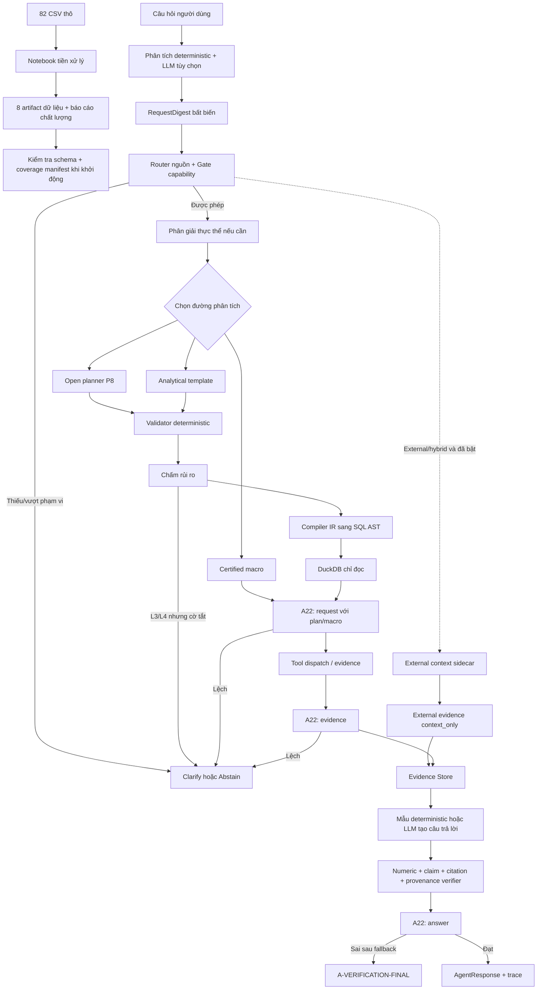

# GLADIATORS - ĐẶC TẢ KIẾN TRÚC HIỆN TẠI

## 0. Thông tin tài liệu

LAST UPDATE: 28/7/2026 - 10P.M

### 0.1. Thứ tự ưu tiên khi có mâu thuẫn

1. Mã nguồn, kiểm thử và cấu hình tại commit ghi ở bảng trên.
2. Artifact trong `data/processed/`, `pipeline_report.json` và
   `semantic_coverage_manifest.json`.
3. Kết quả kiểm thử được chạy lại tại thời điểm viết tài liệu.
4. `Data_Context_and_Analysis_Notes.md` cho ý nghĩa dữ liệu cấp cột.
5. `V2_Unified_Architecture.md` cho mục tiêu, nguyên tắc và hợp đồng chuyển đổi.
6. `Context_harness20% and TC fix 2607.md` cho thiết kế Context/A22/cassette.
7. `External Data Integration.md` và handoff ngày 23/07 cho thiết kế external.
8. Các báo cáo triển khai theo ngày cho lịch sử thay đổi.

Nếu tài liệu này khác mã nguồn sau một commit mới, mã nguồn mới là sự thật và
tài liệu này phải được cập nhật.

### 0.2. Quy ước trạng thái

| Nhãn                       | Ý nghĩa                                                                       |
| --------------------------- | ------------------------------------------------------------------------------- |
| Đã triển khai            | Có code và có kiểm thử hoặc artifact xác minh                            |
| Đã triển khai một phần | Có code nhưng còn giới hạn hoặc chưa phủ đủ hợp đồng               |
| Có code, mặc định tắt  | Code tồn tại nhưng bị khóa bằng cấu hình hoặc chưa nghiệm thu        |
| Chưa nghiệm thu           | Có thể chạy kỹ thuật nhưng chưa đủ bằng chứng để bật chính thức |
| Chưa triển khai           | Chỉ có trong tài liệu mục tiêu hoặc chưa có đường runtime           |
| Lỗi đã biết             | Đã quan sát hành vi sai trong testcase ngày 28/07                          |

## 1. Tóm tắt kiến trúc

Gladiators là agent phân tích dữ liệu listing thương mại điện tử. Kiến trúc dùng
LLM cho các việc cần hiểu hoặc diễn đạt ngôn ngữ, nhưng giữ các quyết định quan
trọng bằng code:

- dữ liệu được làm sạch và tạo metric trước khi agent sử dụng;
- LLM không trực tiếp đọc DataFrame hoặc tự tính metric;
- truy vấn mở phải đi qua semantic catalog, IR có kiểu, validator, compiler và
  executor chỉ đọc;
- mọi số trong câu trả lời phải khớp evidence;
- yêu cầu vượt dữ liệu phải được làm rõ hoặc từ chối;
- dữ liệu web không được nhập vào phép tính nội bộ;
- khi một lớp không chắc chắn, hệ thống ưu tiên dừng thay vì tự đoán.

### 1.1. Sơ đồ tổng thể



### 1.2. Ranh giới trách nhiệm

| Thành phần     | Được làm                                            | Không được làm                       |
| ---------------- | ------------------------------------------------------- | ----------------------------------------- |
| Parser/LLM       | Phân loại, trích xuất, đề xuất plan, diễn đạt | Tự tính số hoặc bỏ qua gate          |
| Semantic layer   | Công bố field, metric, relation được phép         | Tự tạo field không có trong catalog   |
| Planner          | Tạo`LogicalQueryPlan`                                | Chạy SQL hoặc đọc nguồn external     |
| Validator        | Chặn plan sai schema, grain, join, unit, budget        | Sửa âm thầm ý người dùng           |
| Compiler         | Sinh SQL từ plan đã duyệt                           | Nhận SQL tự do từ LLM                  |
| Executor         | Chạy SELECT giới hạn trên artifact đã đăng ký  | Ghi file, mở mạng hoặc tải extension  |
| External sidecar | Bổ sung bối cảnh có provenance                      | Tạo fact nội bộ hoặc tính chéo tier |
| Generator        | Diễn đạt evidence                                    | Thêm số hoặc khẳng định nhân quả  |
| Verifier         | Kiểm tra số, claim, nguồn, tier                      | Tự sửa số sai                          |

## 2. Ma trận triển khai hiện tại

| Khối                                          | Trạng thái                                     | Bằng chứng chính                                              |
| ---------------------------------------------- | ------------------------------------------------ | ---------------------------------------------------------------- |
| Tiền xử lý 5 bảng dữ liệu                | Đã triển khai                                 | `notebooks/pipeline/data_pipeline.ipynb`                       |
| Artifact repository                            | Đã triển khai                                 | `src/gladiators/data/repository.py`                            |
| Schema khởi động                            | Đã triển khai một phần                      | 3 schema Pandera`strict=False`; manifest phủ 8 artifact       |
| Semantic catalog                               | Đã triển khai                                 | 83 object trong`src/gladiators/domain/catalog.py`              |
| Relation graph                                 | Đã triển khai                                 | 10 relation trong`src/gladiators/domain/relations.py`          |
| Parser đa ngôn ngữ                          | Đã triển khai                                 | deterministic + LLM hai attempt + fallback                       |
| Trích xuất entity ID-first                   | Đã triển khai                                 | listing/item/shop/promotion/category ID                          |
| Entity resolution                              | Đã triển khai một phần                      | exact ID/key + RapidFuzz; BGE tùy chọn                         |
| Capability router và gate                     | Đã triển khai                                 | rule deterministic                                               |
| Certified macro                                | Đã triển khai                                 | 7 macro                                                          |
| Analytical template                            | Đã triển khai                                 | 6 template                                                       |
| Open analytical planner                        | Đã triển khai                                 | P7/P8, catalog slice tối đa 30 object                          |
| Typed IR                                       | Đã triển khai                                 | 12 operator, nguồn khóa`btc_dataset`                         |
| Validator/compiler/executor                    | Đã triển khai                                 | SQLGlot + DuckDB chỉ đọc                                      |
| Critic P9                                      | Có code, mặc định tắt                       | `GLADIATORS_ENABLE_CRITIC=0`                                   |
| N-version P10/P11                              | Có code, mặc định tắt                       | `GLADIATORS_ENABLE_NVERSION=0`                                 |
| ContextBundle/RequestDigest                    | Đã triển khai                                 | context hash, budget theo stage                                  |
| A22 alignment                                  | Đã triển khai một phần                      | measure/entity/shape/qualifier/subrequest; còn gap country/date |
| Evidence và claim binding                     | Đã triển khai                                 | typed evidence + claim path                                      |
| Numeric/provenance verifier                    | Đã triển khai                                 | hai lớp kiểm tra, fail-closed                                  |
| LLM cassette                                   | Đã triển khai                                 | `off/record/replay`, content-addressed                         |
| Live web search                                | Có code, mặc định tắt, chưa nghiệm thu E6 | Tavily, cache, quota, P5/P6                                      |
| Reference/FX tier                              | Chưa triển khai runtime                        | config tắt, không có adapter                                  |
| API/CLI/UI                                     | Đã triển khai cho demo nội bộ               | FastAPI, CLI, hai UI                                             |
| Xác thực người dùng/tenant/rate limit API | Chưa triển khai                                | API nội bộ không có auth                                     |
| Production deployment/rollback                 | Chưa nghiệm thu                                | chưa có bằng chứng production                                |

## 3. Pipeline dữ liệu

### 3.1. Dữ liệu nguồn

Dataset gồm 82 CSV thô, hai quốc gia `vn` và `id`, ba ngày quan sát:

- 2026-07-01;
- 2026-07-02;
- 2026-07-03.

Năm bảng nghiệp vụ:

| Bảng                  | Số dòng đã xử lý | Grain chính                           |
| ---------------------- | ---------------------: | -------------------------------------- |
| `products`           |                  3.341 | một listing tại một snapshot        |
| `shop_info`          |                     20 | một shop, dữ liệu latest/static     |
| `category_list`      |                    491 | một kệ nội bộ của shop tại ngày |
| `product_categories` |                  4.054 | mapping listing với kệ nội bộ      |
| `category_platform`  |                  4.482 | taxonomy nền tảng theo quốc gia     |

`products` chứa 1.157 listing duy nhất và 3.341 snapshot. Panel không cân bằng:

- 130 ô listing-ngày bị thiếu;
- 5 listing có gap ở giữa;
- 113 listing thiếu ở mép thời gian.

### 3.2. Artifact đầu ra

Pipeline tạo:

1. `products_clean.csv`
2. `shop_info_clean.csv`
3. `category_list_clean.csv`
4. `product_categories_clean.csv`
5. `category_platform_clean.csv`
6. `product_snapshot_metrics.csv`
7. `product_transition_metrics.csv`
8. `data_quality_issues.csv`
9. `pipeline_report.json`

`semantic_coverage_manifest.json` không do notebook tạo. Nó được sinh riêng từ
`scripts/build_semantic_coverage_manifest.py`.

### 3.3. Kiểm tra lúc runtime khởi động

`ArtifactRepository(validate=True)` gọi `validate_artifacts()`:

- kiểm tra `semantic_coverage_manifest.json` khớp toàn bộ cột của 8 artifact;
- kiểm tra `pipeline_report.json` tồn tại;
- dùng Pandera kiểm tra projection tối thiểu của ba file:
  `products_clean`, `product_snapshot_metrics`, `product_transition_metrics`;
- schema hiện là `strict=False`, nên chưa phải hợp đồng chặt cho mọi cột.

Repository cache ba DataFrame chính:

- `products`;
- `snapshots`;
- `transitions`.

Query executor có thể đăng ký cả 8 artifact vào DuckDB.

### 3.4. Phiên bản dữ liệu

`dataset_version` là 16 ký tự đầu của SHA-256 trên ba artifact chính, theo thứ tự
tên file. Giá trị tại mốc tài liệu:

```text
6b425c770972380c
```

Giá trị được tính một lần bằng `cached_property`.

### 3.5. Chất lượng dữ liệu

`pipeline_report.json` ghi `passed_with_warnings`, gồm:

| Cảnh báo                           | Số lượng |
| ------------------------------------ | ----------: |
| Thiếu snapshot ở mép              |         113 |
| Bản ghi trùng chính xác đã bỏ |          30 |
| `history_sold` giảm bất thường |          88 |
| Gap snapshot ở giữa                |           5 |
| Mapping category mồ côi            |           5 |
| Giá sentinel                        |           3 |

Không có lỗi chuyển đổi số và không có dòng thiếu/trùng khóa logic sau xử lý.

### 3.6. Bất biến dữ liệu

1. `monthly_sold_value` là proxy cửa sổ gần đây, không phải doanh số ngày và
   không được cộng qua ba snapshot.
2. `history_sold_value` là proxy lũy kế; delta âm được gắn cờ anomaly, không được
   gọi là doanh số âm hoặc đơn hoàn.
3. `estimated_recent_revenue = price_num * monthly_sold_value_num` chỉ là doanh
   thu proxy, không phải GMV, lợi nhuận hoặc doanh thu ròng.
4. Giá VN và ID giữ đơn vị địa phương; không cộng hoặc xếp hạng VND với IDR.
5. Ba giá trị `999999999` là sentinel và phải bị loại trước aggregate/rank giá.
6. `is_ad_bool` và `is_sold_out_bool` không có phương sai trong artifact hiện tại.
7. Indonesia không có structured voucher; profile hiện ghi `id=0`, `vn=1580`.
8. `tier_variation` chỉ là lựa chọn hiển thị, không phải SKU.
9. Dataset không có order, traffic, conversion, cost, inventory count hoặc dữ
   liệu hình ảnh đã được nhúng.
10. Kệ shop và category nền tảng là hai hệ khác nhau; không có quan hệ join trực
    tiếp được chứng nhận giữa chúng.

## 4. Semantic layer

### 4.1. Semantic catalog

Catalog có 83 object:

| Loại            | Số lượng |
| ---------------- | ----------: |
| Entity           |          11 |
| Dimension        |          14 |
| Measure          |          25 |
| Derived metric   |          30 |
| External context |           3 |

Theo nguồn:

- 80 object thuộc `btc_dataset`;
- 3 object external chỉ dùng làm `context_only`.

Mỗi object khai báo:

- `ref` ổn định;
- alias;
- physical mapping;
- kiểu và đơn vị;
- grain và time semantics;
- phép aggregate/filter cho phép;
- caveat và data trap;
- answerability;
- source tier.

### 4.2. Semantic coverage manifest

Manifest có 219 cột và trạng thái review `pending_dr1`.

| Trạng thái                         | Số cột |
| ------------------------------------ | -------: |
| Ẩn có chủ đích                  |       77 |
| Expose làm measure                  |       38 |
| Expose làm dimension                |       35 |
| Chỉ provenance                      |       29 |
| Chỉ identifier                      |       24 |
| Proxy                                |        8 |
| Không diễn giải được           |        4 |
| Không có phương sai              |        3 |
| Có dữ liệu nhưng không an toàn |        1 |

Manifest chặn schema drift: cột thực tế và entry khai báo phải bằng nhau. Tuy
nhiên, nhãn nghiệp vụ vẫn chờ DR1 duyệt.

### 4.3. Relation graph

Mười relation được chứng nhận:

1. `belongs_to`
2. `observed_at`
3. `in_platform_category`
4. `in_shop_category`
5. `has_brand`
6. `observed_promotion_id`
7. `observed_structured_voucher`
8. `has_content`
9. `has_display_variation`
10. `has_sales_metric`

Relation khai báo khóa join, scope, cardinality, grain, fanout, chính sách dedupe,
thời gian hiệu lực, độ phủ, path cost và risk.

Planner/compiler không được tự tạo relation ngoài registry.

## 5. Hợp đồng request, response và evidence

### 5.1. StructuredRequest

Request có:

- `intent`;
- `entity_text`;
- `country` và `countries`;
- danh sách entity có namespace;
- `date_range`;
- `slots`;
- `analytical`;
- `language`;
- `route_mode`;
- `external_purpose`;
- `requested_variables`.

Country được chuẩn hóa về `vn` hoặc `id`. Nếu có `countries`, phần tử đầu được
đặt làm `country` chính.

### 5.2. RequestDigest

Digest bất biến chứa:

- câu hỏi đã chuẩn hóa;
- ngôn ngữ và intent;
- danh sách quốc gia;
- entity ref;
- measure và dimension được hỏi;
- dạng đầu ra;
- qualifier;
- ID của từng sub-request.

Digest là đầu vào cho kiểm tra A22 ở các tầng sau.

### 5.3. Evidence

Evidence bắt buộc có:

- `evidence_id`;
- `source_tier`;
- metric, value và unit;
- source locator và source path;
- dataset version;
- attrs;
- provenance nếu không phải dữ liệu nội bộ;
- parent evidence IDs nếu là giá trị dẫn xuất;
- các đường dữ liệu được phép claim.

Evidence nội bộ không được gắn external provenance. Evidence `reference` hoặc
`external` bắt buộc có provenance đúng tier.

### 5.4. ResponseClaim

Mỗi claim có:

- `claim_id`;
- text thật sự xuất hiện trong answer;
- loại claim;
- value và unit;
- evidence ID;
- evidence path.

### 5.5. AgentResponse

Response cuối chứa request, gate decision, answer, evidence, claims, tool calls,
resolved listing key, verification, metadata LLM, metadata planning, context,
cờ degraded và thời gian tạo.

## 6. Phân tích câu hỏi và định tuyến

### 6.1. Đường deterministic

`MultilingualIntentParser` luôn là lớp an toàn nền:

- chuẩn hóa tiếng Việt không dấu;
- nhận diện sơ bộ tiếng Việt/Bahasa;
- trích xuất quốc gia;
- trích xuất entity ID-first;
- phát hiện capability không hỗ trợ;
- chọn internal, external, hybrid, clarify hoặc abstain;
- tạo `AnalyticalRequest` deterministic khi phù hợp.

### 6.2. Đường LLM

Khi runtime có LLM:

1. LLM phân tích tối đa hai attempt.
2. Kết quả được đối chiếu parser deterministic.
3. Route external và unsupported của deterministic có quyền ưu tiên an toàn.
4. Country, entity, slot và analytical payload có thể được bổ sung từ
   deterministic parser.
5. Intent ngoài registry bị từ chối.
6. Sau hai lỗi, runtime dùng deterministic parser và ghi `parse_fallback=true`.

### 6.3. Trích xuất entity

Thứ tự ưu tiên:

1. listing key dạng `vn|id:shop_id:item_id`;
2. promotion ID tường minh, kể cả giá trị `0`;
3. item/shop/promotion/category ID theo danh từ đứng trước;
4. dãy 9-14 chữ số chưa có namespace được coi là item ID độ tin cậy cao;
5. tên trong dấu ngoặc kép;
6. tên tự do do rule trích xuất.

Chữ `ID` trong “mã ID”, “category ID” hoặc “promotion ID” không được coi là quốc
gia Indonesia nếu thiếu ngữ cảnh thị trường.

### 6.4. Phân giải listing

`EntityResolver`:

- exact-match listing key;
- exact-match item ID;
- nếu là số nhưng không tồn tại thì trả rỗng, không fuzzy;
- fuzzy theo `RapidFuzz.WRatio`;
- BGE-M3 chỉ bật khi `GLADIATORS_ENABLE_BGE=1`;
- khi có BGE: điểm cuối = 45% lexical + 55% dense;
- ambiguous nếu top score dưới 0,65 hoặc margin top-2 dưới 0,05.

Hệ thống không tự chọn listing bán chạy nhất khi mơ hồ.

### 6.5. Unsupported capability

Parser/gate có rule cho:

- profit;
- forecast;
- SKU;
- ads;
- inventory;
- conversion;
- image similarity;
- FX/reference;
- external competitor price;
- orders;
- category type chưa expose;
- price reconstruction.

Câu ghép có thể được tách thành phần trả lời được và phần không hỗ trợ.

## 7. Gate và outcome

Ba hành động:

- `allow`;
- `clarify`;
- `abstain`.

Gate kiểm tra:

- so sánh/quy đổi tiền tệ chéo thị trường;
- external competitor price;
- route mismatch;
- unsupported capability;
- intent có đăng ký;
- external path có bật;
- open analytical admission;
- country bắt buộc cho analytical template;
- required slots;
- country có trong artifact;
- structured voucher tại Indonesia;
- hybrid partial khi external đang tắt.

### 7.1. Lưu ý về thứ tự hiện tại

Gate hiện kiểm tra cross-currency trước domain/entity/business trap. Testcase 35
và TC40 ngày 28/07 cho thấy thứ tự này có thể tạo lý do chặn không liên quan.
Đây là lỗi đã biết, không phải hành vi mục tiêu.

## 8. Ba đường phân tích nội bộ

### 8.1. Certified macro

| Macro                           | Slot bắt buộc | Tool plan              | Giới hạn chính                 |
| ------------------------------- | --------------- | ---------------------- | --------------------------------- |
| `sales_decline`               | entity          | resolve + transitions  | một entity                       |
| `similar_product`             | entity          | resolve + find similar | một entity                       |
| `promotion_effectiveness`     | country         | compare voucher groups | một country, median monthly sold |
| `voucher_profile_rank`        | country         | rank profiles          | mặc định bị khóa chờ duyệt |
| `voucher_coverage`            | không          | compare coverage       | mô tả                           |
| `discount_bucket_observation` | không          | observe bucket 50%     | mô tả                           |
| `dataset_coverage`            | không          | describe coverage      | mô tả                           |

`promotion_effectiveness` từ chối các qualifier ngoài contract:

- nhóm không promo;
- yêu cầu mean;
- lọc promotion ID;
- discount bucket;
- revenue measure.

### 8.2. Analytical template

Sáu template deterministic:

1. `price_change_by_date`
2. `highest_revenue_day`
3. `listing_count`
4. `highest_price_listing`
5. `highest_monthly_sold_listing`
6. `top_shop_by_listing_count`

Template yêu cầu một country. `top_shop_by_listing_count` được xếp L3 và cần
critic; khi critic tắt, hệ thống fail-closed.

### 8.3. Open analytical

Đường mở:

1. Deterministic semantic parser liên kết measure, dimension, predicate, time và
   output shape.
2. Catalog slicer lấy tối đa 30 object liên quan.
3. P8 LLM đề xuất `LogicalQueryPlan`.
4. P8 có tối đa hai attempt, attempt sau nhận validator feedback.
5. Nếu không có LLM planner hoặc plan vẫn sai, trả `A19-PLAN`.

Các lỗi admission:

- `A-ANALYTICAL-AMBIGUITY`;
- `A19-OP`;
- `A19-METRIC`;
- `A19-CAT`;
- `A-DATA-ABSENT`;
- `A19-PLAN`.

## 9. Typed IR, validator, compiler và executor

### 9.1. LogicalQueryPlan

IR `1.0` có 12 operator:

```text
Scan, ResolveValue, Filter, Join, Dedupe, Aggregate,
DeriveMetric, TemporalCompare, Rank, Similarity, Project, Union
```

Plan chỉ nhận `source_tier="btc_dataset"`.

Mỗi node khai báo:

- input;
- semantic refs;
- predicate/relation;
- source artifact;
- aggregate/group/rank;
- input và output grain;
- unit;
- expected schema;
- expected cardinality;
- dedupe/invariants;
- evidence emission;
- cost và risk.

`expected_cardinality` chỉ nhận số chính xác hoặc `<=N`. Các giá trị `"single"`
và `"many"` không hợp lệ.

### 9.2. Validator

Validator kiểm tra:

- DAG, output node, node budget, depth và subplan;
- time scope nằm trong ba snapshot;
- semantic ref tồn tại và thuộc `btc_dataset`;
- filter operation được catalog cho phép;
- source artifact phù hợp;
- join chỉ dùng relation registry;
- join key, direction, grain và dedupe;
- aggregate sau fanout phải qua Dedupe;
- temporal compare và metric semantics;
- derive/rank/similarity/union contract;
- không trộn VND và IDR;
- không dùng context object làm fact.

Validator không được bypass bằng critic hoặc N-version.

### 9.3. Compiler

Compiler:

- nhận plan đã validate;
- sinh SQL AST bằng SQLGlot;
- chỉ cho root SELECT hoặc UNION;
- chặn statement ngoài SELECT;
- dùng allow-list function;
- tham số hóa predicate;
- không compile `ResolveValue` và `Similarity`; hai op này được delegate;
- không nhận SQL do LLM viết.

### 9.4. Executor

DuckDB chạy trong memory:

- external access tắt;
- tự tải extension tắt;
- community extension tắt;
- cấu hình bị lock sau khi đăng ký artifact;
- mặc định memory 1 GB;
- mặc định 2 thread;
- giới hạn kết quả 10.000 dòng;
- chạy `EXPLAIN (FORMAT JSON)` để chặn estimate quá lớn trước materialize;
- kiểm tra schema, cardinality và postcondition sau execute.

`configs/default.yaml` có `timeout_s=10`, nhưng `QueryExecutor` hiện chưa nhận và
chưa cưỡng chế timeout này. Đây là khoảng trống cấu hình đã xác nhận.

### 9.5. Chấm rủi ro

Risk score dựa trên:

- số join;
- fanout/thay grain;
- temporal compare;
- metric mới;
- union country;
- schema-linking ambiguity;
- entity margin;
- độ sâu/subplan;
- coverage/anomaly.

Ngưỡng mặc định:

- dưới 3: single;
- từ 3: critic;
- từ 6 hoặc L4: N-version.

Nếu mode cần thiết đang tắt, plan bị chặn thay vì hạ xuống mode ít an toàn hơn.

## 10. Context Harness và A22

### 10.1. ContextBundle

Context dùng cho P2, P6, P8, P9, P10 và P11 chứa:

- stage và purpose;
- RequestDigest;
- plan refs và plan hash;
- payload đã guard;
- guard hits;
- prompt version;
- dataset version;
- token budget;
- trường đã drop;
- context hash ổn định.

Budget hiện khai báo:

| Stage      | Purpose | Token |
| ---------- | ------- | ----: |
| Plan       | P8      | 6.000 |
| Critic     | P9      | 4.000 |
| Alternate  | P10     | 6.000 |
| Adjudicate | P11     | 3.000 |
| Generate   | P2      | 4.000 |
| Extract    | P6      | 2.000 |

Evidence gốc không bị sửa. Context chỉ dùng bản sao đã sanitize.

### 10.2. A22 plan alignment

Đã kiểm tra:

- measure bị bỏ;
- measure bị thay;
- output shape;
- entity chưa bind;
- qualifier ngoài macro;
- sub-request bị bỏ.

### 10.3. A22 evidence alignment

Đã kiểm tra:

- evidence có phủ measure đã hỏi;
- comparison có đủ hai group;
- empty result hợp lệ được nhận diện riêng.

### 10.4. A22 answer alignment

Claim phải bind measure được hỏi hoặc answer phải nêu rõ giới hạn.

### 10.5. Giới hạn A22 đã biết

Kết quả 28/07 chứng minh A22 chưa giữ đầy đủ:

- danh sách quốc gia qua request -> tool;
- toàn bộ `date_range` qua request -> plan -> evidence;
- một số operator nghiệp vụ như cộng sai rolling metric;
- một số grouping/deduplication trap.

TC23 bỏ Indonesia và TC34 bỏ ngày bắt đầu nhưng vẫn được `ALLOW/VERIFIED`. Hai
case này là lỗi hiện hành.

## 11. Tool dispatch và analytics

Workflow không chứa `if/elif` riêng cho từng macro. Intent registry đưa ra
`tool_plan`, sau đó generic dispatcher gọi handler theo tên.

Tool hiện đăng ký:

- `resolve_entity`;
- `get_sales_transitions`;
- `find_similar`;
- `compare_voucher_groups`;
- `compare_voucher_coverage`;
- `observe_discount_bucket`;
- `describe_dataset_coverage`;
- `rank_voucher_profiles`;
- `execute_analytical_plan`.

Dispatcher dừng sớm khi handler đặt `clarify`.

Analytics core tạo Evidence; LLM không tính metric. Open analytical result ghi:

- `result_count`;
- `returned_rows`;
- `row_limit`;
- `truncated`;
- plan hash và postcondition.

## 12. External context sidecar

### 12.1. Trạng thái

Code Phase 6 tồn tại nhưng mặc định:

```yaml
enabled: false
mode: cache_only
max_admission: context_only
```

E6 chưa được sign-off. External không được gọi là production-ready.

### 12.2. Định tuyến

Router deterministic nhận:

- lịch chiến dịch;
- sự kiện thị trường;
- thông tin sản phẩm ngoài;
- câu hybrid vừa hỏi dữ liệu nội bộ vừa hỏi bối cảnh.

Competitor price bị `A14-EXT` từ chối. Cross-market monetary comparison bị
`A16-CROSS-CURRENCY` chặn.

### 12.3. Pipeline external

```text
Router -> P5 Search Planner -> Search Executor -> Relevance Gate
       -> P6 Extractor -> A15/A17/A18 Admission -> External Evidence
```

P5:

- tối đa 3 query;
- mỗi query tối đa 200 ký tự;
- market `vn`, `id` hoặc `global`;
- bounded recency;
- tối đa hai attempt;
- có deterministic fallback cho campaign/market event;
- query fallback được neo bằng tên marketplace.

Search executor:

- tối đa 5 result/query;
- budget tổng mặc định 25 giây;
- timeout mỗi call tối đa 10 giây;
- retry tối đa một lần;
- quota mặc định 150 query/ngày;
- không fetch trực tiếp domain Shopee;
- lọc injection/PII/secret trước extraction.

### 12.4. Cache và replay

External cache:

- content-addressed SHA-256;
- immutable;
- manifest;
- exact typed-query lookup;
- quarantine append-only;
- kiểm tra hash khi đọc;
- quota state ghi local.

`cache_only` không mở mạng.

### 12.5. Extraction và admission

P6 chỉ trích field trong allow-list và phải bind từng field vào UTF-8 source
span. Admission:

- hash/span mismatch -> loại bằng A17;
- unmapped/rejected/superseded -> loại bằng A15;
- candidate/needs_review -> A18 và `context_only`;
- mọi live result luôn có caveat `live_web_result_context_only`.

External evidence bắt buộc có URL, hash, thời điểm quan sát/lấy về, provider,
query, rank, source span, mapping status và license/provenance label.

### 12.6. Bất biến external

1. External không đi qua typed analytical compiler.
2. External không tạo fact `btc_dataset`.
3. External không được dùng trong phép tính chéo tier.
4. External tối đa là `context_only`.
5. Hybrid phải giữ câu trả lời nội bộ khi external thất bại.
6. Không có reference/FX adapter đang hoạt động.

### 12.7. Lỗi đã biết

Đo live ngày 26-27/07 cho thấy relevance gate token-overlap:

- quá lỏng với kết quả rác có chung `7.7` hoặc `Indonesia`;
- quá chặt với một số snippet Bahasa không trùng token tiếng Anh;
- chưa dùng trường score do Tavily trả về.

Ngưỡng score mới chưa được phê duyệt và chưa triển khai. Live-search latency và
rehearsal E6 chưa đạt điều kiện ký.

## 13. Tạo câu trả lời và xác minh

### 13.1. Tạo câu trả lời

Runtime dùng:

- deterministic template khi offline;
- LLM generator khi provider được chọn;
- tối đa hai lần generate/verify;
- sau lỗi dùng deterministic fallback.

Generator chỉ nhận evidence/context đã admit.

### 13.2. Wording guard

Wording gate chặn hoặc yêu cầu caveat cho:

- khẳng định nhân quả;
- dự báo không đủ dữ liệu;
- SKU-level;
- profit/conversion/ads/inventory;
- nội suy vượt ranh giới metric.

### 13.3. Numeric verifier

Verifier:

- quét mọi số trong answer;
- dùng display-rounding, không dùng tolerance phần trăm lỏng;
- kiểm tra citation có thật;
- kiểm tra claim text, value, unit và evidence path;
- kiểm tra provenance external;
- kiểm tra nhãn nguồn và thời gian lấy;
- chặn một claim trộn nhiều tier;
- không tự sửa số.

### 13.4. Final fail-closed

Sau generation/fallback, runtime chạy lại numeric verifier và A22 answer
alignment. Nếu action vẫn là allow nhưng một lớp thất bại:

- đổi thành `A-VERIFICATION-FINAL`;
- xóa evidence/claim khỏi response cuối;
- trả deterministic abstention.

## 14. LLM provider và cassette

### 14.1. Provider được factory hỗ trợ

| Provider     | Factory/API/CLI                                 | Yêu cầu secret      |
| ------------ | ----------------------------------------------- | --------------------- |
| Offline      | Có, mặc định                                | Không                |
| Gemini       | Có                                             | `GEMINI_API_KEY`    |
| Hugging Face | Có                                             | `HF_TOKEN`          |
| Groq         | Có                                             | `GROQ_API_KEY`      |
| Anthropic    | Có class adapter nhưng chưa wire factory/CLI | `ANTHROPIC_API_KEY` |

Groq có thể dùng key/model riêng cho parse:

- `GROQ_PARSE_API_KEY`;
- `GROQ_PARSE_MODEL`.

Thiếu key làm runtime dừng với lỗi rõ ràng trước khi gọi provider.

### 14.2. Cấu trúc output

Provider dùng JSON Schema chặt khi có schema. Groq có fallback không
`response_format` nếu lỗi được nhận diện là không hỗ trợ response format.

Với `gpt-oss`, structured call đặt `reasoning_effort="low"`.

### 14.3. Lỗi Groq đã biết

Test tay ngày 28/07 ghi nhận nhiều `BadRequestError:400`. Runtime hiện chỉ lưu
loại lỗi và mã trạng thái, làm mất phần giải thích chi tiết từ provider.

Đã xác nhận:

- không phải đường “thiếu API key”;
- lỗi xảy ra sau khi tạo client và gửi request;
- parser thường rơi xuống fallback sau lỗi.

Chưa xác nhận nguyên nhân chính xác giữa model, `response_format`,
`reasoning_effort`, schema hoặc payload size. Không được ghi một giả thuyết
thành root cause cho tới khi có provider error body đã loại secret.

### 14.4. LLM cassette

Mode:

- `off`;
- `record`;
- `replay`.

Key cassette chứa provider, model/revision, sampling, prompt version, purpose,
system/tool/context hash và dataset version.

Record:

- immutable;
- redact secret;
- sanitize text;
- atomic write.

Replay:

- không cần provider credential;
- cassette miss không fallback sang network.

## 15. Cấu hình runtime thực tế

### 15.1. Provider mặc định

`create_runtime()` chọn:

```text
provider argument
-> GLADIATORS_LLM_PROVIDER
-> "offline"
```

Vì vậy, runtime thật mặc định là `offline`, dù `configs/default.yaml` ghi
`llm.provider: groq`. Phần `llm` trong YAML hiện chủ yếu mang tính tài liệu/script
phụ; factory không đọc nó để chọn provider.

### 15.2. Các cờ mặc định tắt

| Cờ                                   | Mặc định | Tác dụng                        |
| ------------------------------------- | ----------- | --------------------------------- |
| `GLADIATORS_ENABLE_CRITIC`          | 0           | bật P9                           |
| `GLADIATORS_ENABLE_NVERSION`        | 0           | bật P10/P11                      |
| `GLADIATORS_ENABLE_BGE`             | 0           | bật dense rerank                 |
| `GLADIATORS_ENABLE_LIVE_SEARCH`     | 0           | bật external sidecar             |
| `GLADIATORS_ENABLE_VOUCHER_PROFILE` | 0           | bật ranking chưa được duyệt |
| `GLADIATORS_CASSETTE_MODE`          | off         | record/replay provider            |

### 15.3. Cấu hình external

`load_external_settings()` có đọc `configs/default.yaml` và cho phép override
bằng biến môi trường. Boolean chỉ nhận `0` hoặc `1`.

### 15.4. Sai lệch cấu hình cần giữ trong backlog

- YAML khai executor timeout nhưng executor chưa dùng.
- YAML khai planner threshold nhưng runtime dùng default của `EscalationConfig`;
  hiện giá trị trùng nhau, nhưng chưa có wiring.
- YAML khai trace config nhưng `AgentRuntime` dùng default constructor; hiện giá
  trị trùng 30 ngày.
- YAML khai Groq provider nhưng runtime mặc định offline.

## 16. API, CLI và UI

FastAPI:

- `GET /`
- `GET /flow`
- `GET /health`
- `GET /capabilities`
- `POST /ask`

`POST /ask` nhận text dài 1-4.000 ký tự và trả `AgentResponse`.

Runtime được tạo khi module API được import. Lỗi không kiểm soát trả HTTP 500 với
code `AGENT_RUNTIME_ERROR` và tên loại lỗi, không trả raw exception message.

CLI hỗ trợ:

- offline;
- Gemini;
- Hugging Face;
- Groq;
- output text hoặc JSON.

## 17. Trace, bảo mật và vận hành

### 17.1. Trace

Mỗi request có trace ID 12 ký tự và file JSON trong `artifacts/traces`.

Trace ghi:

- schema version;
- dataset version;
- request/response;
- gate;
- tool calls;
- planning;
- verification;
- LLM telemetry;
- context summary.

### 17.2. Redaction

Trace redact:

- field có tên api key, authorization, password, token, email;
- email trong string;
- Gemini-like API key;
- Bearer token.

File trace được đặt quyền `0600`, retention mặc định 30 ngày. `prune()` tồn tại
nhưng cần được gọi bởi vận hành; không có scheduler trong runtime.

### 17.3. Biên giới bảo mật hiện tại

Đã có:

- không commit secret;
- input ngoài được coi là không tin cậy;
- injection guard;
- SQL SELECT-only;
- DuckDB external access off;
- cache immutable;
- provenance và tier verification.

Chưa có:

- authentication;
- authorization;
- tenant isolation;
- API rate limiting;
- TLS termination trong ứng dụng;
- production audit backend;
- central secret manager;
- migration/rollback production đã nghiệm thu.

## 18. Kiểm thử và acceptance

### 18.1. Bộ kiểm thử

Test hiện phủ:

- runtime V1 và regression;
- anti-hallucination;
- parser/entity/gate;
- semantic planner/IR/validator/compiler/executor;
- planner mutation;
- context và A22;
- DR40 ngày 26/07;
- external Phase 6 E1-E5;
- relevance gate;
- voucher profile.

### 18.2. Kết quả tại mốc tài liệu

Lệnh xác minh:

```powershell
New-Item -ItemType Directory -Path .t -Force | Out-Null
.\.venv\Scripts\python.exe -m pytest -q --basetemp .t\b1 -p no:cacheprovider
```

Kết quả ngày 28/07/2026 tại commit `ef3a380f75e7998d1e79aa4ed74f8d23aa088a1a`:

```text
326 passed in 76.87s
```

Ghi chú môi trường Windows:

- chạy bằng thư mục tạm mặc định từng gây `PermissionError` tại
  `%TEMP%\pytest-of-ADMIN`;
- đường dẫn tạm dài trong repository từng làm 5 test external thất bại vì
  `FileNotFoundError`;
- dùng `--basetemp .t\b1 -p no:cacheprovider` loại bỏ hai vấn đề môi trường trên;
- do đó kết quả chuẩn tại mốc tài liệu là **326 đạt, 0 thất bại, 0 lỗi**.

Các con số test chỉ chứng minh contract được mã hóa trong suite. Chúng không tự
động chứng minh chất lượng provider live hoặc đúng nghiệp vụ cho mọi câu hỏi.

### 18.3. Acceptance chưa đóng

- Phase 6 E6 live-search rehearsal;
- human review/gold approval;
- DR1 review cho semantic coverage manifest;
- voucher profile weights;
- critic/N-version production provider;
- Groq 400 root cause;
- Windows/Linux CI artifact hiện hành;
- auth/operations production.

## 19. Lỗi hiện hành đã xác nhận ngày 28/07

Các lỗi dưới đây là một phần của hiện trạng, không được che bằng kết quả unit
test:

1. Groq trả 400 ở nhiều structured call; thiếu error detail.
2. Deterministic fallback có thể lấy entity text quá dài.
3. Entity resolution báo mơ hồ như hậu quả của entity text sai.
4. `expected_cardinality="single"` hoặc `"many"` từ planner làm Pydantic từ chối.
5. A22 bỏ lọt country bị drop ở TC23.
6. A22 bỏ lọt date range bị drop ở TC34.
7. Similarity TC19 trả kết quả khác danh mục do từ khóa “quà tặng không bán”.
8. Gate validation order tạo lý do sai ở TC35/TC40.
9. Generation fallback có thể lộ thuật ngữ kỹ thuật ra UI.
10. Verifier có thể từ chối số vốn được lặp lại từ câu hỏi người dùng.
11. Relevance gate external chưa đủ chính xác.
12. TC34 trong tài liệu QA có tiền đề gap không khớp artifact được báo cáo trước
    đó; fixture cần được xác nhận lại.

Chi tiết và tiêu chí nghiệm thu nằm trong
`docs/Testcase2807_result_analysis.md`.

## 20. Các bảo đảm được phép tuyên bố

Tại mốc hiện tại, có thể tuyên bố:

1. Phép tính nội bộ chạy bằng code, không do LLM tự tính.
2. Open analytical plan phải qua typed IR và deterministic validator.
3. Compiler/executor chỉ chạy SELECT trên artifact đã đăng ký.
4. Evidence và claim có hợp đồng kiểu.
5. Numeric verifier fail-closed khi phát hiện số/citation/path không hợp lệ.
6. External context bị khóa `context_only`.
7. Cross-tier arithmetic không có đường hợp lệ.
8. Unsupported capability có structured abstention/alternative.
9. Provider path có cassette record/replay bất biến.
10. Trace local có redaction và dataset version.

Không được tuyên bố:

- mọi câu hỏi đều được trả lời đúng;
- production-ready;
- live web search đã nghiệm thu;
- Groq path ổn định;
- A22 giữ được mọi điều kiện;
- similarity đã có nhãn con người đầy đủ;
- external evidence chứng minh nhân quả;
- dữ liệu proxy là doanh số/GMV/lợi nhuận thật.

## 21. Cây module hiện tại

```text
src/gladiators/
├── agent/
│   ├── parser.py
│   ├── entity_extract.py
│   ├── entity_resolution.py
│   ├── gate.py
│   ├── context.py
│   ├── alignment.py
│   ├── tool_dispatch.py
│   ├── llm.py
│   ├── cassette.py
│   ├── verifier.py
│   ├── wording.py
│   ├── trace.py
│   └── workflow.py
├── analytics/
│   └── tools.py
├── data/
│   ├── repository.py
│   ├── contracts.py
│   └── coverage.py
├── domain/
│   ├── catalog.py
│   ├── metrics.py
│   ├── relations.py
│   └── intent_registry.py
├── planner/
│   ├── semantic_parser.py
│   ├── analytical.py
│   ├── open_planner.py
│   ├── query_ir.py
│   ├── validator.py
│   ├── compiler.py
│   ├── executor.py
│   ├── risk.py
│   ├── critic.py
│   ├── consensus.py
│   └── macros.py
├── external/
│   ├── settings.py
│   ├── registry.py
│   ├── router.py
│   ├── search_planner.py
│   ├── search_provider.py
│   ├── search_executor.py
│   ├── relevance.py
│   ├── web_extract.py
│   ├── injection_guard.py
│   ├── admission.py
│   ├── cache.py
│   └── pipeline.py
├── contracts.py
├── runtime_factory.py
├── api.py
├── cli.py
├── ui.py
└── ui_flow.py
```

## 22. Quy tắc cập nhật tài liệu

Tài liệu phải được cập nhật khi có một trong các thay đổi:

- thêm/xóa artifact hoặc đổi grain;
- đổi metric/relation/catalog;
- thêm intent, macro, template hoặc IR operator;
- đổi gate/A22/verifier;
- bật critic, N-version, BGE, voucher profile hoặc external theo mặc định;
- thay provider/model/prompt contract;
- thay source tier hoặc admission;
- thay API response;
- đóng một lỗi trong mục 19;
- thay ngưỡng acceptance hoặc kết quả test.

Mỗi lần cập nhật phải:

1. ghi commit đối soát mới;
2. chạy full test;
3. kiểm tra `/capabilities`;
4. đối chiếu cấu hình YAML với wiring thật;
5. cập nhật trạng thái “đã triển khai/mặc định tắt/chưa nghiệm thu”;
6. không xóa lịch sử thiết kế khỏi Git.

## 23. Tài liệu nguồn

Tài liệu này dung hợp phần hiện hành từ:

- `V2_Unified_Architecture.md`;
- `Context_harness20% and TC fix 2607.md`;
- `External Data Integration.md`;
- `IMPLEMENTATION_HANDOFF_2026-07-20.md`;
- `IMPLEMENTATION_HANDOFF_2026-07-22.md`;
- `IMPLEMENTATION_HANDOFF_2026-07-23.md`;
- `IMPLEMENTATION REPORT 2607.md`;
- `IMPLEMENTATION_REPORT_2707.md`;
- `Data_Context_and_Analysis_Notes.md`;
- `data-pipeline.md`;
- `codegraph.md`;
- `Testcase2807_result_analysis.md`.

Các file trên tiếp tục có giá trị lịch sử hoặc chi tiết chuyên đề. Tuy nhiên,
đối với câu hỏi “pipeline nào đang chạy ở commit `ef3a380`”, tài liệu này là điểm
bắt đầu duy nhất.
