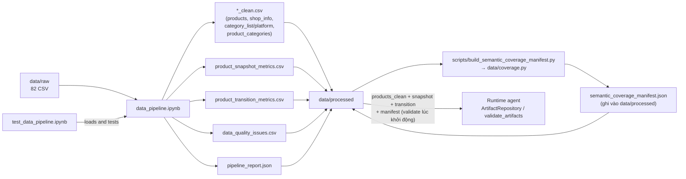
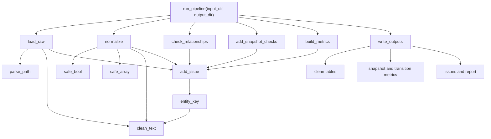
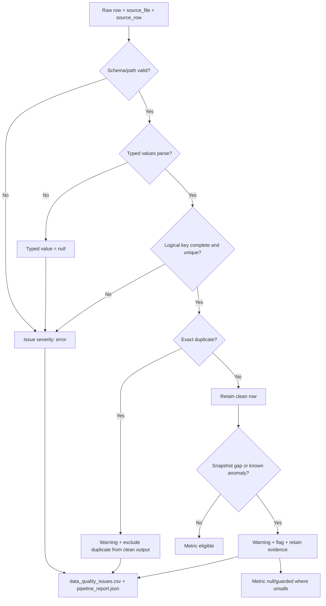
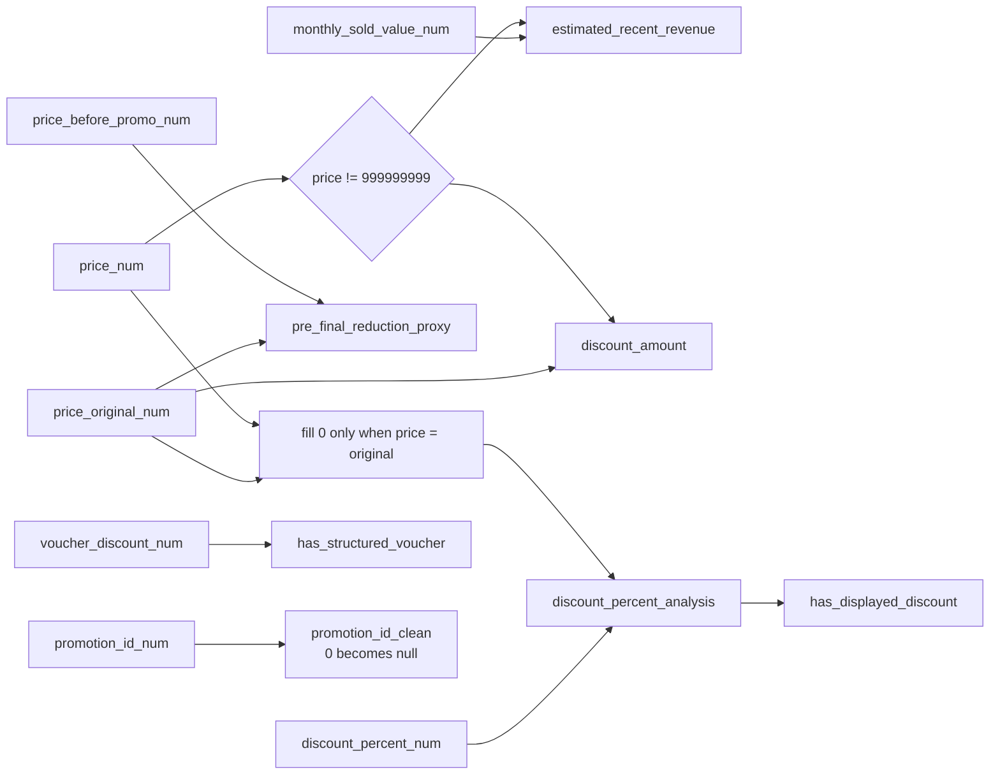
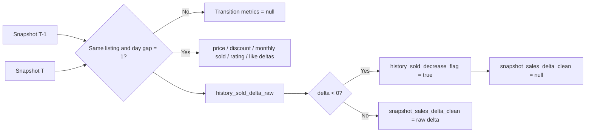
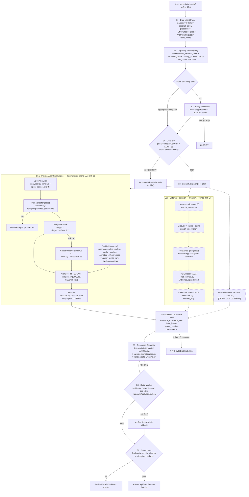

# Pipeline Code Graph

Tài liệu này biểu diễn code hiện hành ở hai tầng: (1) **preprocessing** trong `notebooks/pipeline/data_pipeline.ipynb` (raw → `data/processed`), và (2) **runtime agent** trong `src/gladiators/` (câu hỏi → answer verified, mục "Runtime agent flow (S1–S9)"). Các graph dùng Mermaid và render trực tiếp trên GitHub hoặc Markdown Preview hỗ trợ Mermaid.

## Repository flow

> `semantic_coverage_manifest.json` KHÔNG do notebook sinh — nó do `scripts/build_semantic_coverage_manifest.py` (gọi `src/gladiators/data/coverage.py`) tạo từ `data/processed`, rồi được `data/contracts.py` validate lúc agent khởi động. Agent runtime chỉ đọc `products_clean.csv`, `product_snapshot_metrics.csv`, `product_transition_metrics.csv` (qua `ArtifactRepository`) cộng manifest — không chạm notebook.

## Function call graph

## Validation and error flow

Pipeline không đổi giá trị lỗi thành `0` và không âm thầm loại logical-key conflict. Chỉ exact duplicate được bỏ khỏi clean output, nhưng từng dòng bị bỏ vẫn có evidence trong issue table.

## Metric dependency graph

## Reading order

1. `run_pipeline` để hiểu orchestration.
2. `load_raw` và `normalize` để hiểu provenance và chuyển kiểu.
3. `check_relationships` và `add_snapshot_checks` để hiểu data-quality contract.
4. `build_metrics` để hiểu snapshot/transition semantics.
5. `write_outputs` để hiểu artifact và trạng thái pass/fail.

## Runtime agent flow (S1–S9)

Graph này biểu diễn `AgentRuntime.run()` (`src/gladiators/agent/workflow.py`) theo bảng giai đoạn S1–S9 của `V2_Unified_Architecture.md §1.1–1.2`. Đường nét liền = đã triển khai và chạy; nét đứt/nhãn `[OFF]` = có contract/code nhưng cờ mặc định tắt hoặc chưa có adapter.

**Ánh xạ stage → module chính:**

| Stage | Module | Ghi chú |
| --- | --- | --- |
| S1 | `agent/parser.py`, `agent/llm.py` | deterministic luôn chạy; LLM parse là tuỳ chọn, có safety precedence |
| S2 | `external/router.py`, `planner/semantic_parser.py` | route + A19/complexity bằng rule, không LLM |
| S3 | `agent/resolver.py` | rapidfuzz → BGE-M3 (BGE bật bằng `GLADIATORS_ENABLE_BGE=1`) |
| S4 | `agent/gate.py` | ContractDrivenGate; T-11 clarify cho voucher_profile khi cờ OFF |
| S5a | `planner/{analytical,open_planner,validator,risk,critic,consensus,compiler,executor,macros}.py` | validator/compiler/executor 100% code |
| S5b | — | Tier A FX OFF (config `sources.reference.enabled: false`, chưa có adapter) |
| S5c | `external/{search_planner,search_executor,relevance,web_extract,admission,pipeline}.py` | code đủ, cờ `GLADIATORS_ENABLE_LIVE_SEARCH` mặc định OFF |
| S6 | `contracts.py` (Evidence), `analytics/tools.py` | chỉ ghi record đã qua checkpoint |
| S7 | `agent/workflow.py::_generate`, `agent/wording.py`, `agent/llm.py` | template deterministic hoặc LLM; wording gate chặn nhân quả/forecast/SKU |
| S8 | `agent/verifier.py` | pass 1 numeric answer-wide + pass 2 per-claim binding |
| S9 | `agent/workflow.py` (final verify) | `A-VERIFICATION-FINAL` nếu claim binding fail |
