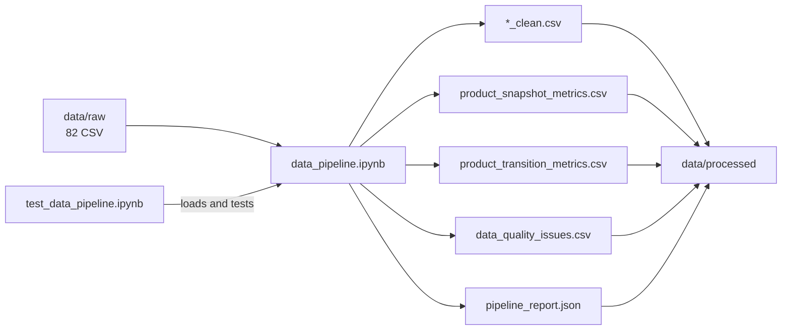
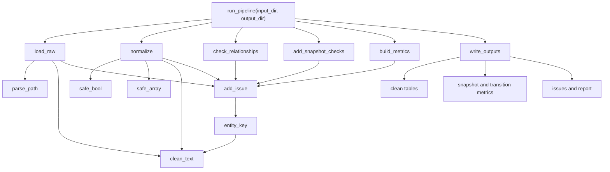
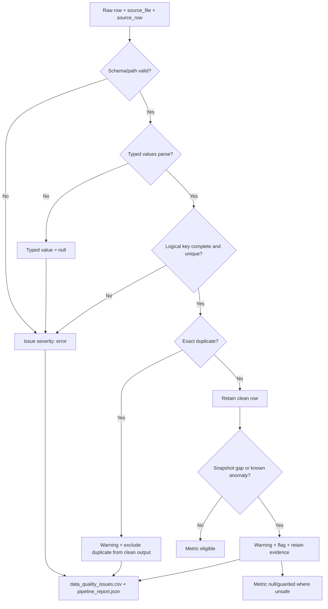
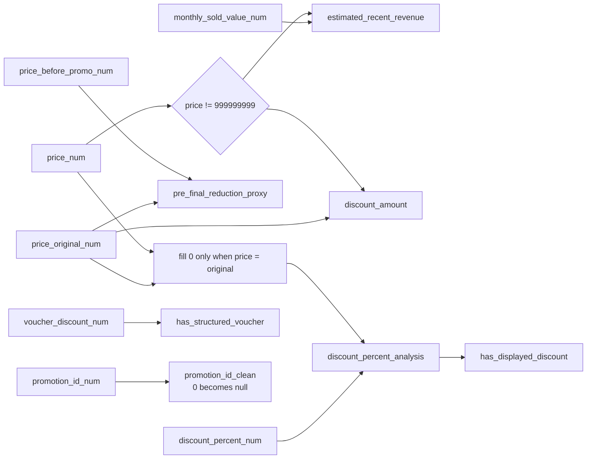
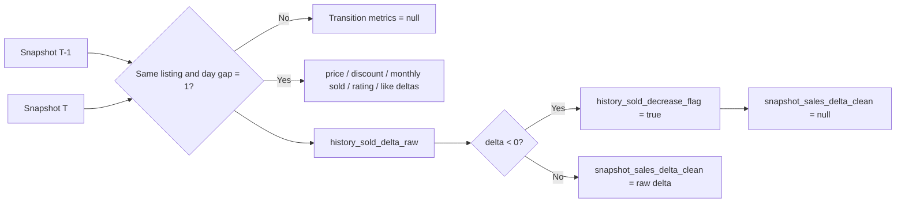

# Pipeline Code Graph

Tài liệu này biểu diễn code hiện hành trong `notebooks/pipeline/data_pipeline.ipynb`. Các graph dùng Mermaid và render trực tiếp trên GitHub hoặc Markdown Preview hỗ trợ Mermaid.

## Repository flow

## Function call graph

## Validation and error flow

Pipeline không đổi giá trị lỗi thành `0` và không âm thầm loại logical-key conflict. Chỉ exact duplicate được bỏ khỏi clean output, nhưng từng dòng bị bỏ vẫn có evidence trong issue table.

## Metric dependency graph

## Reading order

1. `run_pipeline` để hiểu orchestration.
2. `load_raw` và `normalize` để hiểu provenance và chuyển kiểu.
3. `check_relationships` và `add_snapshot_checks` để hiểu data-quality contract.
4. `build_metrics` để hiểu snapshot/transition semantics.
5. `write_outputs` để hiểu artifact và trạng thái pass/fail.
