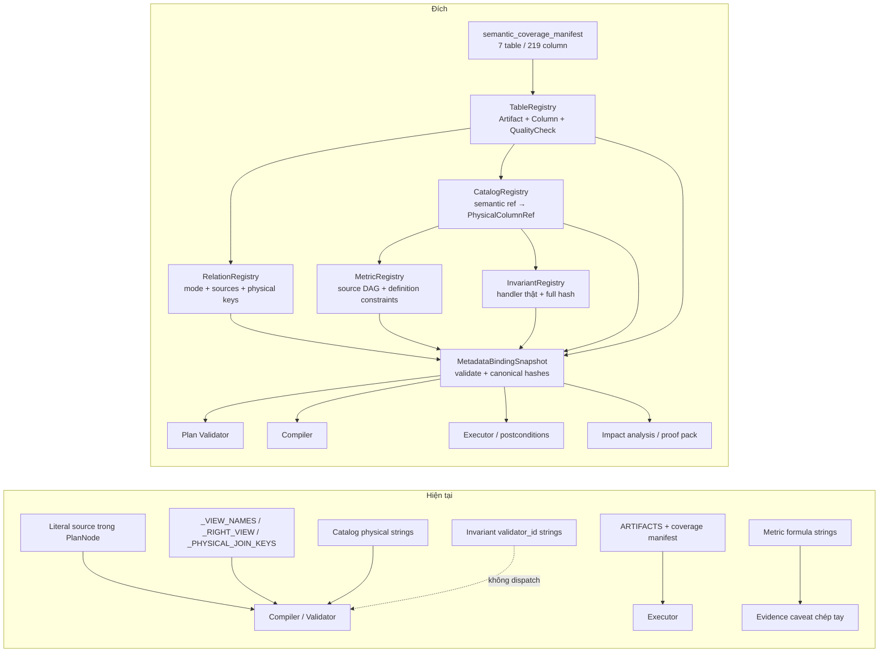
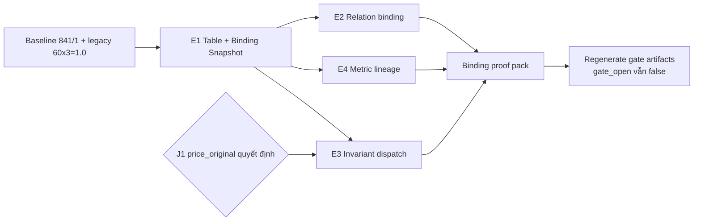

# Metadata Model và Binding Layer cho Gladiators

>

## §A. Tóm tắt điều hành

Gladiators đã có semantic layer tương ứng cả ba tầng của Merlion: catalog giải
nghĩa cột, metric registry định nghĩa đại lượng, invariant/relation registry giữ
constraint và join. Gladiators còn chặt hơn Merlion ở answerability, grain,
dedupe, caveat/trap, source tier, fanout và cơ chế fail-closed. Vì vậy không xây
lại semantic layer và không chép nguyên mô hình Merlion.

Khoảng trống cần sửa nằm ở **binding giữa metadata và vật lý**:

1. Bảy artifact và 219 cột chưa có một `TableRegistry` làm nguồn chung; tên bảng
   đang được lặp ở IR, compiler và coverage, còn catalog dùng chuỗi
   `"<table>.<column>"`.
2. Relation semantic và relation compiler có hai bộ join key. Hai relation đã
   lệch; một inline relation khai key không tồn tại nhưng chưa gây sai số chỉ vì
   compiler đang bỏ qua toàn bộ inline join.
3. Mười một `validator_id` là metadata không được dispatch. Enforcement thật nằm
   rải rác, trong đó sentinel price hard-code thêm `measure.price_original` mà
   spec không khai.
4. Sáu dependency metric→metric chỉ có thể thấy bằng tìm tên trong `formula`;
   không có impact graph để truyền caveat hoặc chặn thay đổi nguồn.

Kiến trúc đích thêm một **Metadata Binding Layer** deterministic giữa registry và
S5a. Layer này build một snapshot bất biến gồm Table/Catalog/Relation/Metric/
Invariant, kiểm mọi reference và handler, rồi cấp hash cho plan, cache, gate và
proof pack. Sai binding làm startup/import hoặc plan validation dừng; không có
fallback suy luận.

Thứ tự: **E1 Table + binding snapshot → E2 relation single source → E4 metric
lineage → E3 invariant dispatch**. E1 và phần khai lineage của E4 là additive.
E2 sửa contract nội bộ bằng dữ liệu thật. E3 chỉ merge sau quyết định của người
về `price_original`. Baseline legacy hiện đã trở lại `60 × 3 = 1.0`, nên điều
kiện “chờ regression 21 case đóng” trong brief đã được thỏa ở working tree này;
không dùng kết quả đó để tự mở topic/decomposer gate.

Rủi ro lớn nhất không phải migration schema mà là tạo một registry mới vẫn chỉ
để “trang trí”. Thiết kế vì vậy buộc mọi ID phải resolve tới object/handler thật,
mọi hash phải phủ toàn bộ semantics, và compiler/validator phải đọc cùng binding.

Không làm: FK inference; cumulative metric trên `monthly_sold`; nhiều metric
version sống song song; Pinot, column-store hay multi-dialect; raw SQL; thay đổi
`Evidence`; bật P5/P6; đổi `gate_open`; đổi E6.

## §B. Trạng thái đo được

### B.1. Provenance và giới hạn phép đo

| Thuộc tính | Giá trị đo ngày 12/08/2026 |
| --- | --- |
| Commit | `954b1f9` (`git rev-parse --short HEAD`) |
| Working tree trước phép đo | Có sẵn hai file untracked: DOCX Merlion và prompt; không có code tracked sửa |
| Python | `.venv/Scripts/python.exe` |
| Catalog / metric / relation / invariant | `86 / 33 / 10 / 11` |
| Artifact / physical column trong coverage manifest | `7 / 219` |
| Invariant hash hiện tại | `dd15c9001a9f4ac5` |
| Code graph | **DRAFT:** `graphify` không có trên PATH/venv; module Python không cài; `graphify-out/GRAPH_REPORT.md` không tồn tại |

Lệnh `graphify explain ...` và `graphify path ...` đều trả
`The term 'graphify' is not recognized`. Vì thế các ô “god node” trong §E.5 chỉ
ghi số tham chiếu từ `CLAUDE.md` để định vị, không coi là số đo. Không chạy
`graphify update` vì prompt cấm ghi đè graph.

### B.2. Kết quả script §3.0

```text
== A. catalog.physical -> cột có thật? ==
  0 lỗi / 82 mapping
== B. relations.join_keys -> cột có thật? ==
  in_platform_category: left products_clean.csv.category_id KHÔNG TỒN TẠI
  has_brand: right key 'raw_brand' không tồn tại ở BẤT KỲ bảng nào
== C. relations.join_keys vs compiler._PHYSICAL_JOIN_KEYS ==
  LỆCH in_platform_category:
      relations: (('country_code', 'path_country_code'), ('category_id', 'category_id'))
      compiler : (('country_code', 'country_code'), ('catid_num', 'category_id_num'))
  LỆCH in_shop_category:
      relations: (('country_code', 'country_code'), ('shop_id', 'shop_id'), ('category_id', 'shop_category_id'), ('date', 'date'))
      compiler : (('country_code', 'country_code'), ('shop_id', 'shop_id'), ('category_id_num', 'shop_category_id_num'), ('date', 'date'))
  Relation không có override: ['has_brand', 'has_content', 'has_display_variation', 'observed_at', 'observed_promotion_id', 'observed_structured_voucher']
== D. metric phụ thuộc metric (chỉ nằm trong formula) ==
  history_sold_decrease_flag: formula->['history_sold_delta_raw'] | depends_on->(none)
  history_sold_delta_clean: formula->['history_sold_delta_raw'] | depends_on->(none)
  median_estimated_recent_revenue: formula->['estimated_recent_revenue'] | depends_on->(none)
  similarity_score: formula->['brand_match', 'category_overlap_depth', 'price_distance', 'same_shelf_bonus', 'text_sim'] | depends_on->(none)
  voucher_rate: formula->['has_structured_voucher'] | depends_on->['has_structured_voucher']
  voucher_profile_score: formula->['descriptive_gap_median_sold', 'median_discount_ratio', 'voucher_rate'] | depends_on->['has_structured_voucher']
```

Kiểm riêng cơ chế inline:

```text
missing_override= ['has_brand', 'has_content', 'has_display_variation', 'observed_at', 'observed_promotion_id', 'observed_structured_voucher']
inline= ['has_brand', 'has_content', 'has_display_variation', 'observed_at', 'observed_promotion_id', 'observed_structured_voucher']
equal= True
```

Đây là lỗi tiềm ẩn có điều kiện kích hoạt. `has_brand` không tạo JOIN hôm nay vì
nó thuộc `_INLINE_RELATIONS`; nếu đổi adapter/mode mà không sửa binding, key giả
`raw_brand` mới đi vào SQL. Không có bằng chứng baseline nào cho thấy lỗi này đã
làm sai con số hiện tại.

`rg -n validator_id src tests` chỉ thấy khai báo/build/hash/prompt/test. Không có
caller của `for_stage()` hoặc dispatch table trong runtime. Chuỗi
`sentinel.price_excluded_before_rank` chỉ xuất hiện ở dòng spec.

### B.3. Baseline hành vi trước và sau khi viết tài liệu

Các lệnh dưới là baseline của code, không phải bằng chứng rằng thiết kế trong tài
liệu đã được implement.

| Phép đo | Trước khi viết | Sau khi viết |
| --- | --- | --- |
| `pytest -q` | `841 passed, 1 skipped, 1 warning in 74.94s`; warning do sandbox không tạo được `.pytest_cache` | `841 passed, 1 skipped, 1 warning in 75.24s`; cùng warning |
| Legacy `questions.json`, 60 case × 3 | `end_to_end_accuracy=1.0`, `pass_pow_runs=1.0`, `verifier_mutation_detection=1.0`, `crash_rate=0.0`, `failures={}` | Cùng các giá trị; 60/60 case, 3 run, `failures={}` |
| Phase 6 external | Lệnh nguyên văn fail `ModuleNotFoundError: gladiators`; với `PYTHONPATH=src`: `12/12`, mode `offline-no-network` | Với `PYTHONPATH=src`: `12/12`, failed 0, cùng mode |
| Topic gate build vào scratch | 5/5 automatic check PASS; 6 metric `pending_oracle`; `gate_open=false`; corpus 191; ownership 86 | Cùng 5/5, 6 pending, `gate_open=false`, corpus 191, ownership 86 |

`scripts/run_evaluation.py` mặc định ghi `eval/reports`. Lần đo trước đã phát
hiện và hoàn nguyên chính xác các file do runner sinh. Lần tái lập an toàn dùng
`--output scratch/eval_reports_<phase>`. `scripts/build_topic_gate.py` cũng được
chạy với `--output` tuyệt đối dưới `scratch/` để không sửa `eval/topic_gate.json`.

### B.4. Sai lệch so với brief

| Brief | Đo lại | Giả thuyết có bằng chứng |
| --- | --- | --- |
| `pytest`: 804 pass, 1 skip | 841 pass, 1 skip | Working tree/commit đã đi tiếp từ baseline `1df8e5b`; commit đo là `954b1f9` |
| Legacy 60×3: 0.65, 21 case fail do digit trong `A-AMBIGUOUS` | 1.0, 0 failure | Regression đã được sửa trước phép đo này; không còn điều kiện chờ 21 case |
| `eval/topic_gate.json`: ownership 83, corpus 188, hash topic/alias cũ | Regenerate scratch: ownership 86, corpus 191; topics `c1cf992e1d852a27`, alias `522e3ee601b0811a` | File gate checked-in đang ký registry/corpus cũ; vẫn `gate_open=false` nên không tạo false allow |
| Lệnh Phase 6 chạy trực tiếp | Fail import; thêm `PYTHONPATH=src` thì 12/12 | Harness không bootstrap `src` như pytest/runner khác; đây là lỗi invocation, không phải 12 case external fail |
| Có graph report và CLI để đo edge | Không có cả CLI lẫn report | Artifact/skill không được cung cấp trong phiên; không suy số từ narrative |

Các số `86 / 33 / 10 / 11`, `0/82`, `7/219`, `1.580 structured voucher
rows đều ở VN`, `3.341 row / 1.157 listing / 3 date` đều được tái lập bằng lệnh
ở §K.

## §C. Đối chiếu Merlion → Gladiators

| # | Khái niệm Merlion | Gladiators hiện có | Verdict | Lý do |
| ---: | --- | --- | --- | --- |
| 1 | Semantic layer / metadata model | Catalog + metric + relation + invariant + typed IR | **Đã có** | Không làm lại; bổ sung binding thực thi giữa các registry |
| 2 | Table model + TableColumn | Tên artifact lặp; coverage manifest phủ 7/219 nhưng không là compiler registry | **Bê có sửa** | Thêm `TableRegistry` cho CSV frozen, view/grain/hash/column; không mang storage abstraction chung chung |
| 3 | DataQualityTests | `validate_manifest`, Pandera cho 3 artifact, pipeline report | **Bê có sửa** | Table chỉ tham chiếu quality check có handler thật; không chép metadata Genchi hoặc tạo job runner mới |
| 4 | DataSource (identifier/dimension/measure) | `CatalogObject` với kind/answerability/role/source tier/alias | **Đã có** | Catalog giàu hơn; chỉ chuyển physical string thành binding đã validate |
| 5 | Dimension + Dimension Dictionary | `dim.*`, alias/value index, Topic ownership | **Đã có** | `value_index` và AliasIndex đã govern value/NL binding; không tạo dictionary thứ hai |
| 6 | Measure + aggregation | `measure.*`, `valid_aggregations`, grain/unit | **Đã có** | Validator đã chặn aggregate ngoài allow-list; không mượn `SUM` mặc định của Merlion |
| 7 | Constraint | Invariants + predicate IR + caveat metric | **Bê có sửa** | Tách `definition_constraints` của metric khỏi user filter; mọi constraint phải declarative hoặc resolve handler thật |
| 8 | Simple / Ratio / Cumulative / Derived | Metric registry, derived refs, certified RatioSpec | **Bê có sửa** | Chấp nhận Simple/Ratio/Derived như tag/validation; **từ chối Cumulative** trên proxy 3 snapshot |
| 9 | Metric Relationship + impact analysis | `depends_on` + formula prose, chưa có graph đầy đủ | **Bê có sửa** | Thêm source column/source metric/owner/tag/constraint và DAG impact; không parse formula để quyết định |
| 10 | End-to-end flow | S1→S9, S5a planner→validator→compiler→executor | **Đã có** | Binding snapshot cắm trước S5a và được pin vào ExecutionContext; không thay Gate/Alignment/Verifier |
| 11 | Join dimension + FK inference | Relation registry cấm tự tạo edge | **Từ chối** FK inference; giữ join dimension khai tay | Header có các tên `shop_id/category_id*` ở hai hệ category; inference có thể tạo edge bị `INV-SHELF-NOT-PLATFORM-CATEGORY` cấm |
| 12 | Query engine + dialect validation | SQLGlot/DuckDB, SELECT-only, AST/function allow-list | **Đã có** | Một dialect là đủ cho 3.341 row; multi-dialect tăng surface và đụng bất biến #5 |
| 13 | Metric versioning / single definition / multi-consumer | Một `METRICS`; plan/evidence có hash nhưng metric hash riêng chưa có | **Bê có sửa** single definition/hash; **từ chối** nhiều active version mặc định | Thêm canonical metric hash cho mọi consumer; parallel version chỉ được xét khi version vào plan/evidence/hash và có migration contract |

## §D. Kiến trúc đích

### D.1. Hiện tại và sau thay đổi



### D.2. Trách nhiệm và negative responsibility

| Tầng | Input → output | Trách nhiệm | KHÔNG được làm |
| --- | --- | --- | --- |
| `TableRegistry` | coverage manifest + fixed table declarations → table/column objects | Sở hữu artifact name, DuckDB view, grain, storage=`csv`, column metadata, quality check ref | Không đọc raw 82 CSV; không tự sửa header/type; không chọn join |
| `CatalogRegistry` | semantic specs + TableRegistry → semantic→physical binding | Parse/validate `table.column`, giữ alias/role/answerability/tier | Không tính metric; không expose context/external vào SQL |
| `RelationRegistry` | entity relation + TableRegistry → executable relation binding | Khai mode inline/join, left/right source, direction, physical key, fanout/dedupe | Không infer FK; không tạo path chỉ vì trùng tên; không chứa SQL string |
| `MetricRegistry` | column/metric deps + constraints → acyclic impact graph | Một định nghĩa, lineage, owner/tag, effective caveat, constraint semantics | Không tính số trong LLM; không cho Cumulative; không chạy constraint chưa duyệt |
| `InvariantRegistry` | spec + handler registry → stage dispatch | Resolve handler, kiểm stage, tạo violation typed, hash toàn bộ semantics | Không coi string có dấu chấm là handler; không để critic hạ hard rule |
| `MetadataBindingSnapshot` | 5 registry → immutable hashes + indexes | Kiểm cross-registry, pin execution context, cache/gate/proof identity | Không mutate `Evidence`; không cấp capability; không đổi gate state |

### D.3. Điểm cắm vào S1→S9

- **Startup trước S1:** build snapshot; binding/hash mismatch làm startup fail.
- **S1–S4:** chỉ đọc alias/catalog/capability như hiện tại. Không đổi precedence,
  Gate, entity resolution hoặc action.
- **S5a:** planner chỉ dùng semantic refs; validator đọc snapshot; compiler lấy
  table/view/join/constraint từ snapshot; executor đối chiếu snapshot hash với
  dataset version trước query.
- **S5b/S5c:** không đổi; external vẫn `context_only`, không được bind vào
  `LogicalQueryPlan`.
- **S6:** tạo `Evidence` mới từ kết quả đã pass, gắn caveat/lineage đã resolve;
  không sửa object gốc.
- **S7:** generator nhận caveat hiệu lực; không tính hay suy dependency.
- **S8:** Verifier vẫn kiểm number/value/unit/path/tier; metadata layer không làm
  giảm scan hoặc claim binding.
- **S9:** Alignment/Gate-output vẫn độc lập. Hash đổi không tự mở topic/decomposer.

## §E. Từng thay đổi

### E1. Table Registry và Metadata Binding Snapshot

#### E1.1. Bằng chứng

```text
validate_manifest('data/processed') -> {'artifacts': 7, 'columns': 219}
CATALOG=86; catalog physical mappings=82; physical errors=0

query_ir.py:64       source: Literal[7 file]
compiler.py:42       _VIEW_NAMES = {7 entry}
data/coverage.py:18  ARTIFACTS = (7 file)
catalog.py           "<table>.<column>" trong physical
```

Row/column thực đo:

```text
category_list_clean.csv: rows=491, cols=22
category_platform_clean.csv: rows=4482, cols=20
product_categories_clean.csv: rows=4054, cols=14
product_snapshot_metrics.csv: rows=3341, cols=27
product_transition_metrics.csv: rows=2184, cols=23
products_clean.csv: rows=3341, cols=80
shop_info_clean.csv: rows=20, cols=33
```

#### E1.2. Lập luận

Đây không phải bốn lỗi copy-paste riêng. Không có object nào biểu diễn “artifact
được govern” nên mỗi consumer phải tự trả lời tên, view và column. Catalog hiện
rất sạch (`0/82`) nhưng relation drift chứng minh cleanliness đó không lan qua
ranh giới registry. Merlion đúng ở việc làm Table thành dependency của
DataSource; Gladiators cần cùng hướng nhưng giới hạn vào bảy CSV frozen.

Coverage manifest đã là nguồn phủ toàn bộ header. Table layer không tạo manifest
thứ hai; nó materialize manifest thành typed registry và thêm phần metadata mà
compiler cần: view, grain, role và quality check đã resolve.

#### E1.3. Thiết kế cụ thể

File mới `src/gladiators/domain/tables.py`:

```python
from dataclasses import dataclass
from enum import StrEnum
from typing import Literal

class ArtifactName(StrEnum):
    PRODUCTS = "products_clean.csv"
    SHOP_INFO = "shop_info_clean.csv"
    CATEGORY_LIST = "category_list_clean.csv"
    PRODUCT_CATEGORIES = "product_categories_clean.csv"
    CATEGORY_PLATFORM = "category_platform_clean.csv"
    SNAPSHOT_METRICS = "product_snapshot_metrics.csv"
    TRANSITION_METRICS = "product_transition_metrics.csv"

@dataclass(frozen=True)
class TableColumnSpec:
    name: str
    physical_type: str | None
    coverage_status: str
    catalog_ref: str | None
    partition: bool = False

@dataclass(frozen=True)
class QualityCheckRef:
    check_id: str
    handler_id: str
    severity: Literal["hard", "warning"] = "hard"

@dataclass(frozen=True)
class TableSpec:
    name: ArtifactName
    view_name: str
    storage: Literal["csv"]
    grain: tuple[str, ...]
    columns: tuple[TableColumnSpec, ...]
    quality_checks: tuple[QualityCheckRef, ...]
    version_policy: Literal["dataset_hash"] = "dataset_hash"
```

API build/validate trong file mới `src/gladiators/domain/bindings.py`:

```python
def build_table_registry(
    manifest: Mapping[str, object],
    declarations: tuple[TableDeclaration, ...],
    quality_handlers: Mapping[str, QualityCheckHandler],
) -> Mapping[ArtifactName, TableSpec]: ...

def validate_metadata_bindings(
    tables: Mapping[ArtifactName, TableSpec],
    catalog: Mapping[str, CatalogObject],
    relations: Mapping[str, RelationSpec],
    metrics: Mapping[str, MetricSpec],
    invariants: Mapping[str, InvariantSpec],
) -> MetadataBindingSnapshot: ...
```

`TableDeclaration` chỉ khai mỗi artifact **một lần**: enum value, `view_name`,
grain và quality check IDs. `columns` đến từ
`semantic_coverage_manifest.json`; `physical_type` và `partition` là field
additive trong manifest, mặc định `None/False` trong compatibility window. Mọi
quality `handler_id` phải có callable trong `QUALITY_CHECK_HANDLERS`; không lặp
lỗi string-dead của invariant.

Mở rộng cuối `CatalogObject` bằng field có default để không phá constructor cũ:

```python
@dataclass(frozen=True)
class PhysicalColumnRef:
    table: ArtifactName
    column: str

@dataclass(frozen=True)
class CatalogObject:
    # field hiện hữu giữ nguyên thứ tự
    physical_bindings: tuple[PhysicalColumnRef, ...] = ()
```

`_build_catalog(objects, tables)` parse `physical` legacy thành binding, dùng
`dataclasses.replace`, rồi fail ngay khi table/column không tồn tại. `physical`
string được giữ một release để fixture/serializer cũ đọc được; writer/compiler
mới chỉ đọc `physical_bindings`.

`MetadataBindingSnapshot` là frozen dataclass, chứa `table_hash`, `catalog_hash`,
`relation_hash`, `metric_hash`, `invariant_hash`, `binding_hash` và index tra cứu.
Hash dùng canonical JSON UTF-8, sort key, không timestamp. `binding_hash` đi vào
`ExecutionContextSnapshot`, plan/cache identity và proof pack; không thay
`dataset_version`.

Thay consumer:

| File | Thay đổi |
| --- | --- |
| `planner/query_ir.py` | `PlanNode.source: ArtifactName | None`; JSON string cũ vẫn parse |
| `planner/compiler.py` | sinh `_VIEW_NAMES` compatibility từ `TABLES`; compiler mới dùng `TABLES[source].view_name` |
| `data/coverage.py` | `ARTIFACTS = tuple(x.value for x in ArtifactName)` compatibility, không khai tên lần hai |
| `planner/executor.py` | register `TableSpec.view_name`; kiểm dataset/binding hash trước execute |
| `data/contracts.py` | quality handler map tới `validate_manifest`, Pandera và pipeline report hiện hữu |
| `planner/execution_plan.py` | dùng hash thật, không điền `topics.REGISTRY_HASH` giả cho catalog/relation |

Build invariants:

- đủ đúng 7 `ArtifactName`, 7 view name duy nhất, 219 `(table,column)` duy nhất;
- mọi manifest table thuộc enum; mọi enum có manifest entry;
- mọi `physical_bindings` tồn tại; `physical_dimension` vẫn phải có binding;
- mọi Scan source thuộc table registry;
- mọi hard quality check resolve handler;
- mọi hash thay khi field semantic tương ứng đổi.

#### E1.4. Cái này KHÔNG làm gì

- Không làm runtime đọc thêm raw data hay đổi projection.
- Không biến Pandera `strict=False` thành `strict=True` trong cùng merge; đó là
  contract data riêng cần quarantine/acceptance.
- Không tự đoán dtype từ pandas rồi ghi ngược manifest.
- Không thêm database, storage plugin, partition pruning hoặc Pinot.
- Không đổi alias, metric formula, Evidence schema, Gate hay feature flag.

#### E1.5. Cổng tương thích

| # | Câu hỏi | Trả lời có bằng chứng/gate |
| ---: | --- | --- |
| 1 | God node | **DRAFT — code-graph audit.** Thay field nested `PlanNode.source`; `CLAUDE.md` tham chiếu `PlanNode=62`, `LogicalQueryPlan=134`, nhưng chưa đo lại được. Không chạm `Evidence` schema. |
| 2 | Stage S1→S9 | Startup + S5a `query_ir.py/compiler.py/executor.py`; S6–S9 chỉ nhận cùng immutable Evidence, không đổi verifier/alignment. |
| 3 | 7 bất biến | #2 giữ source tier; #4 giữ Evidence bất biến; #5 không mở SQL; #6 mọi mismatch fail startup; #7 field mới có default + string JSON cũ parse. |
| 4 | Additive/breaking | Additive trong compatibility window. Gate sau implementation: chạy toàn bộ test cũ, bỏ riêng hai file test mới, phải giữ `841 passed, 1 skipped`; JSON fixture cũ với source string phải parse. |
| 5 | Registry hash | Không đổi 4 hash hiện hữu nếu alias/ref/topic/capability không đổi. Thêm `TABLE/CATALOG/BINDING_HASH`; topic gate phải ghi source hash mới và giữ `gate_open=false` cho tới sign-off. |
| 6 | Fail mode | Fail-closed: `TableRegistryError`/`CatalogError` trước request hoặc `DATASET_VERSION_MISMATCH` trước execute. |
| 7 | Đo hoàn tất | Probe phải in `tables=7 columns=219 catalog_bindings=82 errors=0 duplicate_views=0 unresolved_quality_handlers=0`. |

#### E1.6. Kế hoạch thực thi

1. Viết đỏ `tests/test_table_registry.py`: 7 artifact/219 column, duplicate view,
   missing manifest column, unknown quality handler, canonical hash mutation.
2. Viết đỏ `tests/test_catalog.py`: physical string cũ được materialize; unknown
   table/column fail-at-build.
3. Thêm `tables.py` và `bindings.py`, chỉ đọc manifest; chưa đổi compiler.
4. Sinh compatibility `ARTIFACTS/_VIEW_NAMES` từ registry; chứng minh output bằng
   fixture trước khi chuyển consumer.
5. Chuyển catalog, query IR, compiler, executor và execution context lần lượt.
6. Thêm `scripts/verify_metadata_bindings.py --json` read-only.
7. Chạy baseline/eval; không sửa golden để ép xanh; không regenerate gate vào
   `eval/` trong PR chưa sign-off.

#### E1.7. Nghiệm thu

```powershell
.venv/Scripts/python.exe scripts/verify_metadata_bindings.py --json
# kỳ vọng: tables=7, columns=219, catalog_bindings=82,
# errors=0, duplicate_views=0, unresolved_quality_handlers=0

.venv/Scripts/python.exe -m pytest -q --ignore=tests/test_table_registry.py `
  --ignore=tests/test_catalog.py
# kỳ vọng trên baseline này: 841 passed, 1 skipped; 0 failed

.venv/Scripts/python.exe scripts/run_evaluation.py --suite eval/questions.json `
  --runs 3 --provider offline --output scratch/e1_eval
# kỳ vọng: cases=60, completed_cases=60, pass_pow_runs=1.0,
# verifier_mutation_detection=1.0, crash_rate=0.0
```

#### E1.8. Rollback

Giữ compatibility maps trong một release. Nếu eval tụt, chuyển compiler/executor
về đọc maps **được sinh từ TableRegistry**, không khôi phục danh sách khai tay;
giữ test binding và registry ở shadow/startup audit. Revert merge unit E1 riêng,
không sửa manifest/golden và không thay gate flag.

### E2. Một nguồn executable cho relation binding

#### E2.1. Bằng chứng

```text
in_platform_category:
  relation = country_code→path_country_code, category_id→category_id
  compiler = country_code→country_code, catid_num→category_id_num
  products_clean.csv.category_id KHÔNG TỒN TẠI

in_shop_category:
  relation = category_id→shop_category_id
  compiler = category_id_num→shop_category_id_num

has_brand:
  relation = brand→raw_brand
  raw_brand không tồn tại ở bất kỳ bảng nào

set(relation không override) == _INLINE_RELATIONS -> True
```

#### E2.2. Lập luận

`relations.py` tự nhận là nguồn duy nhất nhưng compiler có nguồn thứ hai mạnh hơn.
Đây là lỗi khái niệm vì review, pathfinding và prompt nhìn một contract, còn SQL
thực thi contract khác. Việc inline relation “an toàn” chỉ là control-flow hiện
tại; thay adapter có thể kích hoạt key sai mà không đổi registry.

#### E2.3. Thiết kế cụ thể

Thêm binding vào `RelationSpec`, dùng object Table/Column của E1:

```python
ExecutionMode = Literal["inline", "left_join"]

@dataclass(frozen=True)
class JoinKey:
    left: PhysicalColumnRef
    right: PhysicalColumnRef

@dataclass(frozen=True)
class RelationBinding:
    mode: ExecutionMode
    left_sources: tuple[ArtifactName, ...]
    right_source: ArtifactName | None
    join_keys: tuple[JoinKey, ...] = ()
    projection_id: str | None = None

@dataclass(frozen=True)
class RelationSpec:
    # field semantic hiện hữu
    binding: RelationBinding | None = None  # append/default một release
```

Quy tắc:

- `left_join`: có đúng một right source, ít nhất một key, mọi column tồn tại,
  mỗi key có type-compatible family, projection ID resolve compiler adapter.
- `inline`: không có right source/key/projection; relation mô tả column đã nằm
  trên left frame. `has_brand` vì vậy không bịa `raw_brand`.
- `scope`, direction, cardinality, input/output grain, fanout/dedupe vẫn bắt buộc.
- `_RIGHT_VIEW`, `_PHYSICAL_JOIN_KEYS`, `_INLINE_RELATIONS` và
  `RELATION_LEFT_SOURCES` được **sinh** từ binding trong compatibility window;
  không có literal thứ hai.
- Compiler đọc `relation.binding` trực tiếp. Không còn `.get(...,
  relation.join_keys)` fallback; thiếu binding là compile fail.

Binding ban đầu:

| Relation | Mode | Physical binding |
| --- | --- | --- |
| `belongs_to` | left_join | products → shop_info: `(country_code,country_code)`, `(shop_id,shop_id)` |
| `in_platform_category` | left_join | products → category_platform: `(country_code,country_code)`, `(catid_num,category_id_num)` |
| `in_shop_category` | left_join | product_categories → category_list: country/shop/`category_id_num→shop_category_id_num`/date |
| `has_sales_metric` | left_join | products → snapshot metrics: `product_listing_key` |
| Sáu relation còn lại | inline | `left_sources` như hiện tại; không physical join key |

Không thêm edge ShopCategory↔PlatformCategory. Pathfinding tiếp tục chỉ chọn edge
khai tay; compiler kiểm source/direction/grain sau khi chọn.

#### E2.4. Cái này KHÔNG làm gì

- Không khẳng định các key cũ đã gây sai baseline.
- Không infer FK, không chọn path theo tên/cost khi grain mơ hồ.
- Không đổi join type/coverage/fanout semantics ngoài ba key có bằng chứng.
- Không gộp hai taxonomy category và không tạo canonical Brand entity.
- Không cho LLM thấy physical keys.

#### E2.5. Cổng tương thích

| # | Câu hỏi | Trả lời có bằng chứng/gate |
| ---: | --- | --- |
| 1 | God node | **DRAFT — code-graph audit.** Không sửa model node; thay compiler/validator consumer của `PlanNode`/`LogicalQueryPlan`. Số tham chiếu 62/134 chưa đo lại. |
| 2 | Stage S1→S9 | S5a `relations.py`, `validator.py`, `compiler.py`; không chạm S6–S9/Evidence/verifier. |
| 3 | 7 bất biến | #1 planner chỉ chọn semantic relation; #5 không raw SQL; #6 missing binding fail; #7 plan JSON vẫn chỉ chứa relation name nên fixture cũ giữ schema. |
| 4 | Additive/breaking | Field additive; sửa key là intentional internal contract correction. Plan/golden user-facing không đổi; test nào assert key sai chỉ được đổi kèm header evidence ở E2.1. |
| 5 | Registry hash | 4 hash hiện hữu không tự đổi vì `topics.REGISTRY_HASH` chỉ hash relation ID. Bắt buộc thêm `RELATION_HASH` và đưa vào binding/execution/topic-gate source hashes; gate vẫn false. |
| 6 | Fail mode | Fail-closed tại registry build/validator/compiler. Cấm fallback `relation.join_keys`. |
| 7 | Đo hoàn tất | `relations=10 join=4 inline=6 invalid_columns=0 duplicate_sources=0 legacy_maps_match=4`; compile fixture cho 4 join phải dùng đúng key. |

#### E2.6. Kế hoạch thực thi

1. Viết đỏ `tests/test_relation_bindings.py` cho ba drift và `has_brand` inline.
2. Thêm `RelationBinding`; migrate đủ 10 relation.
3. Build validation với TableRegistry; sinh private compatibility maps.
4. Chuyển validator rồi compiler; xóa fallback vật lý.
5. Thêm SQL AST test cho 4 relation và negative test edge category bị cấm.
6. Chạy full baseline; không đổi expected số nếu SQL/result signature lệch mà
   chưa giải thích được bằng header/cardinality.

#### E2.7. Nghiệm thu

```powershell
.venv/Scripts/python.exe scripts/verify_metadata_bindings.py --section relations
# kỳ vọng: relations=10, join=4, inline=6, invalid_columns=0,
# legacy_maps_match=4, forbidden_category_cross_edge=0

.venv/Scripts/python.exe -m pytest -q tests/test_relation_bindings.py `
  tests/test_planner_mutations.py tests/test_synthesizer.py
# kỳ vọng: 0 failed; 4 join AST fixture và 6 inline fixture được collect

.venv/Scripts/python.exe scripts/run_evaluation.py --suite eval/questions.json `
  --runs 3 --provider offline --output scratch/e2_eval
# kỳ vọng: pass_pow_runs=1.0, verifier_mutation_detection=1.0, crash_rate=0.0
```

#### E2.8. Rollback

Rollback consumer compiler về maps **sinh từ binding snapshot**, không khôi phục
literal sai. Nếu result signature đổi, disable merge unit E2 và giữ test đỏ/data
evidence để điều tra projection/cardinality; không đổi fixture/golden và không
nới validator.

### E3. Biến Invariant Registry thành dispatch thực thi

#### E3.1. Bằng chứng

```text
INVARIANTS=11; REGISTRY_HASH=dd15c9001a9f4ac5
runtime use of for_stage(...)             : 0
runtime dereference of spec.validator_id  : 0
sentinel.price_excluded_before_rank       : chỉ invariants.py
test contract hiện tại                    : assert "." in validator_id
```

Enforcement sentinel thật trong `planner/validator.py`:

```python
sensitive_refs = {"measure.price", "measure.price_original"}
```

Spec `INV-PRICE-SENTINEL-EXCLUDED` chỉ khai
`semantic_refs=("measure.price",)`. Ngoài ra hash hiện tại không phủ
`semantic_refs`, `applies_to`, `operators`, `traps`, `message_key` hay `owner`;
đổi một trong các semantics đó có thể giữ nguyên `REGISTRY_HASH`.

#### E3.2. Lập luận

Một ID trông hợp lệ nhưng không được gọi là prose mặc schema. Nó nguy hơn thiếu
registry vì prompt/context có thể làm người đọc tin rule đã được enforce. Các
check hard-code hiện có vẫn hữu ích, nhưng không có liên kết máy-kiểm giữa check
và spec; vì vậy semantic set và code set đã lệch ở `price_original`.

#### E3.3. Thiết kế cụ thể

Tạo `src/gladiators/domain/invariant_handlers.py`:

```python
@dataclass(frozen=True)
class InvariantViolation:
    invariant_id: str
    stage: InvariantStage
    severity: Severity
    message_key: str
    node_id: str | None = None
    details: Mapping[str, object] = field(default_factory=dict)

@dataclass(frozen=True)
class InvariantContext:
    stage: InvariantStage
    request: RequestDigest | None = None
    plan: LogicalQueryPlan | None = None
    execution: ExecutionResult | None = None
    evidence: tuple[Evidence, ...] = ()
    answer: str | None = None

class InvariantHandler(Protocol):
    handler_id: str
    handler_version: str
    stages: frozenset[InvariantStage]
    def validate(
        self, spec: InvariantSpec, context: InvariantContext
    ) -> tuple[InvariantViolation, ...]: ...

INVARIANT_HANDLERS: Mapping[str, InvariantHandler]

def enforce_invariants(
    stage: InvariantStage, context: InvariantContext
) -> tuple[InvariantViolation, ...]: ...
```

`_build` nhận handler registry và fail khi:

- validator ID không resolve;
- handler không phủ mọi `applies_to` đã khai;
- hard invariant không có negative fixture ID;
- semantic ref/operator không tồn tại;
- handler ID trùng hoặc `handler_version` rỗng.

Migration không chạy check hai lần. Mỗi hard-code hiện hữu được bọc thành handler,
call site chuyển sang dispatcher, rồi nhánh hard-code cũ bị xóa trong **cùng merge
unit**. Mapping stage:

| Stage | Call site | Kết quả hard violation |
| --- | --- | --- |
| request | `agent/gate.py` | `clarify`/`abstain` theo message catalog |
| plan | `planner/validator.py` | `PlanIssue` + invalid plan |
| composition | `planner/decomposition_validator.py` | `PlanningIssue` |
| execution | `planner/executor.py` | `ExecutionIssue`, không publish frame |
| evidence | `agent/alignment.py` | A22 block, không generate |
| answer | `agent/wording.py` + final workflow | verification block/fallback; fail lần cuối → abstain |

Handler sentinel phải đọc `spec.semantic_refs` và `spec.operators`; không chứa
`sensitive_refs` thứ hai. Quyết định có thêm `measure.price_original` vào spec là
Open Question J1, không được ngầm chọn trong implementation.

Hash mới:

```python
REGISTRY_HASH = canonical_hash({
    "specs": [spec.model_dump(mode="json") for spec in sorted_specs],
    "handlers": [
        {"id": h.handler_id, "version": h.handler_version,
         "stages": sorted(h.stages)} for h in sorted_handlers
    ],
})[:16]
```

Bất kỳ semantic field hoặc handler version đổi đều invalidate execution context,
topic/decomposition gate và proof pack. Không đưa source code bytes/timestamp vào
hash.

#### E3.4. Cái này KHÔNG làm gì

- Không chọn thay người về `price_original`.
- Không gộp Gate, Alignment và Verifier; dispatcher chỉ cấp rule result typed,
  ba lớp vẫn trả lời ba câu khác nhau.
- Không cho warning tự biến thành hard rule hoặc ngược lại.
- Không sửa `Evidence`, không giảm numeric scan, không auto-repair hard violation.
- Không cho LLM/critic dispatch, bỏ hoặc hạ severity.

#### E3.5. Cổng tương thích

| # | Câu hỏi | Trả lời có bằng chứng/gate |
| ---: | --- | --- |
| 1 | God node | **DRAFT — code-graph audit.** Không sửa `Evidence`/LQP schema nhưng chạm validator và S6–S9 consumers. Số tham chiếu `Evidence=64`, `LogicalQueryPlan=134`, `AgentRuntime=102` chưa đo lại. |
| 2 | Stage S1→S9 | S4, S5a, S6/A22, S8 wording/verifier, S9 final. Evidence object chỉ được đọc; result typed được adapter sang code hiện hữu. |
| 3 | 7 bất biến | #1 mọi LLM output vẫn qua deterministic handler; #2/#3 tier rules không đổi; #4 Evidence read-only; #5 không SQL; #6 unresolved/mismatch fail; #7 không đổi external schema. |
| 4 | Additive/breaking | Registry/handler API additive; chuyển enforcement là contract-sensitive. Chỉ merge sau J1 và negative parity cho cả 11 rule; baseline 21-case đã đóng. |
| 5 | Registry hash | `invariants.REGISTRY_HASH` chắc chắn đổi vì canonicalization/handler versions; `topics`/alias/capability ref set không đổi. Regenerate gate/proof artifact nhưng giữ `gate_open=false`; 6 reviewer metric vẫn pending. |
| 6 | Fail mode | Fail-closed: import build error, invalid plan, execution block, A22/final abstain. Không handler → startup fail. |
| 7 | Đo hoàn tất | `specs=11 handlers=11 unresolved=0 uncovered_stages=0 hard_negative_fixtures=10`; từng mutation bị đúng invariant ID chặn. |

#### E3.6. Kế hoạch thực thi

1. J1 được owner quyết và ghi DR; không code trước quyết định.
2. Viết đỏ `tests/test_invariant_dispatch.py`: một negative fixture cho từng hard
   rule, warning fixture cho proxy; test unknown handler/stage/hash mutation.
3. Viết adapters từ violation sang `PlanIssue/ExecutionIssue/A22/wording`.
4. Migrate từng stage, xóa check duplicate trong cùng commit; sentinel làm đầu
   tiên vì có drift đo được.
5. Regenerate topic/decomposition artifact vào scratch; reviewer ký artifact
   riêng, không bật flag trong merge code.
6. Chạy legacy, external, mutation detector và A22 suite.

#### E3.7. Nghiệm thu

```powershell
.venv/Scripts/python.exe scripts/verify_metadata_bindings.py --section invariants
# kỳ vọng: specs=11, handlers=11, unresolved=0, uncovered_stages=0,
# hard=10, warning=1, hard_negative_fixtures=10

.venv/Scripts/python.exe -m pytest -q tests/test_invariant_registry.py `
  tests/test_invariant_dispatch.py tests/test_planner_mutations.py `
  tests/test_context_alignment_2607.py tests/test_jargon_lint.py `
  tests/test_antihallucination.py
# kỳ vọng: 0 failed; mọi hard invariant có ít nhất 1 negative case

.venv/Scripts/python.exe scripts/build_topic_gate.py `
  --output "<repo>\scratch\e3_topic_gate.json"
# kỳ vọng: automatic_checks_pass=true, gate_open=false,
# gate_blocked_by có đúng 6 reviewer metric hiện hữu
```

#### E3.8. Rollback

Mỗi stage là merge unit. Nếu parity tụt, rollback adapter stage đó về hard-code
đã biết nhưng **giữ** build-time handler resolution/hash tests ở shadow. Không
được rollback bằng cách bỏ negative fixture, hạ severity hoặc bỏ verifier. J1
spec và code phải rollback cùng nhau để không tái tạo drift.

### E4. Metric lineage, definition constraint và impact graph

#### E4.1. Bằng chứng

Script §3.0 tìm đúng sáu metric có metric name trong `formula`: hai history,
median revenue, similarity score, voucher rate và voucher profile score. Năm
edge bị thiếu hoàn toàn; `voucher_profile_score.depends_on` chỉ thấy
`has_structured_voucher` nhưng formula dùng ba metric con.

```text
has_structured_voucher true_rows=1580 total_rows=3341
countries={'vn': 1580}
```

Dependency quan trọng nhưng chưa truy được tự động:

```text
has_structured_voucher
  -> voucher_rate
  -> voucher_profile_score
```

Metric gốc mang caveat VN-only; metric cuối còn chờ phê duyệt weight DR1/Lead.

#### E4.2. Lập luận

`formula` là documentation string, không phải AST. Dùng substring để impact
analysis có false positive (`rate` trong tên dài), false negative (đổi cách viết)
và không phát hiện cycle. `depends_on` lại trộn raw column với metric name, nên
consumer không biết edge thuộc loại nào. Đây là thiếu model dependency, không
phải thiếu sáu tuple.

Merlion đúng ở `metric_sources/owners/tags` và constraint thuộc định nghĩa
metric. Gladiators phải thêm typed lineage nhưng giữ grain/dedupe/caveat/trap và
không cho phép công thức tự do.

#### E4.3. Thiết kế cụ thể

Append field có default vào `MetricSpec`:

```python
ConstraintOp = Literal["eq", "ne", "lt", "lte", "gt", "gte", "in"]
NullPolicy = Literal["exclude", "false", "propagate"]

@dataclass(frozen=True)
class MetricConstraint:
    constraint_id: str
    ref: str
    op: ConstraintOp
    values: tuple[object, ...]
    null_policy: NullPolicy
    decision_id: str

@dataclass(frozen=True)
class MetricSpec:
    # field hiện hữu giữ nguyên
    source_columns: tuple[str, ...] = ()
    source_metrics: tuple[str, ...] = ()
    definition_constraints: tuple[MetricConstraint, ...] = ()
    owner: str = "data-owner"
    tags: tuple[str, ...] = ()
```

Compatibility: `depends_on` được giữ nguyên byte-for-byte một release và trở
thành legacy field không authoritative. Builder chỉ yêu cầu mọi token legacy
được phân loại trong `source_columns ∪ source_metrics`; nó không yêu cầu legacy
field đủ mọi edge. Writer/impact engine mới không đọc `formula` và không đọc
`depends_on`. Migration điền đủ 33 metric; sáu metric sau có `source_metrics`:

| Metric | `source_metrics` |
| --- | --- |
| `history_sold_decrease_flag` | `history_sold_delta_raw` |
| `history_sold_delta_clean` | `history_sold_delta_raw` |
| `median_estimated_recent_revenue` | `estimated_recent_revenue` |
| `similarity_score` | `text_sim`, `category_overlap_depth`, `brand_match`, `price_distance`, `same_shelf_bonus` |
| `voucher_rate` | `has_structured_voucher` |
| `voucher_profile_score` | `voucher_rate`, `median_discount_ratio`, `descriptive_gap_median_sold` |

`MetricConstraint` là filter **của definition**, không phải user predicate. Bản
đầu chỉ hỗ trợ predicate declarative; group eligibility/weight chưa duyệt không
được ép vào model. Ví dụ đã có contract rõ:

```python
MetricConstraint(
    constraint_id="structured-voucher-positive",
    ref="measure.voucher_discount",
    op="gt", values=(0,), null_policy="false",
    decision_id="existing-metric-contract",
)
```

Mọi `ref` phải có catalog binding; op phải hợp type; `decision_id` rỗng làm build
fail. Nếu metric đã materialize, materialization manifest phải khai cùng
`constraint_id`; nếu tool-computed, handler contract phải khai nó. Compiler chỉ
chèn constraint cho metric SQL-bound; không re-compute materialized column.

API impact:

```python
@dataclass(frozen=True)
class MetricImpact:
    changed: tuple[str, ...]
    direct_consumers: tuple[str, ...]
    transitive_consumers: tuple[str, ...]
    affected_constraints: tuple[str, ...]
    inherited_caveats: tuple[tuple[str, str], ...]  # (source_metric, caveat)

def build_metric_graph(specs: Mapping[str, MetricSpec]) -> MetricGraph: ...
def impact_of(metric: str) -> MetricImpact: ...
def effective_caveats(metric: str) -> tuple[tuple[str, str], ...]: ...
```

Graph build fail khi dependency không tồn tại, self-edge/cycle, source token lẫn
loại, constraint ref sai, hoặc derived metric không có lineage tới column/tool.
Caveat truyền theo path và dedupe `(source,caveat)`, không copy text vào parent.
Evidence builder lấy effective caveat khi tạo object mới; không mutate Evidence.

Thêm `METRIC_REGISTRY_HASH` phủ toàn bộ spec, constraint và dependency; thêm vào
`CATALOG/BINDING_HASH`, ExecutionContext và proof pack. `formula` vẫn là mô tả
human-readable nhưng đổi formula cũng làm hash đổi cho tới khi field đó được thay
bằng expression/handler version đầy đủ.

#### E4.4. Cái này KHÔNG làm gì

- Không tự duyệt weight `0.4/0.3/0.3` hoặc bật voucher profile capability.
- Không dùng impact graph làm causal graph.
- Không parse formula hoặc cho LLM sinh expression/constraint.
- Không tạo parallel metric version, không Cumulative, không cộng snapshot.
- Không thay caveat/wording của metric con bằng caveat suy diễn mới.

#### E4.5. Cổng tương thích

| # | Câu hỏi | Trả lời có bằng chứng/gate |
| ---: | --- | --- |
| 1 | God node | **DRAFT — code-graph audit.** Không sửa `Evidence` schema; chạm S5 metric selection và S6 Evidence construction. `Evidence=64` chỉ là số tham chiếu chưa đo. |
| 2 | Stage S1→S9 | Startup graph; S5a validator/compiler/tool; S6 tạo Evidence với effective caveat; S7 đọc caveat; S8/S9 giữ nguyên kiểm số/alignment. |
| 3 | 7 bất biến | #1 graph deterministic; #4 chỉ tạo Evidence mới; #5 không expression SQL tự do; #6 dependency/constraint sai fail; #7 field default + legacy union một release. |
| 4 | Additive/breaking | Lineage/owner/tag additive. Enforce definition constraint có thể đổi result nên chỉ bật từng metric sau oracle; voucher profile vẫn gated bởi DR1. Baseline 21-case đã đóng. |
| 5 | Registry hash | Không đổi invariant/topic/alias/capability nếu ref set không đổi. Thêm `METRIC_HASH`; binding/execution/gate source hash đổi, gate vẫn false và proof pack cần ký lại. |
| 6 | Fail mode | Fail-closed import khi DAG/constraint sai; plan dùng metric chưa approved → clarify/abstain, không bỏ constraint. |
| 7 | Đo hoàn tất | `metrics=33 metric_edges=11 missing_edges=0 cycles=0`; impact từ `has_structured_voucher` phải chứa `voucher_rate,voucher_profile_score`; caveat VN-only phải truy được theo path. |

`metric_edges=11` là tổng sáu dòng trên: `1+1+1+5+1+3`. Đây là con số acceptance
cho direct metric→metric edge, không phải số metric có edge.

#### E4.6. Kế hoạch thực thi

1. Viết đỏ `tests/test_metric_lineage.py`: đủ 11 edge, unknown/cycle/hash,
   transitive voucher impact, caveat provenance.
2. Thêm field default và graph builder; migrate đủ 33 spec bằng source column/
   metric explicit.
3. Giữ nguyên `depends_on`; thêm test mọi legacy token được phân loại và
   deprecation test, chưa xóa.
4. Thêm `MetricConstraint` chỉ cho contract đã có decision/source; metric pending
   không được tự cấp constraint/enable.
5. Wire impact report và Evidence caveat creation; không đổi Evidence class.
6. Chạy eval/golden độc lập; review mọi result change do constraint enforcement.

#### E4.7. Nghiệm thu

```powershell
.venv/Scripts/python.exe scripts/verify_metadata_bindings.py --section metrics
# kỳ vọng: metrics=33, metric_edges=11, missing_edges=0, cycles=0,
# legacy_token_unclassified=0, unresolved_constraints=0

.venv/Scripts/python.exe -m pytest -q tests/test_metric_lineage.py `
  tests/test_voucher_profile.py tests/test_v1.py
# kỳ vọng: 0 failed; impact/caveat assertions nêu trên đều được collect

.venv/Scripts/python.exe scripts/run_evaluation.py --suite eval/questions.json `
  --runs 3 --provider offline --output scratch/e4_eval
# kỳ vọng: pass_pow_runs=1.0, verifier_mutation_detection=1.0,
# evidence_accuracy=1.0, crash_rate=0.0
```

#### E4.8. Rollback

Tắt consumer của graph/constraint theo metric và quay về materialized/tool path
đã biết; giữ typed edges + impact report ở shadow vì chúng không đổi result.
Rollback caveat construction nếu answer contract lệch nhưng không xóa caveat
source/lineage test. Không rollback bằng cách xóa constraint hoặc sửa expected.

## §F. Thứ tự thực hiện



| Change | Loại | Có thể bắt đầu | Điều kiện trước merge/enforce |
| --- | --- | --- | --- |
| E1 registry/hash/compatibility maps | Additive | Ngay | 7/219/82 binding probe; test cũ giữ baseline |
| E2 physical relation source correction | Contract nội bộ có bằng chứng | Sau E1 | 4 join AST + result parity; regression 21 case đã đóng |
| E4 dependency graph/impact | Additive | Sau E1, có thể song song E2 | 11 edge, 0 cycle; không enforce constraint pending |
| E4 constraint enforcement từng metric | Contract result | Sau lineage | Oracle + owner decision; voucher profile chờ DR1/Lead |
| E3 dispatch + full invariant hash | Contract-sensitive | Sau E1 | J1, 11 handler, negative parity, gate/proof regeneration |

Không change set nào còn phải chờ regression 21 case vì phép đo hiện tại là 0
failure. Nếu legacy lại xuống dưới 1.0 ở bất kỳ merge unit nào, dừng chính merge
unit đó; không tiếp tục với lý do “regression đã từng đóng”. P5/P6/decomposer vẫn
shadow; bảng này không đổi trạng thái đó.

## §G. Bốn thứ không bê từ Merlion

### G.1. FK inference tự động — từ chối

Header thật:

```text
product_categories_clean.csv: shop_id, category_id, country_code, category_id_num
category_list_clean.csv: shop_id, shop_category_id, country_code, shop_category_id_num
category_platform_clean.csv: category_id, country_code, shop_id, category_id_num
```

Tên giống nhau không chứng minh cùng ontology. Inference có thể nối shelf của shop
với platform taxonomy, vi phạm `INV-SHELF-NOT-PLATFORM-CATEGORY`, trap #2/#3 và
bất biến hệ thống #6. E2 chỉ cho join khai tay đã bind source/direction/grain.

### G.2. Cumulative Metric — từ chối

Data có đúng ba date `2026-07-01..03`, 3.341 row và 1.157 listing.
`monthly_sold` là proxy của cửa sổ chưa xác nhận; cộng ba snapshot đếm lặp cùng
cửa sổ. Nếu cần type taxonomy, `cumulative` phải map thành
`unsupported_metric_type` và fail-closed, không là option hợp lệ. Simple/Ratio/
Derived vẫn được phép khi qua grain/dedupe/unit/constraint.

### G.3. Nhiều metric version sống song song — từ chối mặc định

Parallel active version làm cùng semantic ref có hai nghĩa, phá invariant hệ
thống #7 và làm Evidence khó truy đúng definition. `version` chỉ được xét khi nó
đi vào ref hoặc discriminator, `plan_hash`, `METRIC_REGISTRY_HASH`, Evidence
lineage, cache key, topic/decomposition gate và proof pack; cần migration window
và oracle riêng. Mặc định giữ một active definition, history ở Git.

### G.4. Pinot / multi-dialect / column-store — từ chối

Workload frozen chỉ 3.341 products row, executor DuckDB in-process read-only và
compiler chỉ sinh SELECT AST. Pinot/multi-dialect không mở câu hỏi mới nhưng thêm
storage/version/dialect failure, test matrix và nguy cơ đường SQL mới, đụng bất
biến #5. TableSpec vì thế khóa `storage="csv"`; dialect khóa DuckDB.

## §H. Ma trận rủi ro

| Change | Chế độ hỏng tệ nhất | Thiết kế fail mode | Phát hiện |
| --- | --- | --- | --- |
| E1 | Binding nhầm column nhưng compiler vẫn chạy và trả số sai | **Fail-closed** khi manifest/catalog/hash mismatch; không fallback string | 7/219/82 probe + missing/unknown mutation |
| E1 | Hash không đổi khi semantics đổi, cache dùng snapshot cũ | **Fail-closed** canonical full hash + execution-context equality | hash mutation test từng registry |
| E2 | Join sai làm fanout/sai category âm thầm | **Fail-closed** only declared physical binding; cardinality/dedupe/postcondition | 4 AST fixture, forbidden edge, row-count/cardinality tests |
| E2 | Inline relation bị compile thành join với key giả | **Fail-closed** mode discriminator; inline cấm right/key | six inline negative fixtures |
| E3 | Spec nói rule có nhưng handler không chạy | **Fail-closed** build requires 11/11 handler + stage coverage | dispatch counter + negative fixture/rule ID |
| E3 | Price sentinel set lệch ở spec/code | **Fail-closed** handler đọc spec; J1 blocks merge | mutation cho price và price_original |
| E3 | Dispatcher vô tình giảm verifier/alignment | **Từ chối thiết kế** nếu mutation/A22 metric tụt | legacy + verifier mutation 1.0 + A22 suite |
| E4 | Missing dependency không truyền caveat/impact | **Fail-closed** DAG build và lineage completeness | 11 edge, transitive voucher impact |
| E4 | Constraint pending bị áp như approved | **Fail-closed** `decision_id`/materialization contract; capability clarify | pending-decision negative fixture |
| E4 | Recursive caveat mutate Evidence | **Từ chối thiết kế**; chỉ attach khi construct copy mới | immutability/hash test Evidence |

Bất kỳ implementation nào bỏ một lỗi khỏi probe nhưng vẫn cho query trả số phải
bị reject; không ghi nhận nó như “rủi ro fail-open chấp nhận được”.

## §I. Traceability

### I.1. Mười một invariant hiện hữu

“Sau thay đổi” dưới đây là nơi dispatcher E3 phải gọi implementation; không phải
tuyên bố registry hiện đã dispatch.

| Invariant | Trap | Change chạm | Enforcement sau thay đổi |
| --- | --- | --- | --- |
| `INV-CURRENCY-NO-MIX` | — | E1 hash, E3 dispatch | request `agent/gate.py`; plan `planner/validator.py`; composition `planner/composition.py`; evidence unit/tier ở `agent/verifier.py` |
| `INV-DEDUPE-BEFORE-AGGREGATE` | 12 | E2, E3 | relation fanout/dedupe ở registry; plan validator; composition cardinality; executor postcondition |
| `INV-PRICE-SENTINEL-EXCLUDED` | 5 | E3, E4 constraint | plan/execution handler đọc semantic refs + operators từ spec; synthesizer/compiler không có set riêng |
| `INV-SNAPSHOT-SCOPE` | — | E1, E3 | request Gate + plan time-scope validator đối chiếu governed dates từ TableRegistry |
| `INV-DATE-RANGE-HONOURED` | — | E3 | `agent/alignment.py` evidence coverage theo RequestDigest date range |
| `INV-COUNTRY-COVERAGE` | — | E3 | `agent/alignment.py` đối chiếu requested countries với evidence, không chỉ containment text |
| `INV-PROXY-NOT-VERIFIED-SALES` | 4 | E4, E3 | metric effective caveat → Evidence construction; answer wording handler + verifier |
| `INV-NO-CAUSAL-CLAIM` | — | E3 | request/alignment causal premise; `agent/wording.py`; final gate |
| `INV-EMPTY-RESULT-IS-VALID` | — | E3 | executor tạo zero-row result/Evidence; không repair/nới filter; alignment giữ scope |
| `INV-NO-INTERNAL-VOCABULARY` | — | E3 | `agent/wording.py` jargon lint trên template và LLM output; final gate |
| `INV-SHELF-NOT-PLATFORM-CATEGORY` | 2, 3 | E2, E3 | relation graph không có edge; feasibility/validator/composition reject relation lạ |

### I.2. Mọi trap number đang được registry nhắc tới

Tập đo được là `1,2,3,4,5,7,9,12,13,15,16,18,19,20`. Các trap 6, 8, 10, 11,
14, 17 không xuất hiện trong `traps` của bốn registry đang xét; tài liệu không
tự thêm chúng vào registry trong change set này.

| Trap | Metadata hiện nhắc | Change chạm | Enforcement/trace còn lại sau thay đổi |
| ---: | --- | --- | --- |
| 1 | `measure.price_original` | E1/E3 | catalog binding + quyết định J1; không tái tạo checkout price |
| 2 | category count/overlap/shelf; hai relation category | E2/E3/E4 | không cross-edge, country scope, dependency graph giữ category metric source |
| 3 | shelf total/product count/same-shelf; `in_shop_category` | E2/E3 | N:M fanout + dedupe trước aggregate, cardinality postcondition |
| 4 | sales proxy/history/revenue family; `has_sales_metric` | E2/E3/E4 | lineage/caveat + proxy wording; không cộng snapshot |
| 5 | price/revenue/price-distance family | E3/E4 | sentinel handler/constraint, Rank/Aggregate negative fixtures |
| 7 | shop metrics; `belongs_to` | E2 | `static_latest_only` trong relation binding và caveat |
| 9 | observational gap/voucher profile family | E3/E4 | owner/tag/constraint + no-causal wording |
| 12 | product count; `observed_at` | E2/E3 | grain listing-snapshot, dedupe trước count/aggregate |
| 13 | display variation/count | E1/E2 | inline relation, no SKU entity/capability |
| 15 | `monthly_sold_delta` | E4 | dependency/caveat; temporal handler cần ≥2 snapshot |
| 16 | text/similarity score | E4 | five explicit component edges; wording không same-product |
| 18 | images count/content | E2 | inline content relation; count feature không suy chất lượng |
| 19 | voucher/promotion family và relations | E2/E4 | explicit constraint/lineage; sentinel/coverage; VN-only caveat |
| 20 | monthly delta/observed_at | E2/E4 | transition eligibility + snapshot gap caveat |

## §J. Open Questions cần người quyết

### J1 — BLOCKER: `measure.price_original` có thuộc sentinel invariant không?

**Mâu thuẫn:** registry chỉ khai `measure.price`; validator và catalog caveat áp
cho cả `measure.price` lẫn `measure.price_original`. Giữ nguyên làm spec tiếp tục
nói thiếu; đổi handler theo spec sẽ bỏ một check đang có; tự thêm ref là quyết
định data-policy không thuộc implementer.

**Phương án:**

1. Thêm `measure.price_original` vào `semantic_refs`, bump invariant version và
   giữ handler hiện tại.
2. Loại `price_original` khỏi handler/catalog caveat, chỉ bảo vệ sale price.
3. Tách invariant riêng nếu sentinel meaning/threshold của original price khác.

**Khuyến nghị:** phương án 1 vì code đang enforce và catalog trap #1/#5 đã coi
original price nhạy sentinel; nhưng Data Owner phải xác nhận bằng source rows/
review artifact. J1 chặn E3 merge.

### J2 — BLOCKER cho compatibility audit: ai cung cấp code graph đo được?

**Mâu thuẫn:** prompt bắt buộc `graphify explain/path` và edge count; phiên này
không có skill, package, CLI hay `graphify-out`. Dùng số 134/102/64/62/56 từ
`CLAUDE.md` làm số mới sẽ vi phạm luật không đoán.

**Phương án:**

1. Cung cấp lại `graphify-out` đúng commit `954b1f9` và CLI read-only.
2. Cho phép maintainer có graphify chạy bốn lệnh, đính output vào proof pack.
3. Chấp nhận các ô DRAFT và cấm merge code cho tới audit sau.

**Khuyến nghị:** phương án 2; không cần rebuild trong phiên tài liệu và không
chạy `graphify update` trái prompt. J2 không chặn hiểu thiết kế nhưng chặn việc
đóng compatibility gate #1 của mọi E-change.

### J3 — BLOCKER chỉ cho enable voucher profile: weight/eligibility nào được duyệt?

**Mâu thuẫn:** `voucher_profile_score` ghi weight `0.4/0.3/0.3`, min sample 5 và
đang chờ DR1/Lead; lineage cho thấy nó phụ thuộc signal VN-only qua
`has_structured_voucher → voucher_rate`.

**Phương án:**

1. Duyệt definition hiện tại, ghi DR ID/owner/constraint rồi bật qua gate riêng.
2. Giữ metric/binding nhưng `unavailable/pending`, chỉ dùng impact analysis.
3. Đổi weight/eligibility sau oracle/EDA, bump metric hash trước enable.

**Khuyến nghị:** phương án 2 cho E4 additive; chỉ chuyển sang 1 hoặc 3 sau signed
decision và oracle. J3 không chặn dependency graph, chỉ chặn constraint
enforcement/capability của metric này.

## §K. Phụ lục kiểm chứng

### K.1. Toàn văn script §3.0

```python
import sys
from pathlib import Path
sys.path.insert(0, "src")
sys.stdout.reconfigure(encoding="utf-8")

import pandas as pd
from gladiators.domain.catalog import CATALOG
from gladiators.domain.relations import RELATIONS, RELATION_LEFT_SOURCES
from gladiators.domain.metrics import METRICS
from gladiators.planner.compiler import _PHYSICAL_JOIN_KEYS, _RIGHT_VIEW, _VIEW_NAMES

DATA = Path("data/processed")
TABLES = {p.name: set(pd.read_csv(p, nrows=0).columns) for p in DATA.glob("*.csv")}

print("== A. catalog.physical -> cột có thật? ==")
bad = 0
for ref, obj in CATALOG.items():
    for col in obj.physical:
        table, _, column = col.rpartition(".")
        if table not in TABLES or column not in TABLES.get(table, set()):
            print(f"  LỖI {ref}: {col}"); bad += 1
print(f"  {bad} lỗi / {sum(len(o.physical) for o in CATALOG.values())} mapping")

print("== B. relations.join_keys -> cột có thật? ==")
view_to_table = {v: k for k, v in _VIEW_NAMES.items()}
for name, rel in RELATIONS.items():
    right = view_to_table.get(_RIGHT_VIEW.get(name)) if _RIGHT_VIEW.get(name) else None
    for lk, rk in rel.join_keys:
        for lt in RELATION_LEFT_SOURCES.get(name, ()):
            if lk not in TABLES.get(lt, set()):
                print(f"  {name}: left {lt}.{lk} KHÔNG TỒN TẠI")
        if right and rk not in TABLES.get(right, set()):
            print(f"  {name}: right {right}.{rk} KHÔNG TỒN TẠI")
    allcols = set().union(*TABLES.values())
    for lk, rk in rel.join_keys:
        if rk not in allcols:
            print(f"  {name}: right key '{rk}' không tồn tại ở BẤT KỲ bảng nào")

print("== C. relations.join_keys vs compiler._PHYSICAL_JOIN_KEYS ==")
for name, phys in _PHYSICAL_JOIN_KEYS.items():
    sem = RELATIONS[name].join_keys
    if tuple(sem) != tuple(phys):
        print(f"  LỆCH {name}:\n      relations: {sem}\n      compiler : {phys}")
print(f"  Relation không có override: {sorted(set(RELATIONS) - set(_PHYSICAL_JOIN_KEYS))}")

print("== D. metric phụ thuộc metric (chỉ nằm trong formula) ==")
names = set(METRICS)
for n, spec in METRICS.items():
    refs = sorted({m for m in names if m != n and m in spec.formula})
    if refs:
        print(f"  {n}: formula->{refs} | depends_on->{sorted(set(spec.depends_on) & names) or '(none)'}")
```

Chạy:

```powershell
.venv/Scripts/python.exe scratch/verify_merlion_metadata.py
rg -n --glob '*.py' 'validator_id' src tests
rg -n --glob '*.py' 'sentinel\.price_excluded_before_rank' src tests
```

### K.2. Metadata, headers và graph-condition

```powershell
git rev-parse --short HEAD

.venv/Scripts/python.exe -c "import sys;sys.path.insert(0,'src');from gladiators.domain.catalog import CATALOG;from gladiators.domain.metrics import METRICS;from gladiators.domain.relations import RELATIONS;from gladiators.domain.invariants import INVARIANTS,REGISTRY_HASH;print(len(CATALOG),len(METRICS),len(RELATIONS),len(INVARIANTS),REGISTRY_HASH)"
# 86 33 10 11 dd15c9001a9f4ac5

.venv/Scripts/python.exe -c "import sys;sys.path.insert(0,'src');from gladiators.data.coverage import validate_manifest;print(validate_manifest('data/processed'))"
# {'artifacts': 7, 'columns': 219}

.venv/Scripts/python.exe -c "import sys;sys.path.insert(0,'src');from gladiators.domain.relations import RELATIONS;from gladiators.planner.compiler import _PHYSICAL_JOIN_KEYS,_INLINE_RELATIONS;m=set(RELATIONS)-set(_PHYSICAL_JOIN_KEYS);print(sorted(m));print(sorted(_INLINE_RELATIONS));print(m==set(_INLINE_RELATIONS))"
# hai list 6 relation giống nhau; True

graphify explain "catalog.py"
graphify explain "LogicalQueryPlan"
graphify path "RelationSpec" "CompiledQuery"
graphify path "InvariantSpec" "validate_plan"
# phiên đo: command-not-found; không có GRAPH_REPORT.md
```

### K.3. Số dữ liệu được trích trong tài liệu

```powershell
.venv/Scripts/python.exe -c "import pandas as pd;d=pd.read_csv('data/processed/products_clean.csv',usecols=['date','product_listing_key']);print(sorted(d.date.unique()),len(d),d.product_listing_key.nunique())"
# 3 date; 3341 row; 1157 listing

.venv/Scripts/python.exe -c "import pandas as pd;d=pd.read_csv('data/processed/product_snapshot_metrics.csv',usecols=['country_code','has_structured_voucher']);x=d[d.has_structured_voucher.astype(bool)];print(len(x),len(d),x.country_code.value_counts().sort_index().to_dict())"
# 1580 3341 {'vn': 1580}

.venv/Scripts/python.exe -c "import pandas as pd;from pathlib import Path;r=Path('data/processed');[(print(p.name,len(pd.read_csv(p,usecols=[0])),len(pd.read_csv(p,nrows=0).columns))) for p in sorted(r.glob('*.csv')) if p.name!='data_quality_issues.csv']"

.venv/Scripts/python.exe -c "import pandas as pd;fs=['products_clean.csv','product_categories_clean.csv','category_list_clean.csv','category_platform_clean.csv'];[(print(f,[c for c in pd.read_csv('data/processed/'+f,nrows=0).columns if any(x in c for x in ('catid','category','country','shop_id'))])) for f in fs]"
```

### K.4. Merlion source

```powershell
.venv/Scripts/python.exe -c "import sys,docx;sys.stdout.reconfigure(encoding='utf-8');print('\n'.join(p.text for p in docx.Document('docs/Merlion_Metadata_Model_Documentation.docx').paragraphs))"

.venv/Scripts/python.exe -c "import sys,docx;sys.stdout.reconfigure(encoding='utf-8');d=docx.Document('docs/Merlion_Metadata_Model_Documentation.docx');print('tables=',len(d.tables));[print('\n'.join(' | '.join(c.text for c in row.cells) for row in t.rows)) for t in d.tables]"
```

Paragraph và table không mâu thuẫn phần tóm tắt brief; table duy nhất là ba dòng
food-order minh họa, không được dùng làm dữ liệu Gladiators.

### K.5. Baseline/eval không làm bẩn `eval/`

```powershell
.venv/Scripts/python.exe -m pytest -q

.venv/Scripts/python.exe scripts/run_evaluation.py `
  --suite eval/questions.json --runs 3 --provider offline `
  --output scratch/eval_reports_baseline

# Lệnh nguyên văn trong brief fail import trên working tree này:
.venv/Scripts/python.exe scripts/run_phase6_evaluation.py `
  --suite eval/questions_external.json

# Lệnh tái lập hoạt động:
$env:PYTHONPATH = (Resolve-Path -LiteralPath 'src').Path
try {
  .venv/Scripts/python.exe scripts/run_phase6_evaluation.py `
    --suite eval/questions_external.json
} finally {
  Remove-Item -LiteralPath Env:PYTHONPATH -ErrorAction SilentlyContinue
}

.venv/Scripts/python.exe scripts/build_topic_gate.py `
  --output "D:\B. COMPUTER SCIENCE PROJECTS\E. AREA 303\Gladiators\scratch\topic_gate_baseline.json"

git status --short
```

Kỳ vọng baseline đo ngày 12/08/2026: pytest `841/1`; legacy `60×3=1.0`,
mutation detection `1.0`, no crash/failure; Phase 6 `12/12 offline-no-network` khi
có `PYTHONPATH`; topic gate 5 automatic PASS, 6 pending, `gate_open=false`.
