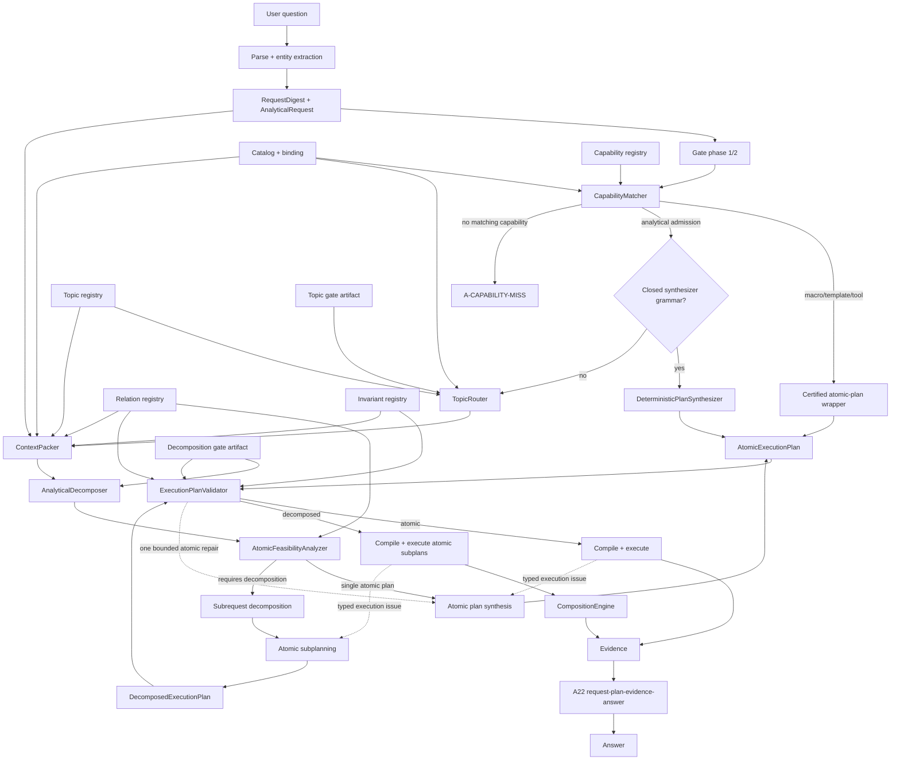
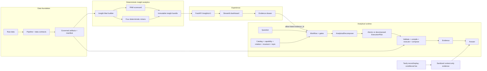

# ULTIMATE SOLUTION — IMPLEMENTATION SPECIFICATION

| Trường                     | Giá trị                                                                                                                                        |
| ---------------------------- | ------------------------------------------------------------------------------------------------------------------------------------------------ |
| Trạng thái                 | Target architecture và implementation contract                                                                                                  |
| Ngày chốt                  | 30/07/2026                                                                                                                                       |
| Baseline code                | `ef3a380`                                                                                                                                      |
| Baseline test đã ghi nhận | 326 passed                                                                                                                                       |
| Runtime hiện tại           | 83 catalog object, 10 relation, 12 IR operator                                                                                                   |
| Phạm vi                     | Correctness hardening, capability routing, topic-routed context, analytical decomposition, context harness, insight product và external context |

Tài liệu này là đầu vào kỹ thuật duy nhất cho đội triển khai. Mọi hạng mục chỉ được coi là đã có sau khi code, test và proof artifact tương ứng tồn tại. `docs/CURRENT_ARCHITECTURE_SPEC.md` chỉ được cập nhật sau khi implementation đã qua acceptance.

## 0. Bổ sung vòng 09/08 — sáu lớp lỗi đã đo

Nguồn bằng chứng: `docs/qa/BGK_20_ANALYSIS.md` (20 câu, ground truth tính bằng
pandas thuần, không import `gladiators`). Điểm khởi đầu: 2/20 trả lời đúng,
3 hiển thị số sai, 2 crash, 9 bỏ lỡ câu trả lời được.

| Lớp lỗi | Ca | Mục spec | Trạng thái |
| --- | --- | --- | --- |
| A. Entity ref là đơn vị phân tích, không phải khoá gom nhóm | bgk01, bgk02, bgk08, bgk11 | **§3.1.1** | đã hiện thực |
| B. Coverage ≠ containment; tiền đề và câu hỏi nhân quả không được kiểm | bgk13 | **§4.4** | đã hiện thực |
| C. Phép đếm thừa hưởng bộ lọc của phép đo | bgk03, bgk10 | **§4.11** | đã hiện thực |
| D. Blocker không khắc phục được phải thắng blocker khắc phục được | bgk14, bgk16 | **§4.5.1** | spec, chưa hiện thực |
| E. Ánh xạ chữ → ký hiệu | bgk05, bgk11 | **§3.2.1–3.2.2** | spec, chưa hiện thực |
| F. Chính sách trọng tài LLM | toàn bộ | **§4.12** | spec, chưa hiện thực |

Hai lớp nguy hiểm nhất là A/B/C dạng *ràng buộc bị thu hẹp im lặng*: chúng tạo
ra output **trông đúng** — một con số có evidence, một mục "Phạm vi", một mục
"Độ tin cậy: High". Crash thì ồn ào nên không thể bị bỏ qua; câu trả lời trôi
chảy và sai thì không.

Chỉ số **không được đánh đổi**: "hiển thị số sai" phải về 0. Tăng số câu trả lời
được bằng cách nới lỏng kiểm tra là đi ngược toàn bộ mục đích của kiến trúc này.
Sau mỗi thay đổi, `verifier_mutation_detection` phải giữ **1.0**; nếu nó tụt,
bản vá đã tắt một phép kiểm chứ không sửa một lỗi.

---

# 1. MỤC TIÊU VÀ RANH GIỚI

## 1.1. Mục tiêu

Hệ thống phải đáp ứng đồng thời năm yêu cầu:

1. Không trả lời bằng capability gần đúng khi measure, aggregation, grouping, scope hoặc output shape không khớp câu hỏi.
2. Analytical request ngoài macro/template hoạt động offline cho lớp ngữ pháp đóng; khi cần LLM, `AnalyticalDecomposer` chỉ lập kế hoạch trong semantic space.
3. Context gửi cho planner được chọn theo chủ đề, có budget thật và có thể đo precision/recall.
4. Câu hỏi phức hợp có thể được tách thành các atomic analytical plan, thực thi độc lập và ghép bằng operator deterministic.
5. Mọi số trả ra từ agent hoặc dashboard truy ngược được tới artifact, row key, công thức, unit, dataset version và caveat.

## 1.2. Bất biến không được phá

- LLM không sinh SQL, physical column, file path hoặc join key.
- Catalog, relation registry, metric registry, capability registry và invariant registry là các nguồn sự thật có cấu trúc.
- SQL chỉ được sinh bởi compiler deterministic và chỉ chạy qua executor read-only.
- Topic chỉ thu hẹp context; topic không cấp capability, relation, filter hoặc aggregation mới.
- Decomposer chỉ tách request và chọn composition operator trong tập đóng; từng subplan vẫn qua cùng validator/compiler/executor.
- Empty result là kết quả hợp lệ nếu plan, scope và predicate đúng; không tự nới filter để tìm dòng.
- Không trộn VND và IDR trong một phép tính tiền tệ.
- Không aggregate qua fanout nếu chưa dedupe theo relation registry.
- External context không đi vào KPI, PAM, SQL nội bộ hoặc phép tính định lượng.
- Evidence gốc bất biến; context chỉ chứa bản sao đã sanitize.

## 1.3. Mức ưu tiên

| Mức            | Ý nghĩa                                                                               |
| --------------- | --------------------------------------------------------------------------------------- |
| `MUST`        | Bắt buộc có code, test và proof artifact trước release mục tiêu                 |
| `CONDITIONAL` | Có implementation nhưng chỉ bật khi credential, network, quota và acceptance đạt |
| `DEFERRED`    | Không thuộc release mục tiêu; không được mô tả là đã triển khai           |

Release mục tiêu gồm:

- `MUST`: §4–§11, bốn insight miner, Insight API/dashboard, Tavily record/replay.
- `CONDITIONAL`: một Tavily live query đã rehearsal.
- `DEFERRED`: production auth/tenant, persistent memory, buyer-RFM, forecast, FX conversion, cross-market category crosswalk tự động, critic/n-version cho decomposed plan.

Ma trận authoritative:

| Capability                                                                       | Trạng thái release |
| -------------------------------------------------------------------------------- | -------------------- |
| Capability/Alias/Binding, Synthesizer                                            | `MUST`             |
| TopicRouter, prompt projection, ContextPacker và metrics                        | `MUST`             |
| `AnalyticalDecomposer`, bốn composition operator và canonical-signature gate | `MUST`             |
| Multi-turn state/persistent notes                                                | `DEFERRED`         |
| Bốn miner: top mover, price move, voucher gap VN, data quality                  | `MUST`             |
| Shelf-risk/assortment-gap miner                                                  | `DEFERRED`         |
| Tavily record + deterministic replay                                             | `MUST`             |
| Tavily live                                                                      | `CONDITIONAL`      |

## 1.4. Thuật ngữ chuẩn

| Thuật ngữ              | Nghĩa trong spec                                                                                                   |
| ------------------------ | ------------------------------------------------------------------------------------------------------------------- |
| Analytical path          | Request đã match`CapabilitySpec.kind="analytical"`; không phải fallback cho request chưa hiểu               |
| `AnalyticalDecomposer` | Planning service thay`OpenAnalyticalPlanner`, trả atomic hoặc decomposed `ExecutionPlan`                      |
| Atomic plan builder      | Component do Decomposer quản lý để tạo một`LogicalQueryPlan`; không có public workflow API                |
| Legacy broad context     | Compatibility context slice rộng sau analytical admission khi topic chưa đủ gate; không cấp thêm capability  |
| A19                      | Nhóm mã semantic binding/capability; message UI không lộ mã                                                    |
| A22                      | Nhóm kiểm alignment request ↔ plan/tool ↔ evidence ↔ answer                                                    |
| DR1                      | Quyết định data-rule có owner/reviewer, dùng cho sentinel/taxonomy/semantic exposure                           |
| R_post                   | Risk score sau khi đã có plan; không thay deterministic validation                                              |
| P2/P6/P8/P9/P10/P11      | Stage ID legacy trong budget/trace; tên component mới là Generate/Extract/AtomicPlan/Critic/Alternate/Adjudicate |
| Dataset version          | Hash/version immutable của tập artifact đang active và được pin cho toàn request                            |

`LogicalQueryPlan.requested_output_shape` hiện hữu thực chất là tuple output fields. API mới gọi rõ `output_fields`; `output_shape_kind` là enum scalar/ratio/ranking/... dùng trong digest và `ExecutionPlan`. Compatibility serializer giữ alias cũ một release.

## 1.5. Ownership và sign-off

| Artifact/decision                       | Owner                     | Reviewer/approver bắt buộc         |
| --------------------------------------- | ------------------------- | ------------------------------------ |
| Catalog, binding, AliasIndex            | Semantic/data engineering | Data owner + architecture            |
| Relation registry, grain, fanout/dedupe | Data engineering          | Architecture + QA                    |
| Invariant registry                      | Architecture/domain       | Data owner + QA                      |
| Capability registry                     | Product/domain            | Architecture + QA                    |
| Topic registry/prompt projection        | Architecture              | Semantic owner + QA                  |
| Sentinel/taxonomy/zero-variance DR1     | Data owner                | Domain reviewer                      |
| Eval oracle và acceptance threshold    | QA                        | Reviewer độc lập với implementer |
| Topic/decomposition gate                | Sinh tự động bởi CI   | QA + architecture sign-off           |
| External source/relevance/security      | Integration owner         | Security/legal/source owner          |
| PAM/miner formula                       | Product analytics         | Data owner + QA                      |

Mọi artifact sign-off ghi `author`, `reviewer`, `approved_at`, source/config hash và dataset version. Implementer không được tự quyết semantic/data rule còn trạng thái chờ duyệt.

DR1/data decision có stable ID, `status=pending|approved|rejected`, proposed rule, source rows/hash, owner và reviewer. Runtime/registry chỉ đọc `approved`; `pending` không được suy thành expression, capability hoặc gate enabled.

## 1.6. Phạm vi vòng 1 và khoá phạm vi triển khai

`Release mục tiêu` ở §1.3 **là** phạm vi vòng 1, không phải một kiến trúc dài hạn tách biệt. Quyết định đã chốt với đội: `AnalyticalDecomposer` (§8) và ba nền tảng nó phụ thuộc trực tiếp — `CapabilitySpec`/`CapabilityMatcher` (§3.5–3.6), `DeterministicPlanSynthesizer` (§5), `TopicRouter`/`ContextPacker` (§6–7) — **bắt buộc có code, test và proof artifact cho vòng 1, không được lùi xuống `DEFERRED` hay cắt khi thiếu thời gian.**

Điều này không mâu thuẫn với mô hình `off/shadow/enforce` ở §10: "bắt buộc có cho vòng 1" nghĩa là package đó phải đạt định nghĩa DONE của §17 (code + test + proof artifact + acceptance report), **không** bắt buộc `decomposer_mode=enforce` phải bật cho mọi signature trước ngày demo. Một signature chưa qua gate thì ở lại `shadow` — có report chứng minh oracle pass/fail, không bị xoá khỏi phạm vi. Đây là khác biệt giữa "chưa bật live" (chấp nhận được, có bằng chứng) và "chưa làm" (không chấp nhận được cho các package bị khoá dưới đây).

### Danh mục package khoá theo vòng 1

Không dùng lại số đếm 58 package của bản nháp trước — phạm vi đã đổi thật (Decomposer chuyển từ hoãn sang bắt buộc; Context Harness cũ gộp thành Topic/Context §6–7). Bảng dưới đếm lại theo đúng cấu trúc bản này, mỗi dòng là một package có thể merge/báo cáo độc lập theo §16.

| Khu vực                        | Section         | Package                                                                                                                                                                                                | Tier                       |
| ------------------------------- | --------------- | ------------------------------------------------------------------------------------------------------------------------------------------------------------------------------------------------------ | -------------------------- |
| Correctness hardening           | §4.1–4.10, P1 | 10 package (Groq/structured-output, entity 3-state, cardinality, A22 alignment, gate phase, similarity, answer fallback, sentinel, eval 3 lớp, execution-feedback/repair)                             | `DEMO-MUST`              |
| Semantic/capability foundation  | §3.1–3.8, P2  | 6 package (catalog binding, alias index, digest/atom, CapabilitySpec+matcher, A-CAPABILITY-MISS, invariant registry)                                                                                   | `DEMO-MUST`              |
| Deterministic synthesizer       | §5, P4         | 1 package (grammar + RatioSpec + oracle 30 case)                                                                                                                                                       | `DEMO-MUST`              |
| Topic-routed context            | §6–7, P5      | 5 package (TopicCard+C1–C8, taxonomy T1–T8/CORE/aspect, coverage tagging+topic_gate, router shadow, context packer+metrics)                                                                          | `DEMO-MUST`              |
| **Analytical Decomposer** | §8, P6         | **10 package** (request atomization, `AtomicFeasibilityAnalyzer`, deterministic decomposition, LLM proposal có budget, atomic subplanning, 4 composition operator riêng, decomposition gate) | **`DEMO-MUST` —** |
| Insight Mart/dashboard          | §12, P8–P11   | 8 package (bundle+manifest+builder, PAM, 4 miner, Insight API, dashboard+evidence drawer)                                                                                                              | `DEMO-MUST`              |
| Tavily                          | §13, P12       | record+replay (1)                                                                                                                                                                                      | `DEMO-MUST`              |
| Tavily                          | §13, P12       | 1 live query đã rehearsal                                                                                                                                                                            | `DEMO-CONDITIONAL`       |
| Release proof                   | P0, §11, §17  | regression lock, trace v1.2, proof pack                                                                                                                                                                | `DEMO-MUST`              |

`PROPOSAL/DEFERRED` — đã chốt ở §1.3/§7.4/§8.12, liệt lại cho rõ ranh giới, không lặp lại quyết định: multi-turn state bền/structured notes; critic/n-version cho decomposed plan; `R_pre`/plan-level metamorphic probe; key pool như bằng chứng độc lập model; shelf-risk/assortment-gap miner; production auth/tenant; buyer-RFM/forecast/FX/cross-market crosswalk tự động; capability backlog §8.12 (compare-two-listings, correlation, no-promotion group, median-by-group, promotion ID ranking) — mỗi cái cần contract riêng trước khi mở, không mở bằng `elif`.

### Nếu thời gian căng — thứ tự giảm tải trong nội bộ package đã khoá MUST

Không cắt package. Nếu một package không kịp đạt gate `enforce` trước demo, giảm tải theo thứ tự sau — mỗi bước vẫn để lại code + test + report ở `shadow`, không xoá:

1. Trong 4 composition operator của Decomposer, ưu tiên đưa `side_by_side` lên `enforce` trước — đây là operator không tính toán chung nên rủi ro thấp nhất và theo dữ liệu đo thử trước đó (~87 case có tag semantic ref), phần lớn câu hỏi 2-topic thật sự thuộc dạng trình bày cạnh nhau. `join_on_relation` và `filter_then_measure` phức tạp hơn (cardinality, deferred predicate) nên xếp cuối hàng đợi `enforce`, nhưng contract/test/adversarial case của cả bốn vẫn phải tồn tại và xanh ở mức atomic/shadow — không được thiếu bất kỳ operator nào trong proof pack.
2. Trong Topic-routed context, bật `enforce` cho topic đạt gate trước (per-topic, đúng §10 R3–R4); topic chưa đạt ở lại broad-context fallback đã admit — vẫn đúng hành vi §6.1, không phải lỗi.
3. Tavily live (`DEMO-CONDITIONAL`) là hạng mục duy nhất được lùi hẳn về cache-replay nếu preflight không đạt, theo đúng §13.1/§13.5 — không cần quyết định thêm.

Không có bậc giảm tải nào áp dụng cho 10 package Correctness hardening (§4) hoặc 6 package Semantic foundation (§3) — đây là điều kiện tiên quyết để mọi package khác chạy đúng, không có chế độ `shadow` tương đương.

---

# 2. KIẾN TRÚC ĐÍCH



Thứ tự bắt buộc:

```text
parse
  → normalize + digest
  → gate capability/data-scope
  → CapabilityMatcher
  → deterministic template/synthesizer hoặc analytical path
  → TopicRouter chỉ trong analytical path
  → AnalyticalDecomposer thay thế OpenAnalyticalPlanner
  → atomic feasibility trong Decomposer
  → atomic plan hoặc decomposed execution plan
  → validate request coverage + plan + composition
  → execute read-only
  → compose deterministic
  → build Evidence
  → A22 evidence/answer alignment
  → final fail-closed
```

Topology runtime và product:



## 2.1. Request state machine

```text
RECEIVED
  → DIGESTED
  → ADMITTED
  → ROUTED
  → CONTEXT_PACKED
  → ATOMIC_FEASIBLE | DECOMPOSITION_PROPOSED
  → PROPOSAL_VALIDATED            # decomposed only
  → SUBPLANS_PLANNED              # decomposed only
  → EXECUTION_PLAN_VALIDATED
  → EXECUTING
  → COMPOSING                     # decomposed only
  → EVIDENCE_ALIGNED
  → COMPLETED

mọi state → FAILED_CLOSED
```

- Không resume giữa request trong release này; intermediate frame chỉ ở memory.
- Persist trace đã sanitize, accepted ExecutionPlan/hash và Evidence; không persist raw prompt/full question.
- Idempotency key nội bộ = hash của request + dataset + planner + config + registry/gate versions.
- Repository pin một dataset version cho toàn request; kiểm lại trước query đầu và trước composition.
- `all_or_nothing` không publish partial frame. `explicit_partial` chỉ hợp lệ khi `RequestDigest.allow_partial=true`; mặc định `false`.
- Cùng idempotency key đang chạy trong cùng process thì caller join/wait tới request timeout; completed accepted result được reuse. Cùng client key nhưng khác canonical request hash trả 409 conflict. Không hứa reuse qua restart.
- Cancellation/timeout dừng scheduling subplan mới, cố interrupt executor nếu adapter hỗ trợ, hủy mọi unpublished frame/Evidence và ghi terminal event. Timeout không tự retry hoặc nới scope.
- Accepted ExecutionPlan/Evidence được giữ trong trace/proof artifact theo retention của run; release không có durable online result store.

Terminal behavior:

| Code                                                                   | Action                                              | Retry                                                                                       |
| ---------------------------------------------------------------------- | --------------------------------------------------- | ------------------------------------------------------------------------------------------- |
| `CAPABILITY_MISS`                                                    | `clarify` với bốn phần §3.6                   | chỉ sau khi user đổi/bổ sung yêu cầu                                                  |
| `CONTEXT_BUDGET_UNSATISFIED`                                         | per-request abstain                                 | sau thay request/config; chỉ degrade health nếu hard block hệ thống luôn vượt budget |
| `DECOMPOSITION_GATE_DISABLED`                                        | shadow hoặc structured abstain theo mode           | không tự fallback capability                                                              |
| `DECOMPOSITION_INVALID` / `PLAN_INVALID` / `COMPOSITION_INVALID` | bounded repair nếu issue cho phép, rồi abstain   | tối đa budget §4.10                                                                      |
| `DATASET_VERSION_MISMATCH`                                           | fail-closed, HTTP 503 ở service boundary           | sau reload bundle/runtime                                                                   |
| `EXECUTION_FAILED`                                                   | typed repair nếu eligible, nếu không fail-closed | theo §4.10                                                                                 |
| `EVIDENCE_ALIGNMENT_FAILED`                                          | không generate answer                              | không retry bằng nới scope                                                               |

`/ask` trả HTTP 200 cho outcome nghiệp vụ `clarify|abstain|block` trong typed response; request/schema sai trả 422; dependency/version unavailable trả 503; lỗi nội bộ không phân loại trả 500 đã redact.

## 2.2. Lifecycle event

Release không thêm event bus/queue. Lifecycle event là append-only trace record:

```python
class PlanningEvent(BaseModel):
    schema_version: Literal["planning-event.v1"] = "planning-event.v1"
    event_id: str
    trace_id: str
    sequence: int
    event_type: Literal[
        "capability.matched", "context.packed", "decomposer.started",
        "decomposition.proposed", "subplan.planned",
        "execution_plan.validated", "subplan.executed",
        "composition.completed", "evidence.aligned",
        "request.completed", "request.failed",
    ]
    request_hash: str
    execution_plan_id: str | None = None
    subplan_id: str | None = None
    dataset_version: str
    payload: dict[str, Any]
    payload_hash: str
```

`sequence` tăng đơn điệu trong trace; payload qua sanitizer và không chứa secret, raw provider body, full question hoặc physical path.

---

# 3. CONTRACT NỀN

## 3.1. Catalog binding

Mở rộng `CatalogObject` trong `src/gladiators/domain/catalog.py`:

```python
BindingKind = Literal[
    "column",
    "expression",
    "aggregate",
    "tool_computed",
    "context_only",
    "unavailable",
]

@dataclass(frozen=True)
class CatalogObject:
    # các field bắt buộc hiện hữu
    # chèn binding trước các field có default như source_tier
    binding: BindingKind
    anchor_entity: str | None = None
    expression_id: str | None = None
    aggregate_op: str | None = None
    computed_by: str | None = None
```

Ý nghĩa:

| Binding           | Contract                                                                           |
| ----------------- | ---------------------------------------------------------------------------------- |
| `column`        | Có physical mapping thật; cột tồn tại trong artifact                          |
| `expression`    | Biểu thức deterministic trên cột cùng grain; expression nằm trong allow-list |
| `aggregate`     | Cần Aggregate/DeriveMetric đúng grain; không giả làm physical column         |
| `tool_computed` | Có handler thật trong tool registry; không compile SQL                          |
| `context_only`  | Không bao giờ vào`LogicalQueryPlan`                                           |
| `unavailable`   | Không được đưa vào AtomicPlan context hoặc synthesizer                     |

CI phải fail khi:

- `column` không có physical mapping hoặc cột không tồn tại;
- `expression` thiếu expression handler;
- `aggregate` thiếu valid aggregation/input-output grain;
- `tool_computed` trỏ handler không tồn tại;
- `context_only` hoặc `unavailable` xuất hiện trong SQL plan;
- relation cần thiết không có đường hợp lệ hoặc fanout không có dedupe strategy.

### 3.1.1. Vai trò phân tích — trục trực giao với `BindingKind`

`BindingKind` trả lời *"ref này lấy giá trị từ đâu"*. Nó không trả lời *"ref này
đóng vai gì trong một câu hỏi"*, và spec bản đầu không có value nào cho vai
"chỉ định danh đơn vị phân tích". Khoảng trống đó là nguyên nhân gốc của
`CompilationError` ở bgk02/bgk11 (`docs/qa/BGK_20_ANALYSIS.md` §4).

```python
AnalysisRole = Literal[
    "physical_dimension",   # chia kết quả; BẮT BUỘC có cột vật lý
    "analysis_unit",        # định danh một dòng là gì; đếm được, không gom nhóm được
    "computed_value",       # đại lượng đo hoặc dẫn xuất
    "context_only",         # không bao giờ vào LogicalQueryPlan
]
```

Hai trục **trực giao**, không thay thế nhau. `derived.product_count` là
`binding=aggregate` (cách lấy giá trị) **và** `counts_unit=entity.product_listing`
(đếm đơn vị nào). `entity.shop` là `analysis_unit` **và** có cột `shop_id`, nên
vừa gom nhóm được vừa đếm được — hai năng lực độc lập:

| Năng lực | Điều kiện | Ví dụ |
| --- | --- | --- |
| Gom nhóm (`GROUP BY`) | `physical` khác rỗng | `entity.shop` được, `entity.product_listing` không |
| Đếm phân biệt | `counting_key` khác rỗng | cả hai đều được |

`answerability` giữ nguyên nghĩa cũ; trục mới là additive. Việc dùng chung một
trục cho cả hai vai là lý do 10 entity ref tự khai `exposed_as_dimension` trong
khi không có gì để `GROUP BY`.

Ba tầng phải hỏi **cùng một câu hỏi**, nếu không chúng sẽ bất đồng đúng như
trước: catalog kiểm lúc build (`CatalogError`, eager tại import, cùng convention
C1–C8 của topic registry); `validate_plan` trả issue `non_physical_grouping`
(rule_id `A19-PLAN-GROUPING`); compiler tra `counting_key` thay vì so tên ref.
Trước đây chỉ compiler đối chiếu với thực tế, và nó làm việc đó bằng exception.

Mỗi đơn vị đếm được có đúng một count metric (`counts_unit` trỏ ngược về entity).
Không đặc cách theo tên ref trong compiler — thêm một đơn vị đếm được là sửa
catalog, không phải thêm nhánh `if`.

Migration catalog không được suy binding chỉ từ việc `physical` rỗng hay không:

| Nhóm                                                                                                   | Phân loại bắt buộc                                                                                         |
| ------------------------------------------------------------------------------------------------------- | -------------------------------------------------------------------------------------------------------------- |
| `derived.product_count`, `derived.median_monthly_sold`, `derived.median_estimated_recent_revenue` | `aggregate`; không giả làm cột                                                                           |
| Similarity family, voucher-profile family,`derived.descriptive_gap_vs_baseline`                       | `tool_computed` với `computed_by` trỏ handler thật                                                      |
| `context.campaign_window`, `context.market_event`, `context.theme_day`                            | `context_only`                                                                                               |
| `derived.has_promo`, `derived.has_voucher_label`, `derived.discount_bucket`                       | DR1 chọn`expression` với dependency đã chứng minh hoặc `unavailable`; không để trạng thái ngầm |

Mỗi binding SQL-bound phải khai và kiểm đồng thời:

- source/artifact hợp lệ cho operator dự kiến;
- physical dependency hoặc expression handler;
- input/output grain;
- time semantics (`per_snapshot`, `transition`, `static_latest`);
- aggregation và filter allow-list;
- relation path, direction, fanout và dedupe khi đi qua source khác.

Migration phải xuất `artifacts/.../catalog_binding_inventory.json` chứa toàn bộ ref, binding, handler/dependency, kết quả schema probe và reason cho `unavailable`. Không được bật Capability/Topic cho ref chưa có kết quả inventory `pass`.

## 3.2. Alias index

`CatalogObject.aliases` là nguồn NL binding duy nhất.

- Xóa `DeterministicSemanticParser.MEASURES` và `.DIMENSIONS`.
- Build `AliasIndex` lúc startup từ catalog.
- Mỗi object được expose phải có alias tiếng Việt và ít nhất một alias tiếng Anh hoặc Bahasa.
- Cùng surface, cùng độ ưu tiên nhưng trỏ nhiều ref phải trả ambiguity; không dùng thứ tự tên ref để chọn.
- TopicCard không được chứa trigger lexicon riêng.

`AliasIndex` lưu ít nhất `{normalized_surface, ref, source_alias, language}` và có `index_hash`. Normalizer dùng chung cho parse, topic fallback và eval: Unicode normalize, case-fold, fold dấu theo policy hiện hữu, chuẩn hóa khoảng trắng; không stem hoặc dịch tự động.

Bootstrap migration phải làm giàu alias Việt/Bahasa cho ít nhất các measure đang chỉ có tên kỹ thuật: cancellation/response rate-time, image/rating/like/follower/variation count, shop-category total, discount percent và voucher minimum spend. Acceptance dựa trên NL fixture, không dựa vào việc alias tiếng Anh tự sinh tồn tại.

Thứ tự match:

1. canonical semantic ref;
2. exact normalized alias;
3. exact value trong `value_index`;
4. fuzzy candidate discovery trong catalog đã eligible.

Fuzzy score không được tự phá hòa. Nếu top candidates khác ref cùng priority và margin dưới ngưỡng config, parser trả typed ambiguity với candidate refs; CapabilityMatcher chưa được chạy. Không còn priority ngầm giữa seed hard-code và catalog vì seed hard-code bị xóa.

Không nhận diện được ref trả `A19-CAT-UNMAPPED`; nhận diện được nhưng binding `unavailable` trả `A19-CAT-UNBOUND`. Hai reason có trace/blocker và message nghiệp vụ riêng.

### 3.2.1. Hai bộ máy khớp alias đang tồn tại song song — nợ kiến trúc

Yêu cầu "Xóa `DeterministicSemanticParser.MEASURES` và `.DIMENSIONS`" ở trên
**chưa xảy ra**. Thực tế đo được trong code hiện tại: có **hai** bộ máy khớp
alias độc lập, thuật toán gần giống nhưng không giống hẳn.

| Bộ máy | File | Ai tiêu thụ | Ảnh hưởng câu trả lời? |
| --- | --- | --- | --- |
| `AliasIndex.find_in` | `domain/alias_index.py` | `TopicRouter._alias_fallback` | **Không** — routing đang shadow |
| `DeterministicSemanticParser._link` | `planner/semantic_parser.py` | mọi request | **Có** |

Cộng thêm nguồn thứ ba: `DeterministicSemanticParser.MEASURES/DIMENSIONS` vẫn
là danh sách hard-code, vẫn được tra **trước** `CatalogObject.aliases`
(seed priority 0 so với 1).

Hệ quả đã đo: bug `"giá trị"` → `measure.price` được vá ad-hoc bằng một regex
`\bgia tri\b` **chỉ trong `_link`**, và vẫn còn sống nguyên trong
`AliasIndex.find_in` — cùng một lỗi, vá một nơi. Đây chính là cơ chế mà §3.2 nói
tới khi cấm TopicCard có trigger lexicon riêng: hai từ vựng cho một khái niệm
thì trôi khỏi nhau.

**Lộ trình dọn cần người quyết**, không tự ý làm trong một bản vá lỗi: hợp nhất
về một binder, xoá seed hard-code, và giữ `index_hash` là thứ duy nhất đi vào
prompt/cache version.

### 3.2.2. Khớp một phần của cụm dài hơn là lỗi, không phải fallback

Longest-match hiện chỉ chặn được cụm con khi cụm dài hơn **có trong index**
(`consumed` accumulator). Không tầng nào xử lý ca ngược lại: cụm dài hơn xuất
hiện trong câu nhưng **không có trong index**. Khi đó surface ngắn nằm bên trong
nó vẫn khớp, âm thầm.

Đo được:

```
lookup("giảm giá")            → None            ← không phải alias
lookup("giá")                 → measure.price
find_in("... listing giam gia tren 50% ...") → gia → measure.price
```

Hệ quả kép: khái niệm *giảm giá* biến mất khỏi request, và `measure.price` bị
liên kết dù người dùng không hỏi về giá. A22 sau đó chặn đúng theo luật của nó —
nó đang bảo vệ một measure mà chính khâu parse gán nhầm (bgk05).

Yêu cầu:

- Bổ sung alias cho các cụm nghiệp vụ đang thiếu, lấy `business-dictionary.md`
  làm nguồn thuật ngữ. **Lưu ý**: file đó là data contract bằng văn xuôi, không
  phải bảng alias — không có tương ứng 1:1 với `CATALOG`, và không script nào
  đang đọc nó. Chỉ lấy cụm có mặt thật trong đó, không tự nghĩ từ mới.
- Một surface **không được** khớp khi nó là substring của một cụm dài hơn cũng
  xuất hiện trong câu và cụm đó bind sang ref khác. Nếu cụm dài hơn không có
  trong index, đó là **alias gap** — phải báo được, không âm thầm khớp phần con.
- Đo lại độ phủ trên toàn corpus sau khi sửa (`scripts/build_alias_coverage.py`,
  `scripts/build_topic_gate.py`) và ghi số vào commit. Tiền lệ: `topic_scoped`
  35.6% → 72.3% sau một vòng vá alias.

Guard này có phạm vi hẹp có chủ đích — một danh sách tường minh các cụm ghép đã
gây lỗi thật (`giá trị`, `giảm giá`, `đánh giá` dạng động từ) — chứ không phải
một bộ tách từ tổng quát. Nói rõ giới hạn thay vì để người sau tưởng nó tổng quát.

CI sinh `alias_coverage.json` và fail khi:

- exposed object thiếu alias bắt buộc;
- hai alias collision nhưng không có ambiguity fixture;
- alias trỏ ref không tồn tại hoặc `unavailable` nhưng không trả `A19-CAT-UNBOUND`;
- NL fixture coverage dưới 90% object exposed;
- `AliasIndex.index_hash` không được đưa vào prompt/cache version.
- `DeterministicSemanticParser.MEASURES/DIMENSIONS` hoặc keyword `if/elif` mới gán capability tái xuất hiện.

## 3.3. RequestDigest

Mở rộng `RequestDigest` trong `agent/context.py` bằng field optional có default:

```python
OutputShape = Literal[
    "scalar", "ratio", "ranking", "comparison",
    "table", "list", "description",
]

FilterScalar = str | int | float | bool
FilterOp = Literal[
    "eq", "ne", "in", "lt", "lte", "gt", "gte", "between", "is_null",
]

class DigestFilter(BaseModel):
    ref: str
    op: FilterOp
    values: tuple[FilterScalar, ...]

class RequestDigest(BaseModel):
    # field hiện hữu
    date_range: tuple[str, ...] = ()
    requested_output_shape: OutputShape | None = None
    requested_grouping: tuple[str, ...] = ()
    requested_aggregation: str | None = None
    requested_filters: tuple[DigestFilter, ...] = ()
    analytical_operators: tuple[str, ...] = ()
    compound_part_ids: tuple[str, ...] = ()
    entity_count: int = 0
    allow_partial: bool = False
```

Digest phải giữ xuyên suốt:

- countries;
- date start/end;
- entity count và entity IDs;
- measures;
- dimensions/grouping;
- aggregation;
- filters;
- output shape;
- analytical operators;
- từng phần của câu phức hợp.

Digest là immutable request source of truth:

- dựng đúng một lần sau normalize/semantic binding;
- `digest_hash` là SHA-256 của canonical JSON, không gồm timestamp;
- mọi stage nhận cùng `digest_hash`, không tự suy lại country/date/shape từ raw text;
- field mới có default để đọc trace cũ; writer mới luôn ghi `digest_schema_version`;
- country/date được chuẩn hóa thành scope đầy đủ, không có tham số `country` song song ở API mới;
- `requested_output_shape=None` nghĩa là người dùng không yêu cầu shape tường minh, không có nghĩa là `scalar`; matcher chỉ dùng shape để chặn khi đã suy chắc chắn.
- `allow_partial` chỉ được bật từ explicit user intent bằng deterministic cue/structured API field; LLM không được tự bật.

Canonical filter operator dùng `lte|gte|is_null`; compatibility parser map đúng một lần `le→lte`, `ge→gte`, `isnull→is_null` trước khi hash. `AnalyticalPredicate`, `DigestFilter`, Capability filter và IR Predicate không được duy trì bốn tên operator khác nhau.

Shape inference deterministic:

| Cue đã normalize                                            | Shape/contract                                  |
| ------------------------------------------------------------- | ----------------------------------------------- |
| `tỷ lệ`, `phần trăm`, `share`, `persentase`       | `ratio`                                       |
| `bao nhiêu`, `how many`, `berapa`                      | `scalar` nếu không có grouping/ranking cue |
| `nào ... nhất`, `top`, `xếp hạng`, `rank`         | `ranking`                                     |
| `so với`, `so sánh`, `vs`, `compare`, `dibanding` | `comparison`                                  |
| `theo X`, `by X`, `per X`                               | `table` và `grouping=X`                    |
| `những ... nào`, `liệt kê`, `list`, `daftar`      | `list`                                        |

Cue được áp dụng sau semantic binding; ranking/comparison/grouping thắng scalar cue chung. Hai cue cụ thể tạo contract không tương thích phải trả shape ambiguity, không dùng thứ tự regex để chọn. Fixture phải phủ Việt/Anh/Bahasa. `AnalyticalRequest.language` và `RequestDigest.language` mở rộng thành `vi|en|id|unknown`; `requested_output_shape` của `AnalyticalRequest` dùng cùng `OutputShape`.

Ratio chỉ hợp lệ khi plan/evidence có tử số, mẫu số và unit `percent`. Grouping được hỏi phải tồn tại trong output schema và Evidence attrs.

## 3.4. Request atom

Decomposer và A22 dùng một representation chung để chứng minh không làm rơi yêu cầu:

```python
AtomKind = Literal[
    "measure", "dimension", "filter", "country", "date",
    "entity", "aggregation", "operator", "output_shape_kind", "compound_part",
]

class RequestAtom(BaseModel):
    atom_id: str
    kind: AtomKind
    semantic_ref: str | None = None
    value: FilterScalar | tuple[FilterScalar, ...] | None = None
    shareable: bool = False
```

Quy tắc:

- Country/date scope có thể `shareable=True` và xuất hiện ở nhiều subrequest.
- Mỗi atom không shareable phải thuộc đúng một subrequest.
- Mọi atom bắt buộc phải được phủ bởi atomic plan hoặc composition.
- Không được coi topic ID là request atom; topic chỉ là metadata định tuyến.
- `atom_id` sinh từ kind + semantic ref + canonical value hash; không dùng UUID/time.
- Trace view của filter/atom có thể hash/redact literal nhạy cảm, nhưng planner/executor dùng typed value trong request-scoped memory; không persist raw PII.

## 3.5. CapabilitySpec

`CapabilitySpec` thay thế `CertifiedShape` và là nguồn để build `IntentRegistry`; không tồn tại ba registry song song.

```python
class CapabilityFilterSpec(BaseModel):
    ref: str
    allowed_ops: frozenset[str]
    required: bool = False

class CapabilitySpec(BaseModel):
    capability_id: str
    kind: Literal["macro", "template", "analytical", "tool", "insight"]
    produces_shape: OutputShape
    produces_grain: str
    required_measures: frozenset[str] = frozenset()
    optional_measures: frozenset[str] = frozenset()
    allowed_grouping: frozenset[str] = frozenset()
    required_grouping_count: int = 0
    allowed_aggregations: frozenset[str] = frozenset()
    allowed_filters: tuple[CapabilityFilterSpec, ...] = ()
    required_slots: frozenset[str] = frozenset()
    scope_predicates: frozenset[str] = frozenset()
    forbidden_qualifiers: frozenset[str] = frozenset()
    cue_terms: tuple[str, ...] = ()
    tool_plan: tuple[str, ...] = ()
    macro_name: str | None = None
    output_field_refs: tuple[str, ...] = ()
```

`match(digest, spec)` trả `MatchResult(score, blockers, missing_slots)`.

```python
class CapabilityBlocker(BaseModel):
    code: Literal[
        "shape", "measure", "measure_missing", "grouping",
        "grouping_missing", "aggregation", "filter", "qualifier", "scope",
    ]
    requested: tuple[str, ...] = ()
    supported: tuple[str, ...] = ()

class MatchResult(BaseModel):
    capability_id: str
    eligible: bool
    score: int
    score_breakdown: dict[str, int]
    blockers: tuple[CapabilityBlocker, ...] = ()
    missing_slots: tuple[str, ...] = ()
```

Blocker bắt buộc:

- output shape đã suy chắc chắn nhưng không khớp;
- request có measure ngoài `required ∪ optional`;
- `required_measures` không phải subset của request;
- grouping ngoài allow-list hoặc thiếu grouping bắt buộc;
- aggregation không được phép;
- filter ref/operator ngoài `allowed_filters`;
- qualifier bị cấm;
- scope predicate không tương thích.

Thiếu slot là `clarify`, không phải lý do chọn capability khác.

Quy tắc chọn:

1. Loại mọi spec có blocker.
2. Ưu tiên spec cụ thể `macro|template|tool|insight` theo score; không có spec cụ thể thì xét spec `analytical`.
3. `analytical` hợp lệ: thử `DeterministicPlanSynthesizer`; ngoài grammar chuyển `AnalyticalDecomposer`.
4. Không có spec `analytical` hợp lệ: `A-CAPABILITY-MISS`.
5. Hòa điểm: cue term chỉ phá hòa sau blocker filtering.
6. Vẫn hòa: clarify; không tự chọn.

Các bất biến matcher:

- Digest có tập measure rỗng không được khớp spec có `required_measures` khác rỗng.
- `cue_terms` không được cộng điểm để cứu một spec có blocker.
- Match là hàm thuần; không đọc artifact, gọi tool hoặc gọi provider.
- Mọi macro, template, synthesizer, tool và insight route đều qua cùng matcher trước side effect.
- `CapabilitySpec` là bản migrate duy nhất của `CertifiedShape`; `IntentRegistry` được build từ cùng registry, không tồn tại bản sao.
- Registry build fail nếu macro/tool/handler được tham chiếu không tồn tại, output grain không hợp lệ hoặc spec không có fixture đúng và fixture chứa cue nhưng sai contract.
- `capability_registry_hash` đi vào trace, gate artifact và cache key.

## 3.6. A-CAPABILITY-MISS

Matcher chỉ xử lý semantic contract. Data availability dùng snapshot đã tính trước, không để matcher đọc artifact:

```python
class AvailabilityResult(BaseModel):
    available: bool
    blockers: tuple[Literal[
        "data_absent", "zero_variance", "binding_unavailable",
        "formula_not_approved", "dataset_scope_missing",
    ], ...] = ()
    profile_version: str
    dataset_version: str

class CapabilityDecision(BaseModel):
    match: MatchResult
    availability: AvailabilityResult
    eligible: bool
    decision_blockers: tuple[str, ...]
```

Response deterministic gồm bốn phần:

1. Hệ thống đã nhận diện measure/grouping/shape nào.
2. Blocker thật: thiếu dữ liệu, zero variance, unavailable binding hoặc chưa có phép tính duyệt.
3. Một đến ba câu hỏi gần nhất làm được, sinh từ CapabilitySpec.
4. Dữ liệu hoặc quyết định cần bổ sung để mở năng lực.

Reason phải lấy từ `CapabilityDecision.decision_blockers`, không suy lại bằng rule/template riêng. Gợi ý gần nhất chỉ được sinh từ spec khả dụng bằng cách nới đúng một trục; ưu tiên measure cùng grain và không gợi ý capability có blocker dữ liệu.

## 3.7. Versioning, identity và compatibility

Mọi contract ghi ra trace/artifact phải có `schema_version`. Writer mới:

- chỉ thêm field optional có default trong cùng major;
- tăng major khi đổi nghĩa, discriminator hoặc field bắt buộc;
- không đổi tên/xóa field trong compatibility window một release;
- canonicalize JSON bằng UTF-8, sort key, separator ổn định và loại timestamp trước khi hash.

ID/hash:

| Giá trị             | Nguồn canonical                                                              |
| --------------------- | ----------------------------------------------------------------------------- |
| `digest_hash`       | normalized`RequestDigest`                                                   |
| `request_hash`      | digest hash + dataset version + execution-context/config/registry/gate hashes |
| `execution_plan_id` | request hash + canonical ExecutionPlan content, không UUID/time              |
| `plan_hash`         | canonical`LogicalQueryPlan`                                                 |
| `context_hash`      | item payload sau guard/pack + source hashes                                   |
| Evidence ID           | dataset version + execution/subplan ID + stable row/field key                 |

Reader phải kiểm discriminator/version trước khi dùng, bỏ qua field lạ cùng major và fail typed error với major không hỗ trợ. Không được deserialize lỗi rồi rơi về legacy broad planner.

## 3.8. Invariant registry

`src/gladiators/domain/invariants.py` là nguồn duy nhất cho rule xuyên topic:

```python
class InvariantSpec(BaseModel):
    invariant_id: str
    version: str
    severity: Literal["hard", "warning"]
    applies_to: tuple[Literal[
        "request", "plan", "composition", "execution", "evidence", "answer",
    ], ...]
    semantic_refs: tuple[str, ...] = ()
    operators: tuple[str, ...] = ()
    validator_id: str
    message_key: str
    owner: str
```

- `validator_id` trỏ deterministic handler thật; `message_key` trỏ message catalog/prompt renderer, không chứa rule prose thứ hai trong TopicCard.
- Caveat/trap hiện hữu được map sang invariant ID versioned; không parse prose để quyết định.
- Build fail khi ID trùng, ref/operator/handler/message không tồn tại, hard invariant không có negative fixture hoặc topic tham chiếu invariant chưa có.
- `invariant_registry_hash` đi vào context hash, topic/decomposition gate, ExecutionPlan validation trace và proof pack.
- Critic không được hạ severity, bỏ qua hoặc “sửa” hard invariant.

---

# 4. CORRECTNESS HARDENING — MUST

## 4.1. Structured output và Groq 400

Sửa `agent/llm.py`:

- Giữ error body đã redact tối đa 500 ký tự trong telemetry.
- Phân loại `schema_rejected`, `param_rejected`, `payload_too_large`, `unknown_400`.
- Ưu tiên `body.error.param`, `body.error.code`, HTTP status; string matching chỉ là fallback.
- Retry `reasoning_effort` đúng một lần khi provider từ chối field đó.
- Adapter strict schema duyệt đệ quy:
  - mọi object có `additionalProperties=false`;
  - mọi property nằm trong `required`;
  - optional nghiệp vụ dùng nullable union;
  - không xóa constraint nếu error body chưa chứng minh provider từ chối.
- Mọi provider path phải chạy local Pydantic validation trước planner/validator.
- Ghi model, purpose, structured path, schema hash, prompt/context size.

Thêm `scripts/debug_groq_400.py`; không sửa schema theo giả thuyết trước khi script thu được error detail.

Error extractor đọc `exc.body` trước, rồi `exc.response.text`; cùng sanitizer với cassette, tối đa 500 ký tự đã redact. Retry `reasoning_effort` phải bỏ field bị provider từ chối, không chỉ đổi giá trị.

Typed failure:

```python
class ProviderCallError(BaseModel):
    category: Literal[
        "schema_rejected", "param_rejected",
        "payload_too_large", "rate_limited", "unknown_provider_error",
    ]
    provider: str
    model: str
    purpose: str
    http_status: int | None = None
    provider_code: str | None = None
    provider_param: str | None = None
    redacted_detail: str | None = None
    retryable: bool = False
```

Structured path nằm trong typed model capability config, không suy chỉ từ tên model:

```text
strict_json_schema
  → json_schema_non_strict
  → json_object
  → schema_in_prompt
```

Chỉ chuyển sang path kế tiếp khi error có cấu trúc chứng minh path hiện tại không hỗ trợ; mỗi path tối đa một attempt và toàn bộ chuỗi chịu call budget của request. Mọi output của mọi path phải qua cùng Pydantic model rồi mới vào Decomposer/validator. `debug_groq_400.py` chạy riêng các purpose `parse_intent`, `decomposition_proposal`, `atomic_plan`, `plan_critic`, `generate` và in model, path, schema hash, payload size, error đã redact.

## 4.2. Entity extraction và resolution

Sửa `agent/entity_extract.py`, `entity_resolution.py`, `tool_dispatch.py`:

- Stop boundary cho phần nguyên nhân, thời gian, giá, dự báo, phủ định, competitor.
- Soft guard 8 token; quoted ID/name không bị cắt mù.
- Controlled suffix trim chỉ tại boundary đã duyệt và chỉ nhận khi resolver score/margin tăng đủ.
- Ba trạng thái:
  - `not_found`;
  - `invalid_extraction`;
  - `ambiguous_broad` kèm top-3 `{name, shop, listing_key}`.
- Không auto-pick listing bán chạy nhất.
- Competitor cue không hỏi giá ngoài sàn đi `similar_product`; competitor price đi external unsupported.

Extraction precedence: listing key → ID có noun → số 9–14 chữ số → quoted name → free text. Stop lexicon versioned phải phủ nhóm nguyên nhân, thời gian, giá, dự báo, phủ định và competitor, gồm các biến thể `vì sao/tại sao`, `bao nhiêu`, `dự báo`, `giá/price/harga`, `tăng/giảm`, `so với`, `đối thủ/cạnh tranh`, `tuần/tháng/ngày/snapshot`. Controlled trim chỉ tại stop-token, dấu câu phân cách hoặc quote boundary; cấm progressive n-gram trim.

```python
class ResolutionCandidate(BaseModel):
    entity_id: str
    display_name: str
    shop_name: str | None = None
    listing_key: str | None = None
    score: float
    score_breakdown: dict[str, float]

class EntityResolutionResult(BaseModel):
    state: Literal["resolved", "not_found", "invalid_extraction", "ambiguous_broad"]
    extracted_text: str
    normalized_text: str
    candidates: tuple[ResolutionCandidate, ...] = ()
    top1_score: float | None = None
    top2_score: float | None = None
    margin: float | None = None
    resolution_source: str
```

Threshold, minimum margin và suffix-trim gain nằm trong typed config. Bootstrap: không trích được span → `not_found`; có span nhưng không có candidate hoặc `top1_score <0.50` → `invalid_extraction`; `top1_score >=0.50` nhưng `margin <0.05` → `ambiguous_broad`; còn lại mới `resolved`. Sau đó hiệu chỉnh bằng fixture. Không hard-code threshold trong message. Trace giữ span, score breakdown và margin, nhưng UI chỉ hiển thị message nghiệp vụ. Cue competitor phải có fixture vi/en/id; price cue trong cửa sổ ±5 token không được route `similar_product`.

## 4.3. Expected cardinality

Trong `query_ir.py` export:

```python
CARDINALITY_GRAMMAR = r"^(<=)?\d+$"
```

- `"single" → "1"`.
- `"many"/"multiple"` chỉ đổi thành `<=N` khi node có `limit=N`.
- Không đổi ngầm thành `<=10000`.
- Prompt và validator feedback dùng cùng constant.
- Schema error không lộ ra UI.
- Normalization chạy tại `PlanNode.model_validator(mode="before")`; ghi `original_cardinality`, `normalized_cardinality`, `cardinality_coerced` vào planning meta.
- Unbounded alias trả structured validation issue cho bounded repair; không sửa trực tiếp payload của model.

## 4.4. A22 country/date/tool alignment

- `RequestDigest.date_range` lấy từ `StructuredRequest.date_range`.
- Thêm issue:
  - `country_dropped`;
  - `date_range_narrowed`;
  - `aggregation_mismatch`;
  - `grouping_dropped`;
  - `filter_dropped`;
  - `composition_mismatch`;
- `decomposition_part_dropped`.

Stable outward codes:

| Condition                               | Code                                                                   |
| --------------------------------------- | ---------------------------------------------------------------------- |
| country/entity scope thiếu hoặc thừa | `A22-ALIGN-COUNTRY`, `A22-ALIGN-ENTITY`                            |
| date/range/temporal pair sai            | `A22-ALIGN-DATE`                                                     |
| measure/aggregation/filter sai          | `A22-ALIGN-MEASURE`, `A22-ALIGN-AGGREGATION`, `A22-ALIGN-FILTER` |
| output shape/grouping sai               | `A22-ALIGN-SHAPE`, `A22-ALIGN-GROUPING`                            |
| compound part/composition thiếu        | `A22-ALIGN-COMPOSITION`                                              |
| unit/ratio component sai                | `A22-ALIGN-UNIT`, `A22-ALIGN-RATIO`                                |
| câu hỏi nguyên nhân bị trả bằng một con số | `A22-ALIGN-SHAPE` (`causal_question_unanswered`)              |
| tiền đề chiều biến động trái dữ liệu | `A22-ALIGN-PREMISE` (`premise_contradicted`)                     |

#### Coverage, không phải containment

Nhánh snapshot của kiểm ngày hỏi *"evidence có nằm TRONG cửa sổ không"*; câu hỏi
đòi *"evidence có PHỦ cửa sổ không"*. Một snapshot cuối kỳ **luôn** nằm trong
cửa sổ chứa nó, nên điều kiện đó không bao giờ bắt được việc thu hẹp cửa sổ.
Nhánh transition ngay bên dưới đã so `min/max` của span với cửa sổ đã hỏi — hai
nhánh giờ dùng **cùng một** phép so, không phải khái niệm thứ ba. Cả hai vẫn
phát cùng mã `date_range_narrowed`.

#### Ràng buộc do chính câu hỏi mang theo

Hai lỗi dưới đây là thuộc tính của **request**, không của plan hay evidence, nên
chúng được kiểm ở biên pre-answer nơi digest + evidence + answer cùng có mặt:

- **Câu hỏi nguyên nhân** (`vì sao`, `tại sao`, `do đâu`, `mengapa`, `why`)
  không được trả lời bằng một đại lượng đơn. Guard cấm *khẳng định* nhân quả đã
  tồn tại cho insight card; đây là chiều ngược lại — im lặng trả lời một câu hỏi
  khác. Phạm vi hẹp có chủ đích: chỉ câu trả lời thuần số mới bị chặn, để câu
  trả lời mô tả đồng biến (mức tối đa dataset này được phép nói) vẫn đi qua.
- **Tiền đề về chiều biến động** (`giảm mạnh`, `tăng vọt`, `sụt`, `chậm lại`) là
  một khẳng định về dữ liệu, không phải cách diễn đạt. Nếu dữ liệu đi ngược, hệ
  phải nói điều đó; giải thích một cú giảm không xảy ra tệ hơn là từ chối.

Khi tiền đề sai, quyết định cuối phải mang `rule_id` của chính vấn đề đó, không
phải `A-VERIFICATION-FINAL` chung chung: người dùng chỉ được báo "xác minh thất
bại" sẽ diễn đạt lại và nhận đúng lời từ chối đó lần nữa, vì trở ngại nằm ở tiền
đề chứ không ở cách hỏi.

- Tách tool dispatch:

```text
prepare_tool_call(request)
  → check_tool_alignment(digest, spec)
  → execute_tool_call(spec)
```

`prepare` không đọc data, không gọi mạng, không chạy tool.

Plan/evidence phải phủ đủ country và date được hỏi. So sánh voucher count/coverage VN-ID hợp lệ; chỉ chặn cross-currency khi unit là `local_currency`.

```python
class ToolArgs(BaseModel):
    """Base cho discriminated union args theo tool_id; mọi subclass extra=forbid."""

class ToolCallSpec(BaseModel):
    tool_id: str
    capability_id: str
    args_schema_id: str
    args: ToolArgs
    expected_shape: OutputShape
    expected_grain: str
    expected_unit_by_ref: dict[str, str] = Field(default_factory=dict)
    expected_currency_by_ref: dict[str, str] = Field(default_factory=dict)
    side_effect_free: Literal[True] = True
```

Tool registry map duy nhất `tool_id → args_schema_id → handler`. `prepare_tool_call` phải parse đúng typed args model; không truyền dict tùy ý hoặc để alignment tự suy schema bằng rule riêng.

Alignment chạy ba lần trên cùng digest:

| Biên          | Đối chiếu                         | Điều kiện                                                  |
| -------------- | ------------------------------------ | ------------------------------------------------------------- |
| pre-execution  | digest ↔ ExecutionPlan/ToolCallSpec | fail thì`executed=false`                                   |
| post-execution | digest/plan ↔ Evidence              | scope, dates, group keys, units và compound parts đủ       |
| pre-answer     | digest/evidence ↔ claims            | mọi claim có evidence hoặc là question echo được phép |

Ngoài các issue đã liệt kê, contract phải phủ `entity_count_mismatch`, `measure_mismatch`, `output_shape_mismatch`, `ratio_component_missing` và `unit_mismatch`. Expected plan oracle chứa tối thiểu country, date start/end, entity count, metric refs, aggregation, grouping, filters, output shape và compound parts.

Multi-country request phải có atomic predicate chứa đủ country hoặc decomposed scope partitions phủ đúng tập country. `TemporalCompare` phải dùng đúng previous/current date được hỏi, không tự thay bằng cặp gần nhất. Evidence country/date sets phải phủ digest; thiếu một scope là alignment failure dù số còn lại đúng. Khi `partial_policy="explicit_partial"`, A22 vẫn kiểm đủ phần đã thực thi và answer formatter phải liệt kê chính xác atom/section bị thiếu; nếu root digest không `allow_partial`, đây là alignment failure.

## 4.5. Gate phases

`agent/gate.py` dùng phase thay vì chuỗi return sớm:

1. unsupported capability / out-of-scope;
2. intent và entity;
3. forbidden operation, grain, fanout, rolling-window;
4. currency;
5. request-plan/tool alignment;
6. missing slot.

Trace ghi toàn bộ issue và selected issue. Thêm:

- `A-OUT-OF-SCOPE`;
- `A-SHELF-DOUBLE-COUNT`;
- `A-METRIC-WINDOW`.

```python
class IssueDetail(BaseModel):
    category: Literal[
        "capability", "entity", "grain", "fanout",
        "currency", "alignment", "security", "slot",
    ]
    code: str
    semantic_refs: tuple[str, ...] = ()

class GateIssue(BaseModel):
    rule_id: str
    phase: int
    priority: int
    action: Literal["clarify", "abstain", "block"]
    detail: IssueDetail

class GateDecision(BaseModel):
    action: Literal["allow", "clarify", "abstain", "block"]
    issues: tuple[GateIssue, ...]
    selected_issue_id: str | None
    evaluated_phases: tuple[int, ...]
```

Một phase được thu thập hết issue rồi mới chọn theo priority registry. Phase sau chỉ không chạy khi thiếu typed input bắt buộc hoặc phase trước đã tạo terminal security/capability block. Country slot không được che out-of-scope, rolling-window hoặc fanout issue; cross-currency chỉ chạy khi measure unit là `local_currency`.

Phase/priority registry có version và ADR; test nhiều issue cùng kích hoạt phải khóa toàn bộ issue list lẫn selected reason.

### 4.5.1. Khả năng khắc phục thắng thứ tự phase

Priority hiện tại **là thứ tự gọi trong source** (`priority = len(issues) + 1`),
không phải trường `phase`. Trường `phase` chỉ đi vào `evaluated_phases` của trace
và không tham gia chọn issue. Hệ quả: gate chọn rule **bắn sớm nhất**, không phải
rule **mô tả đúng vấn đề**.

Đo được (`docs/qa/BGK_20_ANALYSIS.md` §6):

| Câu | Vấn đề thật | Lý do hệ đưa ra |
| --- | --- | --- |
| bgk16 mã `99999999999` không tồn tại | thực thể không có trong dữ liệu | *"Cần chọn thị trường VN hoặc ID"* |
| bgk14 hỏi lợi nhuận | dataset không có cột lợi nhuận | *"Thiếu country để khóa scope"* |

Cả hai đều gợi ý nêu rõ thị trường — một hành động **không thể giúp gì**: thêm
thị trường không làm mã sản phẩm tồn tại và không tạo ra cột lợi nhuận. Người
dùng làm theo gợi ý sẽ nhận đúng lời từ chối đó lần nữa.

```python
class GateIssue(BaseModel):
    rule_id: str
    phase: int
    priority: int
    action: Literal["clarify", "abstain", "block"]
    detail: IssueDetail
    # False khi không thông tin nào của người dùng gỡ được trở ngại.
    fixable: bool = True
```

Luật chọn đổi thành `min(issues, key=lambda i: (not i.fixable, i.priority))`:
issue **không khắc phục được thắng** bất kể thứ tự phase; trong cùng nhóm, thứ tự
cũ vẫn phá hoà. Vì vậy các câu chỉ có issue fixable **không đổi hành vi** — đây
là điều kiện để `questions_boundaries`/`questions_a19` không hồi quy.

Ba nguồn issue `fixable=False`:

1. **Thực thể không tồn tại.** Kiểm tồn tại hiện nằm trong `tool_dispatch`, chạy
   **sau** khi gate đã trả `allow`, nên với câu thiếu country nó không bao giờ
   tới lượt. Khi câu hỏi nêu một định danh tường minh (mã số, listing key),
   resolver chạy **trước** `gate.decide` và kết quả `not_found` vào cuộc thi
   issue như mọi issue khác. Đây là thay đổi thứ tự có chủ đích: một định danh
   không tồn tại là sự thật về **dữ liệu**, còn thiếu country là sự thật về
   **câu hỏi**.
2. **Capability dataset không có** (`profit`, `inventory`, …).
3. **Mệnh đề `UNSUPPORTED` trong câu nhiều mệnh đề.** Hiện phần không làm được
   bị tách thành `partial_unsupported` và chỉ được in thêm ở cuối câu trả lời
   khi phần còn lại **allow**. Khi phần còn lại cũng không trả lời được, nó bị
   nuốt hoàn toàn và quyết định cuối mô tả một vấn đề khác. Nó phải là một
   `GateIssue` cạnh tranh bình đẳng, `fixable=False`.

Issue không khắc phục được **không** đi kèm `answerable_alternative` dạng "hãy
nêu rõ X" — gợi ý một hành động vô ích là một dạng câu trả lời sai.

## 4.6. Similarity

- Candidate bắt buộc cùng platform category level-1; leaf/path dùng để ưu tiên.
- Không nối shop category với platform category.
- Normalize title loại status phrase đã review.
- Listing không map category phải trả caveat, không match toàn catalog.
- Evidence có category path, component score và removed status tokens.

Category path phải đi qua certified relation `in_platform_category`; mapping baseline dùng semantic keys tương ứng `(country_code, catid_num)` và platform category ID, nhưng code lấy physical key từ relation registry. Leaf/path có thể lấy từ `global_catids` sau khi data contract xác nhận. Cấm nối `product_categories_clean`/shop shelf với platform taxonomy vì không có certified edge.

Status phrase registry ban đầu phủ các biến thể đã review của “quà tặng không bán”, “gift not for sale”, “hàng tặng kèm”, “không bán”, “độc quyền”, “chính hãng”, “freeship”, “sale”, “hot”; registry version/hash phải vào Evidence. Evidence attrs tối thiểu gồm `platform_category_path`, `same_level1`, `same_level2`, `same_leaf`, score từng component và `status_tokens_removed`.

## 4.7. Answer fallback và verifier

- Question-number echo được phép lặp nhưng không tự trở thành evidence.
- Generator fail phải dùng deterministic formatter; không dump raw payload.
- Jargon blacklist áp dụng cho mọi answer.
- Numeric verifier, wording guard và A22 chạy lại sau fallback.

Question-number echo được lưu riêng trong `echoed_question_tokens`; token đó không được làm `ResponseClaim.value` nếu không có Evidence. Deterministic formatter chọn template bằng capability/output shape, bắt buộc kiểm đủ biến trước render và ghi `formatter_path`, `generator_retry_reason`, `final_verification` vào trace.

Jargon lint tối thiểu chặn trên UI: `artifact`, `monthly_sold_proxy`, `semantic catalog`, `expected_cardinality`, `analytical template`, tên capability nội bộ, rule ID A19/A22 và raw exception. Rule ID vẫn được giữ trong trace/API machine fields.

## 4.8. Sentinel giá

- Xuất review candidate cho giá toàn chữ số 9 từ 7 chữ số trở lên hoặc ngoài percentile 99.9 theo country/category.
- DR1 phê duyệt rule trong data contract.
- Pipeline, catalog caveat, validator và PAM dùng cùng `price_sentinel_flag`.
- Không hard-code thêm sentinel riêng trong dashboard hoặc analytics.
- Compiler/validator bắt `price_sentinel_flag=false` trước mọi Aggregate/Rank dùng measure giá.
- Review job ghi candidate, cohort, percentile, product label và quyết định DR1 vào `artifacts/.../price_sentinel_review.csv`; rule được duyệt có version và data-contract hash.
- Regression phải phủ cả biến thể giá quà tặng toàn số 9 từ 7 chữ số; expected result lấy từ review artifact, không từ constant trong test.

## 4.9. Eval ba lớp

Mỗi case có:

```json
{
  "expected_action": "allow",
  "expected_plan_properties": {
    "countries": ["vn"],
    "date_start": "2026-07-01",
    "date_end": "2026-07-03",
    "metric_refs": ["measure.price"],
    "aggregation": "median",
    "group_by": ["dim.brand"],
    "output_shape_kind": "ranking",
    "filters": [],
    "compound_parts": [],
    "entity_count": 1
  },
  "must_not_assert": [],
  "forbidden_answer_tokens": []
}
```

PASS khi đồng thời:

1. Action đúng.
2. ExecutionPlan/prepared tool arguments đúng oracle.
3. Answer đúng content constraints.

`ALLOW + VERIFIED` không đủ nếu plan oracle fail.

Runner xuất verdict độc lập `{action, plan_or_tool, answer}` cùng reason code cho từng lớp, fixture hash, dataset version, config/gate hash và denominator. Fixture chỉ được đổi khi oracle reviewer phê duyệt; test lỗi không được sửa expected để hợp thức hóa implementation.

## 4.10. Execution feedback, bounded repair và empty result

```python
class ExecutionIssue(BaseModel):
    code: Literal[
        "schema_invalid", "cardinality_violation",
        "postcondition_failed", "result_cap_exceeded",
    ]
    node_id: str | None = None
    message_key: str
    details: dict[str, Any] = Field(default_factory=dict)
```

Validation feedback và execution feedback dùng **chung một repair budget**. Mặc định tối đa một bounded repair cho mỗi atomic plan; không phải một lượt cho từng kênh. Plan sửa phải:

1. giải quyết ít nhất một blocking issue cũ;
2. không sinh issue validator mới;
3. giữ nguyên digest/request atoms/scope;
4. qua lại A22, validator và compiler.

Nếu plan gốc invalid và repair fail, request fail-closed; không chạy plan gốc. Nếu feedback chỉ từ critic advisory, plan gốc valid và repair làm xấu contract, giữ plan gốc và ghi `critic_repair_rejected`.

Zero-row sau plan hợp lệ là kết quả, không phải `ExecutionIssue`:

- tạo Evidence nêu rõ scope/predicate và row count 0;
- không retry, không xóa/nới predicate;
- diagnostic tùy chọn có thể bỏ từng predicate trên bản sao chỉ để đếm predicate nào làm tập rỗng; kết quả chỉ vào Evidence/trace, không mutate plan và không feed repair;
- zero-row sau một repair cũng dừng;
- `eval/empty_result_acceptance.json` là regression gate bắt buộc.

## 4.11. Phép đếm không thừa hưởng bộ lọc của phép đo

Đo được (`docs/qa/BGK_20_ANALYSIS.md` §3): "Có bao nhiêu listing có voucher tại
Việt Nam ngày 03/07?" — ground truth 577 có voucher / 91 không (tổng 668). Hệ
trả 551 / 77 (tổng 628). Chênh 40 khớp chính xác số listing có `monthly_sold`
null.

Macro tính trung bình/trung vị sold-proxy nên loại listing không đo được sold.
Việc loại đó **đúng cho phép trung bình**. Nhưng phép **đếm** trong cùng macro
thừa hưởng cùng bộ lọc, nên câu trả lời cho "bao nhiêu listing có voucher" thực
chất là "bao nhiêu listing có voucher **và đo được lượt bán**" — và không dòng
nào trong câu trả lời cho biết điều kiện thứ hai tồn tại.

Cùng họ với §4.4: một ràng buộc được thêm vào im lặng, output trông hoàn chỉnh.
Cũng là biến thể của cạm bẫy "thiếu dữ liệu thì gắn cờ, không điền 0": ở đây hệ
không điền 0, nó **bỏ hàng đi**, hệ quả tương đương — "không đo được" biến mất
khỏi kết quả thay vì hiện ra.

**Contract.** Trong mọi macro/analytics tính đồng thời một phép đếm và một phép
tổng hợp:

| | Chạy trên | Mang gì trong `Evidence.attrs` |
| --- | --- | --- |
| Phép đếm | **toàn bộ** phạm vi nghiệp vụ | — |
| Phép tổng hợp | tập con đo được | `unmeasurable_excluded_count`, `measurable_basis` |

Hai con số đến từ hai tập khác nhau và **cả hai đều phải xuất hiện**. Số hàng bị
loại phải được nêu trong câu trả lời, không chỉ nằm trong `attrs`: một phép tổng
hợp bỏ 40/668 hàng mà không nói là một phép tổng hợp mô tả một tập khác với tập
người dùng hỏi.

Bộ lọc "đo được" áp **trong từng phép tổng hợp**, không áp lên dataframe dùng
chung. `discount_bucket_observation` đã đúng theo mẫu này và là tham chiếu.

Ngưỡng sample size cũng là một phép đếm: `n_listings` của một shop là thuộc tính
của shop, không phải của phần đo được. Lọc trước khi đếm khiến shop đủ listing
nhưng ít hàng đo được bị báo là "low coverage", đọc thành "shop quá nhỏ".

Oracle của eval phải phản ánh cùng phân tách này. Oracle cũ dùng một frame đã
lọc cho cả hai nên nó **chứng nhận** 551/77 — đổi oracle ở đây là sửa một
expected sai, có bằng chứng dữ liệu, không phải nới lỏng phép kiểm.

## 4.12. Chính sách trọng tài LLM ↔ deterministic

Đo được (`docs/qa/BGK_20_ANALYSIS.md` §7), cùng 20 câu, hai chế độ:

| | offline | LLM |
| --- | ---: | ---: |
| Tổng thời gian | 0,9s | 394,1s (**438×**) |
| Kết cục giống hệt nhau | | **19/20** |

Câu khác duy nhất chỉ đổi một lý do từ chối thành một lý do từ chối khác. Phép
đo độc lập trên 32 case có nhãn: LLM thô đúng 71,9%, deterministic 53,1%, nhưng
intent **sau khi merge** đúng 53,1% — bằng đúng deterministic.

LLM đang đúng hơn ở tầng intent thô, nhưng luật precedence trong khâu merge cho
deterministic thắng, nên đóng góp thực tế bằng 0. Đây **không** phải lỗi cần vá
gấp — nó là một quyết định an toàn đang quá chặt. Nhưng nó phải trở thành một
quyết định **tường minh và có bằng chứng**, không phải hệ quả phụ của thứ tự các
nhánh `elif`.

Phạm vi cho vòng này, cố ý hẹp:

- **Không đổi luật precedence.** Đổi nó là quyết định về an toàn, cần W3/W4 của
  `docs/PLAN_LLM_INTENT_PARSING.md` cùng sign-off.
- **Ghi chi phí/lợi ích vào trace theo từng request**: `llm_intent` (giá trị
  trước khi bất kỳ nhánh precedence nào ghi đè), `deterministic_intent`,
  `merge_winner`, `merge_reason`. `AgentResponse.llm` đã là `dict[str, Any]` nên
  đây là thay đổi additive, không cần migrate schema. Không có số này thì W4
  không có dữ liệu để quyết.
- **Không gọi LLM ở nhánh mà precedence chắc chắn ghi đè kết quả của nó.** Hai
  trong năm nhánh chỉ phụ thuộc kết quả deterministic (route safety, unsupported
  safety), nên kiểm được **trước** khi gọi. Đây là tối ưu chi phí thuần; bất kỳ
  thay đổi hành vi nào ở đây đều vượt phạm vi và phải bị coi là lỗi.

---

# 5. DETERMINISTIC PLAN SYNTHESIZER — MUST

`DeterministicPlanSynthesizer` chạy trước `AnalyticalDecomposer`.

Ngữ pháp release:

```text
1 bound scalar measure hoặc 1 certified RatioSpec
× 0..2 bound dimensions
× shape ∈ {scalar, ratio, ranking, comparison, table}
× aggregation ∈ CatalogObject.valid_aggregations
× country bắt buộc
× optional date
× ≤2 allowed predicate
× 0..1 certified relation
```

Ràng buộc:

- Chỉ nhận binding `column|expression|aggregate`.
- Relation được chọn deterministic từ anchor/source và relation registry.
- Không dùng `find_path()` như bằng chứng đủ; path phải khớp source, direction, grain và compiler adapter.
- `sum(monthly_sold)` bị loại vì catalog không cho phép.
- Ratio bắt buộc certified `RatioSpec`; synthesizer không tự suy tử/mẫu từ boolean hoặc filter.
- Plan vẫn đi validator/compiler/executor hiện tại.
- Ngoài grammar chuyển `AnalyticalDecomposer` hoặc `A-CAPABILITY-MISS`; không nới.
- Rank dùng `price_sentinel_flag=false` khi measure giá, `top_k` không vượt config và tie policy phải xuất hiện trong output contract.

```python
class RatioSpec(BaseModel):
    ratio_id: str
    numerator_ref: str
    denominator_ref: str
    grouping_ref: str | None = None
    denominator_zero_policy: Literal["null_with_caveat", "empty_with_caveat"]
    unit: Literal["percent"] = "percent"
```

Acceptance:

- Bộ ít nhất 30 NL case có oracle.
- `provider=offline`: ≥80% case trong grammar `allow`.
- 0 case ngoài grammar bị synthesizer nhận.
- Mutation shape/aggregation/grouping làm plan đổi tương ứng hoặc bị chặn.
- Zero denominator/empty numerator không được thành chia cho 0, count thay thế hoặc ratio bịa.

---

# 6. TOPIC-ROUTED CONTEXT — MUST

## 6.1. Vai trò

TopicRouter chỉ chạy cho analytical path đã qua CapabilityMatcher và binding gate. TopicRouter:

- không chọn intent/capability;
- không mở ref/relation/filter;
- không làm safety decision;
- chỉ chọn context items cho planner.

Fallback context rộng chỉ hợp lệ trong analytical path đã admit và vẫn chịu mọi downstream check.

## 6.2. TopicCard

Tạo `src/gladiators/domain/topics.py`:

```python
TopicKind = Literal["core", "domain", "aspect"]

@dataclass(frozen=True)
class TopicRelationPath:
    path_id: str
    anchor_entity: str
    relation_ids: tuple[str, ...]
    input_grain: str
    output_grain: str
    dedupe_policy_id: str | None = None

@dataclass(frozen=True)
class TopicCard:
    id: str
    name: str
    kind: TopicKind
    owner_refs: tuple[str, ...]
    also_refs: tuple[str, ...] = ()
    inherits: tuple[str, ...] = ()
    anchor_entities: tuple[str, ...] = ()
    relation_paths: tuple[TopicRelationPath, ...] = ()
    eligible_bindings: tuple[BindingKind, ...] = (
        "column", "expression", "aggregate",
    )
    invariant_ids: tuple[str, ...] = ()
    example_case_ids: tuple[str, ...] = ()
```

`relation_ids` hiệu lực được suy từ union các `relation_paths`; TopicCard không lưu join key. Renderer/validator lấy key, cardinality, direction, temporal validity và fanout từ relation registry. `dedupe_policy_id` chỉ trỏ policy đã đăng ký, không chứa code/prose.

`eligible_bindings` là projection theo stage, không phải quyền chung: SQL AtomicPlan chỉ nhận `column|expression|aggregate`; topic tool như T8 phải khai tường minh `tool_computed` và chỉ render typed tool contract; A5 có thể khai `context_only` nhưng chỉ render cho external/answer context. `tool_computed|context_only` không bao giờ được đưa vào SQL plan dù xuất hiện trong required refs.

Không chứa:

- trigger alias;
- join key;
- physical column;
- prose `forbidden/caution`;
- worked example viết tay;
- ngày/số snapshot/sentinel hard-code.

Renderer lấy:

- alias/unit/grain/aggregation/filter/binding từ catalog;
- join/cardinality/fanout/dedupe từ relation registry;
- text rule từ invariant registry;
- example từ eval case;
- dataset facts từ manifest/runtime.

## 6.3. Topic taxonomy ban đầu

| ID | Topic                  | Anchor                                         | Ghi chú                                       |
| -- | ---------------------- | ---------------------------------------------- | ---------------------------------------------- |
| T1 | PRICING_DISCOUNT       | ProductListing                                 | price, original price, discount                |
| T2 | SALES_PROXY            | ProductListing, SalesMetric                    | snapshot/transition proxy                      |
| T3 | PROMOTION_VOUCHER      | ProductListing, VoucherObservation             | structured observation                         |
| T4 | REVIEW_ENGAGEMENT      | ProductListing                                 | rating/likes                                   |
| T5 | SHOP_PROFILE           | Shop                                           | scan trực tiếp shop grain                    |
| T6 | CATALOG_STRUCTURE      | ProductListing, PlatformCategory, ShopCategory | platform và shelf không có edge trực tiếp |
| T7 | CONTENT_VARIATION      | ProductListing, Content                        | image/variation                                |
| T8 | SIMILARITY_COMPETITIVE | ProductListing                                 | `tool_computed`; không vào SQL AtomicPlan  |

CORE sở hữu:

- universal dimensions/entities;
- `derived.product_count` như universal measure ngoại lệ;
- data invariants theo manifest.

Bootstrap CORE gồm các semantic role phổ quát tương ứng `dim.country`, `dim.date`, `dim.brand`, `dim.product_name`, `dim.shop_name`, entity keys dùng xuyên domain và `derived.product_count`. Danh sách cuối được sinh/validate từ catalog role, không hard-code số lượng. Quy tắc ownership:

- domain topic sở hữu measure chuyên đề;
- CORE sở hữu grouping/entity ref dùng hợp lệ với nhiều domain;
- aspect chỉ sở hữu rule shape/operator, ngoại trừ ref `context.*` do A5 sở hữu;
- mọi ref có đúng một owner hiệu lực sau inheritance.

T5:

- Pure shop query dùng `anchor=Shop`, source `shop_info_clean.csv`, grain `shop`.
- `belongs_to` là bridge cho listing query theo thuộc tính shop và giữ grain `listing_snapshot`.
- Không dùng `belongs_to` để tuyên bố output shop-grain nếu chưa aggregate/dedupe.

T8:

- Similarity refs là `tool_computed`, không đi vào SQL atomic-plan context.
- T8 chỉ kế thừa/ref relation nào handler thật sự dùng và validation chứng minh; không tự kế thừa toàn T1/T6.
- Similarity category constraint lấy từ certified platform taxonomy relation như §4.6.

Aspect routing không dùng trigger lexicon riêng:

| ID                  | Kích hoạt deterministic                                           | Rule đưa vào context                                                                                            |
| ------------------- | ------------------------------------------------------------------- | ------------------------------------------------------------------------------------------------------------------ |
| A1 TEMPORAL_CHANGE  | `time_scope.mode=transition` hoặc bound ref có transition grain | dùng transition metric; giữ previous/current scope; cần ≥2 snapshot eligible; cấm extrapolate ngoài manifest |
| A2 RANKING          | `output_shape_kind=ranking` hoặc request có ranking             | sentinel flag trước rank;`top_k` theo config; tie policy bắt buộc                                            |
| A3 GROUP_COMPARE    | comparison hoặc ≥2 country                                        | không arithmetic local currency xuyên country; chỉ descriptive gap theo scope                                   |
| A4 DISTRIBUTION_AGG | request có aggregate operator                                      | Dedupe trước Aggregate qua fanout; aggregation phải nằm trong Catalog/Capability                               |
| A5 EXTERNAL_CONTEXT | resolved ref có`binding=context_only`                            | không SQL; provenance, as-of và source tier bắt buộc                                                           |

## 6.4. Topic validation

Build phải kiểm:

| Mã | Kiểm tra                                                                                   |
| --- | ------------------------------------------------------------------------------------------- |
| C1  | Ref/relation/invariant/example tồn tại                                                    |
| C2  | Mỗi ref có đúng một owner thuộc core/domain/aspect; toàn catalog được phân loại |
| C3  | Binding phù hợp planner scope; unavailable không được enable                          |
| C4  | Mỗi SQL-bound ref reachable từ ít nhất một anchor qua relation subset hợp lệ         |
| C5  | Canonical input/output grain hợp lệ; fanout bắt buộc dedupe                             |
| C6  | Không có hai topic cùng effective refs/relation/invariant signature                      |
| C7  | Inheritance không cycle; effective size tính sau inheritance                              |
| C8  | Render token nằm trong budget; mọi example case pass                                      |

Ngưỡng số ref/relation là config được hiệu chỉnh bằng eval, không phải invariant cố định.

Validation chạy trên effective card sau inheritance:

- owner collision và catalog ref không owner là build error;
- relation path phải khớp anchor, source, direction, input/output grain và compiler adapter;
- fanout path phải có policy thật trong dedupe registry;
- inheritance cycle và hai card có cùng effective signature bị chặn;
- mọi planner-exposed relation phải xuất hiện trong ít nhất một effective relation path hoặc được đánh dấu `internal_non_planner`;
- mỗi C1–C8 có mutation test làm registry build fail.

## 6.5. Router

Tạo `src/gladiators/planner/topic_router.py`:

```python
RouteMode = Literal[
    "core_only", "topic_scoped", "multi_topic", "unknown", "overflow"
]

class RoutingResult(BaseModel):
    mode: RouteMode
    domain_topic_ids: tuple[str, ...] = ()
    aspect_topic_ids: tuple[str, ...] = ()
    resolved_refs: tuple[str, ...] = ()
    unresolved_refs: tuple[str, ...] = ()
    required_relation_ids: tuple[str, ...] = ()
    routing_reasons: tuple[str, ...] = ()
    overflow_reason: str | None = None
    topic_gate_version: str
    routing_hash: str
```

Routing:

1. Resolved ref → owner topic.
2. Aspect suy từ structured AnalyticalRequest.
3. Alias fallback chỉ dùng AliasIndex của catalog.
4. Không resolved ref và không alias chắc chắn → `unknown`.
5. Chỉ CORE refs → `core_only`.
6. Không bao giờ bỏ topic thứ ba; `overflow` giữ toàn bộ topic metadata.

`overflow` không có nghĩa “nhiều hơn hai topic”. Nó chỉ được dùng khi toàn bộ hard context không pack được, không có atomic path và không có decomposition signature đã gate trong giới hạn 2–4 subplan. Decomposer hoặc fail-closed xử lý; router không truncate.

Topic chưa qua gate:

- context trở về legacy broad slice trong analytical path đã admit;
- trace ghi `topic_gate_disabled`;
- không đổi capability decision.

Alias fallback chỉ chạy cho unresolved phrase và chỉ qua `AliasIndex`; resolved refs luôn thắng. Required refs đi xuyên route kể cả owner topic bị gate. `core_only`, `unknown`, `overflow` và `gate_disabled` là bốn trạng thái khác nhau trong metric/trace.

## 6.6. Prompt rendering

Tạo `src/gladiators/planner/prompt_library.py`.

AtomicPlan context:

```text
CORE
+ selected domain topic render
+ selected aspect render
+ required refs bất kể topic
+ relation subset cần thiết
+ RequestDigest
+ hard constraints
```

Required refs không bao giờ bị cắt. Relation subset phải đạt required-relation recall 100%. Nếu certified relation tồn tại nhưng projection scoped bỏ sót, context route invalid và có thể dùng admitted broad slice theo mode; relation không tồn tại/unbound phải fail-closed, broad context không được dùng để tạo relation mới.

Selection order:

1. hard constraints + RequestDigest;
2. required refs và dependencies bất kể owner;
3. universal CORE refs cần cho scope/grouping;
4. optional lexical candidates chỉ trong effective refs của selected topics;
5. relation paths là union nhỏ nhất nối các anchor/ref bắt buộc;
6. examples theo eval relevance.

Không dùng fixed top-14/top-30 làm contract; ContextPacker cắt optional items theo budget. Broad slice/all relations chỉ được dùng khi request đã analytical-admitted và route `unknown` hoặc topic gate disabled; unresolved/unbound capability không được broad fallback.

Cache hash dùng canonical JSON của:

- topic effective data;
- invariant versions;
- catalog version;
- relation version;
- dataset version cho runtime facts.

Thêm `AliasIndex.index_hash`, capability/invariant registry hash, renderer version và context packer version. `scripts/render_topic_prompts.py --check` render canonical projections ra `docs/topics/*.md`, so source hash và fail CI khi drift. File sinh không được sửa tay; renderer không đưa physical join key, prose handwritten hoặc hard-coded dataset fact vào prompt.

---

# 7. CONTEXT PACKER VÀ METRICS — MUST

## 7.1. Typed context items

```python
class ContextItem(BaseModel):
    item_id: str
    kind: Literal[
        "constraint", "digest", "feedback", "catalog",
        "relation", "topic", "evidence", "example",
    ]
    payload: dict
    priority: int
    estimated_tokens: int = 0
    semantic_refs: tuple[str, ...] = ()
    source: str
    source_tier: SourceTier
    source_hash: str
    as_of: datetime | None = None
    staleness_policy_id: str | None = None
    droppable: bool = True

class DroppedContext(BaseModel):
    item_id: str
    reason: Literal["budget", "irrelevant", "stale", "guard_reject"]
    estimated_tokens: int
    source_hash: str

class PackedContext(BaseModel):
    stage: str
    dataset_version: str
    digest_hash: str
    routing_hash: str | None = None
    items: tuple[ContextItem, ...]
    dropped: tuple[DroppedContext, ...]
    estimated_tokens: int
    budget_tokens: int
    reserve_ratio: float
    context_hash: str
```

## 7.2. Packing

`pack_context(stage, dataset_version, digest_hash, routing_hash, items, budget_tokens, reserve_ratio=0.15)`:

1. guard reject;
2. dedupe `(kind, source_hash)`;
3. giữ hard block;
4. sort `(droppable, -priority, item_id)`;
5. thêm tới `budget × (1 - reserve_ratio)`;
6. ghi drop ledger.

Không bao giờ drop:

- hard constraints;
- digest;
- required refs/relations;
- validator feedback cho repair.

Nếu hard block vượt budget: fail `context_budget_unsatisfied`; không cắt invariant.

Packer canonical-render từng item rồi tự tính token; không tin `estimated_tokens` do caller truyền. Estimator ưu tiên provider tokenizer/usage adapter, fallback `ceil(len(utf8_bytes)/3.5)`. Calibration so estimate với provider usage trên eval; CI fail nếu actual vượt usable budget hoặc estimator undercount quá ngưỡng config.

Hard item bị guard reject là terminal `context_guard_reject_hard`, không ghi như một optional drop. `context_hash` tính trên canonical items sau guard/pack, dropped ledger, stage/budget/reserve, dataset/digest/routing hash và source hashes; loại timestamp sinh tự động.

Staleness chạy trước packing: external/reference item quá policy bị drop `stale`; required internal item có dataset/source hash mismatch là terminal, không fallback sang bản cũ.

Migration `ContextBundle`:

- thêm `items` và typed `dropped_items`;
- `payload` cũ chỉ là compatibility projection của `PackedContext.items`;
- writer mới không ghi `dropped: tuple[str]`;
- reader cũ được hỗ trợ một release qua adapter, không được dùng legacy payload để tính hash mới.

Stage isolation:

- AtomicPlan chỉ nhận `subrequest.normalized_question`, RequestDigest, semantic refs và scoped context; không nhận raw question khi digest đã đủ.
- Decomposition proposal nhận request atoms và capability/topic metadata, không nhận physical schema.
- Repair attempt chỉ nhận hard constraints, digest, issue validator và các ref/relation liên quan issue; không gửi lại toàn bộ payload.
- Critic/alternate không được tự route context khác primary.

Compact catalog render:

```text
<ref> | <kind> | <unit> | grain=<grain> | agg=<allow-list>
| filters=<allow-list> | binding=<binding> | invariant=<ids>
```

Không dump toàn bộ object JSON hoặc caveat prose lặp lại.

Default budget nằm trong typed config và được ghi vào trace:

| Component/stage             | Default token budget |
| --------------------------- | -------------------: |
| Generate/P2                 |                 4000 |
| Extract/P6                  |                 2000 |
| Decomposition proposal      |                 3000 |
| AtomicPlan/P8, mỗi attempt |                 6000 |
| Atomic repair               |                 3000 |
| Critic/P9                   |                 4000 |
| Alternate/P10               |                 6000 |
| Adjudicate/P11              |                 3000 |

Đổi budget cần ablation và config hash; không đổi cùng merge unit với routing/risk policy.

## 7.3. Metrics

Ghi theo từng LLM call và attempt:

- estimated/provider context tokens;
- dropped count;
- required-ref recall;
- required-relation recall;
- context precision;
- catalog miss;
- topic IDs/mode;
- prompt/context hash;
- provider/model/purpose;
- latency.

Rollup bắt buộc theo stage/attempt/topic:

- `context_tokens_p50/p95`;
- `topic_routing_accuracy`;
- `topic_overflow_rate`;
- `core_only_rate`;
- `unknown_rate`;
- `legacy_fallback_rate`;
- `topic_gate_disabled_rate`;
- `catalog_miss_count`;
- estimator error so với provider usage.

Định nghĩa:

```text
context_precision = |used_plan_refs ∩ selected_refs| / max(1, |selected_refs|)
context_recall    = |used_plan_refs ∩ selected_refs| / max(1, |used_plan_refs|)
required_ref_recall =
    |oracle_required_refs ∩ selected_refs| / max(1, |oracle_required_refs|)
required_relation_recall =
    |oracle_required_relations ∩ selected_relations|
    / max(1, |oracle_required_relations|)
```

Tính cho từng attempt trước repair và cho accepted plan; không chỉ tính accepted plan rồi che mất catalog miss của attempt đầu.

Context routing được bật khi:

- required-ref recall = 100%;
- required-relation recall = 100%;
- plan-valid rate không giảm;
- `false_allow_rate=0`;
- `false_abstain_rate` đạt numeric threshold trong acceptance profile versioned;
- mọi adversarial case của topic pass.

Token giảm là mục tiêu phụ, không được dùng để đổi lấy correctness.

Ablation tối thiểu chạy candidate slice/budget tương đương 10/20/30 object và báo action accuracy, plan-valid rate, context precision/recall, p50/p95 token, latency và false-abstain. Chọn cấu hình bằng oracle report; không dùng token giảm riêng lẻ làm acceptance.

## 7.4. Multi-turn state và structured notes — DEFERRED

Nếu bật thử nghiệm multi-turn:

- state store in-memory TTL mặc định 15 phút;
- server giữ digest, candidate IDs, dataset version và one-time nonce;
- client chỉ gửi `conversation_id` và selected ID; không gửi digest đã sửa;
- merge field bằng allow-list; nonce dùng một lần;
- expired/restart/dataset mismatch yêu cầu hỏi lại.

Không mô tả cơ chế này là multi-worker, persistent hoặc authenticated. Structured notes bền vững chỉ được mở sau khi có persistence, retention, tenant/auth và reference-based retrieval contract.

---

# 8. ANALYTICAL DECOMPOSER — MUST

## 8.1. Quyết định kiến trúc

`AnalyticalDecomposer` **thay thế** `OpenAnalyticalPlanner` tại planning boundary của analytical path. Không chạy hai planner song song, không gọi `OpenAnalyticalPlanner` từ Decomposer và không thêm một agent orchestration ở workflow.

Trách nhiệm của `AnalyticalDecomposer`:

1. Nhận `AnalyticalRequest`, `RequestDigest`, `RoutingResult` và context đã pack.
2. Chứng minh một atomic plan có đủ khả năng trả lời hay không.
3. Trả `AtomicExecutionPlan` nếu một plan đủ.
4. Nếu không, tách request, lập từng atomic subplan và trả `DecomposedExecutionPlan`.
5. Không compile, execute, compose hoặc sinh câu trả lời.

Migration một release:

- `runtime_factory.py` phải inject `AnalyticalDecomposer` cho workflow.
- `planner/open_planner.py` chỉ còn compatibility adapter gọi `AnalyticalDecomposer.build_execution_plan()`; adapter không được chứa rule route, gọi LLM, repair hoặc thay đổi kết quả. Việc chuyển input cũ sang contract mới nằm trong `LegacyPlanningInputFactory` riêng và có contract test.
- Adapter giữ chữ ký cũ, map `DecomposerResult` sang `OpenPlannerResult` cho caller chưa migrate và ghi `planner_adapter_deprecated=true`.
- Caller mới chỉ phụ thuộc `DecomposerProtocol`; CI cấm import mới từ `planner.open_planner`.
- Xóa adapter sau khi không còn caller và proof pack của một release không ghi deprecation hit.

Decomposer không dùng `LogicalQueryPlan.subplan_count` để giả lập nhiều plan. `LogicalQueryPlan` tiếp tục là atomic SQL-plan contract. Tạo envelope mới:

```text
ExecutionPlan
  ├── AtomicExecutionPlan
  └── DecomposedExecutionPlan
          ├── PlannedSubplanSpec[2..4]
          │       └── LogicalQueryPlan
          └── CompositionSpec
```

Lý do:

- Compiler hiện chỉ compile một DAG và Join hiện tại không ghép hai arbitrary subquery.
- `side_by_side` không phải SQL Union.
- `filter_then_measure` cần deferred parameter binding.
- Từng atomic plan phải được validate/compile/execute độc lập.

`LogicalQueryPlan.subplan_count` được giữ tương thích tạm thời nhưng phải bằng `1` trong mọi atomic plan mới. Giới hạn subplan chuyển lên `DecomposedExecutionPlan`.

## 8.2. ExecutionPlan contract

Tạo `src/gladiators/planner/execution_plan.py`:

```python
ComposeOp = Literal[
    "side_by_side", "union_scope", "join_on_relation", "filter_then_measure",
]

class ExecutionContextSnapshot(BaseModel):
    dataset_version: str
    catalog_hash: str
    alias_index_hash: str
    relation_hash: str
    invariant_hash: str
    capability_hash: str
    topic_hash: str
    config_hash: str
    topic_gate_version: str
    decomposition_gate_version: str
    execution_context_hash: str

class ExecutionOutputField(BaseModel):
    name: str
    semantic_ref: str | None = None
    dtype: Literal["string", "integer", "number", "boolean", "date"]
    unit: str
    currency_code: str | None = None
    nullable: bool = False
    aggregatable_across_scope: bool = True

class AtomicExecutionPlan(BaseModel):
    schema_version: Literal["execution-plan.v1"] = "execution-plan.v1"
    kind: Literal["atomic"] = "atomic"
    execution_plan_id: str
    request_hash: str
    digest_hash: str
    capability_id: str
    context_snapshot: ExecutionContextSnapshot
    request_atom_ids: tuple[str, ...]
    output_shape_kind: OutputShape
    output_fields: tuple[ExecutionOutputField, ...]
    planning_source: Literal["macro", "template", "synthesizer", "decomposer"]
    routing: RoutingResult | None = None
    context_hash: str | None = None
    plan: LogicalQueryPlan

class SubrequestProposal(BaseModel):
    subplan_id: str
    request: AnalyticalRequest
    covered_atom_ids: tuple[str, ...]
    shared_atom_ids: tuple[str, ...] = ()

class DeferredPredicate(BaseModel):
    consumer_node_id: str
    ref: str
    op: Literal["in"] = "in"
    source_subplan_id: str
    source_field_ref: str
    max_values: int = 500

class SideBySideProposal(BaseModel):
    op: Literal["side_by_side"]
    input_subplan_ids: tuple[str, ...] = Field(min_length=2, max_length=4)

class UnionScopeProposal(BaseModel):
    op: Literal["union_scope"]
    input_subplan_ids: tuple[str, ...] = Field(min_length=2, max_length=4)
    scope_ref: str

class JoinOnRelationProposal(BaseModel):
    op: Literal["join_on_relation"]
    left_subplan_id: str
    right_subplan_id: str
    relation_id: str

class FilterThenMeasureProposal(BaseModel):
    op: Literal["filter_then_measure"]
    producer_subplan_id: str
    consumer_subplan_id: str
    filter_ref: str

CompositionProposal = Annotated[
    SideBySideProposal | UnionScopeProposal |
    JoinOnRelationProposal | FilterThenMeasureProposal,
    Field(discriminator="op"),
]

class DecompositionProposal(BaseModel):
    schema_version: Literal["decomposition-proposal.v1"] = "decomposition-proposal.v1"
    request_hash: str
    digest_hash: str
    request_atoms: tuple[RequestAtom, ...]
    subrequests: tuple[SubrequestProposal, ...] = Field(min_length=2, max_length=4)
    composition: CompositionProposal

class PlannedSubplanSpec(BaseModel):
    subplan_id: str
    request: AnalyticalRequest
    covered_atom_ids: tuple[str, ...]
    shared_atom_ids: tuple[str, ...] = ()
    subrequest_digest_hash: str
    routing: RoutingResult
    context_hash: str
    topic_gate_version: str
    dataset_version: str
    plan: LogicalQueryPlan
    plan_hash: str
    output_fields: tuple[ExecutionOutputField, ...]

class CompositeOutputContract(BaseModel):
    presentation: Literal["single_frame", "sections"]
    output_shape_kind: OutputShape
    output_grain: str
    fields: tuple[ExecutionOutputField, ...] = ()
    expected_cardinality: str

class SectionSpec(BaseModel):
    section_id: str
    title_key: str
    subplan_id: str
    order: int

class SideBySideSpec(BaseModel):
    op: Literal["side_by_side"]
    sections: tuple[SectionSpec, ...] = Field(min_length=2, max_length=4)
    output_contract: CompositeOutputContract

class ScopePartition(BaseModel):
    subplan_id: str
    scope_values: tuple[str, ...]

class UnionScopeSpec(BaseModel):
    op: Literal["union_scope"]
    scope_ref: str
    partitions: tuple[ScopePartition, ...] = Field(min_length=2, max_length=4)
    dedupe_policy_id: str
    allow_post_union_aggregate: bool = False
    output_contract: CompositeOutputContract

class JoinOnRelationSpec(BaseModel):
    op: Literal["join_on_relation"]
    left_subplan_id: str
    right_subplan_id: str
    relation_id: str
    join_key_refs: tuple[str, ...]
    join_type: Literal["inner", "left"]
    null_policy: Literal["drop_unmatched", "preserve_left"]
    dedupe_policy_id: str | None = None
    output_contract: CompositeOutputContract

class FilterThenMeasureSpec(BaseModel):
    op: Literal["filter_then_measure"]
    producer_subplan_id: str
    consumer_subplan_id: str
    deferred_predicate: DeferredPredicate
    output_contract: CompositeOutputContract

CompositionSpec = Annotated[
    SideBySideSpec | UnionScopeSpec |
    JoinOnRelationSpec | FilterThenMeasureSpec,
    Field(discriminator="op"),
]

class DecomposedExecutionPlan(BaseModel):
    schema_version: Literal["execution-plan.v1"] = "execution-plan.v1"
    kind: Literal["decomposed"] = "decomposed"
    execution_plan_id: str
    request_hash: str
    digest_hash: str
    capability_id: str
    context_snapshot: ExecutionContextSnapshot
    request_atoms: tuple[RequestAtom, ...]
    output_shape_kind: OutputShape
    root_routing: RoutingResult
    decomposition_proposal_hash: str
    subplans: tuple[PlannedSubplanSpec, ...] = Field(min_length=2, max_length=4)
    composition: CompositionSpec
    partial_policy: Literal["all_or_nothing", "explicit_partial"] = "all_or_nothing"

ExecutionPlan = Annotated[
    AtomicExecutionPlan | DecomposedExecutionPlan,
    Field(discriminator="kind"),
]
```

`DecompositionProposal` được validate trước khi lập plan; chỉ sau đó mới tạo `PlannedSubplanSpec`. Nested decomposed plan bị cấm. Mỗi planned subplan chứa đúng một atomic `LogicalQueryPlan` với `subplan_count=1`.

Mọi plan/subplan pin cùng `ExecutionContextSnapshot.dataset_version`; executor so active repository trước query đầu và trước composition. `context_hash`, routing/gate version và output field unit/currency được lưu theo subplan để validator không phải suy lại từ DataFrame. `request_hash` bắt buộc gồm dataset và execution-context hash.

`request_hash`, `digest_hash` và `request_atoms` trong `DecompositionProposal` do caller bọc từ trusted root state sau khi parse model payload; model chỉ được đề xuất `subrequests` và `composition`. Mọi giá trị model lặp lại trusted field bị reject thay vì dùng để ghi đè.

Release chỉ hỗ trợ đúng một composition operator phẳng trên 2–4 atomic subplan; không composition DAG, không operator lồng và không subplan phụ sinh trong lúc execute.

Atomic plan có `planning_source="decomposer"` bắt buộc có routing/context hash. Macro/template/synthesizer có thể không route topic nhưng phải giữ capability/registry snapshot và cùng A22/validator/compiler/executor path.

`output_fields` của atomic plan không được rỗng và phải bằng canonical projection của `LogicalQueryPlan.requested_output_shape`. Với `CompositeOutputContract.presentation="single_frame"`, `fields` cũng không được rỗng; `presentation="sections"` lấy schema field-level từ từng `SectionSpec.subplan_id` và không giả tạo một schema chung.

Issue contract dùng chung cho proposal, plan và composition:

```python
IssueParamValue = str | int | float | bool

class IssueParam(BaseModel):
    name: str
    value: IssueParamValue

class PlanningIssue(BaseModel):
    schema_version: Literal["planning-issue.v1"] = "planning-issue.v1"
    issue_id: str
    category: Literal["decomposition", "atomic_plan", "composition", "execution"]
    code: Literal[
        "ATOM_COVERAGE_MISMATCH", "UNKNOWN_ATOM", "SUBPLAN_ARITY_INVALID",
        "SUBPLAN_ID_DUPLICATE", "GATE_SIGNATURE_DISABLED",
        "DATASET_SNAPSHOT_MISMATCH", "PLAN_INVALID",
        "OUTPUT_SCHEMA_MISMATCH", "UNIT_MISMATCH", "RELATION_INVALID",
        "CARDINALITY_VIOLATION", "PARTIAL_NOT_ALLOWED",
    ]
    path: tuple[str | int, ...] = ()
    message_key: str
    params: tuple[IssueParam, ...] = ()
    repairable: bool = False

class PlanningFailure(BaseModel):
    terminal_code: Literal[
        "DECOMPOSITION_INVALID", "PLAN_INVALID", "COMPOSITION_INVALID",
        "DECOMPOSITION_GATE_DISABLED", "DATASET_VERSION_MISMATCH",
    ]
    primary_issue_id: str
    issues: tuple[PlanningIssue, ...]
```

`issue_id` là hash ổn định của category/code/path/params canonical, không chứa message đã localized. Validator thu toàn bộ issue cùng phase rồi chọn primary bằng priority registry; API trả terminal code + localized message, trace giữ toàn bộ issue. Không parse exception text để quyết định repair hoặc response code.

## 8.3. Khi nào cần decomposition

Không dùng quy tắc “hai topic thì luôn decompose”.

Tạo `AtomicFeasibilityAnalyzer`:

```python
AtomicBlocker = Literal[
    "disconnected_refs", "no_single_target_grain", "ambiguous_target_grain",
    "unit_incompatible", "fanout_without_dedupe",
    "output_not_representable", "context_budget_unsatisfied",
]

class AtomicFeasibility(BaseModel):
    feasible: bool
    target_grain: str | None
    required_relations: tuple[str, ...]
    candidate_target_grains: tuple[str, ...] = ()
    candidate_relation_paths: tuple[str, ...] = ()
    blockers: tuple[AtomicBlocker, ...]
```

Atomic plan được ưu tiên nếu:

- mọi SQL-bound ref nằm trong một connected certified source/relation graph;
- có một target grain hợp lệ;
- unit tương thích;
- fanout có dedupe;
- output shape biểu diễn được bằng atomic IR;
- context hard block nằm trong budget.

Nếu nhiều target grain/relation path hợp lệ nhưng tạo output contract khác nhau và registry không có deterministic priority, analyzer trả `ambiguous_target_grain`; không chọn theo path cost hoặc thứ tự tên. Chỉ decompose khi một certified composition giải được ambiguity, nếu không clarify.

Hai topic vẫn dùng một atomic plan nếu một join/aggregate hợp lệ trả lời được. Ví dụ voucher theo official shop không tự động bị tách.

Decompose khi:

- câu có nhiều compound part độc lập;
- các part cần output grain khác nhau;
- cần trả side-by-side nhưng không được tính chung;
- cùng phép đo trên scope tách biệt cần union có giữ scope;
- một part tạo tập entity để part sau đo;
- single-plan path sẽ vi phạm unit/grain/fanout;
- atomic IR không biểu diễn được composition nhưng operator deterministic đã được chứng nhận.

## 8.4. Cách tạo decomposition

Thứ tự:

1. `atomize_request(digest, analytical_request)`.
2. Thử `infer_deterministic_decomposition()`.
3. Nếu không suy được và feature gate cho phép, gọi LLM đúng một lần để đề xuất:
   - subrequest;
   - covered atom IDs;
   - compose op;
   - không sinh SQL/physical/ref ngoài catalog.
4. Parse thành `DecompositionProposal` và validate atom coverage/op/arity trước khi lập subplan.
5. Với từng subrequest:
   - gọi injected `SubrequestPlanningService.route_and_pack()` để route và pack riêng;
   - DeterministicPlanSynthesizer trước;
   - nếu cần, AtomicPlanBuilder với context riêng;
   - lưu `RoutingResult`, `context_hash`, gate version và dataset version vào `PlannedSubplanSpec`.
6. Validate từng LogicalQueryPlan.
7. Dựng discriminated `CompositionSpec` từ proposal + output contracts đã suy từ subplans, tính exact canonical gate signature rồi validate composition/gate.
8. Trả `DecomposedExecutionPlan`; `enforce` chỉ được execute sau khi exact signature pass.

Root `RoutingResult` trong `DecomposerInput` không được route lại. Decomposer chỉ dùng service được inject để route **subrequest mới**; service dùng cùng registry/config snapshot và không được broad fallback nếu root capability chưa admit.

LLM decomposition call không sinh atomic plan trong cùng response. Việc tách contract và lập plan thành các bước riêng giúp:

- schema nhỏ hơn;
- lỗi decomposition và lỗi plan quan sát riêng;
- mỗi planner chỉ nhìn context của subrequest;
- retry không phải sinh lại toàn bộ decomposition.

Call budget:

```text
max decomposition proposal calls = 1
max atomic planning calls = 1/subplan + 1 bounded repair/subplan
max subplans = 4
max total planner calls/request = config, mặc định 9
```

Vượt budget → fail-closed, không hạ xuống macro gần nhất.

## 8.5. Decomposition validation

`validate_decomposition_proposal()` phải kiểm trước atomic planning:

- 2–4 unique subplan ID, compose proposal arity đúng;
- exact request-atom coverage, shared atoms chỉ từ allow-list;
- không nested decomposition hoặc unknown atom/ref/operator;
- `explicit_partial` không nằm trong proposal của model;
- compose op/arity nằm trong release allow-list và mode cho phép proposal được build; chưa enforce exact topic signature trước khi route subrequest.

`validate_execution_plan()` phải kiểm trước execution:

### Request coverage

- Tập atom không shareable trong subplans bằng đúng tập atom không shareable của request.
- Shared atom chỉ gồm country/date/scope được duyệt.
- Không atom lạ.
- Mọi compound part có ít nhất một subplan.
- Mọi subrequest giữ entity/country/date/filter được phân cho nó.

### Topic/binding

- Subplan refs thuộc topic effective refs hoặc required refs.
- Ref SQL-bound có binding hợp lệ.
- Topic chưa enabled không được dùng scoped context; phải broad fallback hoặc chặn theo config.
- Mỗi subplan có routing/context hash/gate version và cùng registry snapshot với root.

### Atomic plans

- Mỗi plan qua `validate_plan`.
- `subplan_count == 1`.
- Plan refs phủ requested refs của subrequest.
- A22 plan alignment pass cho từng subrequest.
- Tất cả plan dùng cùng dataset version.
- Root `digest_hash` khớp canonical root digest; `subrequest_digest_hash` khớp digest được suy deterministic từ root digest + assigned atoms.
- `plan_hash` khớp canonical serialized plan; output fields/unit/currency khớp catalog/compiler output.

### Composition

- Input subplan IDs tồn tại, không trùng.
- Compose op arity đúng.
- `CompositeOutputContract` khớp schema/grain/unit/cardinality suy từ inputs.
- Unit không bị trộn.
- Không fanout không kiểm soát.
- Không output field collision không khai báo.
- `explicit_partial` chỉ hợp lệ khi root digest `allow_partial=true`.
- Exact canonical signature tính từ **planned** subplan topics/multiplicity, op, arity, output shape và relation/policy class phải enabled ở `enforce`; `shadow` chỉ ghi verdict và tuyệt đối không execute.
- Canonical serialized `ExecutionPlan` không vượt `max_execution_plan_bytes`; context payload/DataFrame không được nhúng vào plan để lách cap.

Proposal validation không thể dùng final decomposition-gate key vì topic signature của từng subrequest chỉ có sau `route_and_pack()`. Gate hai tầng không được trộn: proposal-stage chỉ chặn atom/op/arity ngoài grammar; execution-stage mới kiểm exact canonical signature và artifact hashes.

## 8.6. Composition operators

### `side_by_side`

Mục đích: trình bày nhiều kết quả độc lập, không tính toán chung.

Contract:

- 2–4 input.
- Cho phép grain/unit khác nhau.
- Không join, sum, average hoặc so sánh số tự động.
- Output là `SectionSpec` có `section_id`, localized `title_key`, `subplan_id` và order duy nhất; Evidence giữ `subplan_id` và `section_id`.
- Nếu một subplan fail:
  - `all_or_nothing`: toàn request fail;
  - `explicit_partial`: chỉ dùng khi request ban đầu cho phép partial và answer bắt buộc nêu phần thiếu.

### `union_scope`

Mục đích: ghép cùng phép đo trên scope disjoint.

Contract:

- 2–4 input.
- Schema, semantic refs, grain và unit field-level giống nhau.
- Scope partitions disjoint và xuất hiện trong output.
- Monetary VN/ID chỉ được union để trình bày khi output giữ `currency_code` và field có `aggregatable_across_scope=false`; `allow_post_union_aggregate=false`.
- Post-union aggregate chỉ được bật khi mọi field có cùng unit/currency, cùng grain và `aggregatable_across_scope=true`.
- Row count sau union không vượt cap.
- Dedupe chỉ dùng policy được khai; không `UNION DISTINCT` tùy tiện.

### `join_on_relation`

Mục đích: nối hai kết quả qua relation đã chứng nhận.

Contract:

- Đúng hai input.
- `relation_id` tồn tại.
- `join_key_refs` có trong output schema của hai subplan dưới dạng semantic ref.
- `left_subplan_id`, `right_subplan_id`, `join_type` và `null_policy` phải nhất quán; release chỉ hỗ trợ `inner|left`.
- Relation nối đúng anchor entities/direction.
- Chỉ cho `1:1`, `N:1`, `1:N` khi cardinality assertion pass.
- `N:M` bắt buộc dedupe policy và exact gate signature riêng có relation/policy class; mặc định disabled.
- Executor kiểm uniqueness/cardinality trước merge và row-count sau merge.
- Field trùng tên nhưng khác semantic ref phải fail; field trùng cùng semantic ref được giữ một bản.
- Join key do registry/schemas quyết định; LLM không đưa physical key.

### `filter_then_measure`

Mục đích: subplan đầu sinh tập entity, subplan sau đo trên tập đó.

Contract:

- Đúng hai input.
- Producer output một certified entity key.
- `FilterThenMeasureSpec` khai `DeferredPredicate`; consumer plan chứa typed placeholder, chưa có value do LLM sinh.
- Key set lấy từ execution result, không lấy từ LLM.
- Tối đa 500 key; vượt cap phải aggregate/filter ở producer hoặc clarify.
- Sau producer, `materialize_deferred_predicates()` tạo bản sao immutable của consumer plan, chèn `Predicate(op="in", value=keys)` vào đúng node, rồi chạy lại A22, validator và compiler. Compiler hiện hữu tiếp tục bind parameterized `IN`.
- Empty producer set trả empty hợp lệ; không chạy consumer với filter bị bỏ.
- Dataset version và entity grain phải giống nhau.
- Producer fail hoặc empty không được gọi consumer. Materialization idempotent theo producer result-key hash + consumer plan hash; consumer không chạy lần hai do retry orchestration.

## 8.7. Composition executor

Tạo `src/gladiators/planner/composition.py`:

```python
class LineageEntry(BaseModel):
    subplan_id: str
    plan_hash: str
    source_artifact: str
    source_hash: str
    stable_row_keys: tuple[str, ...]

@dataclass(frozen=True)
class AtomicExecutionResult:
    subplan_id: str
    frame: pd.DataFrame
    schema: tuple[ExecutionOutputField, ...]
    grain: str
    row_count: int
    plan_hash: str
    dataset_version: str
    stable_row_key_fields: tuple[str, ...]
    lineage: tuple[LineageEntry, ...]

@dataclass(frozen=True)
class CompositeExecutionResult:
    execution_plan_id: str
    op: ComposeOp
    dataset_version: str
    output_contract: CompositeOutputContract
    atomic_results: tuple[AtomicExecutionResult, ...]
    presentation: Literal["single_frame", "sections"]
    composed_frame: pd.DataFrame | None
    row_count: int
    stable_row_key_fields: tuple[str, ...]
    lineage: tuple[LineageEntry, ...]
```

Execution:

- Atomic plan compile/execute bằng code hiện tại.
- Independent inputs của `side_by_side`, `union_scope`, `join_on_relation` có thể chạy tuần tự trong cùng read-only repository; không yêu cầu parallel.
- `filter_then_measure` luôn chạy producer trước.
- Mọi intermediate frame có row cap.
- Composition không được gọi LLM.
- Evidence ID gồm execution plan ID, subplan ID, row/field stable key.
- Result chỉ publish sau khi toàn bộ atomic results và composition pass. Request `all_or_nothing` không để lộ frame thành công trước một subplan fail.
- Executor kiểm idempotency key và dataset pin; retry cùng key không chạy lại subplan đã có accepted immutable result trong cùng request.
- `DataFrame` chỉ là object request-scoped nội bộ, không serialize vào API/trace; API dùng typed rows/chart/Evidence DTO.
- `single_frame` bắt buộc có `composed_frame`, schema/grain/stable key khớp `output_contract`; `sections` bắt buộc `composed_frame=None`, `row_count` là tổng row count và stable key được namespace bằng `section_id`.

## 8.8. AnalyticalDecomposer API và compatibility

Tạo `src/gladiators/planner/decomposer.py`:

```python
class DecomposerInput(BaseModel):
    normalized_question: str
    request: AnalyticalRequest
    digest: RequestDigest
    routing: RoutingResult
    packed_context: PackedContext
    context_snapshot: ExecutionContextSnapshot

@dataclass(frozen=True)
class DecomposerResult:
    execution_plan: AtomicExecutionPlan | DecomposedExecutionPlan
    mode: Literal[
        "deterministic_atomic",
        "llm_atomic",
        "deterministic_decomposed",
        "llm_decomposed",
        "legacy_broad_atomic_plan",
    ]
    attempts: int
    decomposition_attempts: int = 0
    subplan_attempts: dict[str, int] = field(default_factory=dict)
    planning_meta: dict[str, Any] = field(default_factory=dict)

class DecomposerProtocol(Protocol):
    def build_execution_plan(self, input: DecomposerInput) -> DecomposerResult: ...
```

`AnalyticalDecomposer.build_execution_plan()` nhận một typed input duy nhất; không nhận raw question hoặc `country` lần hai, không tự parse, tự route hoặc tự dựng broad context. `normalized_question` phải trùng giữa request/digest; `packed_context.dataset_version|digest_hash|routing_hash`, routing gate version và mọi active registry/config hash phải khớp root state/`context_snapshot`. Lệch thì fail `decomposer_input_mismatch`; Decomposer không tự sửa input để tiếp tục.

Compatibility adapter mới được phép giữ chữ ký cũ. Nó ủy quyền toàn bộ việc chuyển input cho `LegacyPlanningInputFactory`; factory chỉ normalize và gọi các component chuẩn, không chứa rule planning:

```python
class OpenAnalyticalPlanner:
    """Deprecated one-release adapter; contains no planning logic."""

    def plan(
        self,
        question: str,
        request: AnalyticalRequest,
        country: str,
        context_bundle: ContextBundle | None = None,
        routing: RoutingResult | None = None,
    ) -> OpenPlannerResult:
        input = self.legacy_input_factory.from_legacy(
            question=question,
            request=request,
            country=country,
            context_bundle=context_bundle,
            routing=routing,
        )
        result = self.decomposer.build_execution_plan(input)
        return OpenPlannerResult.from_decomposer(result, deprecated_adapter=True)
```

`LegacyPlanningInputFactory` phải assert `country in digest.countries` khi legacy caller truyền country; không được ghi đè digest để làm cho input khớp. Factory bị xóa cùng compatibility adapter.

Flow của analytical path:

```text
capability admission
  → route topics
  → pack context
  → AnalyticalDecomposer
      → atomic feasibility
          → atomic plan synthesis
          → request decomposition + atomic subplanning
  → ExecutionPlan
```

Workflow chỉ gọi `plan()` qua `DecomposerProtocol`; không expose method `decompose()` hoặc từng atomic planner. Macro và `DeterministicPlanSynthesizer` vẫn là nhánh trước analytical path trong §2, cùng trả `ExecutionPlan` qua adapter typed của chúng.

## 8.9. Workflow và tool dispatch

Thay `logical_plan` bằng `execution_plan` trong `ToolContext`.

Thêm handler:

```text
execute_execution_plan
```

Handler:

1. `validate_execution_plan`.
2. Execute atomic hoặc decomposed.
3. Build Evidence.
4. `check_evidence_alignment` với toàn RequestDigest.

Giữ `execute_analytical_plan` làm compatibility wrapper cho atomic plan trong một release; trace cảnh báo deprecated.

## 8.10. Risk, critic và n-version

- `score_execution_plan` tổng hợp risk từng atomic plan và composition.
- `side_by_side` không tự tăng risk nếu không có arithmetic.
- `union_scope` tăng risk khi multi-country hoặc unit-sensitive.
- `join_on_relation` và `filter_then_measure` tăng risk do cardinality/data dependency.
- Critic hiện chỉ review atomic plan; không được tuyên bố review composition.
- N-version hiện chỉ hỗ trợ atomic plan.
- Release đầu dùng deterministic composition validation + canonical-signature gate. Nếu policy yêu cầu critic/n-version chưa hỗ trợ, fail-closed.
- Alternate atomic planner phải nhận cùng RoutingResult/context refs với primary.
- Critic issue thuộc lớp deterministic validator đã phủ bị drop; critic không được nới hard invariant.
- Critic repair vẫn dùng shared budget §4.10, revalidate toàn bộ và chịu monotonic guard.
- Primary/critic/alternate trace cùng `routing_hash`, `context_hash`, registry snapshot; alternate không tự route broad context.

Shadow trace thu tín hiệu cho R_pre tương lai nhưng chưa chấm weight: số topic/overflow, fanout, alias-link margin, unresolved binding, proxy-only binding, temporal operator, request complexity và entity-resolution margin. R_pre sau này chỉ cấp budget; không quyết định correctness hoặc override R_post/validator.

## 8.11. Decomposer feature gate

Sinh `eval/decomposition_gate.json`:

```json
{
  "schema_version": "decomposition-gate.v1",
  "dataset_version": "...",
  "planner_version": "...",
  "source_hashes": {
    "config": "...",
    "catalog": "...",
    "relations": "...",
    "invariants": "...",
    "topics": "...",
    "oracle": "..."
  },
  "signatures": {
    "op=side_by_side|arity=2|shape=sections|subplans=T1;T3": {
      "enabled": true,
      "reason": "acceptance_passed",
      "case_ids": ["..."],
      "metrics": {
        "positive_pass": 5,
        "adversarial_pass": 2,
        "denominator": 7,
        "false_allow_rate": 0.0
      },
      "reviewer": "...",
      "approved_at": "..."
    }
  }
}
```

Gate key giữ **topic signature của từng subplan**, multiplicity, arity, compose op, output-shape class và relation/policy class khi có. Với op đối xứng, sort danh sách subplan signature nhưng không collapse duplicate; với `filter_then_measure` giữ thứ tự producer/consumer, với join giữ direction. Không được dùng set topic vì sẽ bật nhầm case khác số subplan.

Artifact chỉ enable signature khi hash/version khớp runtime, đủ denominator/case theo acceptance file versioned và có sign-off. Signature không tồn tại hoặc hash mismatch không được suy rộng từ signature gần nhất.

## 8.12. Hạng mục không chặn release

- `score_request()`/R_pre chỉ được triển khai sau khi shadow routing có dữ liệu đủ để hiệu chỉnh trọng số; release này tiếp tục quyết định correctness bằng contract và R_post.
- Plan-level metamorphic probe như tự chèn Dedupe hoặc tách country rồi Union là `DEFERRED` cho tới khi có `PlanTransform` contract và proof bảo toàn ngữ nghĩa. Bộ metamorphic NL hiện hữu không được dùng làm bằng chứng cho plan transform.
- Key pool theo vai trò là tối ưu rate-limit, không phải correctness boundary. Có thể triển khai độc lập; không dùng nhiều key làm bằng chứng n-version độc lập.
- Critic/n-version cho decomposed execution plan là `DEFERRED`; không được review từng atomic plan rồi tuyên bố composition đã được critic kiểm.

Capability backlog không được mở rộng bằng `elif`:

| Capability           | Contract tối thiểu trước khi enable                                               |
| -------------------- | ------------------------------------------------------------------------------------- |
| Compare two listings | đúng 2 entity, cùng country, metric whitelist, typed output                        |
| Correlation          | operator riêng, minimum sample, causal wording guard                                 |
| No-promotion group   | certified boolean/expression binding và grouping contract                            |
| Median by group      | aggregation/grouping/output oracle                                                    |
| Promotion ID ranking | dimension binding, sentinel`0`, dedupe listing qua snapshot, descriptive proxy only |

`dim.promotion_id` nếu mở chỉ cho filter `eq|in`, không aggregate chính identifier. `image_overlay`/voucher label chỉ expose sau taxonomy DR1; `is_ad` zero-variance và ROI/order/cost tiếp tục `A-CAPABILITY-MISS`. Rolling-window sum và shelf double-count luôn hard block, không phải backlog “làm mềm”.

---

# 9. DECOMPOSER TEST VÀ ACCEPTANCE — MUST

Thêm:

- `eval/decomposition_acceptance.json`;
- `tests/test_decomposition_contract.py`;
- `tests/test_composition_engine.py`;
- `tests/test_analytical_decomposer.py`;
- `tests/test_open_planner_compat.py`;
- `tests/test_decomposition_alignment.py`;
- `tests/test_decomposition_mutations.py`.

## 9.1. Positive matrix

Mỗi compose op có ít nhất:

- 5 positive case;
- 2 multilingual/paraphrase case;
- 2 boundary case;
- 2 execution cases trên artifact thật.

Bốn nhóm là case ID độc lập: tối thiểu 11 unique case/op. Case có nhiều nhãn vẫn chỉ được đếm vào một quota; report ghi mapping quota → case ID.

## 9.2. Adversarial matrix

Phải có:

- dropped measure;
- dropped country/date/filter;
- duplicate atom assignment;
- unknown atom;
- wrong compose arity;
- union schema mismatch;
- cross-currency aggregation;
- join relation không tồn tại;
- N:M thiếu dedupe;
- join key thiếu;
- producer key vượt cap;
- consumer chạy khi producer empty và filter bị bỏ;
- nested decomposition;
- canonical decomposition signature chưa enabled;
- one subplan uses unavailable/context-only ref;
- output shape không khớp request;
- partial answer không được cho phép.
- same-topic subplans bị gate sai do mất multiplicity;
- dataset/registry/context/gate version mismatch;
- invalid join type/null policy;
- local-currency union thiếu currency code hoặc bị aggregate tiếp;
- duplicate idempotency key và consumer double-execution;
- timeout/cancellation giữa subplans không publish partial Evidence.

## 9.3. Atomic-preferred cases

Ít nhất 10 case chạm hai topic nhưng có single-plan path hợp lệ. Hệ thống phải chọn atomic plan, không decompose chỉ vì `len(topics) == 2`.

## 9.4. Acceptance metrics

- `decomposition_request_coverage = 100%`.
- `composition_contract_pass = 100%` cho accepted plan.
- `false_allow_rate = 0`.
- `wrong_aggregation_rate = 0`.
- `wrong_grouping_rate = 0`.
- `scope_drop_rate = 0`.
- `fanout_violation = 0`.
- `cross_currency_violation = 0`.
- `atomic_preferred_accuracy = 100%`.
- `provider_call_budget_violation = 0`.
- `false_abstain_rate` được báo cùng các metric trên.
- `wrong_reason_rate = 0`.

Không bật một decomposition signature nếu chỉ đạt action accuracy nhưng plan oracle fail.

`eval/decomposition_acceptance.json` phải chứa `max_false_abstain_rate`, `baseline_false_abstain_rate`, `min_answerable_cases`, fixture/oracle hash và reviewer sign-off. Runner fail nếu denominator dưới minimum; không dùng câu “ngưỡng reviewer duyệt” không có số.

---

# 10. EVAL COVERAGE VÀ ROLLOUT — MUST

Các số lượng case quan sát ở baseline chỉ là snapshot, không phải invariant. Lần implementation đầu phải tái sinh inventory từ fixture hiện tại và ghi total/positive/adversarial/tagged count, commit và fixture hash. Trước topic/decomposer runtime:

1. Tag đủ semantic refs/expected plan properties cho toàn bộ adversarial set.
2. Gold dùng expected refs/relations/plan properties do reviewer duyệt.
3. Không dùng predicted refs để suy expected topic.
4. Sinh:
   - `eval/topic_gate.json`;
   - `eval/decomposition_gate.json`;
   - `artifacts/.../capability_coverage.json`.

Topic axis được suy từ reviewer-gold `semantic_refs → owner topic`; tuyệt đối không dùng predicted refs. Tag hết adversarial case hiện hữu trước khi viết thêm case để không đánh giá thiếu do metadata.

`eval/topic_gate.json`:

```json
{
  "schema_version": "topic-gate.v1",
  "dataset_version": "...",
  "source_hashes": {
    "catalog": "...",
    "relations": "...",
    "invariants": "...",
    "topics": "...",
    "oracle": "...",
    "config": "..."
  },
  "threshold_profile": "topic-acceptance.v1",
  "topics": {
    "T1": {
      "enabled": true,
      "positive": {"pass": 5, "denominator": 5},
      "adversarial": {"pass": 2, "denominator": 2},
      "case_ids": ["..."],
      "reason": "acceptance_passed"
    }
  }
}
```

Default threshold candidate là 5 positive/2 adversarial cho domain và 3/1 cho aspect; chỉ có hiệu lực sau khi nằm trong acceptance profile có reviewer/sign-off. Topic enable khi đạt denominator **và mọi gold case liên quan pass**; không nội suy từ topic gần nhất.

Gate builder giữ lock theo dataset/source-hash, ghi temp file cùng parent, validate rồi atomic replace con trỏ active. Cùng identity + cùng content hash là idempotent success; cùng identity + khác content fail `IMMUTABLE_GATE_COLLISION`, không overwrite.

Coverage report bắt buộc có:

- `catalog_objects_total`, `objects_bound`, `objects_nl_reachable`;
- `executable_coverage`;
- `answerable_surface`, `answerable_ratio`;
- `capability_miss_rate`;
- `false_allow_rate`, `false_abstain_rate`;
- `wrong_aggregation_rate`, `wrong_grouping_rate`, `wrong_reason_rate`.

`false_allow_rate` luôn đi cùng `false_abstain_rate`, fixture hash, denominator và minimum sample.

Rollout:

| Bước | Runtime                        | Gate                         |
| ------ | ------------------------------ | ---------------------------- |
| R1     | Registry + validation          | import/build pass            |
| R2     | Coverage tagging               | oracle review complete       |
| R3     | TopicRouter shadow             | ref/relation recall đạt    |
| R4     | Topic context per-topic        | false allow 0, no regression |
| R5     | Decomposer shadow              | decomposition oracle pass    |
| R6     | Decomposer per exact signature | gate enabled                 |
| R7     | Context/risk tuning            | ablation và latency         |

Không bỏ broad fallback trước khi per-topic gate đủ bằng chứng. Không dùng broad fallback cho unresolved/unbound capability.

Mode semantics:

| Mode        | TopicRouter/context                                                                 | Decomposer                                                                                                                       | Có đổi answer?                 |
| ----------- | ----------------------------------------------------------------------------------- | -------------------------------------------------------------------------------------------------------------------------------- | --------------------------------- |
| `off`     | dùng legacy broad context**sau analytical admission**                        | chỉ atomic; atomic infeasible trả structured miss/disabled                                                                     | Không có scoped/decomposed path |
| `shadow`  | route + pack candidate và ghi diff; actual planning vẫn dùng control context     | deterministic build/validate proposal/subplans nhưng không execute; provider shadow call mặc định OFF và có budget riêng | Không                            |
| `enforce` | dùng scoped context cho topic có gate; topic ungated dùng admitted broad context | chỉ execute exact canonical signature enabled; ungated signature →`DECOMPOSITION_GATE_DISABLED` nếu atomic không đủ      | Có, trong gate                   |

Gate/hash mismatch làm health degraded. Topic path quay về admitted broad context; Decomposer không execute signature mismatch. Nếu atomic plan vẫn feasible thì dùng atomic; nếu không fail-closed. Rollback là chuyển `enforce → shadow|off`, không cần data migration.

Default code configuration giữ `topic_router_mode=shadow` và `decomposer_mode=shadow`. Release configuration chỉ chuyển `enforce` cho exact topic/decomposition signature đạt acceptance.

---

# 11. OBSERVABILITY VÀ TRACE — MUST

Writer mới dùng `trace.schema_version="v1.2"` cho các field additive dưới đây. Reader cũ phải bỏ qua field lạ; reader mới fail typed error với major không hỗ trợ.

Trace planning/decomposer:

```json
{
  "schema_version": "v1.2",
  "execution_context_hash": "...",
  "capability": {
    "selected": "...",
    "score": 0,
    "blockers": [],
    "missing_slots": []
  },
  "routing": {
    "mode": "multi_topic",
    "topics": ["T1", "T3"],
    "aspects": ["A2"],
    "required_refs": [],
    "required_relations": [],
    "gate_version": "...",
    "all_overflow_topics": [],
    "fallback_reason": null
  },
  "decomposition": {
    "enabled": true,
    "mode": "deterministic",
    "request_atoms": [],
    "subplans": [],
    "composition": {},
    "coverage_pass": true
  },
  "contexts": {},
  "execution": {
    "atomic_plan_hashes": [],
    "composition_op": "side_by_side",
    "row_counts": {},
    "postconditions": []
  },
  "repair": {
    "source": null,
    "issue_ids": [],
    "attempted": false,
    "accepted": false,
    "decision": null
  }
}
```

Ghi:

- attempts/call budget;
- schema/prompt/topic/context hash;
- dropped context ledger;
- plan validation issues;
- composition validation issues;
- execution feedback;
- A22 alignment từng tầng.

Field theo component:

| Component     | Field bắt buộc                                                             |
| ------------- | ---------------------------------------------------------------------------- |
| Provider      | category/path/model/purpose/schema hash/context size/redacted detail         |
| Entity        | raw/normalized span, candidate score breakdown, top margin, state            |
| Alias/binding | matched surface/ref, top candidates/margin, unresolved/unbound reason        |
| Capability    | score breakdown, blockers, missing slots, availability profile               |
| Cardinality   | original/normalized/coerced                                                  |
| Gate          | phases, all issues, selected priority                                        |
| Tool          | prepared typed spec, alignment,`executed`                                  |
| Similarity    | category path, component score, removed tokens                               |
| Decomposer    | proposal hash, exact gate signature, subplan routing/context/plan hashes     |
| Repair        | source `validation                                                           |
| Empty result  | scope/predicate summary và diagnostic counts, không raw rows               |
| Answer        | generator retry reason, formatter path, final verification                   |
| Eval          | verdict/reason từng action/plan-or-tool/answer layer                        |
| Insight API   | dataset/insight/filter hash, endpoint, latency, row count                    |
| External      | mode/provider/query hash/cache hit/calls/credits/quarantine/admission reason |

Không log:

- API key/header/cookie;
- raw provider body chưa redact;
- full question chứa PII;
- full external snippet;
- absolute filesystem path trên UI.

---

# 12. INSIGHT MART VÀ DASHBOARD — MUST

## 12.1. Sidecar bundle

```text
artifacts/insights/<dataset_version>/
├── pam_scorecard.csv
├── insight_cards.jsonl
├── insight_evidence.jsonl
└── manifest.json
```

Bundle immutable, validate trước atomic rename. Cùng dataset version nhưng content hash khác phải fail.

`pam_scorecard.csv` có đúng một row cho mỗi listing tại `as_of_date`:

| Nhóm          | Cột bắt buộc                                                                                                                           |
| -------------- | ----------------------------------------------------------------------------------------------------------------------------------------- |
| Identity/scope | `product_listing_key`, `country_code`, `shop_id`, `item_id`, `as_of_date`, `platform_category_id`, `platform_category_name` |
| Raw proxy      | `last_positive_date`, `activity_days`, `latest_monthly_sold`, `latest_clean_sales_delta`, `latest_estimated_recent_revenue`     |
| Score          | `activity_score`, `momentum_score`, `monetary_score`, `pam_score`, `pam_segment`                                                |
| Quality        | `cohort_size`, `cohort_fallback`, `category_missing`, `transition_missing`, `price_sentinel_excluded`                           |
| Lineage        | `dataset_version`, `source_snapshot_key`, `source_transition_key`, `formula_version`                                              |

Unique key: `(dataset_version, product_listing_key, as_of_date)`. `formula_version="pam_v1"`. Không có converted currency hoặc cross-country monetary aggregate.

`manifest.json`:

```json
{
  "schema_version": "insight-bundle.v1",
  "dataset_version": "...",
  "formula_version": "pam_v1",
  "generated_at": "ISO-8601 UTC",
  "as_of_date": "...",
  "source_files": {"products_clean.csv": "<sha256>"},
  "parameters": {
    "min_cohort_size": 20,
    "top_k": 5,
    "price_drop_pct": 10.0,
    "pam_weights": [0.30, 0.40, 0.30]
  },
  "row_counts": {
    "pam_scorecard": 0,
    "insight_cards": 0,
    "insight_evidence": 0
  },
  "output_hashes": {
    "pam_scorecard.csv": "<sha256>",
    "insight_cards.jsonl": "<sha256>",
    "insight_evidence.jsonl": "<sha256>"
  }
}
```

Builder protocol:

1. Acquire lock theo `dataset_version`.
2. Ghi vào temp directory unique cùng parent.
3. Validate schema, unique key, row count, lineage và tất cả hash.
4. Destination chưa có: atomic rename.
5. Destination có cùng content hash: idempotent success.
6. Destination cùng dataset version nhưng hash khác: `IMMUTABLE_INSIGHT_COLLISION`; không overwrite.

`generated_at` không tham gia data-content determinism. API pin active bundle object/version ở đầu request; không reload giữa request. Chỉ builder được write; repository/API mở bundle read-only.

```python
class InsightScope(BaseModel):
    country_code: Literal["vn", "id"]
    as_of_date: str
    platform_category_id: str | None = None

class InsightCard(BaseModel):
    schema_version: Literal["insight-card.v1"] = "insight-card.v1"
    insight_id: str
    kind: Literal["top_mover", "price_move", "voucher_gap", "data_quality"]
    title: str
    finding: str
    scope: InsightScope
    evidence_ids: tuple[str, ...]
    assumption_ids: tuple[str, ...]
    recommended_action: str
    action_owner_role: str
    impact_metric: str
    baseline_value: float | None
    target_definition: str
    measurement_window: str
    confidence: Literal["observed", "estimated"]
    priority: Literal["high", "medium", "low"]
    dataset_version: str
```

ID/order deterministic; không UUID/time. Text render từ allow-listed template và qua causal wording guard. Mỗi card có ít nhất một Evidence nội bộ với artifact source locator, stable row key, formula, unit, caveat và dataset version. Không có `impact_estimate` trong contract release này.

Build command:

```powershell
$env:PYTHONPATH="src"
python scripts/build_insight_mart.py `
  --processed-dir data/processed `
  --output-root artifacts/insights `
  --config configs/insights.yaml
```

## 12.2. PAM

Đơn vị là listing/shop, không phải customer:

- Activity: ngày gần nhất có eligible positive sold-proxy delta.
- Momentum: `0.7 × percentile(latest monthly sold) + 0.3 × percentile(latest clean delta)`; thiếu transition dùng latest sold và gắn cờ.
- Monetary proxy: latest `price × monthly_sold`, loại sentinel.
- Score trong `country × platform category`; cohort nhỏ fallback country.
- Không rank VN với ID.
- Segment precedence: InsufficientData → Dormant → Cooling → Star → Rising → Steady.

Build algorithm:

1. `as_of_date` là max date thật trong snapshot artifact, trừ khi config chọn một date có trong manifest.
2. Chọn latest snapshot `<= as_of_date` cho mỗi listing; sentinel/null price không tham gia revenue nhưng row vẫn giữ quality flag.
3. Join N:1 tới product/platform category bằng certified relations; assert row count và unique listing không tăng sau mỗi join.
4. Chỉ lấy latest transition có `transition_metric_eligible=true`; không dùng transition qua gap.
5. Cohort chính `(country_code, platform_category_id)`; category thiếu hoặc cohort nhỏ hơn config fallback `(country_code)` và gắn cờ.

Percentile với cohort `n>1`:

```text
p = (average_rank - 1) / (n - 1)
n = 1 → p = 0.5
score = min(5, floor(p * 5) + 1)
```

- Activity: `activity_days = as_of_date - max(date có clean sold-proxy delta > 0)`; không có event dương → `window_days + 1` và flag. Rank đảo chiều để ít ngày hơn có percentile cao.
- Momentum: tính `p_latest_sold` và `p_latest_delta`; đủ cả hai dùng `0.7*p_latest_sold + 0.3*p_latest_delta`. Thiếu transition dùng sold-only, không điền delta 0.
- Monetary: latest `estimated_recent_revenue`; sentinel/null làm Monetary/PAM null.
- `pam_score = 100*(0.30*p_activity + 0.40*p_momentum + 0.30*p_monetary)`.

Segment áp theo đúng precedence:

1. `InsufficientData`: Monetary/PAM null.
2. `Dormant`: activity score ≤2 và latest sold proxy = 0.
3. `Cooling`: latest clean delta <0 hoặc momentum score ≤2.
4. `Star`: ba score đều ≥4.
5. `Rising`: momentum ≥4 và monetary <4.
6. `Steady`: còn lại.

Weights/threshold là product assumption trong `configs/insights.yaml`, được ghi manifest. Đổi weights phải có ablation ít nhất 20/40/40 so với 30/40/30 và sign-off; không gọi PAM là buyer-RFM.

## 12.3. Bốn miner

| Miner          | Input/filter                                            | Phát card                                                | Không phát khi                                                  |
| -------------- | ------------------------------------------------------- | --------------------------------------------------------- | ----------------------------------------------------------------- |
| Top movers     | latest eligible transition theo country/category        | positive`snapshot_sales_delta_clean`, top-k config      | delta null/≤0 hoặc transition qua gap                           |
| Price move     | `price_change_percent <= -10` và clean sold delta >0 | nêu hai biến cùng thay đổi, evidence riêng          | sentinel, previous price≤0, thiếu evidence; cấm causal wording |
| Voucher gap VN | latest VN snapshot; voucher/no-voucher mỗi nhóm ≥10  | median sold proxy từng nhóm, difference và sample size | ID, thiếu nhóm, sample nhỏ; cấm “lift/hiệu quả”           |
| Data quality   | pipeline report + quality issues                        | count, affected scope, phép tính bị ảnh hưởng       | issue không có source/row mapping                               |

Mọi InsightCard có Evidence, assumption ID, action owner, impact metric, baseline, target definition và measurement window. Không có impact estimate nếu chưa có experiment.

Card order: `priority desc → kind → country → category_id → insight_id`. Priority do deterministic rule; LLM không gán. `high` chỉ cho data issue ảnh hưởng trực tiếp phép tính hoặc mover vượt percentile threshold đã cấu hình.

## 12.4. API/dashboard

| Endpoint                                    | Contract                                                    |
| ------------------------------------------- | ----------------------------------------------------------- |
| `GET /insights/v1/overview`               | `country=vn                                                 |
| `GET /insights/v1/cards`                  | filter + pagination;`limit<=50`, cursor opaque            |
| `GET /insights/v1/cards/{insight_id}`     | ID pattern allow-list; 404 nếu không thuộc active bundle |
| `GET /insights/v1/evidence/{evidence_id}` | chỉ Evidence trong active bundle/version                   |
| `GET /insights/v1/health`                 | schema/version/hash/build status, không path/secret        |

Response envelope luôn có `schema_version`, `dataset_version`, `as_of_date`, `applied_filters`, `warnings`. Validation trả stable 422 code, unknown ID trả 404, bundle/version mismatch trả `503 INSIGHT_VERSION_MISMATCH`; không stack trace.

Chart payload là typed data, không câu văn LLM:

```json
{
  "chart_id": "price_move_scatter",
  "x": {"field": "price_change_percent", "unit": "percent"},
  "y": {"field": "snapshot_sales_delta_clean", "unit": "sold_proxy_delta"},
  "points": [{
    "listing_key": "...",
    "x": -15.0,
    "y": 34.0,
    "insight_id": "ic:price_move:...",
    "evidence_ids": ["ev:insight:price:...", "ev:insight:sold:..."]
  }]
}
```

Dashboard Streamlit gọi FastAPI, không tạo AgentRuntime thứ hai. Click-to-evidence deterministic chạy trước; Ask-deeper chỉ gửi allow-listed evidence ID.

Manifest dataset mismatch trả 503. Không có `country=all` cho monetary chart.

Ask-deeper chỉ bật trong local trust boundary khi server xác nhận evidence ID thuộc chart payload và active bundle. Nếu preselected-evidence contract/A22 chưa có, chỉ hiển thị drawer; không gửi DataFrame/chart payload vào prompt.

## 12.5. Dashboard interaction contract

```text
┌ Filters: Country* | Date | Platform category | Reset | Dataset version ┐
├ KPI: listings | shops | snapshot coverage | active quality warnings   ┤
├ PAM segment distribution ─────────┬ Top movers                         ┤
├ Price change vs sold delta ───────┼ Voucher gap / data quality         ┤
├ Insight feed ─────────────────────┼ Evidence drawer                    ┤
└ External context [provider · mode · context only · source/as-of]       ┘
```

- Filter state ở `st.query_params`, nhưng server validate lại.
- Fetch cache `st.cache_data(ttl=60, max_entries=32)`; key gồm API base URL, dataset version và filters, không secret.
- Plotly `customdata` chỉ chứa insight/evidence IDs; selection mở deterministic drawer.
- Empty state nói “không đủ nhóm”, “không có transition hợp lệ” hoặc version mismatch; không render chart 0 gây hiểu nhầm.
- Percent, local currency và count không dùng chung axis; tooltip có as-of date, unit và caveat.
- Evidence flow: validate selection → fetch Evidence → show value/unit/formula/source row keys/caveat/hash → optional Ask-deeper.

## 12.6. Repository, concurrency và security boundary

- `InsightRepository` validate schema, size, hash, row uniqueness và dataset version trước activation.
- Builder dùng per-dataset lock + unique temp directory; API chỉ đọc immutable active bundle.
- API/dashboard bind `127.0.0.1` hoặc private Docker network; cấm public Internet khi chưa auth/rate limit.
- Dashboard không nhận Groq/Tavily secret. API base URL dùng allow-list, không lấy URL tùy ý từ query params.
- Data/insight/cache mounts read-only cho API/dashboard; chỉ builder/record process được write.
- Escape text mặc định; cấm `unsafe_allow_html`; validate CSV/JSON size/hash/schema trước read.
- Release không có multi-tenant database nên không có RLS. Country filter là business scope, không phải authorization.

## 12.7. Test và acceptance

| Lớp           | Test bắt buộc                                                                     |
| -------------- | ----------------------------------------------------------------------------------- |
| Formula        | tie, cohort nhỏ, missing transition/category, sentinel, no cross-country rank      |
| Builder        | unique key, N:1 no fanout, repeat hash/order, immutable collision, concurrent build |
| Miner          | exact threshold, min sample, no causal token, Evidence link 100%                    |
| Repository/API | schema/hash/version, filter, cursor, 422/404/503, active-bundle pin                 |
| UI             | import/smoke, empty/error state, chart point IDs, no monetary`country=all`        |
| End-to-end     | build → repository → API → chart → evidence drawer                              |

Acceptance:

- hai build cùng input có data hash/order giống 100%;
- unique listing 100%, join fanout 0, sentinel leakage vào price/revenue 0;
- Insight Evidence coverage 100%, causal wording violation 0;
- warmed `/insights/v1/overview` p95 <300 ms local;
- dashboard initial render target <2 s trên máy target và report ghi hardware/config;
- secret/path/stack leakage 0.

---

# 13. TAVILY EXTERNAL CONTEXT — MUST REPLAY, CONDITIONAL LIVE

## 13.1. Boundary và mode

- Default external OFF.
- Record mode mới gọi network và ghi cache.
- Cache-only không được fallback network.
- Replay phải assert provider calls = 0 và evidence hash/order giống record.
- External result qua sanitize, relevance, P6/admission và provenance.
- External panel tách khỏi internal KPI.
- Không dùng Tavily để tính KPI, PAM, competitor price hoặc causal claim.
- Live chỉ chạy một câu đã rehearsal; timeout/quota/preflight fail chuyển cache replay với badge rõ ràng.

`cache_only` không cần API key. `record|live` cần `TAVILY_API_KEY` từ environment; key không đi vào config, trace hoặc cache. Raw HTTP adapter hiện hữu được giữ, endpoint/auth/response-size cap/error taxonomy nằm trong provider adapter và có contract test; không bắt buộc thêm SDK.

## 13.2. Typed config và provider response

Typed config tối thiểu:

```yaml
sources:
  live_search:
    provider: tavily
    enabled: false
    mode: cache_only
    search_depth: basic
    auto_parameters: false
    include_answer: false
    include_raw_content: false
    include_images: false
    include_usage: true
    max_queries_per_request: 3
    max_results_per_query: 5
    daily_query_limit: 150
    timeout_s: 10
    total_budget_s: 25
    tavily_score_min: 0.5
    relevance_score_min: 0.5
    cache_dir: data/external_cache
    quota_path: artifacts/external_quota.json
```

Hai threshold `0.5` chỉ là bootstrap; release dùng giá trị calibration đã sign-off và ghi config hash.

```python
class SearchResponse(BaseModel):
    # field hiện hữu
    usage_credits: int | None = None
```

Request luôn khóa `search_depth=basic`, `auto_parameters=false`, `include_answer=false`, `include_raw_content=false`, `include_images=false`; thay đổi cost-bearing option cần config review. Usage provider là nguồn chính; nếu thiếu chỉ báo số provider call, không suy tiền cố định.

## 13.3. Relevance và admission

Relevance gate:

```text
tavily_score    = clamp(provider_score, 0, 1)
lexical_overlap = |query_signal ∩ result_signal| / max(1, |query_signal|)
anchor_coverage = matched_required_anchor_groups / required_anchor_groups
relevance_score = 0.55*tavily_score + 0.30*anchor_coverage + 0.15*lexical_overlap
```

- Threshold nằm trong config.
- Campaign result phải match marketplace/market và campaign/date anchor.
- Market-event result phải match market synonym và domain-event token.
- Label tối thiểu 30 result thật với hai reviewer; chọn threshold trong điều kiện precision ≥0.80 và injection leakage = 0.
- Result không đạt bị drop với reason code; không còn result thì internal answer vẫn giữ nguyên.

Normalizer/synonym table versioned và fold dấu Việt/Bahasa. Campaign/date anchor đơn lẻ không đủ; campaign result phải có marketplace đúng market và market/campaign/date signal hợp lệ. Label set cân bằng VN/ID và purpose; lưu reviewer CSV, disagreement resolution và config hash.

External result sau relevance vẫn phải qua injection guard, P6/admission, provenance và cap `context_only`. Không có kết quả đạt thì không thay đổi internal answer.

## 13.4. Cache, concurrency và determinism

Cache key gồm canonical typed query, provider, request options, relevance config/synonym version, prompt version và dataset version. Record:

- acquire per-cache-key lock; concurrent caller join in-flight result hoặc đọc accepted cache;
- ghi temp unique, sanitize/validate/hash rồi atomic rename;
- cùng key + cùng hash là idempotent success;
- cùng key + khác hash fail `IMMUTABLE_EXTERNAL_CACHE_COLLISION`; không overwrite.

`cache_only` tuyệt đối không gọi network, kể cả cache miss. `live` không ghi giả thành replay; chỉ `record` tạo cache được dùng cho acceptance.

## 13.5. Rehearsal contract

`scripts/rehearse_tavily_demo.py` ghi report gồm mode, typed query hash, cache hit, provider calls, credits, latency, admitted/rejected/quarantined reasons, config/dataset/prompt hashes, content/evidence hashes và secret scan.

1. Preflight: relevant tests xanh; key/quota/UTC clock/cache version/source label hợp lệ cho record/live.
2. Record: hai campaign query và một hybrid query; sanitize/relevance/admission trước cache commit.
3. Replay: restart `cache_only`, chạy cùng exact typed query ba lần; assert calls=0 và Evidence value/order/hash bằng record.
4. Negative: competitor price, cross-currency, injection, cache miss và quota exhaustion không làm mất internal answer.
5. Live conditional: đúng một query đã rehearsal; preflight fail hoặc quá live budget thì dùng recorded replay, không retry ngoài budget.

```powershell
$env:PYTHONPATH="src"
$env:GLADIATORS_ENABLE_LIVE_SEARCH="1"
$env:GLADIATORS_LIVE_SEARCH_MODE="record"
$env:GLADIATORS_CASSETTE_MODE="record"
$env:GLADIATORS_LIVE_SEARCH_DAILY_LIMIT="20"
$env:GLADIATORS_LIVE_SEARCH_TIMEOUT_SECONDS="4"
$env:GLADIATORS_LIVE_SEARCH_TOTAL_BUDGET_SECONDS="8"
python scripts/rehearse_tavily_demo.py --mode record `
  --report artifacts/release/tavily_record.json

$env:GLADIATORS_LIVE_SEARCH_MODE="cache_only"
$env:GLADIATORS_CASSETTE_MODE="replay"
python scripts/rehearse_tavily_demo.py --mode cache_only --repeat 3 `
  --compare-with artifacts/release/tavily_record.json `
  --report artifacts/release/tavily_replay.json
```

## 13.6. Presentation và acceptance

External panel badge bắt buộc: provider, `LIVE|RECORDED REPLAY`, `context only`, `retrieved_at`, URL/domain, short content hash và caveat. Hybrid answer tách section “Dữ liệu nội bộ” và “Bối cảnh web”; không gọi web result là dữ liệu sàn chính thức.

Proof artifact gồm:

- record report;
- replay report lặp ba lần;
- relevance labels;
- provider call/credit/latency;
- secret scan;
- content/evidence hashes.

Acceptance: replay calls=0, Evidence determinism=100%, provenance coverage=100%, injection resistance=100%, unsupported-claim leakage=0. Fixture provider response được hash-lock trong test/proof artifact, không chép hash cụ thể thành invariant trong spec.

---

# 14. CẤU HÌNH

Thêm config typed:

```yaml
planner:
  capability_registry_enabled: true
  deterministic_synthesizer_enabled: true
  topic_router_mode: shadow       # off|shadow|enforce
  decomposer_mode: shadow         # off|shadow|enforce
  topic_gate_path: eval/topic_gate.json
  decomposition_gate_path: eval/decomposition_gate.json
  shadow_provider_calls_enabled: false
  max_subplans: 4
  max_total_planner_calls: 9
  max_filter_set_size: 500
  max_composition_rows: 10000
  max_execution_plan_bytes: 262144
  atomic_execution_timeout_s: 20
  total_request_timeout_s: 60
  context_reserve_ratio: 0.15
  context_budgets:
    decomposition_proposal: 3000
    atomic_plan: 6000
    atomic_repair: 3000
    critic: 4000
    alternate: 6000
```

Environment override:

```text
GLADIATORS_TOPIC_ROUTER_MODE
GLADIATORS_DECOMPOSER_MODE
GLADIATORS_MAX_SUBPLANS
GLADIATORS_MAX_TOTAL_PLANNER_CALLS
GLADIATORS_MAX_FILTER_SET_SIZE
```

Config invalid phải fail startup. Gate artifact version/dataset mismatch phải disable feature và ghi health degraded; không tự bật broad quyền.

`GLADIATORS_TOPIC_CONTEXT_ENABLED` cũ được map `0→off`, `1→shadow` trong compatibility window; nếu đồng thời có mode mới nhưng giá trị mâu thuẫn thì startup fail. Không duy trì hai nguồn cấu hình sau một release.

Key pool optional:

| Role                      | Secret env              | Model env             |
| ------------------------- | ----------------------- | --------------------- |
| parse                     | `GROQ_PARSE_API_KEY`  | `GROQ_PARSE_MODEL`  |
| atomic plan/decomposition | `GROQ_PLAN_API_KEY`   | `GROQ_MODEL`        |
| critic                    | `GROQ_CRITIC_API_KEY` | `GROQ_CRITIC_MODEL` |
| alternate                 | `GROQ_ALT_API_KEY`    | `GROQ_ALT_MODEL`    |

Thiếu role key dùng `GROQ_API_KEY`. Throttle state tách theo role; cache key không chứa key/secret. Nhiều key cùng organization có thể chung quota và không chứng minh độc lập. Chỉ khi n-version contract yêu cầu model diversity mới validate alternate model khác primary; nếu không thì không claim independent-model evidence.

---

# 15. MODULE CHANGE MAP

## 15.1. File mới

```text
src/gladiators/domain/capabilities.py
src/gladiators/domain/invariants.py
src/gladiators/domain/topics.py
src/gladiators/planner/execution_plan.py
src/gladiators/planner/topic_router.py
src/gladiators/planner/prompt_library.py
src/gladiators/planner/context_packer.py
src/gladiators/planner/decomposer.py
src/gladiators/planner/decomposition.py
src/gladiators/planner/atomic_plan_builder.py
src/gladiators/planner/composition.py
src/gladiators/insights/contracts.py
src/gladiators/insights/builder.py
src/gladiators/insights/scoring.py
src/gladiators/insights/miners.py
src/gladiators/insights/repository.py
src/gladiators/insights/service.py
src/gladiators/dashboard.py
scripts/debug_groq_400.py
scripts/render_topic_prompts.py
scripts/build_topic_gate.py
scripts/build_decomposition_gate.py
scripts/build_insight_mart.py
scripts/rehearse_tavily_demo.py
configs/insights.yaml
compose.demo.yaml
eval/topic_acceptance.json
eval/decomposition_acceptance.json
tests/test_topic_registry.py
tests/test_context_packer.py
tests/test_analytical_decomposer.py
tests/test_decomposition_contract.py
tests/test_composition_engine.py
tests/test_insight_builder.py
tests/test_pam_scoring.py
tests/test_insight_miners.py
tests/test_insight_api.py
tests/test_dashboard_smoke.py
```

## 15.2. File sửa

| File                                      | Thay đổi                                                                                |
| ----------------------------------------- | ----------------------------------------------------------------------------------------- |
| `domain/catalog.py`                     | binding, anchor, alias completeness                                                       |
| `domain/intent_registry.py`             | build từ CapabilitySpec                                                                  |
| `planner/macros.py`                     | migrate CertifiedShape                                                                    |
| `planner/analytical.py`                 | DeterministicPlanSynthesizer và atomic`ExecutionPlan` adapter                          |
| `planner/semantic_parser.py`            | AliasIndex, richer shape/aggregation/grouping                                             |
| `agent/context.py`                      | digest, ContextItem, pack metadata                                                        |
| `agent/alignment.py`                    | country/date/grouping/aggregation/filter/decomposition                                    |
| `agent/gate.py`                         | phase ordering                                                                            |
| `agent/parser.py`                       | bỏ intent`if/elif`, shape cue và competitor routing                                   |
| `agent/entity_extract.py`               | stop boundary, typed extraction                                                           |
| `agent/entity_resolution.py`            | typed state/candidate margin                                                              |
| `agent/tool_dispatch.py`                | prepare/check/execute, ExecutionPlan                                                      |
| `agent/verifier.py`                     | question echo/claim boundary                                                              |
| `agent/wording.py`                      | jargon và causal guard                                                                   |
| `planner/query_ir.py`                   | cardinality constant; atomic-only subplan compatibility                                   |
| `planner/open_planner.py`               | compatibility adapter một release; không còn business logic                            |
| `planner/validator.py`                  | atomic plan contract giữ nguyên và bổ sung binding checks                             |
| `planner/compiler.py`                   | giữ atomic SQL compile; nhận consumer plan đã materialize, không compile composition |
| `planner/executor.py`                   | typed error, intermediate caps                                                            |
| `planner/risk.py`                       | score ExecutionPlan/composition                                                           |
| `planner/consensus.py`                  | atomic only; same routing context                                                         |
| `agent/workflow.py`                     | capability → planner → execution plan                                                   |
| `agent/llm.py`                          | structured errors, decomposition purpose/schema                                           |
| `analytics/tools.py`                    | similarity category constraint và Evidence attrs                                         |
| `data/contracts.py`                     | sentinel rule versioned                                                                   |
| `runtime_factory.py`                    | inject Decomposer/InsightRepository; compatibility window                                 |
| `api.py`                                | `/insights/v1/*`, active bundle/version handling                                        |
| `external/settings.py`                  | Tavily typed fields/threshold                                                             |
| `external/search_provider.py`           | usage, request options, typed failure                                                     |
| `external/cache.py`                     | lock/idempotency/collision                                                                |
| `external/relevance.py`                 | score v2 + synonym version                                                                |
| `scripts/run_evaluation.py`             | action/plan/composition/answer verdict                                                    |
| `scripts/build_eval_coverage_matrix.py` | topic và decomposition axes                                                              |
| `configs/default.yaml`                  | typed feature gates                                                                       |
| `requirements.txt`                      | Streamlit/Plotly/HTTPX ranges                                                             |

## 15.3. Module boundary và dependency

- `decomposer.py`: orchestration service/public protocol.
- `decomposition.py`: atomization, deterministic/LLM proposal model và proposal validator; không execute.
- `atomic_plan_builder.py`: tạo/repair đúng một `LogicalQueryPlan`; không biết composition.
- `composition.py`: validate/execute operator deterministic; không gọi provider.

Dependency ranges:

```text
streamlit>=1.42,<2
plotly>=5.24,<7
httpx>=0.28,<1
```

Không thêm database/queue. Release không có DDL/index/RLS migration; migration chỉ gồm Python schema, config, generated gate và immutable file bundle. Field cũ/adapter được giữ một release theo §3.7 rồi xóa bằng merge unit riêng.

## 15.4. Local packaging

`compose.demo.yaml` có `api` và `dashboard` dùng cùng source image. Cả hai mount governed data/insight bundle read-only; chỉ API nhận provider secrets. Dashboard chờ `/insights/v1/health` healthy.

```powershell
$env:PYTHONPATH="src"
python -m uvicorn gladiators.api:app --host 127.0.0.1 --port 8000

$env:GLADIATORS_API_BASE_URL="http://127.0.0.1:8000"
python -m streamlit run src/gladiators/dashboard.py `
  --server.address 127.0.0.1 --server.port 8501
```

Đây là local/private packaging, không phải production deployment/rollback.

---

# 16. IMPLEMENTATION ORDER

Mỗi bước là một merge unit độc lập; không gộp thay đổi context, routing và decomposition vào một measurement.

## P0 — Regression lock

- Chụp baseline test/eval/probe.
- Viết test đỏ cho TC19/TC23/TC34 và hai ALLOW-sai ngoài DR40.
- Khóa oracle/action/plan/answer.

## P1 — Correctness contracts

- Groq error capture + debug script trước mọi fallback change.
- Structured-output capability paths.
- Cardinality.
- Entity extraction/resolution.
- RequestDigest + shape contract + A22 country/date/aggregation/grouping/filter.
- Gate phases.
- Similarity và sentinel.
- Eval ba lớp.
- Answer formatter/verifier/wording làm cuối.

## P2 — Semantic foundation

- Catalog binding.
- AliasIndex.
- Invariant registry.
- CapabilitySpec migration.
- CapabilityMatcher.
- A-CAPABILITY-MISS.

## P3 — ExecutionPlan foundation

- Execution context snapshot, Atomic/Decomposed models.
- DecompositionProposal tách PlannedSubplanSpec.
- Discriminated CompositionSpec.
- Atomic compatibility adapters cho macro/template.
- ExecutionPlanValidator và CompositionEngine unit tests.
- Tool/workflow/runtime-factory migration.
- `open_planner.py` compatibility adapter.

Không expose producer runtime mới trước khi atomic `ExecutionPlan` adapter và validator tồn tại.

## P4 — Deterministic analytical coverage

- DeterministicPlanSynthesizer.
- Ratio/filter/grouping/output contracts.
- Offline oracle suite và capability coverage report.

## P5 — Topic/context foundation

- TopicCard + C1–C8 validation.
- Coverage tagging.
- TopicRouter shadow.
- Context packer và metrics.
- Per-topic gate.

## P6 — Decomposer

- Request atomization.
- AtomicFeasibilityAnalyzer.
- Deterministic decomposition.
- Optional LLM decomposition proposal.
- Atomic subplanning.
- Four composition operators.
- Decomposition gate và shadow trace.

## P7 — Runtime rollout

- Topic context per enabled topic.
- Decomposer per exact enabled signature.
- A/B against baseline.
- Latency/call-budget/cost report.

## P8 — Insight bundle foundation

- Insight contracts/manifest.
- Deterministic builder, locking/collision/repository.
- PAM formula và golden review.

## P9 — Miners

- Bốn miner.
- Evidence linkage, wording và deterministic ordering.

## P10 — Insight API

- Repository/service/API DTO.
- 422/404/503, active bundle pin và performance report.

## P11 — Dashboard

- Layout, filters/charts/empty state.
- Evidence drawer; Ask-deeper chỉ khi preselected Evidence contract pass.
- Security/UI smoke.

## P12 — Tavily

- Provider/config/relevance/cache changes.
- Controlled record.
- Replay ×3 + negative rehearsal.
- Một conditional live query.

## P13 — Release proof

- Full regression/eval/coverage.
- Context/routing/decomposition ablation tách riêng.
- Product/Tavily performance/security proof.
- Proof pack và claim-boundary review.

---

# 17. DEFINITION OF DONE

Release chỉ DONE khi:

- Full suite giữ toàn bộ baseline và test mới xanh.
- TC19, TC23, TC34 không còn ALLOW-sai.
- Hai probe sai shape ngoài DR40 không còn ALLOW.
- `false_allow_rate=0` trên oracle set.
- `false_abstain_rate` đạt numeric threshold/minimum denominator trong acceptance profile versioned.
- `wrong_reason_rate=0`; `answerable_ratio` và `executable_coverage` có baseline trước/sau.
- Catalog binding completeness pass.
- Alias ambiguity không tự chọn.
- Capability mismatch không rơi vào macro/template.
- Topic required-ref/relation recall đạt 100%.
- Không topic thứ ba bị bỏ.
- Decomposition request coverage đạt 100%.
- Bốn compose op qua positive/adversarial acceptance.
- Atomic-preferred cases không bị decompose sai.
- Mọi atomic plan qua validator/compiler/executor.
- Composition không dùng LLM và không dùng physical key do model cung cấp.
- ExecutionPlan/subplans pin cùng dataset/registry/gate/context snapshot; mismatch test fail-closed.
- Proposal và planned subplan là hai state riêng; chỉ một flat composition op.
- Empty result không trigger filter relaxation.
- Insight build lặp có hash/order giống 100%; unique listing 100%, join fanout 0, sentinel leakage 0, Evidence coverage 100%.
- API 422/404/503 contract pass; overview warmed p95 <300 ms local; dashboard empty/error/evidence smoke pass.
- Concurrent bundle/gate/cache operation idempotent; immutable collision không overwrite; active version pin ổn định trong request.
- Tavily replay ×3 provider calls = 0, Evidence determinism/provenance/injection resistance 100%, unsupported leakage 0.
- Trace event sequence, sanitizer và old-reader compatibility pass.
- Local security boundary pass: localhost/private network, read-only mounts, no dashboard secret, no unsafe HTML/public unauthenticated exposure.
- UI không lộ jargon, exception, secret hoặc raw payload.
- Mỗi bug có baseline-red proof và reviewer độc lập đối chiếu oracle/source row.
- Proof pack chứa command, commit SHA, config hash, dataset version và report tương ứng.

Proof pack:

```text
artifacts/release/<run_id>/
├── test_summary.txt
├── baseline_red_proof.json
├── eval_three_layer_report.json
├── capability_coverage.json
├── catalog_binding_inventory.json
├── alias_coverage.json
├── topic_gate.json
├── decomposition_gate.json
├── decomposition_report.json
├── context_ablation.json
├── context_token_calibration.json
├── insight_manifest.json
├── insight_golden_review.csv
├── insight_api_performance.json
├── dashboard_smoke.json
├── tavily_record.json
├── tavily_replay.json
├── tavily_relevance_labels.csv
├── security_secret_scan.json
├── trace_compatibility.json
└── scope_status.json
```

---

# 18. CLAIM BOUNDARY

Chỉ được tuyên bố:

- LLM lập kế hoạch trong semantic space đóng; SQL và composition được thực hiện deterministic.
- Topic routing tối ưu context sau capability admission.
- Decomposer hỗ trợ các canonical signature đã qua gate, không phải truy vấn tự do vô hạn.
- Trên benchmark có oracle, mọi câu ALLOW giữ đúng measure, aggregation, grouping, scope và compound parts.
- PAM là phân khúc listing dựa trên proxy, không phải buyer-RFM.
- Price/voucher miner mô tả đồng biến hoặc group difference, không chứng minh nhân quả.
- Tavily là external context có provenance, replay bắt buộc và live có điều kiện.

Không được tuyên bố:

- trả lời mọi câu hỏi;
- LLM không thể chọn relation sai trước validator;
- `find_path()` hiện tự động dựng mọi join;
- context ngắn hơn đồng nghĩa chính xác hơn;
- `subplan_count` tự nó là Decomposer;
- deterministic đồng nghĩa không thể sai;
- dashboard hoặc Tavily đã production-ready;
- buyer behavior, forecast, profit, ROI hoặc causal uplift khi dataset không có bằng chứng.
