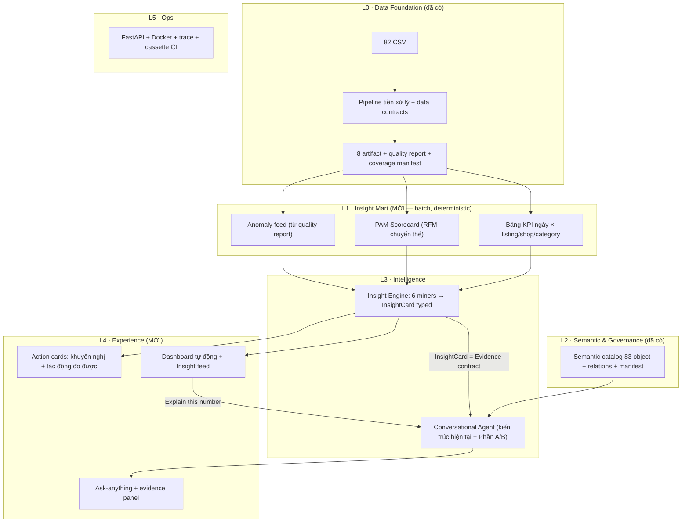

# ULTIMATE SOLUTION 2807 — Sửa lỗi TC 28/07 · Tích hợp Context Harness đầy đủ · Kiến trúc V3 cho vòng 1

| Trường               | Giá trị                                                                                                                                       |
| ---------------------- | ----------------------------------------------------------------------------------------------------------------------------------------------- |
| Ngày lập             | 28/07/2026                                                                                                                                      |
| Cập nhật kỹ thuật | 29/07/2026 — bổ sung implementation contract, dashboard, Tavily demo và scope inventory · 29/07/2026 (bản 2) — thêm Phần E: độ phủ năng lực cho câu hỏi ngoài kịch bản · 29/07/2026 (bản 3) — phản biện độc lập: sửa 6 chỗ (alias catalog đã được đọc nhưng nghèo; lỗ hổng subset rỗng + thiếu kiểm aggregation trong ledger; hợp nhất `CapabilitySpec` với `CertifiedShape` có sẵn; taxonomy binding 3→6 nhóm; thay `wrong_shape_rate=0` bằng `false_allow_rate`/`false_abstain_rate` có oracle độc lập; đôn E5 lên MUST) |
| Baseline code          | commit `ef3a380`, `pytest -q` = 326 passed                                                                                                  |
| Baseline hành vi      | `docs/qa/Testcase2807_result_analysis.md` (40 case, 5 allow, 3 allow-sai)                                                                     |
| Tài liệu ràng buộc | `CURRENT_ARCHITECTURE_SPEC.md`, `design/Context_harness20% and TC fix 2607.md`, `design/Archi_proposal.md`                                |
| Cấu trúc             | Phần A: sửa lỗi TC · Phần B: Context Harness đầy đủ · Phần C: kiến trúc V3 theo 5 tiêu chí · Phần D: phạm vi, DONE và phân loại triển khai · Phần E: độ phủ năng lực, chống trả lời sai dạng cho câu hỏi ngoài 40 TC |

Quy tắc đọc: mỗi mục Phần A theo format **Vấn đề → Nguyên nhân (file:dòng) → Cách sửa → Nghiệm thu**. Thứ tự F1→F11 là thứ tự bắt buộc (theo §16 của báo cáo QA); không đảo. Nhãn trong bản gốc đã được chuẩn hóa theo danh sách dưới đây; **bảng phạm vi D.3 là nguồn chốt cuối cùng** để biết hạng mục nào bắt buộc demo, hạng mục nào stretch, conditional hay chỉ proposal.

- `[DEMO-MUST]`: phải có code + test + đường chạy trong demo vòng 1.
- `[DEMO-STRETCH]`: chỉ làm sau khi toàn bộ `DEMO-MUST` đã xanh; cắt không làm hỏng demo cốt lõi.
- `[DEMO-CONDITIONAL]`: có implementation nhưng chỉ chạy live khi đủ credential/network/quota/acceptance; luôn có fallback đã rehearsal.
- `[PROPOSAL]`: có thiết kế và hợp đồng mở rộng, chưa tuyên bố đã code.
- `[DEFERRED]`: chủ động không làm ở vòng 1.

Khi đưa lên slide, map về đúng bốn trạng thái của `design/Archi_proposal.md`: `DEMO-MUST → Core available/Hardening` tùy kết quả nghiệm thu; `DEMO-CONDITIONAL → Conditional`; `PROPOSAL/DEFERRED → Proposed`. Không đổi nhãn slide chỉ vì đã viết thiết kế trong tài liệu này.

## TÓM TẮT QUYẾT ĐỊNH TRIỂN KHAI

- **Có dashboard thật trong demo**: Streamlit app mới + FastAPI insight API + PAM/4 deterministic miners + click-to-evidence. Hai HTML UI hiện tại được giữ nguyên.
- **Có Tavily trong demo**: `record → cache replay` là bắt buộc; một live query là conditional. External chỉ là market context, không đi vào IR/KPI/phép tính.
- **Không phá kiến trúc hiện tại**: Insight Mart vòng 1 là sidecar read-only, chưa đăng ký vào 8 governed analytical artifact; Tavily tiếp tục `context_only`, default OFF.
- **Sửa cơ chế, không chỉ sửa ca lỗi**: Phần A đóng 12 lỗi của 40 testcase; **Phần E đóng cơ chế sinh ra chúng** — định tuyến theo hợp đồng năng lực thay vì từ khóa, hợp đồng dạng kết quả cho mọi đường trả lời, NL binding sinh từ catalog, và một plan synthesizer deterministic để tăng độ phủ thật ở chế độ offline (E5, đôn từ stretch lên must sau phản biện 29/07). Đo trên baseline, câu hỏi ngoài 40 TC hiện cho 0/8 đúng và 2/8 `allow` mà sai (E.0).
- **Phạm vi định lượng**: 31/58 atomic package `DEMO-MUST`, 9/58 stretch, 1/58 live-conditional, 17/58 proposal/deferred. Chi tiết và cách đếm ở D.3.
- **Điều kiện để tuyên bố chạy được**: code + test + proof artifact phải tồn tại; tài liệu thiết kế này tự nó không làm một hạng mục chuyển thành `Core available`.

---

# PHẦN A — SỬA TRIỆT ĐỂ LỖI TESTCASE 28/07

## A.0. Nguyên tắc chung cho toàn đợt sửa

1. Viết regression test **đỏ trước, sửa sau** cho TC19/TC23/TC34 (ba case "trả lời sai nhưng vẫn ALLOW") — đây là lớp lỗi nguy hiểm nhất.
2. Không nới A22, không auto-pick sản phẩm bán chạy nhất khi mơ hồ — QA đã cấm tường minh (§7 báo cáo QA).
3. Mọi rule ID mới dùng namespace trống, additive; không sửa fixture cũ để test xanh.
4. Điều kiện đóng tổng: 326 test cũ giữ nguyên; legacy 60 câu, V2 11 câu, A19 6 câu, Phase 6 12/12 giữ 100%.

## F1 — Groq 400: chẩn đoán được rồi mới sửa `[DEMO-MUST]`

**Vấn đề.** ~21 lỗi `BadRequestError:400` trên các structured call (TC1-TC5, TC8, TC10-15, TC23, TC25, TC28, TC30, TC31, TC40); mỗi lần lỗi hệ thống rơi xuống fallback parser và phá dây chuyền phía sau. Code hiện rút gọn exception thành `BadRequestError:400`, mất toàn bộ error body.

**Nguyên nhân — đã khoanh vùng bằng nghiên cứu ngoài, cần xác nhận bằng error body:**

Nghiên cứu cộng đồng Groq/LangChain xác nhận 3 lớp nguyên nhân đúng với pattern của ta:

1. **Schema strict đã xác nhận không thỏa một yêu cầu chính thức của provider, nhưng vẫn cần error body để kết luận đây là nguyên nhân của từng 400.** Tài liệu Groq yêu cầu với `strict:true`: model phải nằm trong danh sách hỗ trợ, **mọi property ở mọi object phải xuất hiện trong `required`**, và mọi object phải có `additionalProperties:false`; field tùy chọn phải biểu diễn bằng union với `null` nhưng vẫn nằm trong `required`. Audit local trên baseline cho thấy root `LogicalQueryPlan` chỉ require 4/9 property; `PlanNode` chỉ require 6/22 property (các field default như `inputs`, `refs`, `relation`, `limit`, `evidence_emission`... không nằm trong `required`), dù `additionalProperties:false` đã đúng. Không được khẳng định `minimum`/`maximum`, `$defs`/`$ref` hay `anyOf` là unsupported chỉ dựa trên suy đoán; chỉ biến đổi keyword khi error body chính thức chỉ đúng keyword đó. Xem [Groq structured outputs docs](https://console.groq.com/docs/structured-outputs).
2. **`reasoning_effort` không hợp model.** `gpt-oss` chỉ nhận `low|medium|high`; các model khác chỉ nhận `none|default`. Code tại `agent/llm.py:409-417` map `qwen→"none"`, `gpt-oss→"low"` — nếu env `GROQ_MODEL`/`GROQ_PARSE_MODEL` trỏ model thứ ba (hoặc alias đổi), tham số bị từ chối → 400. Xem: [Groq reasoning docs](https://console.groq.com/docs/reasoning), [openclaw #32638](https://github.com/openclaw/openclaw/issues/32638).
3. **Fallback detector hiện quá hẹp.** `_is_response_format_unsupported()` (`agent/llm.py:361-367`) chỉ match chuỗi `"response_format"`; nó có thể chạy nếu provider dùng đúng cụm đó, nhưng không bắt được error dạng `"invalid JSON schema..."` hoặc code `json_validate_failed`. Trong run QA quan sát không có bằng chứng nhánh thay thế đã chạy.

**Cách sửa (theo đúng thứ tự):**

1. **Giữ error body đã redact** — sửa nhánh except tại `agent/llm.py:432-436`:
   - lấy `getattr(exc, "body", None)` (Groq SDK trả dict `{"error": {"message", "type", "code", "param"}}`) hoặc `exc.response.text`;
   - redact bằng cùng sanitize của cassette (xóa key/token/email);
   - ghi 500 ký tự đầu vào `self._telemetry["last_error_detail"]` và vào `llm_meta` → trace;
   - RuntimeError mang phân loại ngắn: `schema_rejected | param_rejected | payload_too_large | unknown_400`.
2. **Phân loại bằng field có cấu trúc trước, chuỗi sau**: ưu tiên `body.error.param`, `body.error.code`, HTTP status; chỉ match chuỗi cụ thể `"invalid json schema"`, `"response_format"` hoặc `"reasoning_effort"`, không match từ chung `"schema"` vì dễ retry sai loại lỗi. `_is_reasoning_effort_rejected` chỉ retry đúng một lần **không** kèm tham số đó.
3. **Adapter schema theo capability, không xóa ràng buộc mù** — hàm mới `groq_strict_schema(schema: dict) -> dict` (deterministic, có unit test):
   - duyệt đệ quy mọi object, đặt `additionalProperties:false`, đưa toàn bộ key trong `properties` vào `required`; field có default/optional được biểu diễn bằng `anyOf[..., {"type":"null"}]` nếu nghiệp vụ thực sự cho phép `null`;
   - giữ nguyên `$defs`/`$ref`, `minimum`/`maximum`, `pattern` cho đến khi error body chứng minh provider/model đang dùng từ chối keyword cụ thể; local Pydantic validation luôn là chốt cuối;
   - chọn đường theo capability của model: GPT-OSS được thử `strict_json_schema`; model chỉ hỗ trợ best-effort dùng `json_schema_strict_false`; model không hỗ trợ structured output dùng `json_object` hoặc schema-in-prompt. Mỗi đường tối đa một lần, tổng số provider call bị chặn bởi retry budget;
   - ghi `llm_meta["structured_path"]` và `llm_meta["schema_sha256"]`; mọi đường đều phải `LogicalQueryPlan.model_validate()` trước khi qua validator/execute.
4. **Ghi telemetry theo call**: model thật, purpose, structured_path, kích thước prompt — đúng danh sách dữ liệu QA §4 yêu cầu thu thập.
5. **Script tái hiện** `scripts/debug_groq_400.py`: với mỗi purpose (`parse_intent`, `analytical_plan`, `plan_critic`, `generate`) gửi 1 prompt tối giản, in: model, purpose, có/không `response_format`, tên schema, error body đã redact. Chạy script này **trước khi** commit bất kỳ fix nào ở bước 3 — QA cấm chọn giả thuyết khi chưa có body gốc.

**Nghiệm thu (khớp QA §4):**

- Một lỗi 400 để lại nguyên nhân phân loại được trong trace, không lộ secret.
- Schema gửi ở `strict:true` pass audit đệ quy: tại mọi object, `set(properties) == set(required)` và `additionalProperties is false`; local Pydantic vẫn từ chối giá trị sai range/regex.
- TC1, TC2, TC11, TC12 đi qua lớp phân tích chính (`parse_fallback=false`).
- Khi schema không được hỗ trợ: đúng một đường thay thế chạy và `structured_path` ghi rõ đường nào.

## F2 — Fallback parser lấy entity text quá dài `[DEMO-MUST]`

**Vấn đề.** TC1-5, TC8, TC11, TC14, TC15: `entity_text` chứa gần cả câu (TC15: chuỗi 26 từ) → resolver không match → `A-AMBIGUOUS` giả.

**Nguyên nhân.** `agent/entity_extract.py:122-126`: các pattern tên tự do dùng `(.+?)` với lookahead chỉ dừng ở qualifier thị trường (`o|tai|thi truong|vn|indonesia...`) **hoặc hết câu** — mọi phần hỏi nguyên nhân/giá/dự báo/phủ định phía sau bị nuốt vào tên.

**Cách sửa:**

1. Mở rộng stop-lexicon trong lookahead của cả 3 pattern (và nhánh fallback `:141-168`), dừng trước các token: `vi sao|tai sao|nguyen nhan|bao nhieu|the nao|co phai|khong|chua|du bao|du doan|gia|price|harga|thay doi|giam|tang|so voi|de xem|doi thu|canh tranh|tuan|thang|ngay|hom|snapshot`.
2. Trần 8 token là **soft guard**, không phải cắt mù: sau khi dừng đúng stop-boundary, chuỗi dài hơn chỉ được giữ nếu resolver exact/high-confidence có margin đạt chuẩn; nếu không thì `invalid_extraction`. Quoted name/ID không bị luật 8 token cắt nhưng vẫn chịu request-length cap chung.
3. **Controlled suffix trim có kiểm chứng resolver** (đây là "thử lại bằng chuỗi đã làm sạch" mà QA yêu cầu ở nhóm lỗi 4): chỉ được cắt phần hậu tố bắt đầu tại một stop-token đã duyệt ở bước 1, dấu câu phân cách, hoặc ranh giới quote; không thử mọi n-gram và không tự cắt token nằm trong tên. So resolver trước/sau, chỉ nhận chuỗi mới khi score tăng, đạt ngưỡng và margin đủ lớn; nếu không → `invalid_extraction` (F4). Cấm progressive right-trim tùy ý vì có thể đổi thực thể người dùng hỏi.
4. Giữ nguyên ưu tiên ID-first (`listing_key` → ID có noun → dãy 9-14 số → quote → tên tự do) — QA xác nhận nhánh ID đang chạy đúng (TC16/20/34).

**Nghiệm thu (QA §5):** test assert **trực tiếp giá trị `entity_text`** cho TC1, TC2, TC4, TC11, TC14, TC15 (không chỉ hành động cuối); mã sản phẩm/shop tách trước tên tự do; tên không chứa phần hỏi nguyên nhân/thời gian/giá/dự báo/phủ định.

## F3 — TC12: "đối thủ cạnh tranh" bị phân loại sai `[DEMO-MUST]`

**Vấn đề.** TC12 hỏi sản phẩm cạnh tranh tại Indonesia → hệ thống rẽ sang open analytical → báo "chưa ánh xạ được chỉ số". Sai chức năng, thông báo là hậu quả.

**Nguyên nhân.** `agent/parser.py:222-226`: cue list của `similar_product` chỉ có `tuong tu|tuong duong|giong|similar|equivalent|mirip|serupa` — thiếu toàn bộ nhóm từ "đối thủ/cạnh tranh". Câu rơi xuống `open_analytical` mặc định (`parser.py:262`).

**Cách sửa:**

1. Thêm cue: `doi thu`, `canh tranh`, `competitor`, `pesaing`, `kompetitor` vào nhánh `similar_product` — **với điều kiện loại trừ**: nếu trong cửa sổ ±5 token quanh cue có `gia|price|harga` thì giữ nguyên đường `unsupported:external` (giá đối thủ ngoài dataset là A14-EXT, đúng thiết kế). Hai test riêng: "sản phẩm nào là đối thủ cạnh tranh của X" → `similar_product`; "giá đối thủ của X" → `unsupported:external`.
2. Quy tắc chống rẽ nhầm: khi intent đã chọn là chức năng **không cần metric** (`similar_product`, `dataset_coverage`, `voucher_coverage`), thiếu metric ánh xạ không được là lý do chuyển sang `open_analytical` — chốt trong workflow chỗ chọn đường phân tích.
3. Phủ cả đường chính (LLM parse) và đường dự phòng: prompt `parse_intent` (`llm.py:467-470`) thêm 1 dòng: "câu hỏi về đối thủ/sản phẩm cạnh tranh (không hỏi giá ngoài sàn) → similar_product".

**Nghiệm thu (QA §6):** test phân loại riêng cho "đối thủ cạnh tranh", "sản phẩm tương tự", "tương đương" ở cả hai đường; không còn thông báo "chưa ánh xạ chỉ số" cho TC12.

## F4 — Ba trạng thái phân giải entity thay vì một thông báo `[DEMO-MUST]`

**Vấn đề.** Mọi trường hợp đều nhận "Có nhiều listing gần giống" (`agent/tool_dispatch.py:70`), trong khi có 3 tình huống khác nhau cần 3 quyết định khác nhau.

**Cách sửa** — tách trạng thái tại `tool_dispatch._resolve_entity` (`:58-72`) + `entity_resolution.py`:

| Trạng thái           | Điều kiện                                                                  | Hành vi                                                                                                                                                                                        |
| ---------------------- | ----------------------------------------------------------------------------- | ----------------------------------------------------------------------------------------------------------------------------------------------------------------------------------------------- |
| `not_found`          | candidates rỗng (đã có, TC20)                                             | `A-ENTITY-NOT-FOUND`, giữ nguyên                                                                                                                                                            |
| `invalid_extraction` | entity nguồn gốc `confidence="low"` và top score < 0.5                    | retry nội bộ bằng controlled suffix trim (F2.3); vẫn fail → `clarify A-ENTITY-EXTRACTION`: "Chưa xác định được tên sản phẩm trong câu hỏi; vui lòng nêu tên hoặc mã listing" |
| `ambiguous_broad`    | top score ≥ threshold nhưng margin < 0.05 hoặc nhiều ứng viên sát nhau | `clarify A-AMBIGUOUS` **kèm danh sách top-3** `{tên, shop, listing_key}` để người dùng chọn                                                                                  |

Cấm tuyệt đối: tự chọn sản phẩm bán chạy nhất (QA §7 đánh dấu rủi ro cao — đổi ngầm đối tượng câu hỏi). Chỉ được auto-pick khi có quy tắc nghiệp vụ được duyệt + ngưỡng tin cậy + câu trả lời nêu rõ đã chọn gì — chưa có quy tắc nào được duyệt, nên chưa làm.

**Nghiệm thu (QA §7):** ba trạng thái phân biệt được trong trace; message khớp trạng thái; TC1/2/4/5/7/8/11/14/15/16 nhận đúng loại thông báo sau khi F2 sửa xong.

## F5 — Hợp đồng `expected_cardinality`: một nguồn định nghĩa duy nhất `[DEMO-MUST]`

**Vấn đề.** TC3/TC10: planner sinh `"many"`/`"single"`, Pydantic từ chối (`planner/query_ir.py:82-89` chỉ nhận `^(<=)?\d+$`), plan hỏng trước tầng dữ liệu, vòng repair 2 attempt cũng không sửa được vì prompt không nêu grammar.

**Cách sửa:**

1. **Một nguồn định nghĩa**: export từ `query_ir.py` hằng `CARDINALITY_GRAMMAR = r"^(<=)?\d+$"` + docstring 1 dòng; mọi nơi khác import từ đây.
2. **Chuẩn hóa alias tại đúng một biên nhưng không đổi nghĩa** — dùng `model_validator(mode="before")` trong `PlanNode` để đọc đồng thời `limit` và `expected_cardinality`: `"single"→"1"` là alias an toàn; `"many"/"multiple"` chỉ đổi thành `"<=N"` khi node đã có `limit=N` hợp lệ. Nếu không có giới hạn thì trả lỗi có cấu trúc cho vòng repair, **không** đổi ngầm thành `<=10000`. Ghi `cardinality_coerced`, `original_cardinality` vào `planning_meta`.
3. **Prompt P8 nêu grammar tường minh**: payload của `open_planner` thêm mục `constraints.expected_cardinality`: giá trị regex + 2 ví dụ (`"1"`, `"<=5"`). Validator feedback khi sai phải trích đúng dòng này.
4. Audit đường fallback/template planner: grep `"single"|"many"` trong mọi nơi dựng PlanNode; sửa về giá trị hợp lệ.
5. Lỗi schema **không được** trả ra UI: tại điểm bắt ValidationError của plan, message người dùng là câu hoàn chỉnh ("Hệ thống chưa lập được kế hoạch phân tích hợp lệ cho câu hỏi này..."), chi tiết vào trace.

**Nghiệm thu (QA §8):** template/prompt/fallback/Pydantic dùng cùng định nghĩa (test import chung hằng); test phủ cả đường model-sinh (cassette fixture chứa `"single"`) và đường dự phòng; TC3/TC10 không trả lỗi schema ra UI.

## F6 — A22 giữ quốc gia và khoảng ngày (TC23/TC34 — lỗi nặng nhất) `[DEMO-MUST]`

**Vấn đề.** TC23: request có `countries=["vn","id"]` nhưng tool call chỉ còn `country="vn"` → vẫn ALLOW/VERIFIED. TC34: hỏi 01/07→03/07, plan tự đổi thành so sánh 02/07 vs 03/07 → vẫn VERIFIED. Verifier hiện chỉ chứng minh "answer khớp evidence", chưa chứng minh "plan/evidence trả lời đúng câu hỏi gốc".

**Nguyên nhân.**

- `RequestDigest` (`agent/context.py:29-41`) có `countries` nhưng **không có** `date_range`.
- `check_plan_alignment`/`check_evidence_alignment` (`agent/alignment.py`) chỉ so measure/shape/entity/qualifier — không so quốc gia, không so mốc ngày.
- Đường macro không có plan: `compare_voucher_groups` (`agent/tool_dispatch.py:101-106`) đọc mỗi `ctx.request.country` — country thứ hai rơi im lặng, và **không có check nào so digest với args tool**.

**Cách sửa:**

1. **Mở rộng digest**: thêm `date_range: tuple[str, ...] = ()` vào `RequestDigest`; điền từ `request.date_range` trong `request_digest()` (`context.py:111-141`).
2. **Hai issue code + rule mới** trong `alignment.py` (additive):
   - `country_dropped` → `A22-ALIGN-COUNTRY` (action `clarify`);
   - `date_range_narrowed` → `A22-ALIGN-DATE` (action `clarify`).
3. **check_plan_alignment**: nếu `len(digest.countries) >= 2` → plan phải có predicate `dim.country in [cả hai]` hoặc nhánh Union theo country; predicate một quốc gia ⇒ `country_dropped`. Nếu `len(digest.date_range) == 2` → `plan.time_scope` phải chứa cả hai mốc và node `TemporalCompare` phải so đúng cặp mốc được hỏi, không phải cặp ngày liền kề mặc định ⇒ khác là `date_range_narrowed`.
4. **check_tool_alignment (mới) phải chạy trước side effect** cho đường macro/tool không qua IR. Tách dispatcher thành `prepare_tool_call(request) -> ToolCallSpec` (chỉ dựng tên + args, chưa đọc/chạy tool) → `check_tool_alignment(digest, spec)` → chỉ khi ALLOW mới `execute_tool_call(spec)`. Check sau dispatch chỉ dùng như postcondition bổ sung, không thay thế pre-execution check. TC23 bị bắt trước khi chạy (`args={"country":"vn"}` vs digest 2 nước).
5. **check_evidence_alignment**: tập `attrs country` của evidence phải phủ đủ digest.countries; tập ngày trong evidence phải chứa cả hai mốc được hỏi.
6. **Lưu ý nghiệp vụ TC23**: so sánh voucher **coverage/count** giữa VN-ID là hợp lệ (không phải tiền tệ); chỉ khi measure mang unit `local_currency` mới đẩy sang `A16-CROSS-CURRENCY`. Đường sửa đúng cho TC23 là dùng `compare_voucher_coverage` (đa quốc gia, đã có) thay vì chặn chết.
7. **Fixture TC34**: dữ liệu thật của item trong TC34 có đủ 3 snapshot (QA §14) — đổi fixture sang 1 trong các listing có gap giữa kỳ thật (pipeline_report ghi 5 listing có gap giữa) trước khi viết test; phối hợp người phụ trách dữ liệu, không tự bịa gap.

**Nghiệm thu (QA §9):** request 2 quốc gia + plan/tool 1 quốc gia ⇒ chặn hoặc sửa; request 2 mốc ngày + plan 1 mốc ⇒ chặn hoặc sửa; **TC23 và TC34 bắt buộc không ALLOW với kế hoạch hiện tại** (viết test đỏ trước); kiểm tra so sánh request↔plan chạy **trước** khi tool chạy, không chỉ answer↔evidence sau khi chạy. 8 trường phải giữ xuyên suốt: countries, date start/end, số entity, metric, phép tính, chiều nhóm, filter, từng phần câu ghép — đưa đủ vào `expected_plan_properties` của eval runner (F11).

## F7 — Thứ tự kiểm tra của gate (TC35/TC40) `[DEMO-MUST]`

**Vấn đề.** TC35 hỏi iPhone (ngoài phạm vi dataset) nhưng nhận "chọn VN hoặc ID"; TC40 có bẫy cộng trùng kệ nội bộ nhưng bị chặn trước vì thiếu quốc gia — quy tắc nghiệp vụ chính không bao giờ được chạm tới.

**Nguyên nhân.** `agent/gate.py:100-124`: check cross-currency (route-based) đứng đầu `decide()`; `A-CROSS-CURRENCY-SCOPE` (`:162-166`) bắn ra ngay khi `analytical_query` thiếu country, trước mọi kiểm tra phạm vi/phép cấm.

**Cách sửa** — đổi `decide()` từ "return sớm theo thứ tự cứng" sang gate theo phase. Trong một phase có thể thu thập nhiều issue và chọn theo ưu tiên; không chạy toàn bộ rule phẳng vì một số rule cần entity/plan chỉ tồn tại ở phase sau:

1. Thứ tự phase và ưu tiên đã được QA §10 phác:

```
1. unsupported capability / ngoài phạm vi dữ liệu (A-MISSING-*, A-OUT-OF-SCOPE)
2. mục đích + thực thể (A-UNKNOWN-INTENT, entity not_found)
3. phép tính bị cấm (A-SHELF-DOUBLE-COUNT, rolling-sum, A19-OP)
4. tiền tệ — CHỈ khi digest có measure unit local_currency (A16-*)
5. đồng nhất request↔plan (A22-*)
6. thiếu slot (A-MISSING-SLOT / country clarify)
```

   Phase 1 chạy rule tĩnh/capability; Phase 2 mới resolve entity; Phase 3 kiểm phép tính/grain/unit; Phase 4 kiểm alignment và slot còn thiếu. Mỗi phase nhận typed input của phase trước; issue list ghi toàn bộ vào trace, còn response chọn issue có priority cao nhất. Như vậy TC35/TC40 nhận đúng lý do nhưng không phải chạy resolver/plan vô ích cho mọi request.
2. **`A-OUT-OF-SCOPE` (mới)** cho TC35: khi câu có entity dạng tên và resolver existence-probe (exact + fuzzy nhanh, top score < 0.5, chạy ở Phase 2 trước country slot-check) không tìm thấy gì gần đúng ⇒ trả "Sản phẩm này không nằm trong phạm vi dữ liệu đã thu thập (dataset chỉ gồm các listing đã crawl thuộc VN/ID, 01-03/07/2026)" — không nói gì về tiền tệ.
3. **`A-SHELF-DOUBLE-COUNT` (mới)** cho TC40: rule deterministic — câu yêu cầu cộng metric cấp listing theo "kệ"/`shelf`/`category_list` (quan hệ N:M qua `product_categories`) ⇒ cảnh báo đếm trùng + yêu cầu dedupe, **đứng trước** clarify thiếu quốc gia; nếu cả hai cùng kích hoạt thì reason gộp cả hai.
4. Tương tự thêm rule `A-METRIC-WINDOW` cho TC39: yêu cầu `SUM(monthly_sold)` qua nhiều snapshot ⇒ chặn với giải thích "chỉ số cửa sổ trượt, cộng dồn qua snapshot là đếm trùng" (bất biến dữ liệu #1 trong spec kiến trúc). Hiện A22 chỉ bắt gián tiếp qua measure-substitution.

**Nghiệm thu (QA §10):** TC35 báo ngoài phạm vi, không báo tiền tệ; TC40 nêu nguy cơ đếm trùng trước hoặc cùng lúc với yêu cầu quốc gia; TC3 không bị check quốc gia che lỗi cardinality (F5 đã sửa gốc). Thứ tự cuối cùng phải được đội kiến trúc duyệt trước khi merge — ghi ADR ngắn.

## F8 — Similarity TC19: sai mà vẫn ALLOW `[DEMO-MUST]`

**Vấn đề.** Hỏi đối thủ của quạt mini cầm tay → trả collagen, kem dưỡng, mền gối, cùng điểm 0.855 vì cùng chứa cụm "quà tặng không bán". Case được `PASSED` + có citation — nguy hiểm nhất vì trông "có bằng chứng".

**Nguyên nhân.** `analytics/tools.py:29-46` (`similar_products`) resolve bằng **tên sản phẩm thuần** qua `EntityResolver.resolve` (`entity_resolution.py:35-46`): fuzzy WRatio + optional BGE trên toàn catalog, không ràng buộc danh mục; cụm trạng thái lặp lại trong nhiều tiêu đề chi phối điểm.

**Cách sửa:**

1. **Ràng buộc danh mục sàn bắt buộc**: dựng map `listing → platform_category` bằng relation `in_platform_category` đã chứng nhận: `products_clean.(country_code, catid_num) → category_platform_clean.(country_code, category_id_num)`. `catid_num` là top-level; phần tử cuối `global_catids` là leaf khi cần level sâu hơn. **Cấm** nối `product_categories_clean` với `category_platform_clean`: bảng đầu là kệ nội bộ shop, hai taxonomy không có edge được chứng nhận. Ứng viên khác top-level bị loại; cùng leaf/path được cộng ưu tiên. Listing không map được category ⇒ câu trả lời phải nêu giới hạn "chưa xác định được danh mục".
2. **Trung hòa cụm trạng thái**: hàm `normalize_name_for_matching()` loại stoplist cụm mô tả trạng thái khỏi chuỗi so khớp (fuzzy lẫn embedding query): `qua tang khong ban`, `gift not for sale`, `hang tang kem`, `khong ban`, `doc quyen`, `chinh hang`, `freeship`, `sale`, `hot`. Stoplist là hằng có test, mở rộng phải qua review.
3. **Caveat giá kỹ thuật**: khi ứng viên/nguồn chứa cụm trạng thái hoặc nghi vấn giá sentinel nhưng `price_sentinel_flag=False` chưa có nhãn duyệt ⇒ câu trả lời nói "chưa đủ bằng chứng để kết luận về mức giá của sản phẩm quà tặng", **không** khẳng định giá kỹ thuật và **không** tự đổi cờ dữ liệu (QA §12 cấm — cần người phụ trách nghiệp vụ duyệt nhãn).
4. Similarity score đưa thêm attrs `same_level1`, `same_level2`, `status_tokens_removed` vào Evidence để verifier/eval kiểm được.

**Nghiệm thu (QA §12):** TC19 không ALLOW với danh sách hiện tại (test đỏ trước); invariant test "mọi kết quả find_similar cùng danh mục level-1 hoặc có caveat"; cụm trạng thái không chi phối điểm (test: hai sản phẩm khác danh mục cùng chứa "quà tặng không bán" không được match).

## F9 — Câu trả lời cho người dùng vs nhật ký kỹ thuật `[DEMO-MUST]`

**Vấn đề.** (a) TC23/TC31: generator bị verifier từ chối → hệ thống đổ chuỗi dữ liệu thô ra UI. (b) TC31: verifier coi "tháng 6", "tháng 8" người dùng tự nêu là số bịa. (c) Nhiều case lộ jargon: `artifact`, `monthly_sold_proxy`, `expected_cardinality`, mã A19/A22, và TC38 có câu chưa điền biến "Chưa có analytical template cho:".

**Cách sửa:**

1. **Question-echo whitelist trong verifier**: truyền `question_numbers = scan_number_tokens(raw_text)` vào `verify_numeric_claims` (`agent/verifier.py`); số xuất hiện nguyên văn trong câu hỏi được phép lặp lại trong answer **không cần** evidence binding, nhưng bị cấm làm value của một `ResponseClaim` mới (không được citation) — đúng ranh giới QA §13 vạch: "được phép lặp lại, không được xem là bằng chứng cho kết luận mới".
2. **Deterministic answer formatter** thay cho raw-dump: khi generate+retry đều fail, đường fallback phải render evidence qua template diễn giải hoàn chỉnh (mỗi metric có template câu), không bao giờ `str(payload)`.
3. **Lint jargon tự động**: test quét mọi `answer` trong suite DR40 với blacklist `{"artifact", "monthly_sold_proxy", "semantic catalog", "expected_cardinality", "analytical template", "capability", "A19", "A22", "T-8c"}` — 0 match. Mã rule vẫn nằm trong `gate.rule_id`/trace, chỉ cấm trong text người đọc (nhất quán với `CAPABILITY_MESSAGES` đã làm ở `gate.py:23-96`).
4. **Template có biến phải có test biến-thiếu**: TC38 phải ra câu hoàn chỉnh ("Hệ thống chưa hỗ trợ dạng phân tích này; có thể hỏi ... thay thế").

**Nghiệm thu (QA §13):** 4 điều kiện của QA đạt; demo UI không còn chuỗi kỹ thuật.

## F10 — Khoảng trống chức năng phân tích `[PROPOSAL — trừ 2 mục]`

QA §11 xác định đúng: đây là **thiếu thiết kế**, không phải bug; từ chối hiện tại là hành vi an toàn. Không mở rộng chức năng cũ nhận mọi tham số. Mỗi chức năng mới cần đủ 5 thứ: đầu vào định kiểu, giới hạn entity/quốc gia, metric + phép tính được phép, câu kết luận bị cấm, test thiếu-dữ-liệu.

| Chức năng                              | TC         | Ưu tiên                                                         | Ghi chú                                                                                                     |
| ---------------------------------------- | ---------- | ----------------------------------------------------------------- | ------------------------------------------------------------------------------------------------------------ |
| So sánh trực tiếp 2 listing cụ thể  | TC9, TC17  | **P1 — làm được sớm** `[DEMO-STRETCH]` | macro mới `compare_two_listings`: 2 entity, cùng country, metric whitelist (price, monthly_sold, voucher) |
| Voucher coverage đa quốc gia           | TC23       | **P1 — dùng cái đã có** `[DEMO-MUST]`                    | route câu 2-nước không-tiền-tệ sang `compare_voucher_coverage` (F6.6)                                 |
| Đồng biến 2 chỉ số, cấm nhân quả | TC4, TC26  | P2                                                                | template correlation + wording guard causal                                                                  |
| Nhóm không khuyến mãi                | TC22       | P2                                                                | mở rộng certified shape của promotion macro                                                               |
| Doanh thu trung vị theo nhóm           | TC21, TC24 | P2                                                                | template median-by-group                                                                                     |
| Chặn cộng metric cửa sổ trượt      | TC39       | P1 `[DEMO-MUST]`                                                  | đã xử ở F7.4 (`A-METRIC-WINDOW`)                                                                       |
| Nhận diện đếm trùng kệ nội bộ    | TC40       | P1 `[DEMO-MUST]`                                                  | đã xử ở F7.3 (`A-SHELF-DOUBLE-COUNT`)                                                                  |
| Mã khuyến mãi không hợp lệ         | TC26, TC30 | P2                                                                | validate promotion_id tồn tại trước khi lập plan                                                        |

## F11 — Eval 3 lớp: hết cảnh "PASSED nhưng sai" `[DEMO-MUST — phần schema; PROPOSAL — phần oracle đầy đủ]`

**Vấn đề.** Nhãn `PASSED = ALLOW/VERIFIED` để lọt TC19/TC23/TC34. QA §14 yêu cầu 3 lớp kết quả.

**Cách sửa** — mở rộng schema `eval/dr2807.json` và runner:

```json
{
  "expected_action": "allow",
  "expected_plan_properties": {
    "countries": ["vn", "id"],
    "date_start": "2026-07-01", "date_end": "2026-07-03",
    "entity_count": 1, "metric_refs": ["measure.monthly_sold"],
    "aggregation": "median", "group_by": ["derived.has_structured_voucher"],
    "compound_parts": []
  },
  "must_not_assert": ["so sánh trực tiếp VND với IDR"],
  "forbidden_answer_tokens": ["A22", "artifact", "expected_cardinality"]
}
```

Case chỉ PASS khi cả 3 lớp đạt: (1) đúng loại hành động; (2) plan/tool giữ đủ điều kiện (đối chiếu `expected_plan_properties` với trace `planning_meta` + tool args); (3) answer đạt ràng buộc nội dung. TC34 đổi fixture (F6.7). TC19 có thể tạm `needs_oracle` trong lúc sửa, nhưng trước `DEMO-MUST DONE` phải có reviewer khóa category constraint/forbidden candidates; chỉ **full independent oracle cho toàn 40 case** mới là `[PROPOSAL]`.

## A.1. Thứ tự thực hiện tổng (bám QA §16)

```
1. F1.1+F1.5 (giữ error body + script tái hiện)   → có chẩn đoán rồi mới sửa
2. F1.2-F1.4 (fallback path Groq)                  → TC1/2/11/12 qua lớp chính
3. F5  (cardinality)                               → TC3/TC10
4. F2+F4 (entity trim + 3 trạng thái)              → mở lại nhóm TC1-15
5. F6  (A22 country/date + test đỏ TC23/TC34)      → đóng 2 lỗ hổng ALLOW-sai
6. F8  (similarity + test đỏ TC19)                 → đóng lỗ hổng ALLOW-sai còn lại
7. F7  (gate order)                                → TC35/TC40
8. F3  (intent competitor)                         → TC12
9. F10 hai mục P1                                  → TC9/17/23
10. F9 (wording)                                   → cuối cùng, như QA yêu cầu
```

## A.2. Hợp đồng triển khai chung cho F1-F11

Phần này khóa các chi tiết xuyên module để người triển khai không phải tự suy luận thêm.

### A.2.1. Ranh giới module và test bắt buộc

| Work package | Module chính phải sửa | Test đỏ tối thiểu trước khi sửa | Output/trace phải quan sát được |
| --- | --- | --- | --- |
| F1 | `agent/llm.py`, script chẩn đoán mới | provider error body, strict-schema audit, retry budget | `error_category`, `structured_path`, model, purpose, schema hash, prompt/context size |
| F2/F4 | `agent/entity_extract.py`, `entity_resolution.py`, `tool_dispatch.py` | exact `entity_text`, stop-boundary, three-state resolution | raw span, normalized span, candidate scores/margin, resolution state |
| F3 | `agent/parser.py`, prompt parse trong `agent/llm.py` | competitor/similar vs competitor-price ở vi/id/en | chosen intent, cue, route mode |
| F5 | `planner/query_ir.py`, `planner/open_planner.py` | `single`, bounded `multiple`, unbounded `many` | original/coerced cardinality, validator feedback |
| F6 | `agent/context.py`, `alignment.py`, `tool_dispatch.py`, `workflow.py` | request→plan và request→tool country/date mismatch | digest, prepared tool spec, alignment issues, executed=`false` khi fail |
| F7 | `agent/gate.py`, orchestration trong `workflow.py` | TC35/39/40 và nhiều issue cùng kích hoạt | `gate.phases[]`, toàn bộ issue, selected issue/priority |
| F8 | `analytics/tools.py`, relation/category helper | same top-level, cross top-level, orphan category, stop phrase | category path, component scores, removed tokens |
| F9 | `agent/verifier.py`, deterministic formatter, wording guard | question-number echo, generator fail, jargon lint | retry reason, formatter path, final verification |
| F10 | `analytics/tools.py`, `planner/macros.py`, dispatcher | input contract, missing-data, forbidden wording | typed args, macro version, caveat IDs |
| F11 | `scripts/run_evaluation.py`, `eval/dr2807.json` | action/plan/answer fail độc lập | verdict ba lớp + reason per layer |

Không sửa fixture để hợp thức hóa output mới, trừ TC34 phải đổi sang listing có gap thật như F6.7 và phải ghi lại lý do/row key trong commit. Mỗi bug fix có một test đúng testcase gốc và ít nhất một mutation/negative test.

### A.2.2. Tương thích schema và trace

- Mở rộng `RequestDigest`, `ToolCall` hoặc trace bằng field **optional có default**; không đổi tên/xóa field cũ trong vòng 1.
- Tăng `trace.schema_version` từ `v1.1` lên `v1.2` khi thêm `gate.phases`, `alignment`, `prepared_tool_call` và telemetry Groq. Reader cũ phải bỏ qua được field lạ.
- Rule ID mới là additive; message người dùng lấy từ message catalog, không ghép trực tiếp exception/provider body.
- Error body, prompt preview và external snippet trước khi ghi trace phải qua cùng sanitizer; chỉ lưu hash + tối đa 500 ký tự đã redact. Không log API key/header/cookie.
- Mọi retry budget là hữu hạn và ghi được: parse/plan tối đa số attempt hiện hành; schema fallback không được tạo vòng lặp lồng khiến số call tăng không kiểm soát.

### A.2.3. Trình tự an toàn bắt buộc

```text
parse
  → normalize + digest
  → gate phase 1/2
  → build plan hoặc prepare ToolCallSpec (chưa thực thi)
  → deterministic validate + A22 alignment
  → execute read-only
  → build immutable Evidence
  → evidence alignment
  → generate/fallback
  → numeric + wording + claim verification
  → final fail-closed
```

Không được để `prepare` âm thầm đọc dữ liệu, gọi mạng hoặc chạy tool. Đây là điều kiện để câu “chặn trước thực thi” ở F6/F7 có ý nghĩa thật.

### A.2.4. Cổng merge

Một work package chỉ được đánh dấu xong khi: test đỏ đã được chứng minh fail trên baseline; test mới xanh; full suite xanh; trace chứa field chẩn đoán cần thiết; UI không lộ jargon/exception; và một reviewer khác đối chiếu output với oracle/row nguồn. `ALLOW + VERIFIED` không còn đủ nếu lớp plan/oracle của F11 chưa đạt.

---

# PHẦN B — CONTEXT HARNESS: TỪ 20% LÊN THIẾT KẾ ĐẦY ĐỦ

## B.1. Định vị khái niệm (kết quả nghiên cứu)

Ba tầng kỹ thuật, từ hẹp đến rộng — tài liệu 2026 phân biệt rõ:

1. **Prompt engineering** — tối ưu input của một lần gọi model.
2. **Context engineering** — quản trị *toàn bộ* thông tin model thấy qua nhiều bước: bốn họ thao tác **Offloading** (đẩy state ra ngoài context), **Reduction** (nén/compaction), **Retrieval** (JIT — chỉ nạp khi cần, giữ lightweight reference), **Isolation** (mỗi stage/sub-agent thấy view riêng). Nguyên tắc lõi của Anthropic: *tìm tập token tín hiệu cao nhỏ nhất tối đa hóa xác suất ra kết quả đúng* — context window là "attention budget" hữu hạn, context rot làm chất lượng giảm trước khi chạm trần token.
3. **Harness engineering** — thiết kế *hạ tầng bọc quanh model*: tool interface, orchestration, **verification hooks**, observability, execution env. Survey 2026 (taxonomy ETCLOVG) chỉ ra: độ tin cậy khi chạy thật phụ thuộc **harness nhiều hơn model** — một harness tốt nâng cùng một model +13.7 điểm Terminal-Bench chỉ bằng thay đổi hạ tầng; và context management nên được nhìn như **state estimation**: mỗi lần nén/truy hồi phải ghi rõ mất mát thông tin, gắn provenance + staleness marker, và **khôi phục từ artifact bền vững thay vì từ lịch sử đã nén**.

Đối chiếu: Gladiators đã vô tình xây một harness mạnh (deterministic gate/validator/verifier = verification hooks; trace = observability; typed contracts = tool interface). Cái đang ở mức 20% là **tầng context engineering** — và đó chính là chỗ Phần A cho thấy lỗi tập trung (payload P8 thiếu grammar → cardinality sai; digest thiếu date_range → TC34; prompt không được đo → không biết vì sao Groq 400).

## B.2. Hiện trạng — cái gì đã có, cái gì chưa

| Thành phần                                                             | Trạng thái                                                                  | Vị trí                               |
| ------------------------------------------------------------------------ | ----------------------------------------------------------------------------- | -------------------------------------- |
| Typed carrier (`ContextBundle` + `RequestDigest` + `context_hash`) | ✅ có                                                                        | `agent/context.py`                   |
| Guard nội bộ (injection patterns, evidence bất biến)                 | ✅ có                                                                        | `context.py:87-108`                  |
| Per-stage isolation (P2/P6/P8/P9/P10/P11 view riêng)                    | ✅ một phần                                                                 | call sites trong workflow/open_planner |
| Budget token                                                             | ⚠️**khai báo, chưa cưỡng chế**                                   | `BUDGETS` chỉ ghi vào bundle/trace |
| Compaction / drop-and-record                                             | ❌ chưa                                                                      | `dropped` luôn rỗng                |
| JIT catalog slice có ranking                                            | ⚠️ đã có lexical relevance/rank và cắt tối đa 30 object; chưa đo recall, render còn dài | call path P8/open planner |
| Context metrics (precision/recall/tokens)                                | ❌ chưa                                                                      | —                                     |
| Multi-turn state carry                                                   | ❌ chưa                                                                      | clarify xong là mất digest           |
| Structured notes / memory                                                | ❌ chưa                                                                      | —                                     |
| Cassette record/replay                                                   | ✅ có                                                                        | `agent/cassette.py`                  |

## B.3. Thiết kế tích hợp CH-1 → CH-8

### CH-1. Deterministic Context Packer — cưỡng chế budget `[DEMO-STRETCH]`

Hàm `pack(bundle: ContextBundle) -> ContextBundle` trong `context.py`:

- Ước lượng token bằng adapter theo provider nếu SDK có usage/tokenizer; fallback `ceil(len(utf8_text)/3.5)` và giữ **15% headroom**. Chạy calibration trên DR40 để so estimate với usage thực. Nếu riêng ba khối “không bao giờ cắt” đã vượt budget thì trả `context_budget_unsatisfied` trước LLM, không cắt invariant.
- Xếp payload theo **thứ tự ưu tiên cố định**, cắt từ đuôi khi vượt `budget_tokens`, phần bị cắt ghi vào `dropped`:

```
1. constraint khối cứng (grammar IR, cardinality, invariants)   — không bao giờ cắt
2. RequestDigest                                                — không bao giờ cắt
3. validator_feedback (nếu là attempt 2)                        — không bao giờ cắt
4. catalog slice (đã rank, CH-2)                                — cắt từ object ít liên quan nhất
5. evidence payload top-k                                       — cắt từ rank thấp
6. few-shot example                                             — cắt đầu tiên
```

- Điểm tích hợp: nơi dựng payload P8 trong `open_planner.py`, payload P2 generate trong `workflow.py`. Chữ ký `llm_client.*` không đổi — chỉ nguồn dựng dict đổi (đúng nguyên tắc của spec 2607 §2.5).
- Đây là điều kiện cho F1: payload nhỏ và có cấu trúc ổn định giúp loại giả thuyết "payload quá lớn" của Groq 400 bằng số liệu (`context_tokens` trong trace).

### CH-2. JIT catalog slice: rank + nén kiểu M-Schema `[DEMO-STRETCH]`

Hiện slicer đã có lexical rank và lấy tối đa 30 object liên quan. Nâng cấp phần scoring, compact render và đo coverage, không viết lại từ đầu:

1. **Rank deterministic có breakdown**: kế thừa lexical scorer hiện hữu; cộng điểm exact semantic ref từ `digest.requested_measures/dimensions`, alias match đa ngôn ngữ và dependency/required object (`dim.country`, `dim.date` chỉ giữ khi request cần scope tương ứng). Trace ghi từng thành phần điểm. BGE rerank chỉ khi `GLADIATORS_ENABLE_BGE=1`, không thay thế hard dependency.
2. **Render nén một-dòng-một-object** thay vì dump JSON đầy đủ:
   `measure.monthly_sold | measure | count/window | grain=listing-snapshot | alias: lượt bán, penjualan | caveat: W1-rolling-no-sum`
   Ước tính giảm 60-70% token slice; caveat rút thành mã ngắn có bảng giải nghĩa cố định trong system prompt.
3. Slice trở thành **JIT thật**: chỉ dựng khi digest sẵn sàng, theo digest — không nạp catalog tĩnh "cho chắc".

### CH-3. Context metrics — đo được mới tối ưu được `[DEMO-STRETCH]`

Ghi vào `planning_meta` + trace mỗi lần gọi P8/P2:

- `context_tokens` (sau pack), `dropped_count`;
- `context_precision` = `|planned_refs ∩ slice_refs| / max(1, |slice_refs|)` — slice thừa bao nhiêu;
- `context_recall` = `|planned_refs ∩ slice_refs| / max(1, |planned_refs|)` và `catalog_miss_count = |planned_refs - slice_refs|`. Tính cho từng attempt **trước validator** và cho accepted plan; không dùng accepted plan duy nhất rồi che mất lỗi repair.

Eval offline: chạy DR40 với slice size 10/20/30 để chọn cấu hình — số liệu này đưa thẳng vào slide "risk-adaptive, đo được" (tiêu chí 3).

### CH-4. Multi-turn digest carry `[DEMO-STRETCH — mức tối thiểu]`

Vòng clarify hiện vứt digest, user trả lời xong parse lại từ đầu (ma trận entity #10 của spec 2607 yêu cầu "multi-turn giữ entity"). Demo tối thiểu dùng store in-memory TTL 15 phút: response trả `conversation_id` UUID; server giữ `RequestDigest` + candidate IDs + dataset_version, lượt sau chỉ nhận `conversation_id` và lựa chọn ID, không nhận digest do client tự sửa. Merge theo allow-list, kiểm dataset_version và one-time nonce; hết hạn/restart thì yêu cầu hỏi lại. Đây là **Offloading** ngoài context, nhưng phải ghi rõ chưa hỗ trợ multi-worker/persistence/auth.

### CH-5. Structured notes / session memory `[PROPOSAL]`

Ghi chú bền theo phiên (bindings đã resolve, giả định đã nêu, insight đã trả) → file JSON per-session, nạp lại qua reference. Đúng pattern "structured note-taking" của Anthropic. Chưa cần cho vòng 1.

### CH-6. Isolation chặt hơn: P8 không thấy câu hỏi thô `[DEMO-STRETCH nhẹ]`

P8 chỉ nhận `digest.normalized_question` + refs — không nhận raw text (giảm injection surface + token, đúng nguyên tắc "mỗi stage nhìn thấy tối thiểu"). Guard hits hiện có sẵn để đối chiếu trước/sau.

### CH-7. Provenance + staleness marker trên context item `[PROPOSAL — external]`

Mỗi item trong payload external mang `as_of` + `source_tier` ngay trong render (không chỉ trong Evidence object) để P2 không diễn đạt tin cũ như tin mới. Gắn với sidecar external khi E6 được sign-off.

### CH-8. Repair context tối thiểu `[DEMO-STRETCH]`

Attempt 2 của P8 hiện gửi lại nguyên payload + feedback. Sửa: attempt 2 chỉ gửi (constraint cứng + digest + **đúng các lỗi validator** + các ref liên quan lỗi) — repair khu trú, token giảm, và đo được tỷ lệ repair thành công trước/sau. Kết hợp F5.3 (grammar trong feedback) là đường đóng TC3/TC10 từ phía prompt.

**Nguyên tắc bất biến kế thừa spec 2607:** alignment vẫn deterministic (không LLM-judge); Evidence gốc bất biến; bundle chỉ chứa bản copy đã guard; không được gọi 20% hiện tại là "đã tích hợp Context Harness" trong deck — sau khi CH-1/2/3/8 xong mới được gọi là tích hợp tầng context engineering.

## B.4. Contract triển khai Context Harness

### B.4.1. Typed model

```python
class ContextItem(BaseModel):
    item_id: str
    kind: Literal["constraint", "digest", "feedback", "catalog", "evidence", "example"]
    payload: dict
    priority: int
    estimated_tokens: int
    semantic_refs: tuple[str, ...] = ()
    source: str
    source_hash: str
    as_of: datetime | None = None
    droppable: bool = True

class DroppedContext(BaseModel):
    item_id: str
    reason: Literal["budget", "irrelevant", "stale", "guard_reject"]
    estimated_tokens: int
    source_hash: str
```

`ContextBundle.items` được pack thành view theo stage; không mutate evidence/source object. Hash bundle tính trên canonical JSON sau guard + pack, không gồm timestamp sinh tự động.

### B.4.2. API của packer

```python
pack_context(
    *,
    stage: Literal["P2", "P5", "P6", "P8", "P9", "P10", "P11"],
    items: Sequence[ContextItem],
    budget_tokens: int,
    reserve_ratio: float = 0.15,
) -> PackedContext
```

Thuật toán ổn định: guard reject → dedupe theo `(kind, source_hash)` → giữ hard block → sort `(droppable, -priority, item_id)` → thêm tới budget → ghi drop ledger. Hai lần pack cùng input phải có cùng `context_hash`, item order và drop ledger.

### B.4.3. Acceptance

- Hard constraints/digest/validator feedback recall = 100%.
- Không bundle nào vượt `budget_tokens × 0.85` theo estimator; nếu provider usage cho thấy vượt thì calibration test phải fail.
- DR40 không giảm action accuracy; `A19-CAT` không tăng.
- Báo cáo ablation size 10/20/30 ghi action accuracy, plan-valid rate, context precision/recall, median/p95 token và latency; chọn cấu hình bằng dữ liệu, không chọn vì “prompt ngắn hơn”.
- CH-4/5/7 không được ghi là production memory/external freshness cho tới khi có persistence/auth/retention policy.

---

# PHẦN C — KIẾN TRÚC V3

## C.1. Chẩn đoán thẳng: vì sao đang tụt so với các nhóm khác

Nhóm đã đầu tư gần như toàn bộ vào **trục an toàn/đúng đắn của agent hỏi-đáp** (verifiability, fail-closed) — đó là điểm khác biệt thật, nhưng bản proposal hiện **thiếu tầng sản phẩm phân tích**: không có dashboard, không có insight chủ động, không có khung "khuyến nghị → tác động đo được". Ban giám khảo chấm theo 5 tiêu chí sản phẩm, không chấm theo độ sạch của guardrail. Kết luận thiết kế: **giữ nguyên lõi agent làm điểm khác biệt (tiêu chí 3), bọc thêm 2 tầng: Insight Mart phía dưới và Experience phía trên** — cả hai đều deterministic, làm nhanh, không đụng vào guarantee hiện có.

Một sự thật dữ liệu phải nói thẳng trong proposal (nó là **điểm cộng** tiêu chí 2 nếu nói đúng): dataset là **listing snapshot**, không có order/customer → không làm được RFM khách hàng thật, không biết "ai mua". Nhóm nào demo buyer-RFM trên dataset này là đang bịa dữ liệu. Ta làm bản **chuyển thể có căn cứ** (C.3) + ghi rõ đường nâng cấp khi có order data (tiêu chí 5).

## C.2. Pipeline V3 tổng thể



Nguyên tắc giữ nguyên: LLM không tính số ở bất kỳ tầng nào; Insight Mart và miners là pandas/DuckDB thuần; InsightCard tái dùng đúng hợp đồng `Evidence`/claim hiện có nên **mọi số trên dashboard đều truy ngược được** — đây là câu trả lời cho "có khả năng giải thích" mạnh hơn mọi nhóm chỉ vẽ chart.

## C.3. PAM Scorecard — bản chuyển thể RFM có căn cứ `[DEMO-MUST]`

Không có customer/order ⇒ chuyển đơn vị phân tích từ *khách hàng* sang *listing/shop*. Ba trục, mỗi trục ghi rõ proxy + giả định:

| Trục | RFM gốc       | PAM (Product Activity-Momentum-Monetary)                                        | Nguồn cột                    | Giả định phải nêu                         |
| ----- | -------------- | ------------------------------------------------------------------------------- | ------------------------------ | ---------------------------------------------- |
| R     | Recency mua    | **Activity**: snapshot gần nhất có delta lượt bán dương           | `product_transition_metrics` | delta proxy cửa sổ, không phải đơn/ngày |
| F     | Tần suất mua | **Momentum**: `monthly_sold_value` + chiều biến động qua 3 snapshot | `product_snapshot_metrics`   | rolling window, cấm cộng qua snapshot        |
| M     | Chi tiêu      | **Monetary proxy**: `estimated_recent_revenue = price × monthly_sold`  | derived có sẵn trong catalog | proxy, không phải GMV/lợi nhuận            |

- Chấm 1-5 **trong từng cohort `country × platform top-level category`**. Join category đúng relation `products_clean.(country_code, catid_num) → category_platform_clean.(country_code, category_id_num)`; không dùng shop shelf. Cohort dưới 20 listing fallback về country và gắn `cohort_fallback=true`.
- Không dùng `qcut` trực tiếp vì tie/duplicate edge làm số bin thay đổi. Dùng percentile rank deterministic rồi `score = min(5, floor(percentile*5)+1)`; Activity đảo chiều vì ít ngày hơn là tốt hơn. Tie dùng average rank; cohort một dòng cho score 3.
- Segment ánh xạ có thứ tự: `InsufficientData` (thiếu Monetary do price null/sentinel) → `Dormant` (Activity ≤2 và latest monthly-sold proxy = 0) → `Cooling` (latest clean delta <0 hoặc Momentum ≤2) → `Star` (Activity/Momentum/Monetary đều ≥4) → `Rising` (Momentum ≥4, Monetary <4) → `Steady` (còn lại). Roll-up shop chỉ là tỷ lệ listing theo segment sau dedupe listing và báo riêng tỷ lệ `InsufficientData`.
- Vòng 1 xuất **sidecar product artifact** `artifacts/insights/<dataset_version>/pam_scorecard.csv`; chưa đăng ký là nguồn thứ 9 của typed analytical compiler. Điều này giữ nguyên enum source/8 artifact hiện tại và ngăn agent query nhầm bảng dẫn xuất. Việc đăng ký artifact thứ 9 + 3 semantic object là `[PROPOSAL]`, chỉ làm sau khi cập nhật repository, source enum, compiler, coverage manifest, data contract và regression test.

Đây là câu trả lời trực diện cho "các nhóm khác có RFM": ta có **PAM — một chuyển thể lấy cảm hứng từ RFM nhưng đúng grain listing của dữ liệu thật**, kèm giả định minh bạch. Không gọi PAM là buyer-RFM.

## C.4. Insight Engine — 6 miners deterministic `[DEMO-MUST 4/6]`

Mỗi miner đọc Insight Mart, phát `InsightCard` typed:

```python
class InsightCard(BaseModel):
    insight_id: str
    kind: str                      # "top_mover" | "price_move" | ...
    finding: str                   # 1 câu, template deterministic
    evidence_ids: tuple[str, ...]  # tái dùng Evidence contract
    scope: dict                    # country, category, date
    assumption_ids: tuple[str, ...]  # proxy caveat bắt buộc
    recommended_action: str        # 1 hành động cụ thể
    action_owner_role: str
    impact_metric: str             # KPI đo tác động
    baseline_value: float | None
    target_definition: str         # cách đánh giá, không bịa uplift
    measurement_window: str
    confidence: Literal["observed", "estimated"]
```

| # | Miner                  | Logic                                                                                                                   | Tiêu chí phục vụ | Nhãn          |
| - | ---------------------- | ----------------------------------------------------------------------------------------------------------------------- | -------------------- | -------------- |
| 1 | Top movers             | top-k delta lượt bán proxy theo country/category                                                                     | 4                    | `[DEMO-MUST]`     |
| 2 | Price-move observation | listing giảm giá ≥x% và delta sold dương — **đồng biến, cấm chữ "nhờ/do"** (wording guard tái dùng) | 3, 4                 | `[DEMO-MUST]`     |
| 3 | Voucher observed gap VN | tái dùng định nghĩa mô tả: `median(monthly_sold \| voucher) - median(monthly_sold \| no voucher)` trong cùng scope; cấm “lift/hiệu quả/nhờ” | 3, 4 | `[DEMO-MUST]` |
| 4 | Data-quality digest    | render `data_quality_issues.csv`/`pipeline_report.json` thành cảnh báo có row count + cách ảnh hưởng phép tính | 2, 3 | `[DEMO-MUST]` |
| 5 | Shelf overlap risk     | listing nằm ≥N kệ nội bộ → cảnh báo double-count cho seller; dedupe về listing trước mọi roll-up | 2 | `[PROPOSAL]` |
| 6 | Assortment gap VN↔ID  | chỉ so category sau khi có `category_crosswalk_v1.csv` được business owner duyệt; không match tên dịch tự động | 2, 4 | `[PROPOSAL]` |

Ví dụ card hoàn chỉnh (mẫu chuẩn để viết template): *"Trong nhóm Đồ gia dụng VN, listing X có lượt bán proxy tăng 34% ở cùng khoảng quan sát mà giá hiển thị giảm 15% [ev:...]. Đây là đồng biến mô tả, chưa đủ dữ liệu kết luận nhân quả. Đề xuất: đưa listing vào danh sách theo dõi thử nghiệm có kiểm soát; đo ở snapshot kế bằng cùng proxy và đối chiếu nhóm không thay đổi giá. Giả định: monthly_sold là proxy cửa sổ gần đây, không phải đơn/ngày."* — không tự đề xuất “biên giảm 10-15%” từ một quan sát vì đó là quyết định giá chưa có thử nghiệm/biên lợi nhuận.

## C.5. Experience layer `[DEMO-MUST]`

1. **Dashboard tự động**: tạo app mới `src/gladiators/dashboard.py` bằng Streamlit + Plotly, chạy song song FastAPI. `ui.py` và `ui_flow.py` hiện là HTML nhúng do FastAPI phục vụ, **không phải Streamlit và không được thay thế**. Một trang gồm: KPI header · phân bố PAM · top movers · price-change vs sold-delta scatter · voucher observed gap VN · data-quality/coverage. Chart deterministic giúp giảm bề mặt hallucination nhưng vẫn phải qua data contract/test; không tuyên bố tuyệt đối về sai số.
2. **Insight feed**: render InsightCards, mỗi card có nút evidence → mở trace/evidence panel.
3. **"Explain this number"**: click chart/KPI → gọi endpoint deterministic `/insights/v1/evidence/{evidence_id}` trước, hiển thị nguồn, row key, công thức, unit, caveat, dataset version/hash. Nút “Hỏi sâu hơn” mới gọi `/ask` với `evidence_id` được server allow-list; agent không được tự resolve một con số chỉ từ text. Đây là demo-moment mạnh của tiêu chí 3.
4. **Ask-anything** giữ nguyên + evidence panel + hiển thị hành vi clarify/partial/abstain như tính năng (không giấu): "hệ thống từ chối có cấu trúc thay vì bịa" là điểm mạnh cần demo chủ động 1 câu.

## C.6. Bảng đối chiếu 5 tiêu chí — bằng chứng cụ thể

| Tiêu chí BTC                                                           | Bằng chứng trong demo                                                                                                                                                                                                                                                                                                      | Ghi trong proposal                                                                                                                                                                                                                                          |
| ------------------------------------------------------------------------ | ---------------------------------------------------------------------------------------------------------------------------------------------------------------------------------------------------------------------------------------------------------------------------------------------------------------------------- | ----------------------------------------------------------------------------------------------------------------------------------------------------------------------------------------------------------------------------------------------------------- |
| 1. Đúng vấn đề, đối tượng, phạm vi e-commerce                  | Persona cụ thể: **category/brand manager vận hành đa thị trường VN-ID**; 3 job-to-be-done: theo dõi biến động giá trong tập listing quan sát, mô tả khác biệt nhóm voucher, sức khỏe danh mục listing. Phạm vi nêu thẳng: 2 nước, 3 snapshot, 5 bảng, những gì dataset KHÔNG có (order, traffic, cost) và hệ quả | Khung mở rộng phạm vi khi nối order data |
| 2. Dữ liệu xử lý/liên kết/phân tích hợp lý, giả định rõ    | Data contracts + quality report (113 gap, 88 anomaly, 3 sentinel) + coverage manifest 219 cột; PAM ghi giả định proxy từng trục; mọi insight card có trường`assumption` bắt buộc                                                                                                                               | Bảng bất biến dữ liệu 10 điều (đã có trong spec) đưa vào phụ lục                                                                                                                                                                             |
| 3. AI logic phù hợp + khả năng giải thích                          | Lõi hiện tại là lợi thế chính: LLM chỉ lập kế hoạch trong semantic space đóng; typed IR → validator → SQL AST → DuckDB read-only; claim→evidence→plan→artifact hash; A22 chứng minh "trả lời đúng câu hỏi" chứ không chỉ "số đúng"; demo "explain this number" | Thiết kế Context Harness đầy đủ ở Phần B; implementation CH là stretch. Critic/N-version chỉ proposal/conditional tới khi có acceptance/ablation |
| 4. Insight/khuyến nghị hỗ trợ quyết định, tác động đo được | Insight feed + Action cards: mỗi khuyến nghị kèm `impact_metric`, baseline, owner và cách đo ở snapshot kế; voucher chỉ là **observed group difference**, không phải tác động nhân quả | Vòng lặp đo tác động thật (act → snapshot mới → so với control/baseline), A/B test khi có dữ liệu dài hơn |
| 5. Triển khai được, tích hợp, mở rộng                            | FastAPI + Docker chạy được hôm nay; offline mode + cassette replay = demo không phụ thuộc mạng/quota; DuckDB in-process không cần hạ tầng                                                                                                                                                                       | Đường scale ghi rõ từng bước: DuckDB→MotherDuck/Postgres, artifact→dbt, catalog-as-code sang warehouse mới không đổi agent; connector Shopee/Lazada seller API; auth/tenant/rate-limit; chi phí LLM có trần theo stage (chính là BUDGETS) |

## C.7. Những thứ KHÔNG hứa trong proposal

Giữ kỷ luật overclaim của spec hiện tại: Tavily cache replay là `[DEMO-MUST]`, Tavily live là `[DEMO-CONDITIONAL]` vì E6/human sign-off chưa xong; không gọi production-ready. FX/reference tier, forecast (3 snapshot không đủ), buyer-RFM thật, cross-market category gap chưa có crosswalk, causal uplift và production auth vẫn `[PROPOSAL]/[DEFERRED]`. Slide dùng đúng 4 nhãn trạng thái của `Archi_proposal.md`.

## C.8. Cấu trúc code cần bổ sung — additive, không thay lõi hiện tại

```text
src/gladiators/
├── api.py                         # thêm /insights/v1/*; giữ /ask và 2 UI hiện hữu
├── dashboard.py                   # Streamlit app mới
└── insights/
    ├── contracts.py               # PAMRow, InsightCard, InsightEvidence, API DTO
    ├── builder.py                 # build sidecar mart deterministic
    ├── scoring.py                 # PAM formula + cohort rank
    ├── miners.py                  # 4 demo miner + registry
    ├── repository.py              # read/validate immutable insight bundle
    └── service.py                 # filter/aggregate; không chứa UI
scripts/
├── build_insight_mart.py
└── rehearse_tavily_demo.py
configs/
└── insights.yaml
tests/
├── test_insight_builder.py
├── test_pam_scoring.py
├── test_insight_miners.py
├── test_insight_api.py
└── test_dashboard_smoke.py
compose.demo.yaml                  # api + dashboard, chỉ cho local/demo
```

Thêm dependency có version range vào `requirements.txt`: `streamlit>=1.42,<2`, `plotly>=5.24,<7`, `httpx>=0.28,<1`. Không thêm database/queue mới cho demo. `ArtifactRepository` và typed compiler tiếp tục chỉ biết 8 analytical artifact hiện hành; `InsightRepository` là read-only sidecar riêng.

Luồng runtime:

```text
data/processed (8 governed artifacts)
  → build_insight_mart.py (batch, deterministic)
  → artifacts/insights/<dataset_version>/ (immutable bundle)
  → InsightRepository (schema/hash/version validation)
  → FastAPI /insights/v1/*
  → Streamlit dashboard

/ask → AgentRuntime hiện tại
Tavily → external sidecar hiện tại → context_only Evidence
```

API và dashboard không khởi tạo thêm một `AgentRuntime`; dashboard gọi FastAPI. Startup phải so `insight_manifest.dataset_version == runtime.repo.dataset_version`; mismatch trả health `degraded` và endpoint insight trả 503 có mã `INSIGHT_VERSION_MISMATCH`, không hiển thị mart cũ.

## C.9. Insight Mart bundle và data contract `[DEMO-MUST]`

### C.9.1. Output vật lý

Mỗi build tạo một thư mục bất biến:

```text
artifacts/insights/<dataset_version>/
├── pam_scorecard.csv
├── insight_cards.jsonl
├── insight_evidence.jsonl
└── manifest.json
```

`pam_scorecard.csv` có đúng một dòng cho mỗi `product_listing_key` tại `as_of_date`:

| Nhóm | Cột bắt buộc |
| --- | --- |
| Identity/scope | `product_listing_key`, `country_code`, `shop_id`, `item_id`, `as_of_date`, `platform_category_id`, `platform_category_name` |
| Raw proxy | `last_positive_date`, `activity_days`, `latest_monthly_sold`, `latest_clean_sales_delta`, `latest_estimated_recent_revenue` |
| Score | `activity_score`, `momentum_score`, `monetary_score`, `pam_score`, `pam_segment` |
| Quality | `cohort_size`, `cohort_fallback`, `category_missing`, `transition_missing`, `price_sentinel_excluded` |
| Lineage | `dataset_version`, `source_snapshot_key`, `source_transition_key`, `formula_version` |

Khóa duy nhất: `(dataset_version, product_listing_key, as_of_date)`. `formula_version="pam_v1"`. Local currency chỉ tồn tại trong row của một country; không có cột quy đổi và không có aggregate VN+ID.

`manifest.json`:

```json
{
  "schema_version": "insight-bundle.v1",
  "dataset_version": "6b425c770972380c",
  "formula_version": "pam_v1",
  "generated_at": "ISO-8601 UTC",
  "as_of_date": "2026-07-03",
  "source_files": {"products_clean.csv": "<sha256>", "...": "<sha256>"},
  "parameters": {"min_cohort_size": 20, "top_k": 5, "price_drop_pct": 10.0},
  "row_counts": {"pam_scorecard": 0, "insight_cards": 0, "insight_evidence": 0},
  "output_hashes": {"pam_scorecard.csv": "<sha256>", "...": "<sha256>"}
}
```

Build ghi vào temp directory cùng parent, validate xong mới atomic rename. Nếu thư mục cùng `dataset_version` đã tồn tại mà bytes/hash khác thì fail `IMMUTABLE_INSIGHT_COLLISION`; không overwrite. `generated_at` không tham gia so sánh content determinism của ba data file.

Lệnh phải chạy được sau implementation:

```powershell
$env:PYTHONPATH="src"
python scripts/build_insight_mart.py `
  --processed-dir data/processed `
  --output-root artifacts/insights `
  --config configs/insights.yaml
```

### C.9.2. InsightCard và Evidence

Mở rộng model C.4 thành contract đóng:

```python
class InsightCard(BaseModel):
    schema_version: Literal["insight-card.v1"]
    insight_id: str                    # ic:<kind>:<stable-hash-12>
    kind: Literal["top_mover", "price_move", "voucher_gap", "data_quality"]
    title: str
    finding: str
    scope: InsightScope                # one country; category/date optional
    evidence_ids: tuple[str, ...]
    assumption_ids: tuple[str, ...]
    recommended_action: str
    action_owner_role: str
    impact_metric: str
    baseline_value: float | None
    target_definition: str             # cách đánh giá, không bịa target số
    measurement_window: str
    confidence: Literal["observed", "estimated"]
    priority: Literal["high", "medium", "low"]
    dataset_version: str
```

Card ID và thứ tự phải deterministic; không dùng UUID/time. `finding` và `recommended_action` render từ template allow-list, qua causal wording guard. Mỗi card có ít nhất một `Evidence` nội bộ hợp lệ trong `insight_evidence.jsonl`; `source_locator` trỏ artifact gốc, `attrs` chứa listing/category/date/row key/formula/caveat. Sidecar file không được tự nhận là nguồn chân lý nếu không truy ngược được về artifact gốc.

Không có `impact_estimate` trong demo contract: ba snapshot và không có cost/control không đủ ước lượng uplift đáng tin. Dùng `baseline_value + target_definition + measurement_window`; chỉ ghi estimate khi một phương pháp thử nghiệm riêng được duyệt sau vòng 1.

## C.10. Công thức triển khai chính xác `[DEMO-MUST]`

### C.10.1. Chuẩn bị cohort

1. Lấy `as_of_date = max(product_snapshot_metrics.date)` trừ khi config chỉ định một ngày có thật.
2. Từ `product_snapshot_metrics`, chọn đúng latest snapshot trên hoặc trước `as_of_date` cho mỗi listing; loại row `price_sentinel_flag=true` khỏi price/revenue, nhưng giữ cờ quality.
3. Join N:1 với `products_clean` bằng `product_snapshot_key` để lấy `catid_num`; join tiếp taxonomy nền tảng bằng `(country_code, catid_num)`. Assert row count và unique listing không tăng sau mỗi join.
4. Từ `product_transition_metrics`, chỉ dùng `transition_metric_eligible=true`; lấy transition gần nhất tới `as_of_date`. Không dùng transition qua gap/không đủ điều kiện.
5. Cohort scoring là `(country_code, platform_category_id)`. Category thiếu hoặc cohort `<20` fallback về `(country_code)` và gắn cờ; không trộn country.

### C.10.2. PAM v1

- **Activity raw**: `activity_days = as_of_date - max(date where snapshot_sales_delta_clean > 0)`. Không từng có delta dương trong cửa sổ → `window_days + 1` và `activity_no_positive_event=true`. Percentile đảo chiều để số ngày ít nhận score cao.
- **Percentile chuẩn**: với cohort `n>1`, `p=(average_rank-1)/(n-1)`; rank ascending cho Momentum/Monetary và descending cho `activity_days`. `n=1 → p=0.5`. Null không tham gia rank.
- **Momentum raw**: không cộng `monthly_sold` qua snapshot. Tính hai percentile trong cohort: `p_latest_sold` của latest `monthly_sold_value_num` và `p_latest_delta` của latest `snapshot_sales_delta_clean`; đủ cả hai thì `momentum_percentile = 0.7*p_latest_sold + 0.3*p_latest_delta`. Thiếu transition thì dùng `p_latest_sold`, không điền delta 0, và gắn `transition_missing=true`.
- **Monetary raw**: latest `estimated_recent_revenue`, không sum ba snapshot. Row sentinel/price null → Monetary/PAM null, segment `InsufficientData`, card phụ thuộc Monetary không phát.
- **Score**: percentile average-rank trong cohort → 1..5 theo công thức ở C.3. `pam_score = 100*(0.30*p_activity + 0.40*p_momentum + 0.30*p_monetary)`, chỉ để xếp trong cùng country/cohort; không xếp VN với ID.
- **Segment precedence**: áp dụng đúng thứ tự C.3 để một listing chỉ thuộc một segment.

Các trọng số là giả định sản phẩm, không phải mô hình học máy. Chúng nằm trong `configs/insights.yaml`, được ghi vào manifest và phải có ablation 20/40/40 so với 30/40/30 trước khi đổi.

### C.10.3. Bốn miner demo

| Miner | Input/filter | Công thức/phát card | Điều kiện không phát |
| --- | --- | --- | --- |
| Top movers | latest eligible transition, theo country/category | sort `snapshot_sales_delta_clean desc`, `top_k=5`; finding nêu absolute delta + khoảng ngày | delta null/≤0, transition qua gap |
| Price-move observation | latest eligible, `price_change_percent <= -10`, `snapshot_sales_delta_clean >0` | nêu hai biến cùng thay đổi; evidence riêng cho giá và sold delta | sentinel, previous price≤0, thiếu một evidence; cấm nhân quả |
| Voucher observed gap VN | latest snapshot VN, cùng category, hai nhóm `has_structured_voucher`, mỗi nhóm ≥10 | median sold proxy từng nhóm và difference; nêu sample size | ID; thiếu nhóm; n<10; cấm “lift/hiệu quả” |
| Data-quality digest | `pipeline_report.json` + `data_quality_issues.csv` | một card/kind có count, affected scope và phép tính cần loại/flag | issue không có row/source mapping |

Thứ tự card: `priority desc → kind → country → category_id → insight_id`. `priority=high` chỉ cho vấn đề data quality ảnh hưởng trực tiếp phép tính hoặc mover vượt percentile 95 trong cohort; không để LLM gán priority.

## C.11. API, dashboard và click-to-evidence `[DEMO-MUST]`

### C.11.1. API contract

Thêm endpoint additive:

| Endpoint | Chức năng | Ràng buộc |
| --- | --- | --- |
| `GET /insights/v1/overview` | KPI + chart payload | `country=vn|id` bắt buộc; `date/category_id` phải thuộc manifest |
| `GET /insights/v1/cards` | feed đã filter/paginate | `limit<=50`, cursor opaque; không sort tùy ý |
| `GET /insights/v1/cards/{insight_id}` | một card + linked evidence IDs | ID pattern allow-list |
| `GET /insights/v1/evidence/{evidence_id}` | lineage deterministic | chỉ evidence có trong bundle đang active |
| `GET /insights/v1/health` | version/hash/build status | không lộ filesystem/secret |

Mọi response có `schema_version`, `dataset_version`, `as_of_date`, `applied_filters`, `warnings`. Validation error trả 422 có code ổn định; manifest mismatch 503; không trả stack trace/path tuyệt đối.

Ví dụ payload chart không đưa câu văn LLM:

```json
{
  "chart_id": "price_move_scatter",
  "x": {"field": "price_change_percent", "unit": "percent"},
  "y": {"field": "snapshot_sales_delta_clean", "unit": "sold_proxy_delta"},
  "points": [{
    "listing_key": "vn:shop:item",
    "x": -15.0,
    "y": 34.0,
    "insight_id": "ic:price_move:...",
    "evidence_ids": ["ev:insight:price:...", "ev:insight:sold:..."]
  }]
}
```

### C.11.2. UI layout

```text
┌ Filters: Country* | Date | Platform category | Reset | Dataset version ┐
├ KPI: listings | shops | snapshot coverage | active quality warnings   ┤
├ PAM segment distribution ─────────┬ Top movers                         ┤
├ Price change vs sold delta ───────┼ Voucher observed gap / DQ digest   ┤
├ Insight feed (action + measure) ──┼ Evidence drawer                    ┤
└ External market context [Tavily · context only · source/as-of]         ┘
```

- Không có lựa chọn `country=all` cho chart tiền tệ; người dùng chuyển tab VN/ID.
- Filter nằm trong `st.query_params` để URL tái lập được; validate lại ở server, không tin query params.
- Hàm fetch dùng `st.cache_data(ttl=60, max_entries=32)` và key gồm API base URL + dataset_version + filter; không cache secret.
- Plotly point dùng `customdata=[insight_id, evidence_id...]`. `st.plotly_chart(..., on_select="rerun", selection_mode="points")` mở evidence drawer; selection không trực tiếp tạo claim.
- Empty state phải nói rõ “không đủ nhóm/không có transition hợp lệ”, không render chart 0 gây hiểu nhầm.
- Màu segment và unit cố định; percent, local currency, counts không dùng chung trục. Tooltip luôn có as-of date và caveat ngắn.

### C.11.3. Explain this number

Luồng bắt buộc:

```text
chart selection
 → validate insight_id/evidence_id thuộc chart payload hiện tại
 → GET deterministic evidence
 → hiển thị value + unit + formula + source row keys + caveat + hashes
 → optional "Hỏi sâu hơn"
 → POST /ask với text + allow-listed evidence_id
 → A22 kiểm answer vẫn bám evidence đã chọn
```

Nếu agent chưa hỗ trợ preselected evidence contract thì vòng 1 chỉ demo drawer deterministic; nút hỏi sâu hơn là `[DEMO-STRETCH]`. Không gửi toàn bộ chart/dataframe vào prompt.

## C.12. Tavily Search trong demo `[DEMO-MUST replay · DEMO-CONDITIONAL live]`

### C.12.1. Trạng thái thật và tuyên bố được phép

Code hiện đã có `TavilyProvider`, P5/P6, search executor, cache SHA-256 bất biến, quota, injection guard, provenance/admission và `cache_only|record|live`; default vẫn `enabled:false`, `mode:cache_only`, `max_admission:context_only`. Repo hiện có ba response fixture Tavily thật được hash-lock trong `tests/test_external_phase6_e5.py`:

| Fixture | `SearchResponse.content_hash` (SHA-256 normalized payload) |
| --- | --- |
| `w8_tavily_id_campaign.json` | `37814e418f49f4d5d18d025d14f266ee3c624016711978ee0a4da57e9766faf6` |
| `w8_tavily_vn_campaign.json` | `210923133bc8f52a0f831b2fd5cd2fd9d36c2847b46f79d3dd47e46ac0a0fb64` |
| `w8_tavily_global_event.json` | `1c74065ea58ed369e1c92565853a3122a5bed938157cb1ecf5ac2c28f7c949b4` |

Vì vậy checklist ngày 23/07 nói “chưa có fixture thật” đã lạc hậu ở riêng điểm fixture. Tuy nhiên E6 vẫn `PENDING`: chưa có biên bản live rehearsal mới, DR1 review ≥10 answer, source/legal approval và lead sign-off. Tuyên bố vòng 1 phải là: **“đã demo Tavily context bằng live có điều kiện và cache replay deterministic; chưa bật mặc định/chưa production accepted.”**

### C.12.2. Thay đổi provider/config cần làm

Giữ raw HTTP adapter hiện tại, không bắt buộc thêm Tavily SDK. Bổ sung typed setting và request body:

```yaml
sources:
  live_search:
    provider: tavily
    mode: cache_only
    search_depth: basic
    auto_parameters: false
    include_answer: false
    include_raw_content: false
    include_images: false
    include_usage: true
    max_queries_per_request: 3
    max_results_per_query: 5
    daily_query_limit: 150
    timeout_s: 10
    total_budget_s: 25
```

`search_depth=basic` được đặt tường minh để một provider call = một Tavily credit theo tài liệu hiện hành; tắt `auto_parameters` để không tự chuyển sang `advanced` hai credit. `TAVILY_API_KEY` chỉ đọc từ environment, không ghi `.env` vào repo/trace/cache. `record` mới ghi ExternalCache; `live` không được giả làm replay. Default trong `configs/default.yaml` sau demo vẫn `enabled:false`.

Các field mới được thêm đồng bộ vào `LiveSearchSettings` (default như YAML), `TavilyProvider.search()` và mock contract test. `SearchResponse` thêm `usage_credits: int | None = None` để tương thích fixture cũ; report dùng usage provider khi có, fallback số provider call vì depth đã khóa `basic`. Không đổi endpoint cố định `https://api.tavily.com/search`, Bearer auth, response-size cap hay error taxonomy hiện có.

### C.12.3. Relevance gate v2

Không hard-code chỉ token-overlap=1 và cũng không tin tuyệt đối Tavily score. Sau sanitize/denied-domain, trước P6:

```text
tavily_score     = clamp(item.score, 0, 1)
lexical_overlap  = |query_signal ∩ item_signal| / max(1, |query_signal|)
anchor_coverage  = matched purpose-specific anchor groups / required groups
relevance_score  = 0.55*tavily_score + 0.30*anchor_coverage + 0.15*lexical_overlap
```

- Campaign query bắt buộc match một marketplace thuộc market **và** ít nhất một trong `{market synonym, campaign/date anchor}`.
- Market-event query bắt buộc match market synonym và một domain-event token.
- Fold dấu tiếng Việt/Indonesia, dùng synonym table versioned; anchor/date một mình không đủ.
- Ngưỡng `tavily_score_min` và `relevance_score_min` nằm trong config, không chôn trong code. Seed có thể bắt đầu từ 0.5 theo hướng dẫn Tavily nhưng chỉ chốt sau calibration.
- Label tối thiểu 30 result thật, cân bằng VN/ID và purpose; hai reviewer ghi relevant/not-relevant. Chọn threshold cao nhất recall trong điều kiện precision ≥0.80, injection leakage=0 và không nhận rác rõ ràng. Lưu CSV review + config hash vào rehearsal artifact.
- Result fail relevance bị drop với reason code; result mơ hồ không được nâng quá `context_only`. Nếu không còn result, internal answer vẫn giữ nguyên và external section nói không có bối cảnh đủ tin cậy.

### C.12.4. Quy trình record/replay/live

Tạo `scripts/rehearse_tavily_demo.py` làm đúng một việc: chạy bộ năm câu trong `PHASE6_ACCEPTANCE_SIGNOFF.md`, ghi report JSON gồm mode, query, cache hit, provider calls, Tavily credits, latency, admitted/rejected reasons, content/evidence hashes và secret scan.

1. **Preflight**: full/Phase6 tests xanh; key tồn tại cho `record/live`; quota còn; clock UTC; cache dir mới/rõ version; source label cấu hình.
2. **Record có kiểm soát**: `mode=record`, chạy hai campaign question + một hybrid; response sanitize/relevance/P6/admission rồi ghi cache bất biến. Đồng thời cassette-record P5/P6 nếu demo cache không dùng live LLM.
3. **Replay bắt buộc**: restart runtime với `mode=cache_only` + cassette replay; chạy cùng exact typed query ba lần. Assert provider calls=0, cache hit>0, evidence values/order/hash giống record.
4. **Negative rehearsal**: competitor price phải A14-EXT; cross-currency phải A16; injection fixture bị quarantine; cache miss/quota exhaustion không crash và không xóa internal answer.
5. **Live tại sân khấu**: chỉ chạy một câu campaign đã rehearsal. Nếu preflight fail hoặc quá 8 giây, chuyển ngay cache replay và hiển thị badge `RECORDED REPLAY`; không retry thủ công ngoài budget.

Fixture W8 hiện hữu là bằng chứng provider response thật và test contract, **không tự động tương đương exact ExternalCache + P5/P6 cassette cho câu demo**. Phải chạy bước record để tạo cache đúng typed query trước ngày trình bày.

Command contract cho rehearsal script:

```powershell
# Record có mạng, chỉ chạy trong session kiểm soát đã có TAVILY_API_KEY/GROQ_API_KEY
$env:PYTHONPATH="src"
$env:GLADIATORS_ENABLE_LIVE_SEARCH="1"
$env:GLADIATORS_LIVE_SEARCH_MODE="record"
$env:GLADIATORS_LLM_PROVIDER="groq"
$env:GLADIATORS_CASSETTE_MODE="record"
$env:GLADIATORS_LIVE_SEARCH_DAILY_LIMIT="20"
$env:GLADIATORS_LIVE_SEARCH_TIMEOUT_SECONDS="4"
$env:GLADIATORS_LIVE_SEARCH_TOTAL_BUDGET_SECONDS="8"
python scripts/rehearse_tavily_demo.py --mode record `
  --report artifacts/demo_round1/tavily_record.json

# Replay bắt buộc: script phải assert provider_calls=0
$env:GLADIATORS_LIVE_SEARCH_MODE="cache_only"
$env:GLADIATORS_CASSETTE_MODE="replay"
python scripts/rehearse_tavily_demo.py --mode cache_only --repeat 3 `
  --compare-with artifacts/demo_round1/tavily_record.json `
  --report artifacts/demo_round1/tavily_replay.json
```

Script không được tự fallback từ cache miss sang network. Record/replay dùng cùng prompt version, dataset version, typed query và config hash; mismatch phải fail preflight thay vì tạo demo result khác.

### C.12.5. Hiển thị trên dashboard

External market context là panel riêng, badge bắt buộc: `Tavily`, `LIVE|RECORDED REPLAY`, `context only`, `retrieved_at`, URL/domain, content hash ngắn và caveat. Không trộn số external với KPI/PAM, không phát ActionCard định lượng từ web, không gọi nội dung search là dữ liệu Shopee chính thức. Hybrid answer giữ hai section `Dữ liệu nội bộ` và `Bối cảnh web`.

## C.13. Test, observability và bảo mật `[DEMO-MUST]`

### C.13.1. Test pyramid

| Lớp | Test tối thiểu |
| --- | --- |
| Formula/unit | PAM ties, small cohort fallback, missing transition/category, sentinel, no cross-country ranking |
| Builder | row uniqueness, N:1 join không fanout, immutable collision, same input→same data hashes |
| Miner | exact threshold, min sample, no causal tokens, every evidence link exists |
| API | filter validation, 404 ID, 503 version mismatch, schema snapshot, path/stack không lộ |
| UI | app import/smoke, empty/error state, chart point có evidence IDs, không có `country=all` monetary |
| Tavily | request body/cost fields, score calibration, cache no-network, hash/provenance, five-question rehearsal |
| End-to-end | build → API → dashboard payload → evidence drawer; agent/eval suite không regression |

Acceptance định lượng:

- full suite ≥ baseline 326 và mọi test mới xanh;
- Insight bundle build hai lần từ cùng input: data file hash/order giống 100%;
- PAM unique listing = 100%; join fanout = 0; sentinel lọt vào price/revenue = 0;
- Insight Evidence Coverage = 100%; card có causal wording không được duyệt = 0;
- warmed `/insights/v1/overview` p95 <300 ms local; dashboard initial render mục tiêu <2 s trên máy demo;
- cache replay provider calls = 0 và evidence determinism = 100%;
- External Provenance Coverage = 100%, Injection Resistance = 100%, unsupported-claim leakage = 0.

### C.13.2. Trace/metric

Log JSON có `trace_id`, `dataset_version`, `insight_id`, filter hash, endpoint, latency, row count; external thêm mode, provider, query hash, cache hit, provider calls, credits, quarantined/admitted/rejected reason. Không log raw API key, Authorization header, full question chứa PII hoặc full external snippet.

Dashboard hiển thị `/health` của API và insight bundle. Tavily timeout/quota/cache miss là degraded external, không làm health nội bộ `down`.

### C.13.3. Security/operating boundary

- FastAPI/Streamlit hiện chưa có auth/tenant/rate limit: demo bind `127.0.0.1` hoặc network nội bộ Docker; không expose Internet.
- API base URL là config allow-list; dashboard không nhận URL tùy ý từ query params.
- Artifact/cache mount read-only cho API/dashboard; chỉ batch builder/record script có quyền ghi.
- CSV/JSON được validate schema, kích thước và hash trước đọc; text render escape mặc định, không `unsafe_allow_html`.
- Default external OFF; key custody, retention/license và sign-off vẫn là điều kiện trước mọi deployment thật.

## C.14. Đóng gói demo và đường mở rộng

`compose.demo.yaml` có hai service:

```text
api       : existing Docker image/command, port 8000
dashboard : same source image, command streamlit run ..., port 8501
```

Hai service mount cùng `data/processed` và `artifacts/insights` read-only; chỉ API có quyền đọc env LLM/Tavily, dashboard không nhận secrets. Healthcheck API trước dashboard. Đây là local demo packaging, không phải production deployment/rollback.

Lệnh local sau khi đã build Insight bundle:

```powershell
# Terminal 1
$env:PYTHONPATH="src"
python -m uvicorn gladiators.api:app --host 127.0.0.1 --port 8000

# Terminal 2
$env:PYTHONPATH="src"
$env:GLADIATORS_API_BASE_URL="http://127.0.0.1:8000"
python -m streamlit run src/gladiators/dashboard.py `
  --server.address 127.0.0.1 --server.port 8501
```

Hoặc `docker compose -f compose.demo.yaml up --build`; compose phải chặn dashboard healthy cho tới khi `/insights/v1/health` sẵn sàng.

Chi phí demo được chặn bằng `max 3 query/request`, `max 5 result/query`, `basic` depth, quota demo 20 credit/ngày và overlay timeout 4 giây/call, 8 giây tổng; hard cap mặc định của repo vẫn là 10/25 giây. Replay là đường chính. Theo tài liệu Tavily hiện hành, basic search dùng một credit và tài khoản có free credit hằng tháng, nhưng đội vẫn phải kiểm tra pricing/quota tại ngày demo và không ghi con số tiền cố định vào slide.

Đường scale `[PROPOSAL]`: sidecar CSV/JSON → object store + versioned table; DuckDB → warehouse/Postgres/MotherDuck; batch script → orchestrated job; in-memory conversation state → Redis có TTL; local API → auth/tenant/rate limit/audit; category crosswalk → master data có owner; impact observation → controlled experiment. Mỗi bước giữ nguyên `dataset_version`, Evidence lineage và fail-closed boundary.

---

# PHẦN D — PHẠM VI, DONE & PHÂN LOẠI TRIỂN KHAI

## D.1. Phạm vi chốt cho demo vòng 1

Vòng 1 chấm **ý tưởng kiến trúc + demo sơ bộ**. Demo phải chứng minh 5 điều:

1. Pipeline dữ liệu + Insight Mart + dashboard chạy từ artifact thật, có quality caveat.
2. Agent trả lời đúng câu hỏi, số có evidence/lineage; một chart click ra được phép tính/row nguồn.
3. Hệ thống từ chối/clarify có cấu trúc ở câu thiếu dữ liệu hoặc sai unit/grain.
4. Tavily cung cấp market/campaign context ở sidecar: cache replay chắc chắn; live chỉ khi preflight đạt; external không đi vào phép tính nội bộ.
5. **Câu hỏi ngẫu hứng ngoài kịch bản** (giám khảo tự hỏi) hoặc được trả lời đúng — giữ đúng measure/aggregation/grouping/scope đã hỏi, đối chiếu được với oracle — hoặc nhận `A-CAPABILITY-MISS` với lý do đúng + gợi ý thay thế; không rơi vào macro gần nhất. Đây là hạng mục Phần E (`false_allow_rate`/`false_abstain_rate` của E6), là câu trả lời trực tiếp cho "hỏi cái chưa lập trình thì sao".

Không demo trong vòng 1: critic/N-version, multi-turn persistence, cross-market assortment gap chưa có crosswalk, forecast, buyer-RFM, FX, production auth/deployment. Context Harness CH1/2/3/4/6/8 là stretch sau khi P0 + product demo xanh; E8 (trục promotion) cũng là stretch. **E5 (plan synthesizer) đã được đôn lên `DEMO-MUST`** (quyết định 29/07/2026): mục tiêu vòng 1 không chỉ là "không trả lời sai" (E1/E2/E7) mà còn phải **tăng số câu hỏi trả lời được thật** ở chế độ offline — nếu thời gian căng, cắt E8 trước, không cắt E5.

## D.2. Định nghĩa DONE của đợt này

- `pytest -q` ≥ baseline 326, 0 regression legacy/V2/A19/Phase6; test insight/dashboard/Tavily mới xanh.
- TC19, TC23, TC34 tuyệt đối không còn ALLOW-sai; không dùng known-issue để gọi P0 là done.
- **`false_allow_rate = 0`** trên bộ fixture có oracle độc lập của E6 (không phải `wrong_shape_rate` — xem sửa đổi ở E6); hai probe ALLOW-sai ở E.0 ("giá trung vị theo brand", "tỷ lệ listing hết hàng") có test đỏ trước và không còn `allow`; không tồn tại đường code nào từ "không match năng lực" tới một macro/template (test bất biến E1).
- `false_abstain_rate` được báo cáo cùng `false_allow_rate` — không tuyên bố an toàn nếu chỉ đạt số này bằng cách từ chối nhiều hơn.
- `answerable_ratio`, `executable_coverage` và `capability_miss_rate` được ghi baseline trước/sau E3+E5; mọi `A-CAPABILITY-MISS` có đủ bốn phần và lý do khớp blocker trong trace (`wrong_reason_rate` = 0 trên fixture).
- TC1/2/11/12 qua lớp chính khi provider path được demo; TC3/10 không lộ schema; TC35/39/40 đúng rule/phase.
- Insight bundle build deterministic, manifest/hash/schema hợp lệ; join fanout=0; PAM không cross-currency; 4 miner có 100% evidence linkage.
- API/dashboard chạy từ bundle thật; click-to-evidence không cần LLM; empty/error/version-mismatch state đã smoke test.
- Tavily có report `record → cache_only ×3`, provider calls replay=0, hash/order/evidence deterministic=100%; live chỉ gắn DONE-CONDITIONAL nếu preflight/rehearsal đạt.
- Đường chạy network-off/replay và live có điều kiện đều qua rehearsal tương ứng. Không có secret/jargon/raw exception trên UI.
- `CURRENT_ARCHITECTURE_SPEC.md`, `PHASE6_ACCEPTANCE_SIGNOFF.md` và slide chỉ cập nhật trạng thái sau khi bằng chứng tương ứng tồn tại; E6 vẫn PENDING nếu thiếu human/source/lead sign-off.

## D.3. Thống kê chốt: demo, conditional và proposal

Để tránh đếm một heading lớn như một việc và một bullet nhỏ như một việc, bảng dưới dùng **atomic work package**: một package có owner, test/acceptance riêng và có thể merge/cắt độc lập. Đây là bảng authoritative thay cho nhãn cũ rải trong tài liệu.

| Khối | `DEMO-MUST` | `DEMO-STRETCH` | `DEMO-CONDITIONAL` | `PROPOSAL/DEFERRED` | Thành phần |
| --- | ---: | ---: | ---: | ---: | --- |
| TC hardening/eval | 10 | 1 | 0 | 5 | F1-F9 + F11 schema; stretch compare-two; 4 function gap + full oracle |
| Context Harness | 0 | 6 | 0 | 2 | stretch CH1/2/3/4/6/8; proposal CH5/7 |
| Insight/dashboard | 8 | 1 | 0 | 4 | bundle, PAM, 4 miner, API/dashboard, evidence drawer; stretch Ask-deeper; 2 miner + crosswalk + governed artifact |
| Tavily external | 2 | 0 | 1 | 1 | relevance/config + record/cache replay; live conditional; production enable/ops proposal |
| Test/Ops | 3 | 0 | 0 | 5 | test pack, observability, compose; auth/warehouse/Redis/orchestration/experiment roadmap |
| Độ phủ năng lực (Phần E) | 8 | 1 | 0 | 0 | must E1 ledger, E2 shape contract, E3 catalog binding NL, E4 binding gate, E5 plan synthesizer (đôn từ stretch 29/07), E6 coverage report, E7 capability-miss, E9 sentinel; stretch E8 trục promotion |
| **Tổng 58 package** | **31 (53.4%)** | **9 (15.5%)** | **1 (1.7%)** | **17 (29.3%)** |  |

Tỷ lệ làm tròn tới một chữ số nên tổng cột là 99.9%.

Diễn giải: demo vòng 1 chỉ tuyên bố **31 package must đã nghiệm thu**; 9 stretch không được phép làm chậm P0; live Tavily là package conditional duy nhất; 17 package còn lại dùng để chứng minh khả năng mở rộng chứ không giả là đã triển khai. Tám package `DEMO-MUST` của Phần E (kể cả E5, đôn lên sau phản biện 29/07) là điều kiện để demo vừa **không trả lời sai** vừa **trả lời được nhiều hơn** cho câu hỏi tự do từ ban giám khảo — nếu cắt bất kỳ package nào trong tám, phải cắt kèm cam kết tương ứng bị mất (xem D.4).

## D.4. Claim matrix dùng khi thuyết trình

| Có thể nói khi đủ DONE | Không được nói |
| --- | --- |
| “PAM là phân khúc listing dựa trên ba proxy quan sát, rank trong từng thị trường/category.” | “Đây là buyer RFM” hoặc “biết khách hàng nào sẽ mua.” |
| “Giá và sold proxy đồng biến trong khoảng quan sát.” | “Giảm giá làm tăng doanh số.” |
| “Nhóm voucher có median sold proxy khác nhóm không voucher trong scope này.” | “Voucher tạo lift/hiệu quả X%.” |
| “Tavily cung cấp web context có provenance, context-only, live conditional + replay.” | “Web data đã được dùng tính KPI/đối thủ” hoặc “E6 production-ready.” |
| “Mọi số demo truy ngược tới artifact, row key, formula và dataset version.” | “Deterministic nên không thể sai.” |
| “Trên bộ fixture có oracle độc lập, `false_allow_rate=0`: mọi câu ALLOW giữ đúng measure/aggregation/grouping/scope đã hỏi; câu không khớp năng lực nào nhận từ chối có lý do đúng và gợi ý thay thế; `false_abstain_rate` được báo cùng, không giấu.” | “Trả lời được mọi câu hỏi”, “hiểu được mọi cách diễn đạt”, hoặc suy diễn an toàn chỉ từ `wrong_shape_rate=0`. |
| “Local demo deploy bằng FastAPI + Streamlit + Docker.” | “Đã production deploy, có auth/tenant/rollback.” |

## D.5. Proof pack giao cho người thuyết trình/reviewer

Đóng gói dưới `artifacts/demo_round1/<run_id>/`:

1. `test_summary.txt` + command/commit SHA/platform;
2. `insight_manifest.json` + data hashes + formula config;
3. `insight_golden_review.csv` có reviewer;
4. `dr2807_report.json` verdict ba lớp;
5. `tavily_rehearsal_report.json` + relevance labels + secret scan;
6. `scope_status.json` phản chiếu đúng bảng D.3;
7. `capability_coverage.json` (E6) + bộ NL fixture đã dùng, kèm baseline trước/sau E3+E5.

Không commit key, raw provider headers hay dữ liệu quarantine nhạy cảm vào proof pack. Reviewer có thể kiểm lại mọi tuyên bố ở 5 tiêu chí từ các artifact này mà không cần tin lời thuyết trình.

---

# PHẦN E — ĐỘ PHỦ NĂNG LỰC: CHỐNG "TRẢ LỜI GẦN ĐÚNG" CHO CÂU HỎI NGOÀI KỊCH BẢN

## E.0. Vấn đề gốc mà Phần A không chạm tới

Phần A sửa 12 lỗi cụ thể của 40 testcase. **40 testcase là một tập đóng.** Câu hỏi thật của ban giám khảo và người dùng nằm ngoài tập đó. Câu hỏi đúng phải là: *khi gặp một khía cạnh chưa được lập trình sẵn, hệ thống làm gì?*

Đo thực nghiệm trên baseline `ef3a380`, runtime mặc định (`provider=offline`), tám câu hỏi **không liên quan promotion**, đều nằm trong phạm vi dữ liệu:

```powershell
$env:PYTHONPATH="src"; python -c "from gladiators.runtime_factory import create_runtime; ..."
```

| # | Câu hỏi | Kết quả | Đánh giá |
| - | --- | --- | --- |
| 1 | Shop nào có tỷ lệ hủy đơn cao nhất tại VN? | `clarify` A19-CAT "chưa ánh xạ được measure" | **Sai lý do** — `measure.shop_cancellation_rate` có trong catalog |
| 2 | Brand nào có giá trung vị cao nhất tại Indonesia? | `allow` → "Listing có giá cao nhất là [GIVEAWAY] ZOICY…, giá 9999999 IDR" | **ALLOW-SAI** — hỏi trung vị theo brand, trả max theo listing; giá 9.999.999 chưa bị chặn |
| 3 | Danh mục nào có nhiều listing nhất tại VN? | `clarify` A19-CAT | **Sai lý do** — `dim.platform_category_name` + `derived.product_count` đều có |
| 4 | Những listing nào có rating dưới 4 sao tại VN? | `abstain` "không có semantic planner provider" | Từ chối vì thiếu LLM, không phải thiếu dữ liệu |
| 5 | Shop official có lượt bán proxy cao hơn shop thường không, tại VN? | `abstain` A19-PLAN | Xác nhận lại (tái lập được với đúng câu có kèm "tại VN"): country resolve đúng `vn`, không có ambiguity; `open_planner` abstain vì offline không có provider, không phải do thiếu country |
| 6 | Listing nào có nhiều ảnh nhất tại VN? | `clarify` A19-CAT | **Sai lý do** — `measure.images_count` có trong catalog |
| 7 | Tỷ lệ listing hết hàng tại VN là bao nhiêu? | `allow` → "Có 668 listing trong phạm vi đã chọn" | **ALLOW-SAI không cần tranh cãi** — hỏi tỷ lệ (ratio), trả tổng số (count); sai bất kể `is_sold_out_bool` có ý nghĩa gì. Riêng việc `is_sold_out_bool` zero-variance nên trả "0% observed, có caveat" hay abstain là quyết định DR1 (E.8 mục "Chặn cứng"), **không** phải kết luận tự động từ zero-variance |
| 8 | Giá trung vị theo danh mục sàn tại VN? | `abstain` như #4 | như trên |

**0/8 trả lời đúng. 2/8 trả lời sai nhưng `allow` + `verification.passed=true`.** Ba câu bị từ chối với lý do sai (dữ liệu có, chỉ từ vựng không có). Ba câu bị từ chối vì cấu hình mặc định không có LLM.

Cùng hiện tượng trên trục promotion: ba câu khác hẳn nhau về cấu trúc — "promotion nào hiệu quả nhất", "xếp hạng **từng promotion id** theo lượt bán trung vị", "sản phẩm có voucher **thuộc danh mục nào, shop nào**" — trả về **cùng một** kết quả so sánh hai nhóm voucher, đều `allow` + `alignment.aligned=true`.

Kết luận: lớp lỗi của TC19/TC23/TC34 (Phần A gọi là "nguy hiểm nhất") **không phải ba trường hợp cá biệt**. Nó là hành vi mặc định của kiến trúc khi gặp câu hỏi ngoài kịch bản. Phần A sửa từng ca; Phần E sửa cơ chế sinh ra chúng.

## E.1. Năm nguyên nhân cấu trúc và một phát hiện phụ

### E.1.1. Định tuyến bằng từ khóa, "gần nhất thắng" — `agent/parser.py:222-262`

Chuỗi `if/elif` chọn intent theo từ khóa xuất hiện, **không kiểm câu hỏi có khớp hợp đồng của năng lực đó không**:

- `:233` — bất kỳ câu nào chứa `voucher|khuyen mai|promotion|promosi|promo` → `promotion_effectiveness`, một macro cố định hai nhóm.
- `:295-307` — trong `analytical_query`, `bao nhieu` → `listing_count`, `gia` → `highest_price_listing`. Đây là nguồn của lỗi #2 và #7.
- `:262` — nhánh `else` cuối cùng là `open_analytical`.

Không có bước nào hỏi "năng lực được chọn có sinh ra đúng dạng kết quả người dùng cần không". Một câu hỏi *ranking theo entity* nhận về *comparison hai nhóm* mà không có lớp nào phản đối.

### E.1.2. Alias catalog có được đọc, nhưng nghèo và không kiểm soát va chạm — `planner/semantic_parser.py:125-162`, `domain/catalog.py:169-174`

**Sửa lại một chẩn đoán sai ở bản trước:** `_link()` (`semantic_parser.py:125-162`) **có** duyệt `CATALOG.values()` và đọc `obj.aliases` (dòng 135-141) — không phải "không đọc catalog" như viết trước đó. Vấn đề thật nằm ở ba chỗ khác, đã xác nhận lại bằng code và data:

1. **Alias tự sinh từ catalog nghèo tới mức vô dụng cho NL.** Vòng lặp tại `catalog.py:161-174` gán alias duy nhất là `name.replace("_", " ")` — ví dụ `measure.shop_cancellation_rate` chỉ có alias `("shop cancellation rate",)`, `measure.images_count` chỉ có `("images count",)` (đã kiểm bằng `CATALOG[ref].aliases`). Không có alias tiếng Việt/Bahasa nào cho phần lớn measure tự sinh. Vì vậy probe #1 ("tỷ lệ hủy đơn") và #6 ("nhiều ảnh nhất") không khớp được **dù đường đọc catalog đã tồn tại**.
2. **Hai nguồn cùng đóng góp candidate, ưu tiên bằng thứ tự tuple không tài liệu hóa.** `_link()` gộp cả seed cứng (`MEASURES`/`DIMENSIONS`, priority `0`) và catalog alias (priority `1`) vào cùng một danh sách `candidates` rồi sort theo `(độ dài, priority, ...)` — seed thắng khi trùng độ dài, không có cơ chế khai báo "nguồn nào là chân lý" hay cảnh báo khi hai nguồn bất đồng.
3. **Không có kiểm soát ambiguity giữa các ref cạnh tranh** ngoài "longest match wins" (`:148-158`) — hai alias cùng độ dài từ hai object khác nhau không có đường `clarify`, chỉ có thứ tự sort ổn định.

Sửa đúng bản chất: **hợp nhất** — bỏ seed cứng, làm giàu alias trong catalog (đa ngôn ngữ), thêm xử lý ambiguity tường minh. Không phải "dạy parser đọc catalog" vì nó đã đọc; là "làm catalog đáng đọc" + xử lý va chạm. Chi tiết ở E3.

### E.1.3. Đường mở phụ thuộc LLM, mặc định lại là offline — `planner/open_planner.py:102`

Không có provider → `OpenPlannerError`. Mà `create_runtime()` mặc định `provider="offline"` (spec §15.1). Ở cấu hình mặc định, **tập câu trả lời được = 7 macro + 6 template**. Mọi thứ khác abstain. Demo chạy offline để không phụ thuộc mạng (D.1) đồng nghĩa demo chạy ở chế độ phủ hẹp nhất.

### E.1.4. 28/83 catalog object không có physical binding — `domain/catalog.py:177-199`

`_DERIVED_PHYSICAL` chỉ ánh xạ 12 metric. Các object còn lại có `physical=()` nên không compile được thành SQL, dù vẫn xuất hiện trong catalog slice gửi cho P8:

```
entity.country, entity.brand, entity.product_listing, entity.platform_category,
entity.shop_category, entity.promotion_id_observation, entity.voucher_observation,
entity.content, entity.sales_metric, entity.date_snapshot,
derived.voucher_state_transition, derived.has_voucher_label, derived.has_promo,
derived.discount_bucket, derived.median_monthly_sold, derived.median_estimated_recent_revenue,
derived.product_count, derived.descriptive_gap_vs_baseline, derived.text_sim,
derived.category_overlap_depth, derived.brand_match, derived.price_distance,
derived.same_shelf_bonus, derived.similarity_score, derived.voucher_rate,
derived.median_discount_ratio, derived.descriptive_gap_median_sold, derived.voucher_profile_score
```

Một số cố ý được tính ở analytics layer (similarity, voucher profile), một số là thiếu sót thật (`derived.has_promo`, `derived.discount_bucket`, `derived.product_count`). Hiện **không có gì phân biệt hai loại** — P8 nhìn thấy tất cả như nhau và có thể lập plan không compile được.

### E.1.5. A22 không có hợp đồng dạng cho đường macro/template — `agent/alignment.py:76-107`, `:242-252`

`_shape_issues` chỉ chạy khi **có `LogicalQueryPlan`**. Đường macro dùng `check_macro_shape` (`:242-252`) mà hàm này chỉ so `digest.qualifiers` với `forbidden_qualifiers` — tức chỉ chặn được 5 qualifier do detector từ khóa ở `parser.py:271-290` nhận ra. Đường analytical template **không đi qua kiểm dạng nào cả**.

Hệ quả trực tiếp: câu "xếp hạng từng promotion id" không chứa số promotion nên không set `promotion_id_filter` (`parser.py:272-274`) → lọt; câu "tỷ lệ … là bao nhiêu" khớp `bao nhieu` → template đếm → lọt.

### E.1.6. Phát hiện phụ: sentinel giá bị lọt

Bất biến dữ liệu #5 (spec §3.6) chỉ nhận `999999999` là sentinel — `price_sentinel_flag=True` đúng 3 dòng. Nhưng còn **6 dòng giá `9999999`** (7 chữ số) trên các listing `[GIVEAWAY]` / `[FREE GIFT FOR 6/25!]` **không** được gắn cờ, và chính một trong số đó đã lọt ra câu trả lời ở probe #2. Có dòng vừa có bản `999999999` vừa có bản `9999999` cho cùng một sản phẩm quà tặng — dấu hiệu mạnh của cùng một quy ước sentinel ở hai độ dài. Xử lý ở E.9.

## E.2. Nguyên tắc sửa

> **Không bao giờ chọn năng lực gần nhất. Chỉ chọn năng lực khớp hợp đồng; không khớp thì nói rõ không khớp.**

Ba hệ quả bắt buộc:

1. Định tuyến phải là **so khớp hợp đồng có điểm số**, không phải chuỗi `if/elif` theo từ khóa.
2. **Mọi** đường trả lời (macro, template, open, insight) phải khai báo dạng kết quả nó tạo ra, và bị so với dạng người dùng hỏi **trước khi thực thi**.
3. Mở rộng độ phủ phải đi bằng **dữ liệu khai báo** (catalog/ledger), không bằng thêm nhánh `elif`. Mỗi lần thêm `elif` là thêm một bề mặt trả lời sai.

Đây là phần mở rộng tự nhiên của F6 (A22 giữ điều kiện) và F7 (gate theo phase): F6/F7 làm cho *một* request không bị mất điều kiện; E làm cho *mọi* request không bị gán nhầm năng lực.

## E1 — Capability Ledger và bộ so khớp `[DEMO-MUST]`

**Vấn đề.** E.1.1.

**`CapabilitySpec` phải là `CertifiedShape` mở rộng, không phải một cấu trúc thứ ba.** `planner/macros.py:13-20` đã có `CertifiedShape` (`required_measures`, `allowed_extra_measures`, `allowed_grouping`, `output_shape`, `forbidden_qualifiers`) và `intent_registry` đã có khai báo tool_plan riêng. Nếu `CapabilitySpec` được tạo song song mà không thay thế cả hai, hệ thống có **ba nguồn khai báo năng lực** (`CertifiedShape`, `intent_registry`, `CapabilitySpec`) có thể lệch nhau — đúng lỗi mà chính Phần E đang chống. Cách làm đúng: đổi tên/mở rộng trường của `CertifiedShape` thành `CapabilitySpec`, giữ nguyên các macro hiện có chỉ thêm trường mới; `intent_registry` build từ cùng bảng.

**Cách sửa.** Thay `if/elif` bằng một registry khai báo — mở rộng trực tiếp từ `CertifiedShape`:

```python
class CapabilitySpec(BaseModel):          # kế thừa CertifiedShape, không thay thế song song
    capability_id: str                       # "macro:promotion_effectiveness:1.0"
    kind: Literal["macro", "template", "open", "insight"]
    produces_shape: Literal["scalar", "ratio", "ranking", "comparison", "table", "list", "description"]
    produces_grain: str                      # "voucher_group" | "listing" | "shop" | ...
    required_measures: frozenset[str]        # = CertifiedShape.required_measures
    optional_measures: frozenset[str]         # = CertifiedShape.allowed_extra_measures (đổi tên)
    allowed_grouping: frozenset[str]          # = CertifiedShape.allowed_grouping
    allowed_aggregations: frozenset[str]      # MỚI — xem lý do dưới
    required_slots: frozenset[str]           # "country", "entity_text", ...
    scope_predicates: frozenset[str]         # "country_single" | "date_single" | ...
    forbidden_qualifiers: frozenset[str]      # = CertifiedShape.forbidden_qualifiers
    cue_terms: tuple[str, ...] = ()          # chỉ dùng để phá hòa, KHÔNG dùng để chọn
```

`match(digest, spec) -> MatchResult` deterministic, trả `score` và `blockers`. **Bản đầu chỉ kiểm một chiều (`requested ⊆ allowed`) — đây là lỗ hổng đã tìm thấy khi review: nếu `digest.requested_measures` rỗng (đo lường không nhận diện được), tập rỗng luôn là subset của mọi `required ∪ optional`, nên "không có measure nào" khớp được với BẤT KỲ năng lực nào.** Bảng dưới đã sửa, kiểm cả hai chiều:

| Điều kiện | Kết quả |
| --- | --- |
| `digest.requested_output_shape` ∉ `{produces_shape}` | **blocker** `shape` |
| `digest.requested_measures ⊄ required ∪ optional` (đo lường hỏi vượt quá năng lực hỗ trợ) | **blocker** `measure` |
| `required_measures ⊄ digest.requested_measures` (năng lực cần measure mà câu hỏi không có/không nhận diện được) | **blocker** `measure_missing` |
| `digest.requested_grouping ⊄ allowed_grouping` | **blocker** `grouping` |
| `allowed_grouping ⊄ ∅` và `digest.requested_grouping = ∅` nhưng năng lực bắt buộc group (`kind="comparison"` cần ≥1 group) | **blocker** `grouping_missing` |
| `digest.requested_aggregation is not None` và `digest.requested_aggregation ∉ allowed_aggregations` | **blocker** `aggregation` — đây là hàng mới đóng lỗi probe #2 (hỏi `median`, macro/template chỉ tính `max`/đếm) mà bảng gốc không kiểm |
| `digest.qualifiers ∩ forbidden_qualifiers ≠ ∅` | **blocker** `qualifier` |
| thiếu `required_slots` | **soft** → `clarify` slot, không loại năng lực |
| còn lại | cộng điểm theo số ref khớp chính xác |

Quy tắc chọn, không có ngoại lệ:

1. Chỉ xét các spec **không có blocker**. Có blocker là loại, bất kể cue term khớp bao nhiêu.
2. Không còn spec nào → chuyển sang đường mở (E5/P8). Đường mở cũng thất bại → `A-CAPABILITY-MISS` (E7). **Không có nhánh `else` rơi vào macro/template.**
3. Nhiều spec không blocker → chọn điểm cao nhất; hòa điểm → dùng `cue_terms` phá hòa; vẫn hòa → `clarify` liệt kê các cách hiểu, không tự chọn.
4. `cue_terms` **không bao giờ** là căn cứ chọn khi có blocker. Đây chính là quy tắc đảo ngược hành vi `parser.py:233`.

`parser.py` giữ nguyên vai trò chuẩn hóa/trích entity/nhận capability không hỗ trợ; phần gán intent chuyển sang ledger. `intent_registry` và `CertifiedShape` hiện có **được migrate vào**, không tồn tại song song với ledger mới.

**Ghi chú phạm vi khái niệm.** `required_measures`/`allowed_grouping` ở đây là **ngữ nghĩa request** (cái người dùng hỏi phải khớp cái năng lực công bố nhận). Đây không phải chỗ khai phụ thuộc nội bộ của plan (ví dụ `promotion_effectiveness` cần đọc cả `derived.has_structured_voucher` để tính, dù người dùng không hỏi trực tiếp field đó) — phụ thuộc nội bộ tiếp tục là việc của `LogicalQueryPlan.refs` sau khi năng lực đã được chọn, không trộn vào bước match.

**Nghiệm thu.**

- Ba câu promotion ở E.0 cho ba kết cục **khác nhau**: câu so sánh nhóm → macro; câu rank theo promotion → open path hoặc `A-CAPABILITY-MISS`; câu hỏi danh mục/shop → open path hoặc `A-CAPABILITY-MISS`. Không câu nào nhận kết quả hai nhóm voucher.
- Test riêng cho lỗ hổng subset rỗng: digest có `requested_measures=()` không được khớp bất kỳ `CapabilitySpec` nào có `required_measures` khác rỗng.
- Test riêng cho aggregation: digest `requested_aggregation="median"` không được khớp năng lực chỉ khai `allowed_aggregations={"max"}` hoặc không khai gì.
- Test bảng: với mỗi macro/template, ít nhất một câu **chứa cue term nhưng sai dạng** phải bị loại bằng blocker.
- Test bất biến: không tồn tại đường nào từ "không match" tới một macro/template. Grep CI cấm thêm `elif` gán intent trong `parser.py`.
- Test hợp nhất: không còn định nghĩa `CertifiedShape` độc lập với `CapabilitySpec` trong codebase sau migrate (một nguồn, không phải ba).

## E2 — Answer Shape Contract cho mọi đường trả lời `[DEMO-MUST]`

**Vấn đề.** E.1.5 — hai câu trả lời sai ở E.0 (#2, #7) đều đi qua đường template không có kiểm dạng.

**Cách sửa.**

1. **Mở rộng `RequestDigest`** (`agent/context.py:29-41`, additive, default rỗng — theo A.2.2): `requested_output_shape`, `requested_grouping: tuple[str, ...]`, `requested_aggregation: str | None`. Đây là phần bổ sung cùng chỗ với `date_range` của F6.1, làm chung một lần.
2. **Suy dạng deterministic** từ câu hỏi, có bảng cue riêng và có test:
   - `ty le|phan tram|tỷ lệ|share|persentase` → `ratio` (**dạng mới**, khác `scalar` đếm);
   - `bao nhieu|how many|berapa` → `scalar`;
   - `nao ... nhat|top|xep hang|rank|tertinggi` → `ranking`;
   - `so voi|so sanh|vs|compare|dibanding` → `comparison`;
   - `theo <dimension>|by <dimension>|per <dimension>` → `table` + grouping = dimension đó;
   - `nhung ... nao|liet ke|list|daftar` → `list`.
3. **Mọi năng lực khai `produces_shape`/`produces_grain`** (E1) và bị so **trước khi thực thi**, tại đúng điểm `prepare_tool_call` mà F6.4 đã đặt ra. Lệch → `A22-ALIGN-SHAPE` với action `clarify`, kèm câu gợi ý dạng hệ thống làm được. **`shape` chỉ là một trong bốn trục match** (cùng `measure`, `grouping`, `aggregation` — xem bảng blocker ở E1); nó không phải hợp đồng ngữ nghĩa duy nhất. Một câu có thể đúng shape (`ranking`) nhưng vẫn sai vì aggregation không khớp (`median` vs năng lực chỉ tính `max`) — trục đó do `allowed_aggregations` của E1 chặn, không phải do E2.
4. **`ratio` là dạng hạng nhất**: muốn trả tỷ lệ, năng lực phải trả cả tử số, mẫu số và đơn vị `percent`. Không năng lực nào khai `ratio` → `A-CAPABILITY-MISS`, **không** hạ xuống đếm. Đây là đường đóng lỗi #7. (`ratio` đã được thêm vào enum `produces_shape` của `CapabilitySpec` ở E1 — bản trước của tài liệu này có mâu thuẫn: E2 nhắc tới `ratio` nhưng enum ở E1 chưa liệt kê nó; đã đồng bộ.)
5. **Grouping phải xuất hiện trong kết quả**: nếu `requested_grouping` không rỗng, evidence bắt buộc có `attrs` cho từng nhóm; thiếu → `A22-ALIGN-GROUPING` (mã mới, additive). Đây là đường đóng lỗi #2 và câu "sản phẩm có voucher thuộc danh mục nào".

**Nghiệm thu.**

- Viết **test đỏ trước** cho hai probe: "Brand nào có giá trung vị cao nhất tại Indonesia" và "Tỷ lệ listing hết hàng tại VN là bao nhiêu" — cả hai phải **không** còn `allow` với hành vi hiện tại.
- Ma trận `shape × capability`: mọi ô lệch dạng đều bị chặn trước khi tool chạy (`executed=false` trong trace).
- Bổ sung vào `expected_plan_properties` của F11: `output_shape`, `group_by`, `aggregation`. Case chỉ PASS khi ba trường này khớp — đây chính là nền cho oracle-backed metric của E6 (không dừng ở tự-khai của ledger).

## E3 — NL binding sinh từ catalog, bỏ lexicon hard-code `[DEMO-MUST]`

**Vấn đề.** E.1.2 — đường đọc catalog đã có, nhưng alias tự sinh nghèo, có seed cứng cạnh tranh không tường minh, và không xử lý ambiguity.

**Cách sửa.**

1. **Xóa seed cứng, chỉ còn một nguồn.** `DeterministicSemanticParser.MEASURES/DIMENSIONS` (seed priority-0 trong `_link`) bị xóa hoàn toàn; alias trong `catalog.py` trở thành nguồn duy nhất. Sinh `AliasIndex` từ catalog lúc khởi động: `ref`, `aliases`, tên tách dấu gạch dưới, `value_index` khi có; fold dấu tiếng Việt/Bahasa bằng đúng normalizer hiện có.
2. **Làm giàu alias — nội dung, không phải code, rẻ nhất để tăng độ phủ.** Tối thiểu vòng 1, thêm alias tiếng Việt/Bahasa cho các measure đang chỉ có alias tiếng Anh tự sinh (đã kiểm bằng `CATALOG[ref].aliases`): `shop_cancellation_rate` (tỷ lệ hủy đơn), `shop_response_rate|response_time`, `images_count` (số ảnh / jumlah gambar), `rating_count`, `liked_count`, `shop_followers`, `variation_options_count`, `shop_category_total`, `discount_percent`, `voucher_min_spend`. Test đối chiếu **mọi** object `exposed_as_*` phải có ≥1 alias vi + ≥1 alias en/id — không chỉ alias tự sinh từ tên cột.
3. **Khớp mơ hồ thì hỏi, không dùng thứ tự sort để quyết.** Khi hai ref cùng độ dài match cùng một cụm, hiện tại `_link` chọn theo `sort` ổn định (`item[3]` = tên ref, không phải nghiệp vụ) — thay bằng: cùng điểm số → `clarify` liệt kê các ref cạnh tranh, không tự chọn.
4. **Sửa thông báo `A19-CAT`** (`semantic_parser.py:272`) tách làm hai: `A19-CAT-UNMAPPED` ("chưa hiểu chỉ số nào trong câu hỏi" — thật sự không map được) và `A19-CAT-UNBOUND` ("chỉ số này có trong danh mục nhưng chưa mở để truy vấn", dùng khi alias khớp nhưng `binding="unavailable"`, xem E4). Thông báo hiện tại nói sai bản chất trong cả ba probe #1/#3/#6.

**Nghiệm thu.** Probe #1, #3, #6 không còn nhận "chưa ánh xạ được measure nào". Test coverage: ≥90% object `exposed_as_measure`/`exposed_as_dimension` được nhận diện từ ít nhất một câu hỏi tiếng Việt tự nhiên trong bộ NL fixture mới (một câu/object, do người viết, không sinh máy).

## E4 — Binding completeness gate `[DEMO-MUST]`

**Vấn đề.** E.1.4 — P8 nhìn thấy object không compile được.

**Sửa một mâu thuẫn ở bản trước:** taxonomy hai nhóm `physical`/`computed` không đủ — bản trước xếp `derived.product_count`, `derived.median_monthly_sold`, `derived.median_estimated_recent_revenue` vào `physical` "vì có cột thật **hoặc** tính được trong một biểu thức", nhưng định nghĩa `physical` lại là "có cột thật, compiler dùng được". Ba object này là **aggregate/expression cấp group** (`COUNT(*)`, `MEDIAN(...)  GROUP BY ...`), không có cột vật lý nào tương ứng — xếp chúng vào `physical` là tự mâu thuẫn với chính định nghĩa vừa nêu.

**Cách sửa — sáu nhóm thay vì ba:**

1. Thêm trường `binding: Literal["column", "expression", "aggregate", "tool_computed", "context_only", "unavailable"]` vào `CatalogObject`:
   - `column` — ánh xạ thẳng một cột vật lý, compiler đọc trực tiếp;
   - `expression` — biểu thức deterministic trên cột vật lý cùng grain, không đổi grain (ví dụ `price - voucher_discount`);
   - `aggregate` — cần `GROUP BY`/đổi grain (`derived.product_count`, `derived.median_monthly_sold`, `derived.median_estimated_recent_revenue`) — compiler dùng được nhưng phải qua node `Aggregate`/`DeriveMetric` đúng grain, không phải Scan/Project đơn giản;
   - `tool_computed` — không compile SQL, tính bởi handler analytics đã đăng ký (bắt buộc khai `computed_by="tool:find_similar"`, v.v.) — similarity family, voucher profile family, `descriptive_gap_vs_baseline`;
   - `context_only` — 3 object external hiện có (`context.campaign_window`, v.v.), không bao giờ vào IR;
   - `unavailable` — chưa có đường tính; **không được đưa vào catalog slice của P8** và không được lập plan.
2. **Binding không tự động nghĩa là compile được** — thêm bốn điều kiện kiểm riêng cho `column`/`expression`/`aggregate`, vì "có cột" chưa đủ để đảm bảo plan hợp lệ:
   - nguồn/artifact tương thích với node dự kiến;
   - nếu cần join: đường relation tồn tại trong registry (`domain/relations.py`), đúng chiều;
   - grain đầu vào/đầu ra khớp; nếu có fanout thì `dedupe_strategy` bắt buộc có;
   - time semantics khớp (`per_snapshot` vs `static_latest_only`) và compiler có operator tương ứng trong allow-list.
3. **Test CI chặn drift**: mọi `column` phải có `physical` khác rỗng và cột tồn tại trong artifact; mọi `aggregate` phải khai node/grain hợp lệ; mọi `tool_computed` phải trỏ tới handler có thật trong tool registry; `unavailable` không xuất hiện trong slice.
4. Phân loại 28 object hiện tại: `aggregate` — `derived.product_count`, `derived.median_monthly_sold`, `derived.median_estimated_recent_revenue`; `tool_computed` — similarity family, voucher profile family, `descriptive_gap_vs_baseline`; `context_only` — 3 object external; còn `derived.has_promo`, `derived.has_voucher_label`, `derived.discount_bucket` cần DR1 quyết định `expression` (nếu decode được từ cột thô) hay `unavailable` (xem E8).
5. Slicer (CH-2) lọc theo `binding` trước khi rank, nên payload P8 nhỏ hơn và không còn dụ model lập plan hỏng.

**Nghiệm thu.** `A19-PLAN` do tham chiếu object không binding = 0 trên DR40; test CI đỏ khi thêm object không khai `binding`; không còn object nào được xếp `column` mà thực chất là aggregate/expression.

## E5 — Bộ tổng hợp plan deterministic (đường mở không cần LLM) `[DEMO-MUST]`

**Quyết định phạm vi (29/07/2026):** ban đầu xếp stretch; sau phản biện, đội xác nhận mục tiêu vòng 1 là **tăng độ phủ thật**, không chỉ từ chối an toàn — nếu cắt E5, E1/E2/E7 chỉ đảm bảo "không trả lời sai", không đảm bảo "trả lời được nhiều hơn". Đôn lên `DEMO-MUST`, chấp nhận tăng khối lượng trước demo.

**Vấn đề.** E.1.3 — offline thì đường mở chết.

**Cách sửa.** Một `DeterministicPlanSynthesizer` sinh `LogicalQueryPlan` bằng code cho **lớp câu hỏi có ngữ pháp đóng**, chạy trước khi thử P8:

```
[1 measure đã bind] × [0-2 dimension đã bind] × [shape ∈ {scalar, ratio, ranking, comparison, table}]
× [aggregation ∈ catalog.valid_aggregations của measure đó]
× [filter: country bắt buộc, date, ≤2 predicate từ allowed_filters]
× [join: 0 hoặc 1 relation trong registry, đúng chiều, đúng dedupe]
```

Ràng buộc cứng:

- Chỉ dùng ref có `binding ∈ {column, expression, aggregate}` (loại `tool_computed/context_only/unavailable`); chỉ dùng aggregation nằm trong `valid_aggregations` của chính object đó — điều này tự động cấm `sum(monthly_sold)` vì catalog chỉ khai `median|min|max` (`catalog.py:169-174`), khớp với `A-METRIC-WINDOW` của F7.4.
- Ngoài ngữ pháp trên → **không tự nới**, chuyển sang P8 nếu có LLM, không thì `A-CAPABILITY-MISS`.
- Plan sinh ra đi qua **đúng** validator/compiler/executor hiện tại, không có đường tắt. Đây là điều kiện để nó không trở thành lỗ hổng thứ hai.

Giá trị demo: probe #4, #5, #8 và phần lớn câu "X nào cao nhất / theo Y" trả lời được **ở chế độ offline**, không phụ thuộc Groq — trực tiếp gỡ rủi ro F1 khỏi đường demo chính.

**Nghiệm thu.** Bộ 30 câu hỏi mới phủ ngữ pháp trên: ≥80% `allow` với plan hợp lệ ở `provider=offline`; 0 câu ngoài ngữ pháp bị synthesizer nhận; mutation test: đổi shape/aggregation/dimension trong câu hỏi phải làm plan đổi tương ứng hoặc bị từ chối.

## E6 — Đo độ phủ, và công bố nó `[DEMO-MUST]`

**Vấn đề.** Hiện không ai biết hệ thống trả lời được bao nhiêu phần dữ liệu mình có. "326 test passed" không nói gì về độ phủ.

**Sửa một lỗ hổng claim ở bản trước:** `wrong_shape_rate = 0` (tỷ lệ `allow` mà `produces_shape ≠ requested_shape`) **không chứng minh "không trả lời sai"**, vì bốn lý do:

1. Shape đúng không suy ra measure/aggregation/grouping/filter/grain/dedupe đúng — một câu có thể đúng `shape=ranking` nhưng dùng sai measure hoặc sai công thức bên trong, và metric này không bắt được.
2. `requested_shape` và `produces_shape` đều do **chính hệ thống tự khai** (parser suy `requested_shape`, ledger tự khai `produces_shape`). Nếu cả hai cùng sai theo cùng một cách, tỷ lệ vẫn ra 0 — metric không có trọng tài độc lập.
3. Một hệ thống từ chối **mọi** câu hỏi cũng đạt `wrong_shape_rate = 0` — metric không phạt việc từ chối quá tay (không đo `false_abstain`).
4. Không đo grain/dedupe/numerator-denominator — đúng loại lỗi mà chính TC19 (similarity sai danh mục) và TC40 (đếm trùng kệ) thuộc về, và cả hai đều có thể "đúng shape".

**Cách sửa — thay một số bằng một bộ số có oracle độc lập, tái dùng đúng cơ chế F11 đã có** (không phải hạ tầng mới): F11 đã định nghĩa `expected_plan_properties` (`countries`, `date_start/end`, `entity_count`, `metric_refs`, `aggregation`, `group_by`, `compound_parts`) do người viết oracle, độc lập với parser/ledger. Mở rộng oracle đó thành bộ fixture NL cho toàn bộ measure/dimension đã bind (không chỉ 40 TC), rồi tính:

| Chỉ số | Định nghĩa | Oracle so với |
| --- | --- | --- |
| `catalog_objects_total` | số object trong catalog | — |
| `objects_bound` | số object `binding ∈ {column, expression, aggregate, tool_computed}` | — |
| `objects_nl_reachable` | số object có ≥1 alias khớp được từ NL fixture | — |
| `executable_coverage` | tỷ lệ object bound thực sự **compile và execute được** trên artifact thật (không chỉ tự khai binding) | chạy thật, không phải ledger tự khai |
| `answerable_surface` / `answerable_ratio` | số bộ `(measure, grouping, shape, aggregation)` hợp lệ có năng lực nhận, chia cho candidate sinh từ catalog | — |
| `capability_miss_rate` | tỷ lệ `A-CAPABILITY-MISS` trên bộ NL fixture | — |
| `false_allow_rate` | tỷ lệ `allow` mà **bất kỳ trường nào** trong `expected_plan_properties` (measure/aggregation/group_by/date/country/entity) lệch oracle người viết — **thay thế hoàn toàn `wrong_shape_rate`, mục tiêu 0** | oracle người viết (F11) |
| `wrong_aggregation_rate`, `wrong_grouping_rate` | hai lát cắt con của `false_allow_rate`, tách riêng để biết lỗi nằm ở đâu khi số tổng > 0 | oracle người viết |
| `false_abstain_rate` | tỷ lệ `clarify/abstain` trên tập câu đã được người gắn nhãn "answerable" (dữ liệu đủ, chỉ hệ thống từ chối nhầm) | nhãn người |
| `wrong_reason_rate` | trong các case bị từ chối đúng, tỷ lệ lý do nêu ra không khớp blocker thật (ví dụ ca "Indonesia không có voucher structured" cho câu hỏi promotion) | trace blocker (E1) |

`false_allow_rate = 0` (không phải `wrong_shape_rate = 0`) mới là tuyên bố tương đương "không trả lời sai" — và nó chỉ đúng trong phạm vi bộ fixture có oracle, không phải "mọi câu hỏi có thể có". `executable_coverage` chặn việc ledger tự khai `binding` sai. `false_abstain_rate` chặn việc đạt số đẹp bằng cách từ chối tất cả.

Bốn chỉ số cuối (`false_allow_rate`, `wrong_aggregation_rate`, `wrong_grouping_rate`, `false_abstain_rate`) vào `scope_status.json` (D.5) và lên slide tiêu chí 3.

**Nghiệm thu.** Báo cáo chạy được từ CLI; `false_allow_rate = 0` trên bộ fixture có oracle là điều kiện DONE (không phải `wrong_shape_rate`); `false_abstain_rate` được báo cáo cùng, không được đánh đổi lấy `false_allow_rate` thấp; `answerable_ratio` và `executable_coverage` ghi baseline trước/sau E3+E5 để chứng minh mức tăng độ phủ bằng số, không chỉ bằng lời.

## E7 — Giao thức câu hỏi ngoài năng lực `[DEMO-MUST]`

**Vấn đề.** Hiện có hai kết cục xấu: rơi vào macro gần nhất (sai), hoặc abstain với lý do kỹ thuật không liên quan ("Indonesia không có voucher structured để so sánh" cho câu hỏi promotion nào áp dụng cho sản phẩm gì).

**Cách sửa.** Mã mới `A-CAPABILITY-MISS`, action `clarify`, câu trả lời **bốn phần bắt buộc**, render từ template deterministic (không LLM, không jargon — theo F9.3):

1. **Đã hiểu gì**: chỉ số/chiều/dạng đã nhận ra từ câu hỏi, bằng tên nghiệp vụ.
2. **Thiếu gì và vì sao**: đúng một trong bốn lý do — `chưa có dữ liệu` (ví dụ ad spend, đơn hàng) / `dữ liệu có nhưng không có phương sai` (`is_ad`, `is_sold_out`) / `chưa mở để truy vấn` (binding/alias) / `chưa có phép tính được duyệt`.
3. **Gần nhất làm được gì**: 1-3 câu hỏi cụ thể, sinh từ ledger bằng cách nới đúng một chiều của yêu cầu (đổi shape, bỏ grouping, đổi measure sang measure cùng grain) — không phải danh sách tính năng chung chung.
4. **Nếu muốn có**: dữ liệu/quyết định nào cần bổ sung. Đây là nội dung ăn điểm tiêu chí 5.

Ràng buộc: lý do phải được sinh từ **blocker thật** của bộ so khớp (E1), không phải từ rule độc lập — nếu không sẽ tái lập đúng lỗi gate-order của F7.

**Nghiệm thu.** Mọi `A-CAPABILITY-MISS` trong bộ NL fixture có đủ bốn phần; lý do khớp blocker trong trace; 0 thông báo nêu ràng buộc không liên quan tới câu hỏi; jargon lint của F9.3 áp dụng cho cả template này.

## E8 — Trục promotion làm ca mẫu đầu tiên `[DEMO-STRETCH]`

Trục promotion là ví dụ kiểm chứng E1-E7. Cần nói chính xác dữ liệu đủ cho **cái gì**: **106 promotion_id khác 0** (874 dòng sentinel `0`), promotion lớn nhất phủ **155 listing** — đủ để **xếp hạng mô tả theo proxy** (đếm listing, median lượt bán proxy theo từng promotion_id). Dữ liệu **không** đủ để kết luận promotion nào "hiệu quả" theo nghĩa nhân quả, không có incremental lift/ROI, và không biết mục tiêu/doanh thu thật của từng promotion — ba giới hạn này giữ nguyên bất kể E1-E9 có làm hay không, phải nêu trong mọi câu trả lời trục này. Hiện `promotion_id_num` đang là `identifier_only`, `catalog_ref: null` trong coverage manifest, nên còn chưa có cả đường truy vấn mô tả.

| Việc | Nội dung |
| --- | --- |
| Mở `dim.promotion_id` | dimension, filter `eq|in`, **cấm aggregate**, cardinality 107, sentinel `0` phải lọc như sentinel giá; cập nhật manifest `identifier_only → exposed_as_dimension`, cần DR1 |
| Quyết định 3 object treo | `derived.has_promo`, `derived.has_voucher_label`, `derived.discount_bucket`: bind `expression` (nếu decode được từ `image_overlay`/`vouchers`) hoặc chuyển `unavailable` (E4) — không để trạng thái lửng |
| Không thêm relation | có `dim.promotion_id` là Aggregate/Rank chạy thẳng trên `products_clean`; **bắt buộc dedupe về listing** vì 3 snapshot |
| "Loại promotion" | `image_overlay` (15 giá trị) và `vouchers` (39 nhãn) đang `intentionally_hidden`/`uninterpretable`. DR1 chọn: decode thành taxonomy có kiểm chứng, hoặc giữ abstain vĩnh viễn. **Không để LLM tự suy loại promo từ chuỗi overlay.** |
| Chặn cứng, không nới | `is_ad` (3341/3341 `False`) và "doanh nghiệp thu được bao nhiêu / mục tiêu là gì" — không có ad metric, không có order/cost/margin. Giữ abstain, đi qua E7 để câu từ chối có ích |

**Nghiệm thu.** "Xếp hạng từng promotion id theo lượt bán proxy trung vị tại VN" trả kết quả rank có dedupe listing, hoặc `A-CAPABILITY-MISS` đúng lý do — **không** trả so sánh hai nhóm voucher.

## E9 — Vá lỗ sentinel giá `[DEMO-MUST]`

**Vấn đề.** E.1.6 — 6 dòng giá `9999999` không được gắn `price_sentinel_flag`, và một dòng đã lọt vào câu trả lời ở probe #2.

**Cách sửa.** Không đoán ngưỡng. Ba bước:

1. Liệt kê toàn bộ dòng có `price_num` khớp mẫu "toàn chữ số 9, ≥7 chữ số" hoặc nằm ngoài percentile 99.9 của cohort `country × category`, kèm `product_name` — xuất thành file review.
2. DR1 duyệt danh sách; quy tắc sentinel được viết vào data contract, **không** hard-code một hằng số mới trong analytics.
3. Rule đã duyệt vào pipeline (`price_sentinel_flag`) và vào caveat của `measure.price`/`price_original`; test: 0 dòng sentinel lọt vào aggregate/rank giá. Đồng bộ với `price_sentinel_excluded` của PAM (C.9.1) để dashboard và agent dùng cùng một định nghĩa.

**Nghiệm thu.** Bất biến dữ liệu #5 trong `CURRENT_ARCHITECTURE_SPEC.md` §3.6 được cập nhật theo kết quả DR1; probe #2 không còn trả về listing quà tặng giá 9.999.999.

## E.12. Thứ tự thực hiện và phụ thuộc

```
sau F5 (cardinality) và F6 (digest + prepare_tool_call)   → E2  (digest mở rộng dùng chung một lần với F6.1)
sau F7 (gate theo phase)                                  → E1  (ledger thay if/elif, cắm vào phase 1-2)
song song, không phụ thuộc                                → E3, E4, E9
sau E1 + E2                                               → E7  (blocker phải có trước mới sinh được lý do)
sau E3 + E4                                               → E5  (synthesizer cần alias và binding — nay MUST, nằm trên đường găng)
cuối, đo toàn bộ                                          → E6
sau khi E1-E7 xanh                                        → E8
```

E5 giờ là `DEMO-MUST` nên nằm trên đường găng của lịch demo, không còn là nhánh có thể cắt cuối cùng khi thiếu thời gian — nếu timeline căng, ưu tiên cắt E8 (stretch, chỉ là ca mẫu) trước, không cắt E5.

E2 **phải** làm cùng lần sửa `RequestDigest` của F6.1 — tách ra sẽ phải đổi schema hai lần và tăng `trace.schema_version` hai lần, trái A.2.2.

## E.13. Điều không được tuyên bố sau Phần E

- Không nói "trả lời được mọi câu hỏi". Nói: **"trên bộ benchmark có oracle độc lập, mọi câu ALLOW giữ đúng measure/aggregation/grouping/scope đã hỏi (`false_allow_rate=0`); câu không khớp năng lực nào bị từ chối kèm lý do đúng và gợi ý thay thế."** Đây là phạm vi của **bộ fixture đã kiểm**, không phải "mọi câu hỏi có thể tồn tại".
- **Không dùng `wrong_shape_rate=0` làm bằng chứng "không trả lời sai"** — shape đúng không suy ra measure/aggregation/grouping đúng, và cả `requested_shape` lẫn `produces_shape` đều do hệ thống tự khai nên không có trọng tài độc lập. Bằng chứng đúng là `false_allow_rate` đối chiếu oracle người viết (E6).
- Không nói độ phủ tăng nếu chưa có số `answerable_ratio`/`executable_coverage` trước/sau.
- Không báo cáo `false_allow_rate` thấp mà giấu `false_abstain_rate` cao — một hệ thống từ chối mọi câu cũng đạt `false_allow_rate=0`; hai số phải đi cùng nhau trên mọi slide.
- Không dùng `A-CAPABILITY-MISS` như chỗ chứa rác: mỗi lần nó bắn ra vì blocker `grouping`/`shape` mà dữ liệu **có** đủ, đó là backlog mở rộng ledger, phải đếm được trong báo cáo E6.
- `DeterministicPlanSynthesizer` (E5) không phải "text-to-SQL". Nó là bộ sinh plan trong ngữ pháp đóng, vẫn đi qua validator/compiler hiện có. Không được mô tả trên slide như năng lực truy vấn tự do.

---

# NGUỒN THAM KHẢO

**Context engineering / harness:**

- [Anthropic — Effective context engineering for AI agents](https://www.anthropic.com/engineering/effective-context-engineering-for-ai-agents) (attention budget, JIT retrieval, compaction, structured notes, sub-agents)
- [Phil Schmid — Context Engineering Part 2](https://www.philschmid.de/context-engineering-part-2) (Offloading/Reduction/Retrieval/Isolation)
- [Agent Harness Engineering: A Survey](https://openreview.net/forum?id=3hXEPbG0dh) (taxonomy ETCLOVG; harness quyết định reliability; context như state estimation)
- [Harness Engineering for Agentic AI Coding Tools](https://arxiv.org/pdf/2602.14690)
- [Hugo Bowne — AI Agent Harness, 3 Principles for Context Engineering](https://hugobowne.substack.com/p/ai-agent-harness-3-principles-for)

**Groq 400:**

- [Groq docs — Structured Outputs](https://console.groq.com/docs/structured-outputs) · [Reasoning](https://console.groq.com/docs/reasoning) · [Error codes](https://console.groq.com/docs/errors)
- [Groq community — GPT-OSS-120B invalid JSON schema for response_format](https://community.groq.com/t/gpt-oss-120b-invalid-json-schema-for-response-format/1016)
- [Groq community — 400 gpt-oss-20b structured output](https://community.groq.com/t/i-am-receiving-400-gpt-oss-20b-structured-output/941)
- [LangChain #34155 — gpt-oss-120b incompatible with structured output strict=True](https://github.com/langchain-ai/langchain/issues/34155)
- [openclaw #32638 — reasoning_effort must be none or default → 400](https://github.com/openclaw/openclaw/issues/32638)

**Tavily Search:**

- [Tavily official API — Search endpoint](https://docs.tavily.com/documentation/api-reference/endpoint/search) (Bearer auth, `search_depth`, date filter, `max_results`, result score, usage/credit)
- [Tavily official — Search best practices](https://docs.tavily.com/documentation/best-practices/best-practices-search) (query length, explicit depth/cost control, score-based filtering)
- [Tavily official — Quickstart](https://docs.tavily.com/documentation/quickstart) (key setup và free-credit policy hiện hành; phải kiểm tra lại tại ngày demo)

**Streamlit dashboard:**

- [Streamlit official — `st.plotly_chart`](https://docs.streamlit.io/develop/api-reference/charts/st.plotly_chart) (`on_select="rerun"`, point/box/lasso selection)
- [Streamlit official — `st.cache_data`](https://docs.streamlit.io/develop/api-reference/caching-and-state/st.cache_data) (TTL, max entries, global/session cache)
- [Streamlit official — `st.query_params`](https://docs.streamlit.io/develop/api-reference/caching-and-state/st.query_params) (filter state trong URL; server vẫn phải validate)

**RFM:**

- [CleverTap — RFM Analysis Guide](https://clevertap.com/blog/rfm-analysis/) · [Reloadify — RFM in E-commerce](https://www.reloadify.com/en/hub/rfm-analysis-in-e-commerce) (nền RFM gốc; bản PAM ở C.3 là chuyển thể do dataset không có order/customer)
